# PDF文本提取功能详细说明

<cite>
**本文档中引用的文件**
- [TextExtractHelper.cs](file://PdfHelperLibrary/TextExtractHelper.cs)
- [PdfTextExtracter.cs](file://PdfTool/PdfTextExtracter.cs)
- [PdfTextExtracter.Designer.cs](file://PdfTool/PdfTextExtracter.Designer.cs)
- [TextHelper.cs](file://PdfHelperLibraryX3/TextHelper.cs)
- [CommonHelper.cs](file://PdfHelperLibrary/CommonHelper.cs)
- [Config.cs](file://PdfTool/Config.cs)
- [PdfTextExtractor.cs](file://_obsolete\PdfTool\PdfHelper\PdfTextExtractor.cs)
- [TextExtractor.cs](file://_obsolete\PdfTool\PdfHelper\TextExtractor.cs)
- [Pdf2String.cs](file://PdfTool_Obsolete\TextExtractor.cs)
- [TableExtractHelper.cs](file://PdfHelperLibrary/TableExtractHelper.cs)
- [ImageExtractHelper.cs](file://PdfHelperLibrary/ImageExtractHelper.cs)
</cite>

## 目录
1. [简介](#简介)
2. [项目结构概述](#项目结构概述)
3. [核心组件分析](#核心组件分析)
4. [架构概览](#架构概览)
5. [详细组件分析](#详细组件分析)
6. [文本提取算法](#文本提取算法)
7. [输出格式与编码处理](#输出格式与编码处理)
8. [高级功能特性](#高级功能特性)
9. [使用案例](#使用案例)
10. [OCR缺失问题与预处理建议](#ocr缺失问题与预处理建议)
11. [性能考虑](#性能考虑)
12. [故障排除指南](#故障排除指南)
13. [总结](#总结)

## 简介

PDF文本提取是PDF工具库中的核心功能之一，主要负责从PDF文档中提取可读的文本内容。该功能通过多种PDF解析库（UglyToad.PdfPig、Spire.PDF、iTextSharp等）实现，支持纯文本和带格式文本的提取，并提供了丰富的文本定位、字体信息提取等高级功能。

本文档将深入分析PDF文本提取功能的实现原理，包括TextExtractHelper如何使用UglyToad.PdfPig解析PDF文本内容并保持原始布局信息，以及PdfTextExtracter中支持的各种输出格式和编码处理机制。

## 项目结构概述

PDF文本提取功能分布在多个模块中，形成了完整的解决方案：

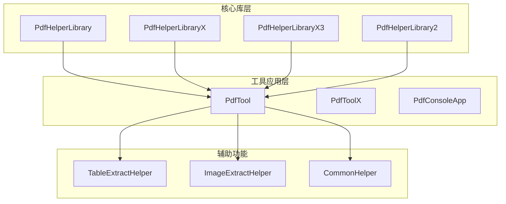

**图表来源**
- [TextExtractHelper.cs](file://PdfHelperLibrary/TextExtractHelper.cs#L1-L35)
- [PdfTextExtracter.cs](file://PdfTool/PdfTextExtracter.cs#L1-L119)

## 核心组件分析

### TextExtractHelper类

TextExtractHelper是文本提取的核心静态类，提供了统一的文本提取接口。它使用UglyToad.PdfPig库进行PDF文档解析，能够提取页面文本和单个单词信息。

**关键特性：**
- 基于UglyToad.PdfPig的高性能PDF解析
- 支持逐页文本提取
- 提供单词级别的文本信息
- 包含调试模式下的详细日志输出

**节来源**
- [TextExtractHelper.cs](file://PdfHelperLibrary/TextExtractHelper.cs#L1-L35)

### PdfTextExtracter用户界面

PdfTextExtracter是一个Windows Forms控件，提供了直观的图形化界面用于PDF文本提取操作。

**主要功能：**
- 批量PDF文件管理
- 实时进度显示
- 后台异步处理
- 日志记录和错误处理

**节来源**
- [PdfTextExtracter.cs](file://PdfTool/PdfTextExtracter.cs#L1-L119)
- [PdfTextExtracter.Designer.cs](file://PdfTool\PdfTextExtracter.Designer.cs#L1-L38)

## 架构概览

PDF文本提取功能采用分层架构设计，确保了功能的模块化和可扩展性：

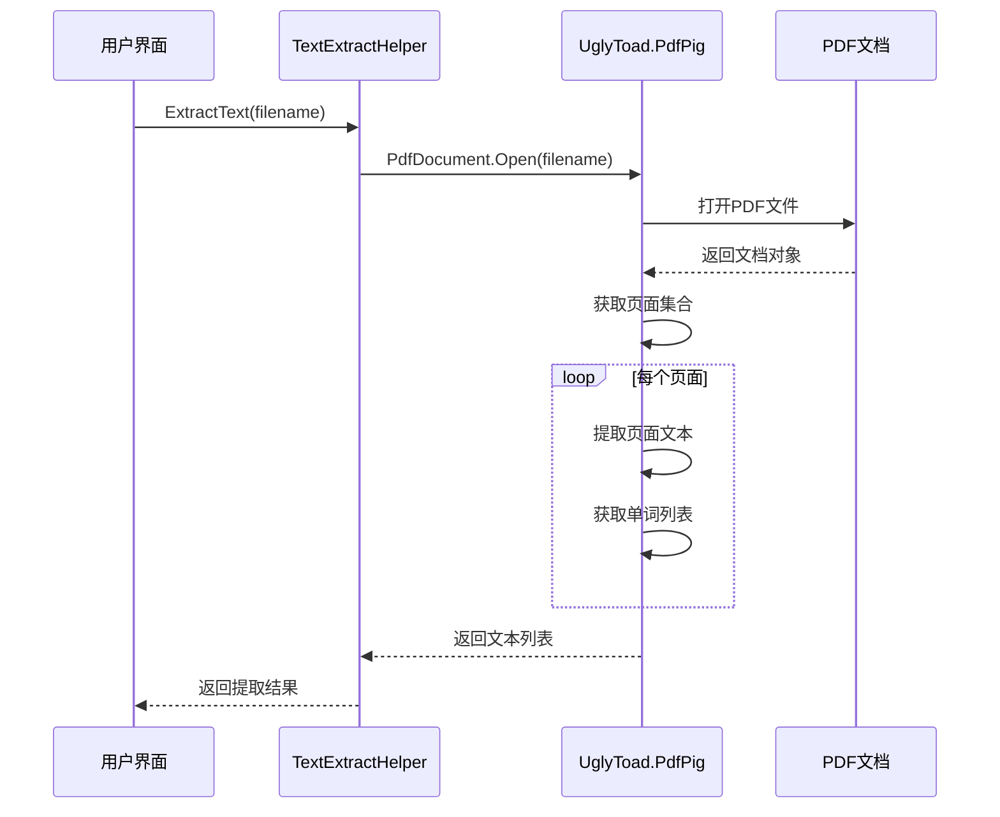

**图表来源**
- [TextExtractHelper.cs](file://PdfHelperLibrary/TextExtractHelper.cs#L11-L31)
- [PdfTextExtracter.cs](file://PdfTool/PdfTextExtracter.cs#L58-L65)

## 详细组件分析

### UglyToad.PdfPig集成

TextExtractHelper使用UglyToad.PdfPig库进行PDF解析，该库提供了以下核心功能：

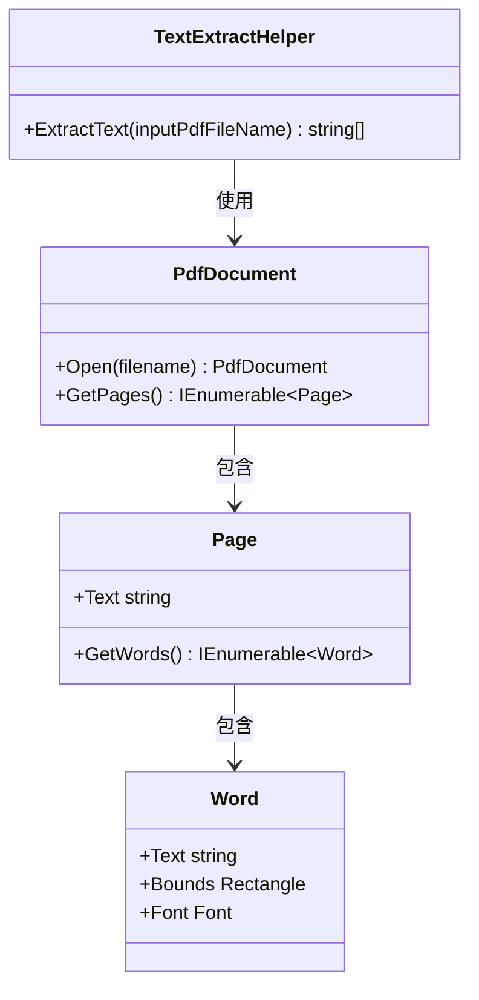

**图表来源**
- [TextExtractHelper.cs](file://PdfHelperLibrary/TextExtractHelper.cs#L11-L31)

### 文本提取流程

文本提取过程遵循以下步骤：

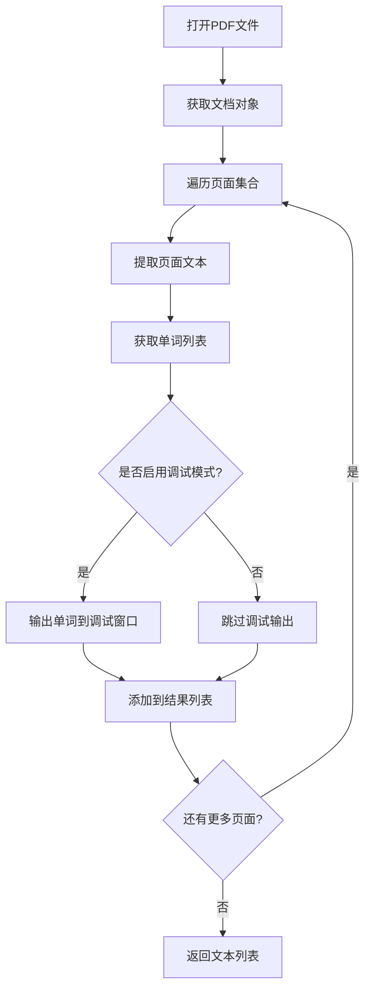

**图表来源**
- [TextExtractHelper.cs](file://PdfHelperLibrary/TextExtractHelper.cs#L13-L29)

**节来源**
- [TextExtractHelper.cs](file://PdfHelperLibrary/TextExtractHelper.cs#L11-L31)

## 文本提取算法

### 基础文本提取算法

TextExtractHelper实现了简洁而高效的文本提取算法：

1. **文档打开阶段**：使用`PdfDocument.Open()`方法安全地打开PDF文件
2. **页面遍历**：通过`document.GetPages()`获取所有页面
3. **文本提取**：每个页面的`page.Text`属性提供完整的页面文本
4. **单词级提取**：`page.GetWords()`方法提供详细的单词信息

### 高级文本提取选项

在其他实现中，还提供了更精细的控制选项：

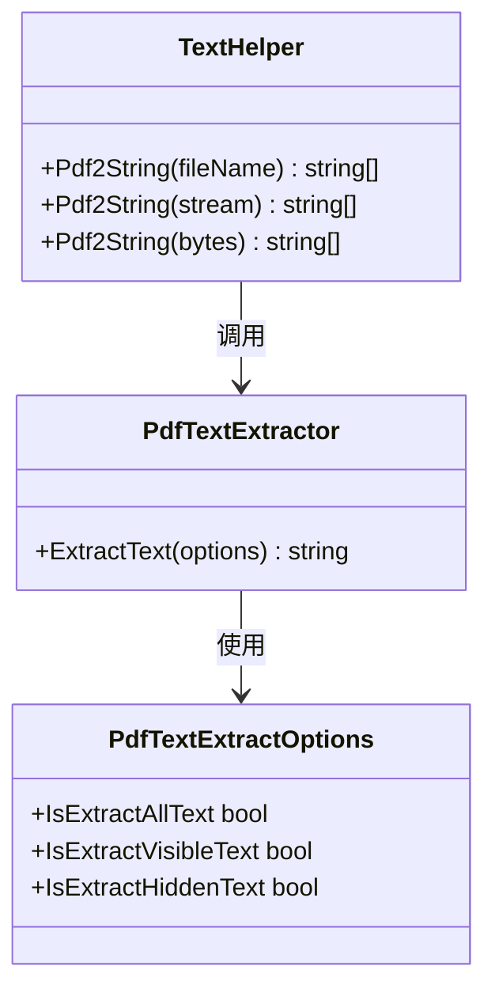

**图表来源**
- [TextHelper.cs](file://PdfHelperLibraryX3/TextHelper.cs#L54-L60)

**节来源**
- [TextHelper.cs](file://PdfHelperLibraryX3/TextHelper.cs#L47-L100)

## 输出格式与编码处理

### 支持的输出格式

PDF文本提取功能支持多种输出格式：

| 格式类型 | 描述 | 实现方式 | 适用场景 |
|---------|------|----------|----------|
| 纯文本 | 仅包含可读文本内容 | 直接提取页面文本 | 文本分析、搜索引擎索引 |
| 带格式文本 | 保留部分格式信息 | 结合字体和位置信息 | 内容重构、格式化输出 |
| 单词列表 | 详细的单词级别信息 | 提取每个单词的边界和字体 | OCR增强、文本定位 |

### 编码处理机制

系统采用了多层编码处理策略：

1. **字符编码检测**：自动识别PDF中的字符编码
2. **Unicode转换**：确保文本的Unicode兼容性
3. **特殊字符处理**：正确处理标点符号和特殊字符
4. **空行清理**：移除无意义的空白行

**节来源**
- [TextHelper.cs](file://PdfHelperLibraryX3/TextHelper.cs#L63-L65)

## 高级功能特性

### 文本定位功能

虽然当前实现主要关注文本内容提取，但底层的UglyToad.PdfPig库提供了强大的文本定位能力：

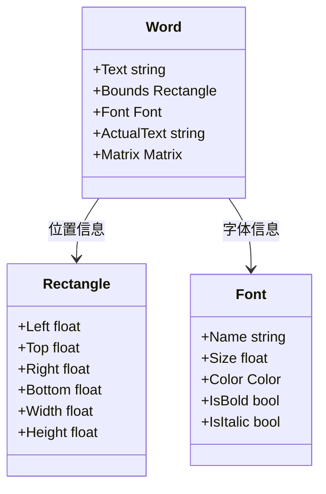

### 字体信息提取

通过Word对象可以获取丰富的字体信息：
- 字体名称和样式
- 字体大小和颜色
- 粗体和斜体标识
- 字符间距和行高

### 多库支持架构

系统支持多种PDF解析库，提供了灵活的架构选择：

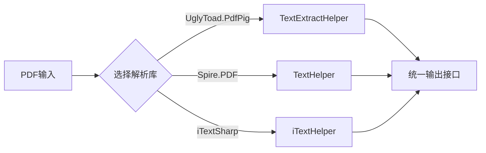

**图表来源**
- [TextExtractHelper.cs](file://PdfHelperLibrary/TextExtractHelper.cs#L1-L35)
- [TextHelper.cs](file://PdfHelperLibraryX3/TextHelper.cs#L1-L100)

**节来源**
- [TextExtractHelper.cs](file://PdfHelperLibrary/TextExtractHelper.cs#L1-L35)
- [TextHelper.cs](file://PdfHelperLibraryX3/TextHelper.cs#L1-L100)

## 使用案例

### 学术论文PDF提取摘要和参考文献

这是一个典型的学术论文PDF文本提取应用场景：

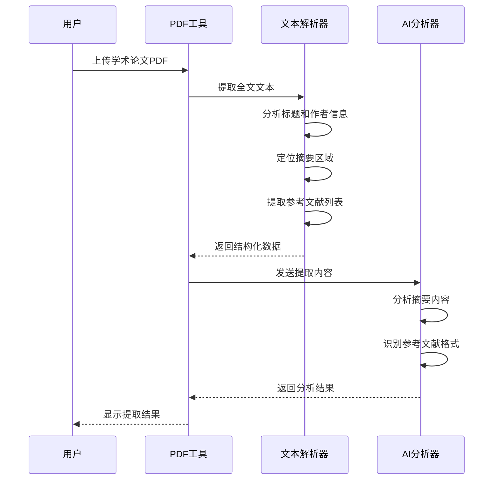

**实际应用场景：**

1. **摘要提取**：
   - 识别标题和作者信息
   - 定位"摘要"、"Abstract"等关键词区域
   - 提取关键词和研究目的

2. **参考文献提取**：
   - 识别"参考文献"、"References"等章节
   - 提取文献条目格式
   - 结构化存储引用信息

### 批量文档处理

对于大量文档的批量处理场景：

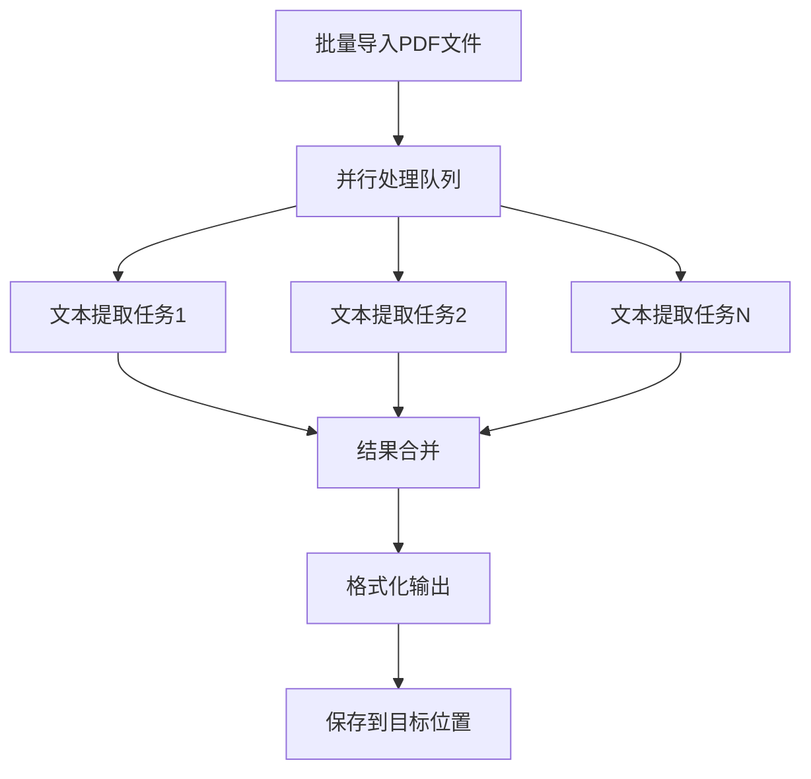

**节来源**
- [PdfTextExtracter.cs](file://PdfTool/PdfTextExtracter.cs#L58-L77)

## OCR缺失问题与预处理建议

### OCR缺失导致的文本提取失败

PDF文本提取失败的主要原因包括：

1. **扫描件PDF**：没有OCR处理的扫描件PDF
2. **图像PDF**：完全由图像组成的PDF文档
3. **加密PDF**：受密码保护的PDF文件
4. **损坏PDF**：格式不正确的PDF文件

### 预处理建议

针对不同类型的PDF文件，推荐以下预处理方案：

| PDF类型 | 问题描述 | 预处理方案 | 工具推荐 |
|---------|----------|------------|----------|
| 扫描件PDF | 缺少可搜索文本 | OCR文字识别 | Tesseract、ABBYY FineReader |
| 图像PDF | 完全由图像组成 | OCR处理 | Adobe Acrobat、Google Drive |
| 加密PDF | 受密码保护 | 密码破解或解密 | PDF解密工具 |
| 损坏PDF | 文件格式错误 | 修复工具 | PDF修复软件 |

### 自动化预处理流程

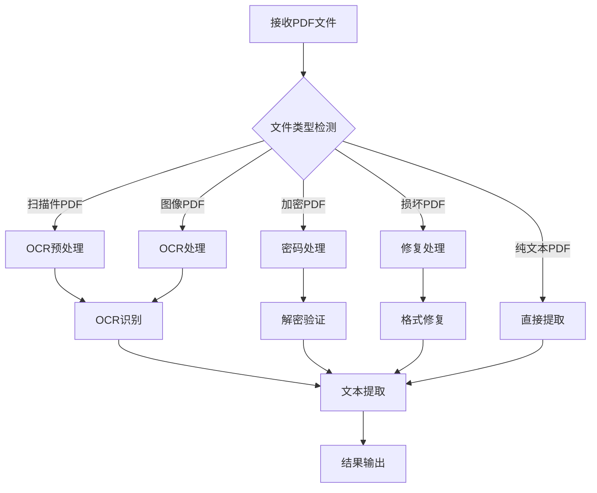

### 错误处理策略

系统实现了多层次的错误处理机制：

1. **文件级错误处理**：捕获文件打开和读取异常
2. **文档级错误处理**：处理PDF格式验证错误
3. **页面级错误处理**：单页解析失败时的降级处理
4. **内容级错误处理**：文本提取质量评估和修正

**节来源**
- [PdfTextExtracter.cs](file://PdfTool/PdfTextExtracter.cs#L52-L56)
- [CommonHelper.cs](file://PdfHelperLibrary/CommonHelper.cs#L11-L26)

## 性能考虑

### 大文件处理优化

对于大型PDF文件，系统采用了以下优化策略：

1. **流式处理**：避免将整个文件加载到内存
2. **分页处理**：逐页处理减少内存占用
3. **异步处理**：使用BackgroundWorker避免界面阻塞
4. **进度报告**：实时反馈处理进度

### 内存管理

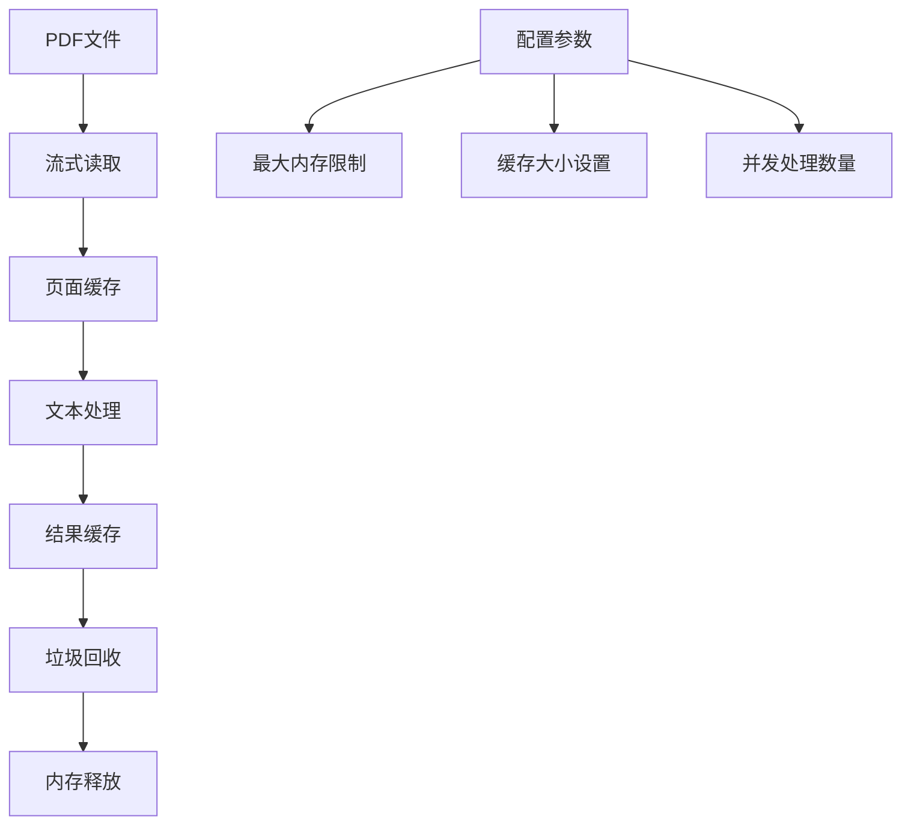

### 并发处理能力

系统支持多线程并发处理，提高了大批量文件的处理效率：

- **后台工作线程**：使用BackgroundWorker进行异步处理
- **进度同步**：线程安全的进度报告机制
- **异常隔离**：单个文件处理失败不影响整体进程

## 故障排除指南

### 常见问题及解决方案

| 问题类型 | 症状描述 | 可能原因 | 解决方案 |
|---------|----------|----------|----------|
| 提取失败 | 空结果或异常 | 文件损坏、权限不足 | 检查文件完整性，确认访问权限 |
| 文本乱码 | 中文显示为问号 | 字符编码问题 | 尝试不同的编码设置 |
| 性能缓慢 | 处理时间过长 | 文件过大、系统资源不足 | 优化系统配置，分批处理 |
| 内存溢出 | 程序崩溃 | 大文件处理 | 增加内存限制，使用流式处理 |

### 调试和诊断

系统提供了完善的调试和诊断功能：

1. **调试模式输出**：编译时启用DEBUG宏定义
2. **详细日志记录**：记录处理过程和错误信息
3. **进度监控**：实时显示处理进度
4. **错误报告**：详细的错误堆栈信息

**节来源**
- [TextExtractHelper.cs](file://PdfHelperLibrary/TextExtractHelper.cs#L24-L27)
- [PdfTextExtracter.cs](file://PdfTool/PdfTextExtracter.cs#L67-L72)

## 总结

PDF文本提取功能通过精心设计的架构和多种PDF解析库的支持，提供了强大而灵活的文本提取能力。主要特点包括：

1. **多库支持**：支持UglyToad.PdfPig、Spire.PDF、iTextSharp等多种解析库
2. **灵活输出**：支持纯文本、带格式文本等多种输出格式
3. **高级功能**：提供文本定位、字体信息提取等高级功能
4. **性能优化**：采用流式处理和异步处理提高效率
5. **错误处理**：完善的错误处理和恢复机制

该功能为学术论文处理、文档分析、内容管理系统等应用场景提供了坚实的技术基础，能够满足各种复杂的文本提取需求。