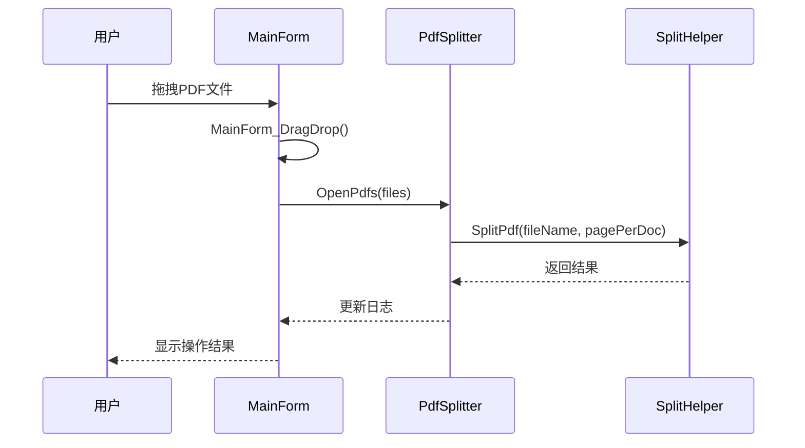
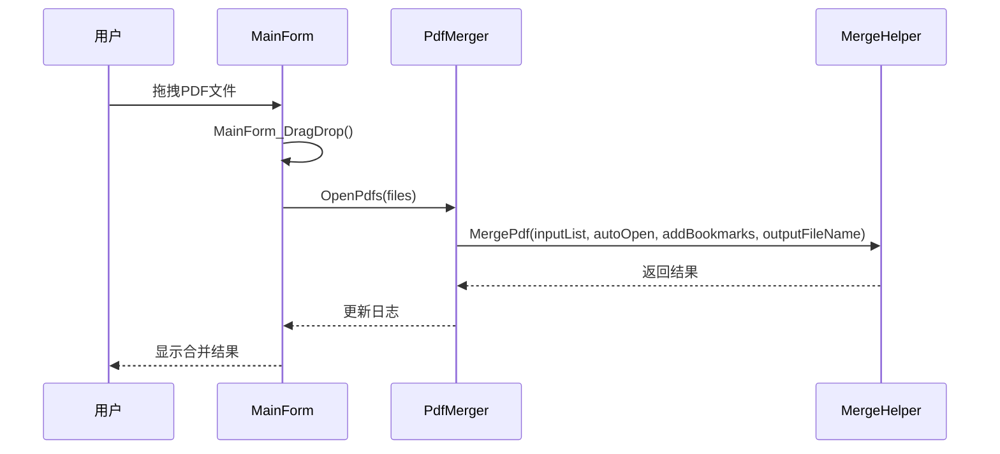
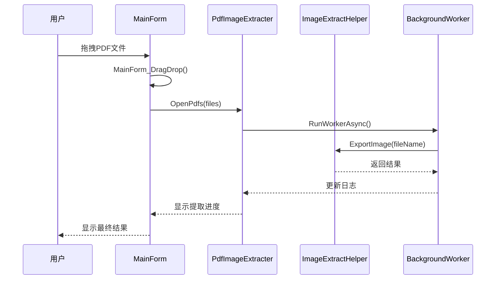
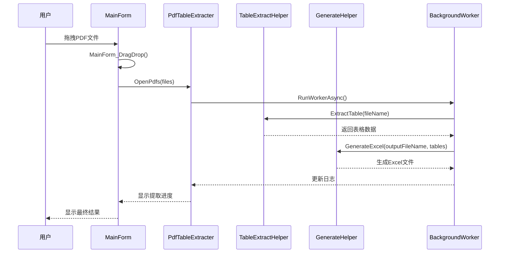
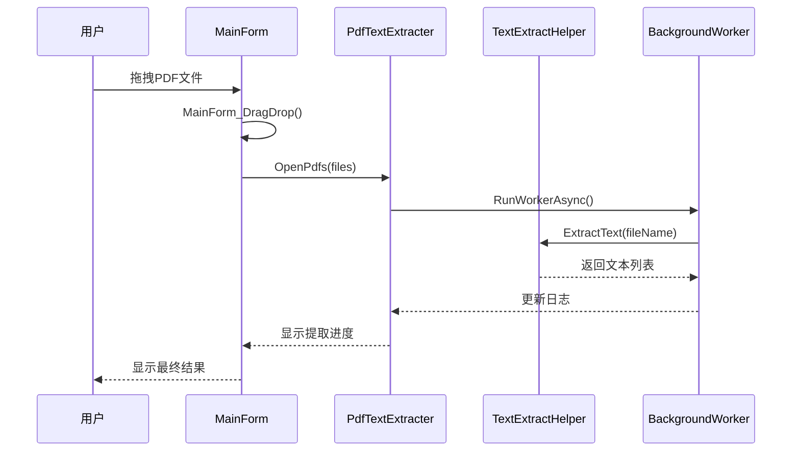
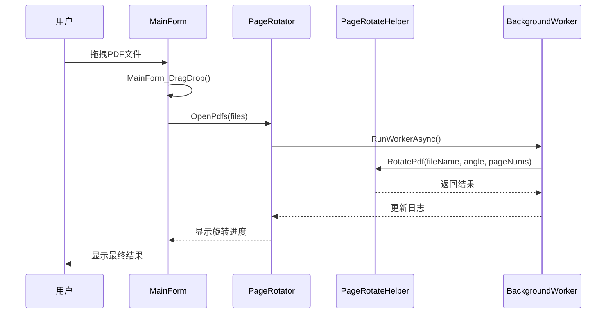
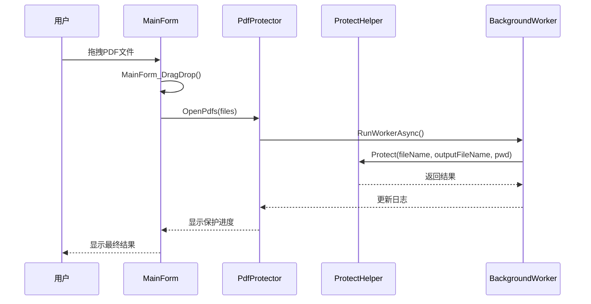
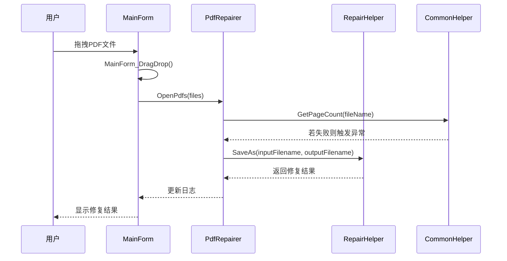
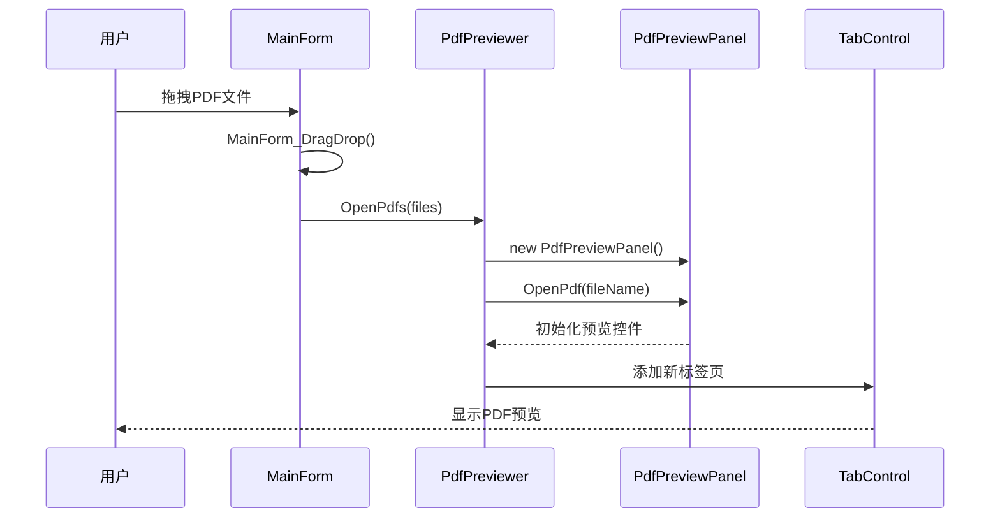

# 核心功能详解

<cite>
**本文档引用的文件**  
- [MainForm.cs](file://PdfTool/MainForm.cs)
- [PdfSplitter.cs](file://PdfTool/PdfSplitter.cs)
- [PdfMerger.cs](file://PdfTool/PdfMerger.cs)
- [PdfImageExtracter.cs](file://PdfTool/PdfImageExtracter.cs)
- [PdfTableExtracter.cs](file://PdfTool/PdfTableExtracter.cs)
- [PdfTextExtracter.cs](file://PdfTool/PdfTextExtracter.cs)
- [PageRotator.cs](file://PdfTool/PageRotator.cs)
- [PdfProtector.cs](file://PdfTool/PdfProtector.cs)
- [PdfRepairer.cs](file://PdfTool/PdfRepairer.cs)
- [PdfPreviewer.cs](file://PdfTool/PdfPreviewer.cs)
- [PdfImager.cs](file://PdfTool/PdfImager.cs)
- [ImageImporter.cs](file://PdfTool/ImageImporter.cs)
- [PdfPrinter.cs](file://PdfTool/PdfPrinter.cs)
- [Config.cs](file://PdfTool/Config.cs)
- [Common.cs](file://PdfTool/Common.cs)
- [PdfHelperLibrary/SplitHelper.cs](file://PdfHelperLibrary/SplitHelper.cs)
- [PdfHelperLibrary/MergeHelper.cs](file://PdfHelperLibrary/MergeHelper.cs)
- [PdfHelperLibrary/ImageExtractHelper.cs](file://PdfHelperLibrary/ImageExtractHelper.cs)
- [PdfHelperLibrary/TableExtractHelper.cs](file://PdfHelperLibrary/TableExtractHelper.cs)
- [PdfHelperLibrary/TextExtractHelper.cs](file://PdfHelperLibrary/TextExtractHelper.cs)
- [PdfHelperLibrary/PageRotateHelper.cs](file://PdfHelperLibrary/PageRotateHelper.cs)
- [PdfHelperLibrary/ProtectHelper.cs](file://PdfHelperLibrary/ProtectHelper.cs)
- [PdfHelperLibrary2/RepairHelper.cs](file://PdfHelperLibrary2/RepairHelper.cs)
- [PdfHelperLibrary/ImagerHelper.cs](file://PdfHelperLibrary/ImagerHelper.cs)
- [PdfHelperLibrary/ImageHelper.cs](file://PdfHelperLibrary/ImageHelper.cs)
- [PdfHelperLibrary/PrintHelper.cs](file://PdfHelperLibrary/PrintHelper.cs)
</cite>

## 目录
1. [系统架构与模块通信](#系统架构与模块通信)  
2. [PDF拆分功能](#pdf拆分功能)  
3. [PDF合并功能](#pdf合并功能)  
4. [PDF图片提取功能](#pdf图片提取功能)  
5. [PDF表格提取功能](#pdf表格提取功能)  
6. [PDF文本提取功能](#pdf文本提取功能)  
7. [PDF页面旋转功能](#pdf页面旋转功能)  
8. [PDF保护功能](#pdf保护功能)  
9. [PDF修复功能](#pdf修复功能)  
10. [PDF预览功能](#pdf预览功能)  
11. [多线程处理机制](#多线程处理机制)  
12. [典型使用案例](#典型使用案例)  
13. [性能优化建议](#性能优化建议)

## 系统架构与模块通信

PdfTool采用模块化架构设计，通过`IPdfHandler`接口实现各功能模块的统一接入和通信。主窗体`MainForm`作为中央控制器，负责管理所有功能标签页，并通过拖拽事件将PDF文件分发给当前激活的处理模块。

```mermaid
classDiagram
class IPdfHandler {
<<interface>>
+OpenPdfs(List<string> files) void
}
class PdfSplitter {
+OpenPdfs(List<string> files) void
-List<string> _inputPdfFileList
-TextBox _txtLog
-NumericUpDown _numPagePerDoc
-NumericUpDown _numPageFrom
-NumericUpDown _numPageTo
-TextBox _txtDeletePageNum
}
class PdfMerger {
+OpenPdfs(List<string> files) void
-TextBox _txtFileList
-CheckBox _ckbAutoOpen
-CheckBox _ckbAddBookmarks
-TextBox _txtOutputFileName
-TextBox _txtLog
}
class PdfImageExtracter {
+OpenPdfs(List<string> files) void
-List<string> _inputPdfFileList
-TextBox _txtLog
}
class PdfTableExtracter {
+OpenPdfs(List<string> files) void
-List<string> _inputPdfFileList
-TextBox _txtLog
}
class PdfTextExtracter {
+OpenPdfs(List<string> files) void
-List<string> _inputPdfFileList
-TextBox _txtLog
}
class PageRotator {
+OpenPdfs(List<string> files) void
-List<string> _inputPdfFileList
-TextBox _txtLog
-ComboBox _cmbRotationAngle
-RadioButton _rbAllPage
-RadioButton _rbPartPage
-TextBox _txtPageNums
}
class PdfProtector {
+OpenPdfs(List<string> files) void
-List<string> _inputPdfFileList
-TextBox _txtPwd
-TextBox _txtLog
}
class PdfRepairer {
+OpenPdfs(List<string> files) void
-TextBox _txtLog
}
class PdfPreviewer {
+OpenPdfs(List<string> files) void
-List<string> _inputPdfFileList
-TabControl _tabControl
}
class PdfImager {
+OpenPdfs(List<string> files) void
-List<string> _inputPdfFileList
-TextBox _txtLog
-ComboBox _cmbDpi
-ComboBox _cmbFormat
-RadioButton _rbAllPage
-RadioButton _rbPartPage
-NumericUpDown _numPageFrom
-NumericUpDown _numPageTo
}
class ImageImporter {
+OpenImages(List<string> files) void
-TextBox _txtFileList
-TextBox _txtLog
}
class PdfPrinter {
+OpenPdfs(List<string> files) void
-List<string> _inputPdfFileList
-TextBox _txtLog
}
IPdfHandler <|.. PdfSplitter
IPdfHandler <|.. PdfMerger
IPdfHandler <|.. PdfImageExtracter
IPdfHandler <|.. PdfTableExtracter
IPdfHandler <|.. PdfTextExtracter
IPdfHandler <|.. PageRotator
IPdfHandler <|.. PdfProtector
IPdfHandler <|.. PdfRepairer
IPdfHandler <|.. PdfPreviewer
IPdfHandler <|.. PdfImager
IPdfHandler <|.. PdfPrinter
```

**图表来源**  
- [MainForm.cs](file://PdfTool/MainForm.cs#L49-L58)
- [Common.cs](file://PdfTool/Common.cs#L13-L16)
- [PdfSplitter.cs](file://PdfTool/PdfSplitter.cs#L12)
- [PdfMerger.cs](file://PdfTool/PdfMerger.cs#L12)
- [PdfImageExtracter.cs](file://PdfTool/PdfImageExtracter.cs#L13)
- [PdfTableExtracter.cs](file://PdfTool/PdfTableExtracter.cs#L14)
- [PdfTextExtracter.cs](file://PdfTool/PdfTextExtracter.cs#L13)
- [PageRotator.cs](file://PdfTool/PageRotator.cs#L14)
- [PdfProtector.cs](file://PdfTool/PdfProtector.cs#L14)
- [PdfRepairer.cs](file://PdfTool/PdfRepairer.cs#L16)
- [PdfPreviewer.cs](file://PdfTool/PdfPreviewer.cs#L13)
- [PdfImager.cs](file://PdfTool/PdfImager.cs#L13)
- [ImageImporter.cs](file://PdfTool/ImageImporter.cs#L12)
- [PdfPrinter.cs](file://PdfTool/PdfPrinter.cs#L13)

## PDF拆分功能

PDF拆分功能允许用户将一个或多个PDF文件按指定规则拆分为多个独立文件。该功能提供三种拆分模式：按页数拆分、按页码范围提取和按页码删除。

### 用户界面入口
在主界面中选择“PDF拆分”标签页，即可进入拆分功能界面。用户可通过“添加文件”按钮或直接拖拽PDF文件到窗口来加载待处理文件。

### 操作流程
1. **添加文件**：点击“添加文件”按钮或拖拽PDF文件，系统会自动读取并显示每个文件的页数。
2. **选择拆分模式**：
   - **常规拆分**：设置每份文档的页数，系统将按此数量将原文件拆分为多个文件。
   - **指定页提取**：设置起始页和结束页，提取指定范围内的页面生成新文件。
   - **指定页删除**：输入要删除的页码（支持逗号、分号分隔），生成不包含这些页面的新文件。
3. **执行操作**：点击相应“开始”按钮，系统将执行拆分操作并在日志区域显示结果。

### 支持的输入输出格式及限制
- **输入格式**：仅支持PDF文件（.pdf）
- **输出格式**：PDF文件（.pdf）
- **限制条件**：
  - 页码输入必须为正整数
  - 页码范围不能超出文档实际页数
  - 删除页码时需确保至少保留一页

### 功能调用链路

**图表来源**  
- [MainForm.cs](file://PdfTool/MainForm.cs#L41-L58)
- [PdfSplitter.cs](file://PdfTool/PdfSplitter.cs#L33-L67)
- [PdfHelperLibrary/SplitHelper.cs](file://PdfHelperLibrary/SplitHelper.cs)

**本节来源**  
- [PdfSplitter.cs](file://PdfTool/PdfSplitter.cs#L12-L230)

## PDF合并功能

PDF合并功能允许用户将多个PDF文件合并为一个单一的PDF文档，并可选择是否添加书签。

### 用户界面入口
在主界面中选择“PDF合并”标签页，即可进入合并功能界面。

### 操作流程
1. **添加文件**：点击“添加文件”按钮或拖拽PDF文件，文件将按添加顺序显示在列表中。
2. **配置选项**：
   - **自动打开**：勾选后，合并完成后会自动打开生成的PDF文件。
   - **添加书签**：勾选后，每个源文件的文件名将作为书签添加到合并后的文档中。
   - **自定义输出文件名**：可点击“修改”按钮指定输出文件的路径和名称。
3. **执行合并**：点击“开始合并”按钮，系统将按列表顺序合并所有文件。

### 支持的输入输出格式及限制
- **输入格式**：PDF文件（.pdf）
- **输出格式**：PDF文件（.pdf）
- **限制条件**：
  - 至少需要添加一个PDF文件
  - 文件将按添加顺序合并
  - 输出文件名默认为“MergedFile - 时间戳.pdf”

### 功能调用链路

**图表来源**  
- [MainForm.cs](file://PdfTool/MainForm.cs#L49-L58)
- [PdfMerger.cs](file://PdfTool/PdfMerger.cs#L33-L71)
- [PdfHelperLibrary/MergeHelper.cs](file://PdfHelperLibrary/MergeHelper.cs)

**本节来源**  
- [PdfMerger.cs](file://PdfTool/PdfMerger.cs#L1-L154)

## PDF图片提取功能

PDF图片提取功能可以从PDF文档中提取所有嵌入的图像，并保存为独立的图片文件。

### 用户界面入口
在主界面中选择“PDF图片提取”标签页，即可进入图片提取功能界面。

### 操作流程
1. **添加文件**：点击“添加文件”按钮或拖拽PDF文件。
2. **执行提取**：点击“开始提取”按钮，系统将在后台提取所有图片。
3. **查看结果**：提取完成后，系统会在日志中显示结果，图片将保存在原PDF文件所在目录的“images”子目录中。

### 支持的输入输出格式及限制
- **输入格式**：PDF文件（.pdf）
- **输出格式**：PNG、JPG、BMP等常见图片格式
- **限制条件**：
  - 仅提取PDF中嵌入的图像
  - 图片将按“原文件名_页码_序号”格式命名
  - 提取过程为异步执行，支持长时间操作

### 功能调用链路

**图表来源**  
- [MainForm.cs](file://PdfTool/MainForm.cs#L49-L58)
- [PdfImageExtracter.cs](file://PdfTool/PdfImageExtracter.cs#L30-L80)
- [PdfHelperLibrary/ImageExtractHelper.cs](file://PdfHelperLibrary/ImageExtractHelper.cs)

**本节来源**  
- [PdfImageExtracter.cs](file://PdfTool/PdfImageExtracter.cs#L1-L119)

## PDF表格提取功能

PDF表格提取功能可以识别PDF文档中的表格结构，并将其转换为Excel文件。

### 用户界面入口
在主界面中选择“PDF表格提取”标签页，即可进入表格提取功能界面。

### 操作流程
1. **添加文件**：点击“添加文件”按钮或拖拽PDF文件。
2. **执行提取**：点击“开始提取”按钮，系统将分析PDF中的表格结构。
3. **生成Excel**：提取完成后，系统会自动生成一个Excel文件（.xlsx），文件名与原PDF文件相同。

### 支持的输入输出格式及限制
- **输入格式**：PDF文件（.pdf）
- **输出格式**：Excel文件（.xlsx）
- **限制条件**：
  - 仅能提取具有明确边框的表格
  - 复杂的合并单元格可能无法完全准确识别
  - 提取过程为异步执行

### 功能调用链路

**图表来源**  
- [MainForm.cs](file://PdfTool/MainForm.cs#L49-L58)
- [PdfTableExtracter.cs](file://PdfTool/PdfTableExtracter.cs#L31-L91)
- [PdfHelperLibrary/TableExtractHelper.cs](file://PdfHelperLibrary/TableExtractHelper.cs)
- [ExcelHelperLibrary/GenerateHelper.cs](file://ExcelHelperLibrary/GenerateHelper.cs)

**本节来源**  
- [PdfTableExtracter.cs](file://PdfTool/PdfTableExtracter.cs#L1-L130)

## PDF文本提取功能

PDF文本提取功能可以从PDF文档中提取纯文本内容，并在界面中显示。

### 用户界面入口
在主界面中选择“PDF文本提取”标签页，即可进入文本提取功能界面。

### 操作流程
1. **添加文件**：点击“添加文件”按钮或拖拽PDF文件。
2. **执行提取**：点击“开始提取”按钮，系统将提取文档中的所有文本。
3. **查看结果**：提取完成后，文本内容将显示在日志区域，每页内容以分隔符区分。

### 支持的输入输出格式及限制
- **输入格式**：PDF文件（.pdf）
- **输出格式**：纯文本（显示在界面中）
- **限制条件**：
  - 提取的文本保持原始的换行和段落结构
  - 图像中的文字无法提取（OCR功能未实现）
  - 提取过程为异步执行

### 功能调用链路

**图表来源**  
- [MainForm.cs](file://PdfTool/MainForm.cs#L49-L58)
- [PdfTextExtracter.cs](file://PdfTool/PdfTextExtracter.cs#L30-L80)
- [PdfHelperLibrary/TextExtractHelper.cs](file://PdfHelperLibrary/TextExtractHelper.cs)

**本节来源**  
- [PdfTextExtracter.cs](file://PdfTool/PdfTextExtracter.cs#L1-L119)

## PDF页面旋转功能

PDF页面旋转功能允许用户将PDF文档的页面按指定角度旋转。

### 用户界面入口
在主界面中选择“PDF页面旋转”标签页，即可进入页面旋转功能界面。

### 操作流程
1. **添加文件**：点击“添加文件”按钮或拖拽PDF文件。
2. **设置旋转参数**：
   - **旋转角度**：可选择90°、180°或270°。
   - **旋转范围**：可选择“全部页面”或“仅部分页面”。
   - **指定页码**：若选择部分页面，可输入页码（支持单个页码、逗号分隔和连字符范围，如“1,3,5-9”）。
3. **执行旋转**：点击“开始旋转”按钮，系统将生成旋转后的PDF文件。

### 支持的输入输出格式及限制
- **输入格式**：PDF文件（.pdf）
- **输出格式**：PDF文件（.pdf）
- **限制条件**：
  - 旋转角度仅支持90°的倍数
  - 页码输入必须为有效页码
  - 旋转过程为异步执行

### 功能调用链路

**图表来源**  
- [MainForm.cs](file://PdfTool/MainForm.cs#L49-L58)
- [PageRotator.cs](file://PdfTool/PageRotator.cs#L35-L127)
- [PdfHelperLibrary/PageRotateHelper.cs](file://PdfHelperLibrary/PageRotateHelper.cs)

**本节来源**  
- [PageRotator.cs](file://PdfTool/PageRotator.cs#L1-L213)

## PDF保护功能

PDF保护功能提供PDF文档的加密和解密功能，通过密码保护文档内容。

### 用户界面入口
在主界面中选择“PDF保护”标签页，即可进入保护功能界面。

### 操作流程
1. **添加文件**：点击“添加文件”按钮或拖拽PDF文件。
2. **输入密码**：在密码输入框中输入保护密码。
3. **执行操作**：
   - **加密**：点击“加密”按钮，系统将使用输入的密码对PDF进行加密，生成“_protected.pdf”文件。
   - **解密**：点击“解密”按钮，系统将使用输入的密码对已加密PDF进行解密，生成“_unprotected.pdf”文件。

### 支持的输入输出格式及限制
- **输入格式**：PDF文件（.pdf）
- **输出格式**：PDF文件（.pdf）
- **限制条件**：
  - 密码不能为空
  - 解密时必须输入正确的密码
  - 操作过程为异步执行

### 功能调用链路

**图表来源**  
- [MainForm.cs](file://PdfTool/MainForm.cs#L49-L58)
- [PdfProtector.cs](file://PdfTool/PdfProtector.cs#L32-L84)
- [PdfHelperLibrary/ProtectHelper.cs](file://PdfHelperLibrary/ProtectHelper.cs)

**本节来源**  
- [PdfProtector.cs](file://PdfTool/PdfProtector.cs#L1-L171)

## PDF修复功能

PDF修复功能用于修复损坏的PDF文件，使其能够正常打开和使用。

### 用户界面入口
在主界面中选择“PDF修复”标签页，即可进入修复功能界面。

### 操作流程
1. **打开文件**：点击“打开文件并修复”按钮，选择需要修复的PDF文件。
2. **自动检测与修复**：系统会先尝试打开文件，若失败则自动调用修复功能。
3. **查看结果**：修复完成后，系统会在日志中显示结果，包括修复成功或失败的信息。

### 支持的输入输出格式及限制
- **输入格式**：PDF文件（.pdf）
- **输出格式**：PDF文件（.pdf）
- **限制条件**：
  - 仅对无法正常打开的PDF文件进行修复
  - 修复后的文件名格式为“原文件名_repaired.pdf”
  - 修复功能不能保证100%成功

### 功能调用链路

**图表来源**  
- [MainForm.cs](file://PdfTool/MainForm.cs#L49-L58)
- [PdfRepairer.cs](file://PdfTool/PdfRepairer.cs#L32-L55)
- [PdfHelperLibrary2/RepairHelper.cs](file://PdfHelperLibrary2/RepairHelper.cs)

**本节来源**  
- [PdfRepairer.cs](file://PdfTool/PdfRepairer.cs#L1-L111)

## PDF预览功能

PDF预览功能允许用户在软件内部直接查看PDF文档内容，支持多文档标签页浏览。

### 用户界面入口
在主界面中选择“PDF预览”标签页，即可进入预览功能界面。

### 操作流程
1. **添加文件**：点击“添加文件”按钮或拖拽PDF文件。
2. **多文档浏览**：每个PDF文件将在独立的标签页中打开，支持同时查看多个文档。
3. **页面导航**：在预览面板中可进行页面缩放、翻页等操作。

### 支持的输入输出格式及限制
- **输入格式**：PDF文件（.pdf）
- **输出格式**：无（仅预览）
- **限制条件**：
  - 预览功能仅用于查看，不支持编辑
  - 大型PDF文件可能加载较慢
  - 内存占用随打开文件数量增加

### 功能调用链路

**图表来源**  
- [MainForm.cs](file://PdfTool/MainForm.cs#L49-L58)
- [PdfPreviewer.cs](file://PdfTool/PdfPreviewer.cs#L30-L42)
- [PdfPreviewPanel.cs](file://PdfTool/PdfPreviewPanel.cs)

**本节来源**  
- [PdfPreviewer.cs](file://PdfTool/PdfPreviewer.cs#L1-L77)

## 多线程处理机制

PdfTool在处理长时间运行的操作时，采用`BackgroundWorker`模式实现多线程处理，确保用户界面的响应性。

### BackgroundWorker模式应用
系统在以下功能模块中使用了`BackgroundWorker`：
- PDF图片提取
- PDF表格提取
- PDF文本提取
- PDF页面旋转
- PDF保护
- PDF打印

### 实现原理
1. **创建BackgroundWorker实例**：在事件处理方法中创建`BackgroundWorker`对象，并设置`WorkerReportsProgress = true`以支持进度报告。
2. **定义DoWork事件**：在`DoWork`事件中执行耗时的PDF处理操作。
3. **定义ProgressChanged事件**：在`ProgressChanged`事件中更新UI，显示处理进度。
4. **定义RunWorkerCompleted事件**：在`RunWorkerCompleted`事件中处理操作完成后的UI更新。
5. **启动异步操作**：调用`RunWorkerAsync()`方法启动后台任务。

### 优势
- **界面响应性**：避免UI线程被长时间阻塞，用户可继续与其他控件交互。
- **进度反馈**：通过`ReportProgress`方法实时向用户反馈处理进度。
- **异常处理**：后台线程中的异常不会导致主程序崩溃。

**本节来源**  
- [PdfImageExtracter.cs](file://PdfTool/PdfImageExtracter.cs#L57-L80)
- [PdfTableExtracter.cs](file://PdfTool/PdfTableExtracter.cs#L58-L91)
- [PdfTextExtracter.cs](file://PdfTool/PdfTextExtracter.cs#L57-L80)
- [PageRotator.cs](file://PdfTool/PageRotator.cs#L92-L127)
- [PdfProtector.cs](file://PdfTool/PdfProtector.cs#L60-L84)
- [PdfPrinter.cs](file://PdfTool/PdfPrinter.cs#L57-L71)

## 典型使用案例

### 案例一：将合同按章节拆分为独立文件
**场景**：用户有一份包含多个章节的合同PDF，希望将每个章节拆分为独立的文件以便单独管理和审阅。

**操作步骤**：
1. 在“PDF拆分”功能中添加合同PDF文件。
2. 切换到“指定页提取”模式。
3. 根据合同的章节页码，依次设置起始页和结束页。
4. 点击“开始提取”，系统将为每个章节生成独立的PDF文件。

**技术实现**：调用`ExtractHelper.ExtractPdf`方法，传入源文件路径、起始页码和结束页码。

### 案例二：批量提取发票中的表格数据
**场景**：财务人员需要从多张PDF格式的发票中提取表格数据，并汇总到Excel文件中进行统计分析。

**操作步骤**：
1. 在“PDF表格提取”功能中添加所有发票PDF文件。
2. 点击“开始提取”按钮。
3. 系统自动分析每张发票中的表格结构，并生成对应的Excel文件。
4. 所有发票的表格数据将以独立的Excel文件形式保存。

**技术实现**：调用`TableExtractHelper.ExtractTable`方法识别表格，然后使用`GenerateHelper.GenerateExcel`方法生成Excel文件。

## 性能优化建议

1. **批量处理优化**：对于大量文件的处理操作，建议分批进行，避免一次性加载过多文件导致内存占用过高。
2. **大文件处理**：对于大型PDF文件，建议在“页面旋转”、“图片提取”等功能中选择“仅部分页面”模式，减少处理范围。
3. **资源释放**：在长时间使用软件后，建议定期关闭不再需要的预览标签页，释放内存资源。
4. **并发控制**：虽然系统支持多线程，但不建议同时运行多个耗时操作（如同时进行图片提取和表格提取），以免造成系统资源竞争。
5. **存储空间**：图片提取和表格提取功能会生成大量输出文件，建议定期清理临时文件，避免磁盘空间不足。