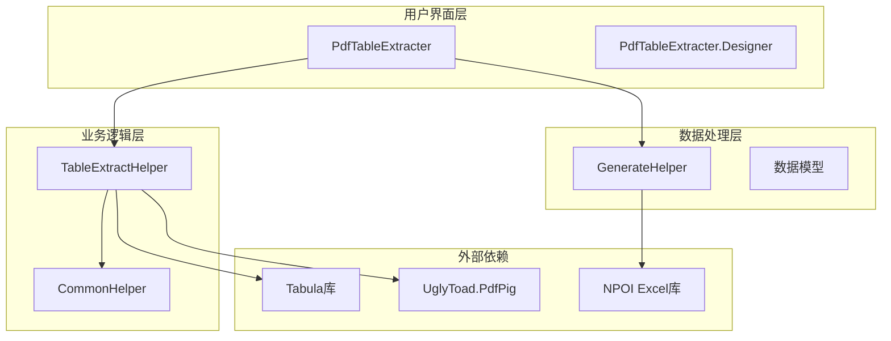
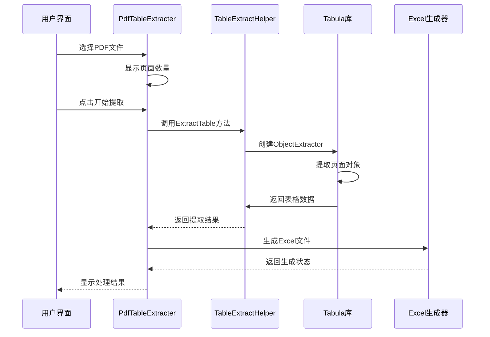
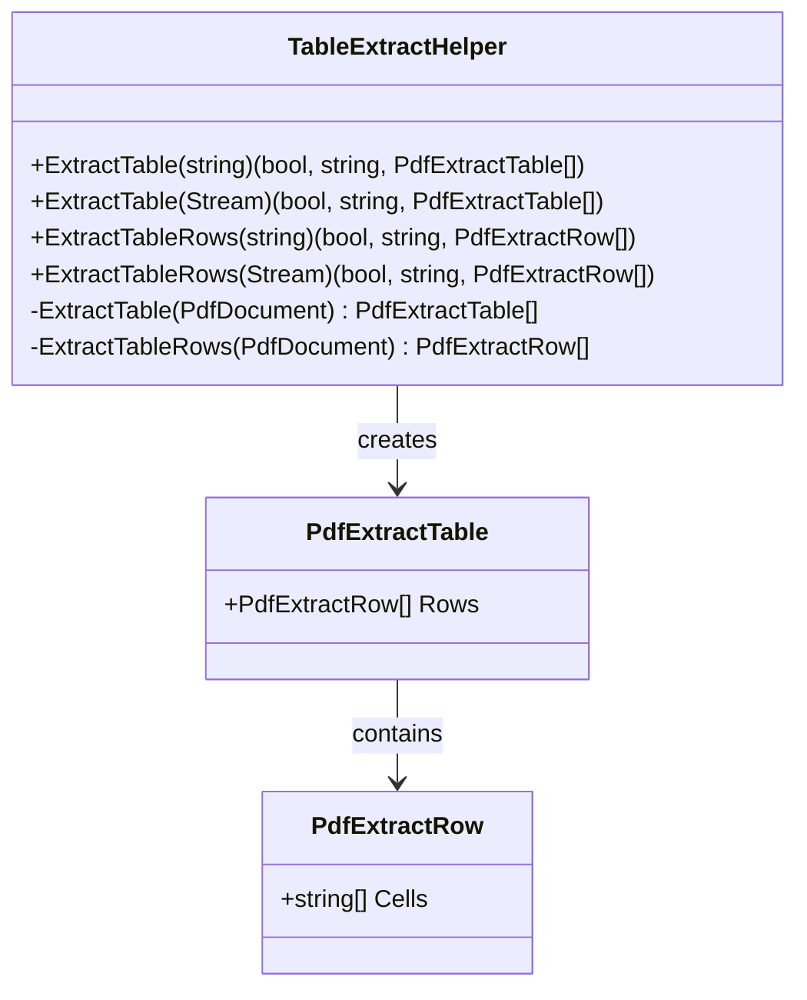
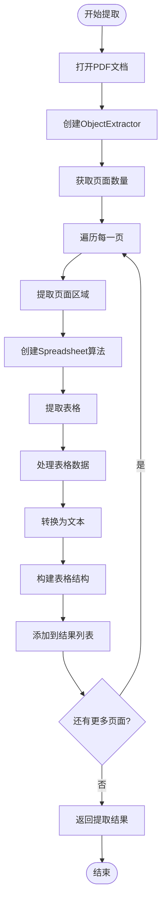
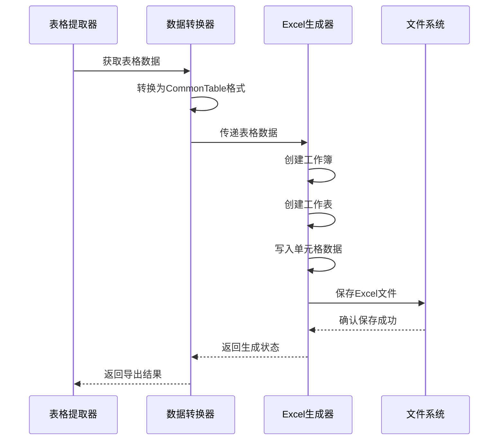
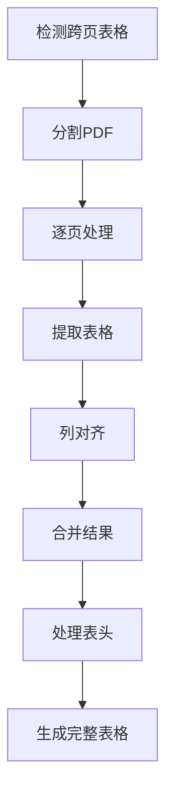
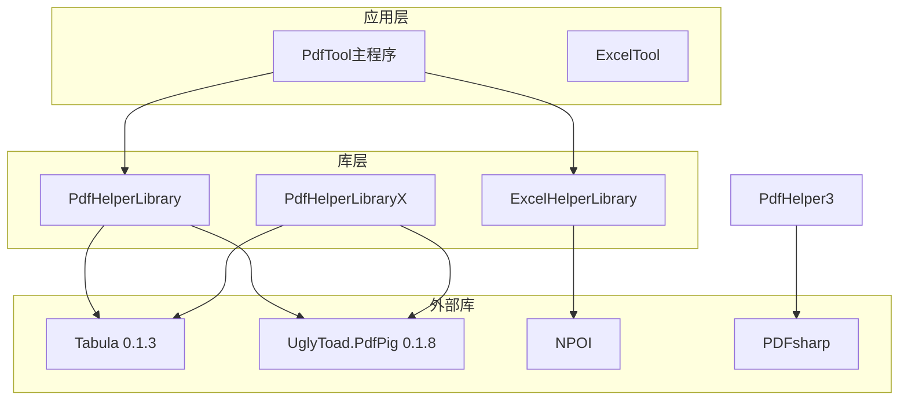

# 表格提取

<cite>
**本文档中引用的文件**
- [PdfTableExtracter.cs](file://PdfTool/PdfTableExtracter.cs)
- [PdfTableExtracter.Designer.cs](file://PdfTool/PdfTableExtracter.Designer.cs)
- [TableExtractHelper.cs](file://PdfHelperLibrary/TableExtractHelper.cs)
- [TableExtractHelper.cs](file://PdfHelperLibraryX/TableExtractHelper.cs)
- [GenerateHelper.cs](file://ExcelHelperLibrary/GenerateHelper.cs)
- [Common.cs](file://PdfTool/Common.cs)
- [Config.cs](file://PdfTool/Config.cs)
- [CommonHelper.cs](file://PdfHelperLibrary/CommonHelper.cs)
- [TableHelper.cs](file://PdfHelperLibrary3/TableHelper.cs)
</cite>

## 目录
1. [简介](#简介)
2. [项目结构](#项目结构)
3. [核心组件](#核心组件)
4. [架构概览](#架构概览)
5. [详细组件分析](#详细组件分析)
6. [依赖关系分析](#依赖关系分析)
7. [性能考虑](#性能考虑)
8. [故障排除指南](#故障排除指南)
9. [结论](#结论)

## 简介

PDF表格提取是PDF工具库中的核心功能之一，专门用于从PDF文档中识别和提取表格结构数据。该功能主要基于Tabula库实现，能够将PDF中的表格转换为结构化的数据格式（如CSV、Excel），并支持多种复杂的表格场景，包括合并单元格、跨页表格等。

本文档将深入解析TableExtractHelper如何利用Tabula等库识别PDF中的表格结构，并转换为结构化数据。同时，我们将探讨PdfTableExtracter界面中用户可配置的参数，以及具体的代码示例和异常处理机制。

## 项目结构

PDF表格提取功能分布在多个模块中，形成了清晰的分层架构：

**图表来源**
- [PdfTableExtracter.cs](file://PdfTool/PdfTableExtracter.cs#L1-L130)
- [TableExtractHelper.cs](file://PdfHelperLibrary/TableExtractHelper.cs#L1-L106)

**章节来源**
- [PdfTableExtracter.cs](file://PdfTool/PdfTableExtracter.cs#L1-L130)
- [TableExtractHelper.cs](file://PdfHelperLibrary/TableExtractHelper.cs#L1-L106)

## 核心组件

### PdfTableExtracter 用户界面组件

PdfTableExtracter是表格提取功能的主要用户界面，实现了IPdfHandler接口，提供了直观的操作界面。

#### 主要功能特性：
- 支持多文件批量处理
- 实时进度显示和日志记录
- 异步后台处理避免界面阻塞
- 自动页面数量统计

#### 界面控件布局：
- 添加文件按钮：支持多选PDF文件
- 开始提取按钮：触发表格提取过程
- 日志文本框：显示处理进度和结果

### TableExtractHelper 核心处理引擎

TableExtractHelper是表格提取的核心处理引擎，基于Tabula和PdfPig库实现。

#### 核心算法：
1. **ObjectExtractor**：提取PDF页面对象
2. **SpreadsheetExtractionAlgorithm**：识别表格结构
3. **文本提取**：将表格单元格内容转换为字符串

#### 数据结构：
- `PdfExtractTable`：表示完整的表格结构
- `PdfExtractRow`：表示表格中的行
- `Cells`：存储单元格文本内容

**章节来源**
- [PdfTableExtracter.cs](file://PdfTool/PdfTableExtracter.cs#L14-L130)
- [TableExtractHelper.cs](file://PdfHelperLibrary/TableExtractHelper.cs#L14-L106)

## 架构概览

PDF表格提取采用分层架构设计，确保了良好的可维护性和扩展性：

**图表来源**
- [PdfTableExtracter.cs](file://PdfTool/PdfTableExtracter.cs#L58-L85)
- [TableExtractHelper.cs](file://PdfHelperLibrary/TableExtractHelper.cs#L51-L71)

## 详细组件分析

### TableExtractHelper详细分析

TableExtractHelper是表格提取功能的核心，提供了多种重载方法来处理不同类型的输入。

#### 方法签名分析：

**图表来源**
- [TableExtractHelper.cs](file://PdfHelperLibrary/TableExtractHelper.cs#L14-L106)

#### 表格提取流程：

**图表来源**
- [TableExtractHelper.cs](file://PdfHelperLibrary/TableExtractHelper.cs#L51-L71)

### Excel导出功能

系统提供了完整的Excel导出功能，支持将提取的表格数据保存为.xlsx格式。

#### 导出流程：

**图表来源**
- [PdfTableExtracter.cs](file://PdfTool/PdfTableExtracter.cs#L66-L84)
- [GenerateHelper.cs](file://ExcelHelperLibrary/GenerateHelper.cs#L12-L35)

**章节来源**
- [TableExtractHelper.cs](file://PdfHelperLibrary/TableExtractHelper.cs#L51-L106)
- [PdfTableExtracter.cs](file://PdfTool/PdfTableExtracter.cs#L58-L85)

### 复杂表格处理挑战

#### 合并单元格处理

PDF中的合并单元格是一个重要的挑战，系统通过以下方式处理：

1. **坐标计算**：基于表格单元格的几何位置判断是否为合并单元格
2. **文本聚合**：将多个单元格的文本内容合并为一个逻辑单元
3. **结构重建**：重新构建表格的行列结构

#### 跨页表格处理

对于跨页的表格，系统采用了分页处理策略：

**图表来源**
- [TableHelper.cs](file://PdfHelperLibrary3/TableHelper.cs#L111-L141)

**章节来源**
- [TableHelper.cs](file://PdfHelperLibrary3/TableHelper.cs#L67-L129)

## 依赖关系分析

系统的依赖关系体现了清晰的分层架构：

**图表来源**
- [PdfHelperLibrary.csproj](file://PdfHelperLibrary/PdfHelperLibrary.csproj#L64-L83)
- [PdfHelperLibraryX.csproj](file://PdfHelperLibraryX/PdfHelperLibraryX.csproj#L11-L15)

**章节来源**
- [PdfHelperLibrary.csproj](file://PdfHelperLibrary/PdfHelperLibrary.csproj#L64-L83)
- [PdfHelperLibraryX.csproj](file://PdfHelperLibraryX/PdfHelperLibraryX.csproj#L11-L15)

## 性能考虑

### 并发处理

系统采用BackgroundWorker实现异步处理，避免长时间运行导致界面冻结：

- **UI线程隔离**：所有耗时操作在后台线程执行
- **进度报告**：实时更新处理进度
- **异常捕获**：确保异常不会影响主线程

### 内存管理

针对大型PDF文件的内存优化：

- **流式处理**：使用Stream而非一次性加载整个文件
- **及时释放**：使用using语句确保资源及时释放
- **分页处理**：大文件按页处理，减少内存占用

### 性能优化策略

1. **缓存机制**：对重复处理的文件进行缓存
2. **并行处理**：多文件处理时支持并行执行
3. **算法优化**：选择最适合的表格提取算法

## 故障排除指南

### 常见问题及解决方案

#### 表格识别失败

**症状**：PDF中的表格无法被正确识别
**可能原因**：
- PDF字体编码问题
- 表格结构过于复杂
- 页面布局混乱

**解决方案**：
1. 检查PDF文件质量
2. 尝试不同的提取算法
3. 手动调整提取区域

#### Excel导出错误

**症状**：表格数据无法正确导出为Excel
**可能原因**：
- 单元格内容包含特殊字符
- 表格结构不规则
- 文件路径权限问题

**解决方案**：
1. 清理单元格内容
2. 验证表格结构完整性
3. 检查文件写入权限

#### 内存不足

**症状**：处理大型PDF文件时出现内存溢出
**解决方案**：
1. 分批处理大文件
2. 增加系统内存
3. 优化处理算法

**章节来源**
- [PdfTableExtracter.cs](file://PdfTool/PdfTableExtracter.cs#L53-L57)
- [TableHelper.cs](file://PdfHelperLibrary3/TableHelper.cs#L101-L107)

## 应用场景

### 财务报表数据分析

系统特别适用于从财务报表PDF中提取数据进行分析：

### 其他应用场景

1. **合同文档处理**：提取合同条款中的关键数据
2. **报告自动化**：从各种报告中提取统计数据
3. **数据迁移**：将PDF中的数据迁移到数据库
4. **审计支持**：辅助审计人员提取和验证数据

## 结论

PDF表格提取功能通过精心设计的架构和算法，成功解决了从PDF文档中提取结构化数据的挑战。系统具有以下优势：

1. **技术先进性**：基于成熟的Tabula和PdfPig库
2. **功能完整性**：支持多种复杂表格场景
3. **用户体验**：提供直观易用的界面
4. **扩展性强**：模块化设计便于功能扩展

未来的发展方向包括：
- 改进复杂表格的识别准确率
- 增加更多的数据格式支持
- 优化处理性能和内存使用
- 增强异常处理和错误恢复能力