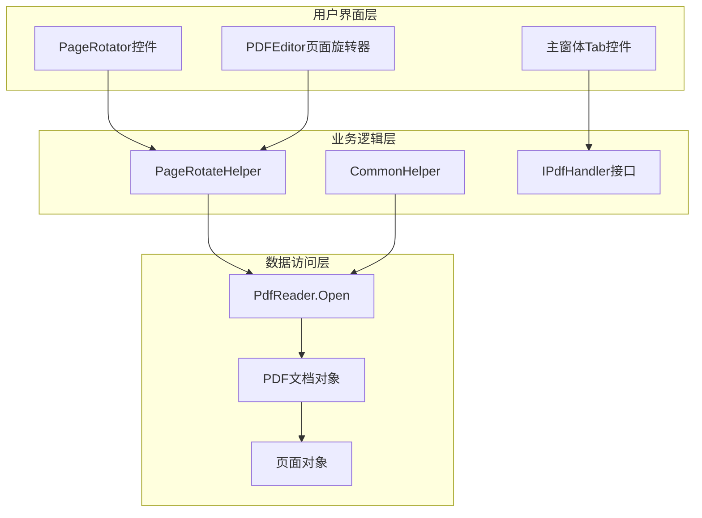
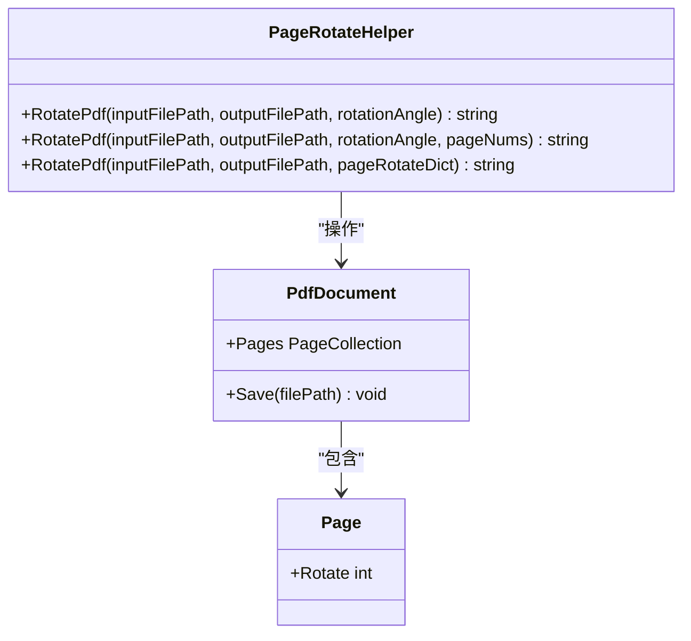
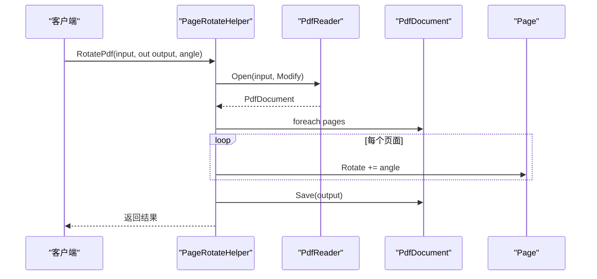
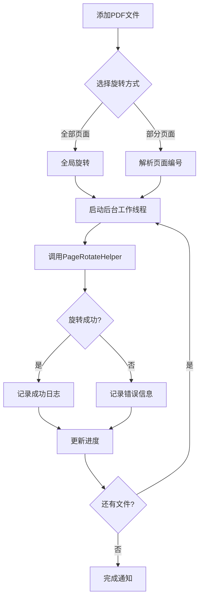
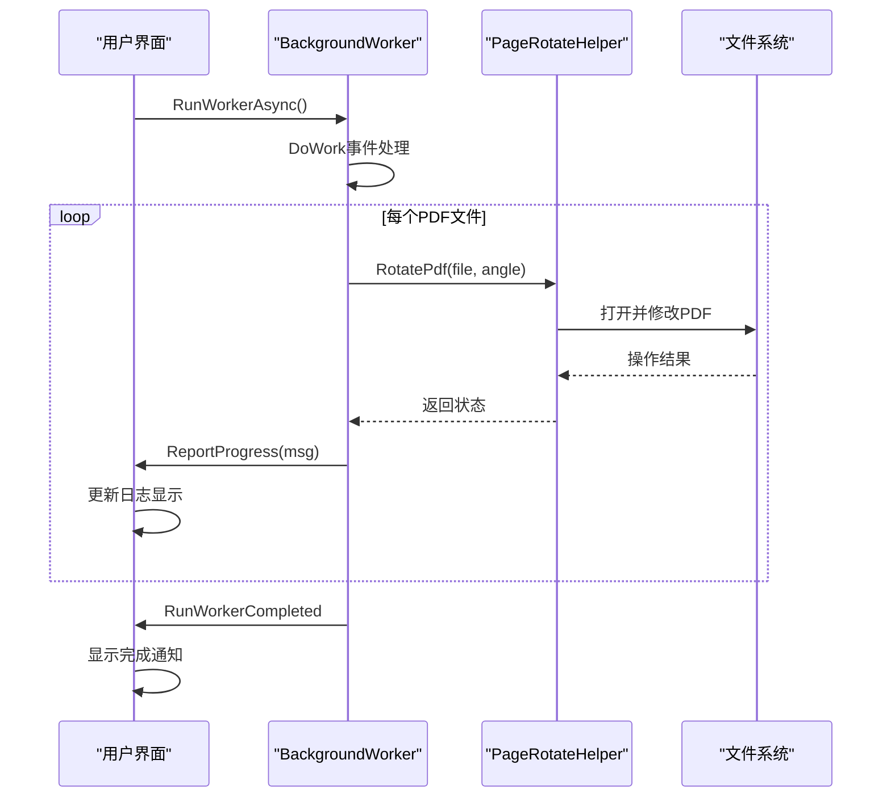
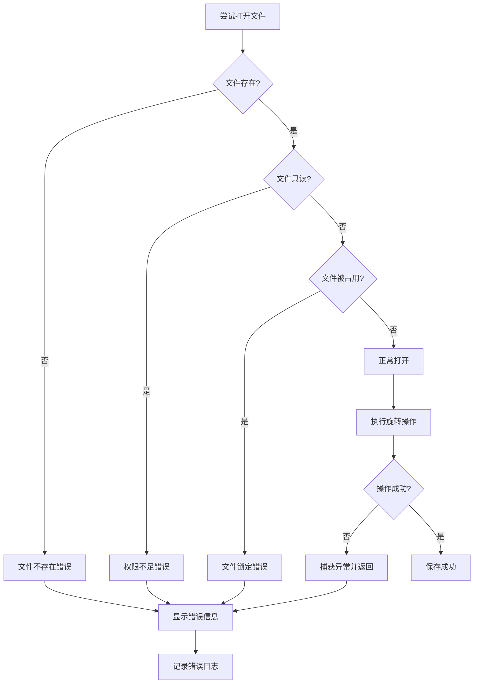

# PDF页面旋转功能技术实现文档

<cite>
**本文档中引用的文件**
- [PageRotateHelper.cs](file://PdfHelperLibrary/PageRotateHelper.cs)
- [PageRotator.cs](file://PdfTool/PageRotator.cs)
- [PageRotator.Designer.cs](file://PdfTool/PageRotator.Designer.cs)
- [CommonHelper.cs](file://PdfHelperLibrary/CommonHelper.cs)
- [MainForm.cs](file://PdfTool/MainForm.cs)
- [PdfEditor\Modules\PageRotator.cs](file://PdfEditor\Modules\PageRotator.cs)
- [PdfEditor\Modules\PageRotator.Designer.cs](file://PdfEditor\Modules\PageRotator.Designer.cs)
- [PdfEditor\PdfEditor.csproj](file://PdfEditor\PdfEditor.csproj)
</cite>

## 目录
1. [概述](#概述)
2. [系统架构](#系统架构)
3. [核心组件分析](#核心组件分析)
4. [PageRotateHelper详细实现](#pagerotatehelper详细实现)
5. [PageRotator用户界面](#pagerotator用户界面)
6. [操作流程与调用链路](#操作流程与调用链路)
7. [典型用例](#典型用例)
8. [性能优化策略](#性能优化策略)
9. [错误处理机制](#错误处理机制)
10. [最佳实践建议](#最佳实践建议)

## 概述

PDF页面旋转功能是PDF工具库中的核心模块之一，主要负责对PDF文档中的页面进行旋转操作。该功能支持多种旋转角度（0°、90°、180°、270°），并提供了灵活的批量处理能力。系统采用分层架构设计，将底层的PDF操作逻辑与用户界面分离，确保了良好的可维护性和扩展性。

## 系统架构

系统采用三层架构模式，包含用户界面层、业务逻辑层和数据访问层：

**图表来源**
- [PageRotator.cs](file://PdfTool/PageRotator.cs#L1-L213)
- [PageRotateHelper.cs](file://PdfHelperLibrary/PageRotateHelper.cs#L1-L95)
- [CommonHelper.cs](file://PdfHelperLibrary/CommonHelper.cs#L1-L29)

## 核心组件分析

### PageRotateHelper - 核心旋转引擎

PageRotateHelper是整个旋转功能的核心组件，提供了三种不同的旋转方法：

**图表来源**
- [PageRotateHelper.cs](file://PdfHelperLibrary/PageRotateHelper.cs#L12-L94)

### PageRotator - 用户交互界面

PageRotator提供了两种不同的用户界面实现：

1. **独立工具版** - 位于PdfTool项目中，支持批量处理
2. **集成编辑器版** - 位于PdfEditor项目中，支持实时预览

**章节来源**
- [PageRotator.cs](file://PdfTool/PageRotator.cs#L1-L213)
- [PdfEditor\Modules\PageRotator.cs](file://PdfEditor\Modules\PageRotator.cs#L1-L204)

## PageRotateHelper详细实现

### 方法重载设计

PageRotateHelper提供了三个重载方法，满足不同场景的需求：

#### 全局旋转方法

**图表来源**
- [PageRotateHelper.cs](file://PdfHelperLibrary/PageRotateHelper.cs#L14-L36)

#### 指定页面旋转方法
该方法支持选择特定页面进行旋转，具有页面有效性验证机制。

#### 自定义字典旋转方法
支持为每个页面指定不同的旋转角度，适用于复杂的批量处理场景。

**章节来源**
- [PageRotateHelper.cs](file://PdfHelperLibrary/PageRotateHelper.cs#L14-L94)

## PageRotator用户界面

### 独立工具版界面设计

独立工具版PageRotator实现了完整的用户交互功能：

**图表来源**
- [PageRotator.cs](file://PdfTool/PageRotator.cs#L82-L126)

### 集成编辑器版界面设计

集成版本提供了实时预览功能，支持单页和批量旋转操作。

**章节来源**
- [PageRotator.cs](file://PdfTool/PageRotator.cs#L130-L212)
- [PdfEditor\Modules\PageRotator.cs](file://PdfEditor\Modules\PageRotator.cs#L107-L204)

## 操作流程与调用链路

### 基本旋转流程

1. **文件加载阶段**
   - 用户通过文件对话框选择PDF文件
   - 系统调用CommonHelper.GetPageCount获取页面数量
   - 将文件列表存储在内部状态中

2. **参数验证阶段**
   - 验证旋转角度的有效性（90°、180°、270°）
   - 解析页面编号字符串（支持范围格式：1-5,8,10-12）
   - 过滤无效页面编号

3. **执行旋转阶段**
   - 调用PageRotateHelper.RotatePdf方法
   - 使用PdfReader.Open以Modify模式打开文档
   - 遍历目标页面并应用旋转角度
   - 保存修改后的文档

4. **结果处理阶段**
   - 记录操作日志
   - 显示成功或失败信息
   - 更新用户界面状态

### 批量处理优化

系统采用BackgroundWorker实现异步处理，避免界面冻结：

**图表来源**
- [PageRotator.cs](file://PdfTool/PageRotator.cs#L92-L125)

**章节来源**
- [PageRotator.cs](file://PdfTool/PageRotator.cs#L35-L126)

## 典型用例

### 校正扫描倾斜的PDF页面

这是最常见的应用场景，特别是在文档数字化过程中：

1. **问题识别**：扫描仪可能产生倾斜的页面
2. **解决方案**：使用90°或270°旋转校正
3. **实施步骤**：
   - 批量检测页面方向
   - 应用适当的旋转角度
   - 验证校正效果

### 批量标准化处理

对于包含多种页面方向的大型文档：

1. **统一标准**：将所有页面调整为相同的阅读方向
2. **自动化处理**：使用脚本或批处理工具
3. **质量控制**：检查旋转后的页面布局

### 特殊格式适配

某些特殊格式需要特定的页面方向：

1. **横版表格**：可能需要90°旋转
2. **竖版文本**：保持原始方向
3. **混合内容**：为每页单独设置方向

## 性能优化策略

### 内存管理优化

1. **及时释放资源**：使用using语句确保PDF文档正确关闭
2. **批量处理缓冲**：避免同时加载过多页面
3. **内存监控**：监控大文件处理时的内存使用

### 并发处理优化

1. **异步处理**：使用BackgroundWorker避免界面阻塞
2. **进度报告**：定期更新用户界面状态
3. **错误隔离**：单个文件错误不影响整体流程

### 文件I/O优化

1. **临时文件管理**：合理命名输出文件避免冲突
2. **磁盘空间检查**：预估输出文件大小
3. **原子操作**：确保文件写入的完整性

**章节来源**
- [PageRotator.cs](file://PdfTool/PageRotator.cs#L92-L125)

## 错误处理机制

### 文件权限错误处理

系统针对常见的文件访问问题提供了完善的错误处理：

### 异常类型处理

1. **文件系统异常**：处理文件不存在、权限不足等问题
2. **PDF格式异常**：处理损坏或不兼容的PDF文件
3. **内存异常**：处理大文件导致的内存不足
4. **网络异常**：处理远程文件访问问题

### 错误恢复策略

1. **自动重试**：对于临时性错误提供重试机制
2. **降级处理**：当高级功能不可用时使用基础功能
3. **用户提示**：提供清晰的错误信息和解决建议

**章节来源**
- [PageRotateHelper.cs](file://PdfHelperLibrary/PageRotateHelper.cs#L16-L36)
- [CommonHelper.cs](file://PdfHelperLibrary/CommonHelper.cs#L13-L25)

## 最佳实践建议

### 开发建议

1. **输入验证**：严格验证用户输入的页面编号和旋转角度
2. **资源管理**：始终正确处理PDF文档的打开和关闭
3. **异常处理**：为所有可能的异常情况提供处理方案
4. **日志记录**：详细记录操作过程和错误信息

### 使用建议

1. **备份重要文件**：在执行批量操作前备份原始文件
2. **测试小样本**：先对少量页面进行测试确认效果
3. **合理设置角度**：避免不必要的多次旋转
4. **监控系统资源**：注意内存和磁盘空间使用情况

### 性能建议

1. **分批处理**：对于超大文件，考虑分批处理
2. **硬件配置**：确保有足够的内存和快速的存储设备
3. **并发控制**：避免同时运行多个大型处理任务
4. **缓存策略**：对于重复操作，考虑使用缓存机制

通过以上详细的分析和说明，开发者可以深入理解PDF页面旋转功能的技术实现，并在实际开发中应用这些知识来构建稳定可靠的PDF处理应用程序。