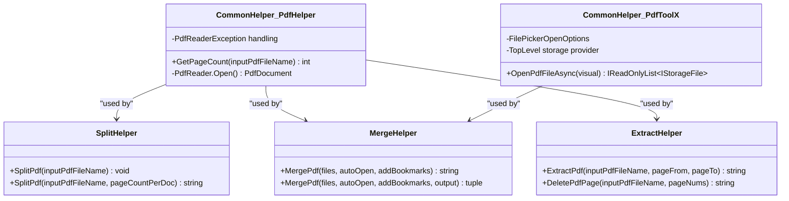

# CommonHelper - 通用工具助手

<cite>
**本文档中引用的文件**
- [PdfHelperLibrary/CommonHelper.cs](file://PdfHelperLibrary/CommonHelper.cs)
- [PdfHelperLibraryX/CommonHelper.cs](file://PdfHelperLibraryX/CommonHelper.cs)
- [PdfToolX/CommonHelper.cs](file://PdfToolX/CommonHelper.cs)
- [ExcelTool/Helpers/CommonHelper.cs](file://ExcelTool/Helpers/CommonHelper.cs)
- [PdfHelperLibrary/SplitHelper.cs](file://PdfHelperLibrary/SplitHelper.cs)
- [PdfHelperLibrary/MergeHelper.cs](file://PdfHelperLibrary/MergeHelper.cs)
- [PdfHelperLibrary/ExtractHelper.cs](file://PdfHelperLibrary/ExtractHelper.cs)
- [PdfHelperLibrary/ImageExtractHelper.cs](file://PdfHelperLibrary/ImageExtractHelper.cs)
- [PdfTool/MainForm.cs](file://PdfTool/MainForm.cs)
- [PdfToolX/PdfMerger.axaml.cs](file://PdfToolX/PdfMerger.axaml.cs)
</cite>

## 目录
1. [简介](#简介)
2. [项目结构](#项目结构)
3. [核心组件](#核心组件)
4. [架构概览](#架构概览)
5. [详细组件分析](#详细组件分析)
6. [依赖关系分析](#依赖关系分析)
7. [性能考虑](#性能考虑)
8. [故障排除指南](#故障排除指南)
9. [结论](#结论)

## 简介

CommonHelper类是PDF工具项目中的核心通用工具助手，提供在PDF处理过程中使用的通用静态方法。该类的设计理念是通过集中化管理通用功能来减少代码重复，提高代码一致性，并为其他PDF处理类（如SplitHelper、MergeHelper等）提供基础支持。

根据项目结构分析，CommonHelper类在多个PDF处理模块中发挥着重要作用，主要负责文件路径处理、目录创建、字符串操作、日志记录等跨功能复用的工具方法。

## 项目结构

PDF工具项目采用模块化架构，包含多个专门的PDF处理库和应用程序：

**图表来源**
- [PdfHelperLibrary/CommonHelper.cs](file://PdfHelperLibrary/CommonHelper.cs#L1-L29)
- [PdfToolX/CommonHelper.cs](file://PdfToolX/CommonHelper.cs#L1-L28)

**章节来源**
- [PdfHelperLibrary/CommonHelper.cs](file://PdfHelperLibrary/CommonHelper.cs#L1-L29)
- [PdfHelperLibraryX/CommonHelper.cs](file://PdfHelperLibraryX/CommonHelper.cs#L1-L28)

## 核心组件

CommonHelper类在不同版本中有不同的实现特点：

### PdfHelperLibrary版本
- **功能**: 提供PDF页数获取功能
- **异常处理**: 包含详细的错误信息包装
- **用途**: 主要用于PDF文件的基本信息查询

### PdfHelperLibraryX版本  
- **功能**: 提供简化的PDF页数获取功能
- **异常处理**: 直接抛出原始异常
- **用途**: 轻量级实现，适用于特定场景

### PdfToolX版本
- **功能**: 提供异步文件选择功能
- **技术栈**: 基于Avalonia框架
- **用途**: 用户界面文件交互

**章节来源**
- [PdfHelperLibrary/CommonHelper.cs](file://PdfHelperLibrary/CommonHelper.cs#L1-L29)
- [PdfHelperLibraryX/CommonHelper.cs](file://PdfHelperLibraryX/CommonHelper.cs#L1-L28)
- [PdfToolX/CommonHelper.cs](file://PdfToolX/CommonHelper.cs#L1-L28)

## 架构概览

CommonHelper类在整个PDF处理系统中扮演着基础设施的角色：

**图表来源**
- [PdfHelperLibrary/CommonHelper.cs](file://PdfHelperLibrary/CommonHelper.cs#L10-L26)
- [PdfHelperLibraryX/CommonHelper.cs](file://PdfHelperLibraryX/CommonHelper.cs#L10-L25)
- [PdfToolX/CommonHelper.cs](file://PdfToolX/CommonHelper.cs#L11-L25)

## 详细组件分析

### PDF页数获取功能

#### PdfHelperLibrary版本实现

**图表来源**
- [PdfHelperLibrary/CommonHelper.cs](file://PdfHelperLibrary/CommonHelper.cs#L11-L26)

#### 功能特性
- **输入验证**: 接受有效的PDF文件路径
- **异常处理**: 分别处理PDF读取异常和其他通用异常
- **错误信息增强**: 在异常消息中包含文件名信息
- **资源管理**: 自动管理PDF文档的打开和关闭

**章节来源**
- [PdfHelperLibrary/CommonHelper.cs](file://PdfHelperLibrary/CommonHelper.cs#L11-L26)

### 文件选择功能

#### PdfToolX版本实现

**图表来源**
- [PdfToolX/CommonHelper.cs](file://PdfToolX/CommonHelper.cs#L11-L25)

#### 技术特性
- **异步操作**: 使用async/await模式
- **平台兼容**: 基于Avalonia框架的存储提供程序
- **多文件支持**: 支持同时选择多个PDF文件
- **类型安全**: 返回强类型的IReadOnlyList<IStorageFile>

**章节来源**
- [PdfToolX/CommonHelper.cs](file://PdfToolX/CommonHelper.cs#L11-L25)

### 在其他类中的使用

CommonHelper的功能被广泛应用于各种PDF处理场景：

**图表来源**
- [PdfToolX/PdfMerger.axaml.cs](file://PdfToolX/PdfMerger.axaml.cs#L32-L32)
- [PdfTool/MainForm.cs](file://PdfTool/MainForm.cs#L41-L47)

**章节来源**
- [PdfToolX/PdfMerger.axaml.cs](file://PdfToolX/PdfMerger.axaml.cs#L25-L50)
- [PdfTool/MainForm.cs](file://PdfTool/MainForm.cs#L41-L47)

## 依赖关系分析

CommonHelper类的依赖关系展现了其在整个系统中的核心地位：

**图表来源**
- [PdfHelperLibrary/CommonHelper.cs](file://PdfHelperLibrary/CommonHelper.cs#L1-L3)
- [PdfToolX/CommonHelper.cs](file://PdfToolX/CommonHelper.cs#L1-L6)

**章节来源**
- [PdfHelperLibrary/CommonHelper.cs](file://PdfHelperLibrary/CommonHelper.cs#L1-L3)
- [PdfToolX/CommonHelper.cs](file://PdfToolX/CommonHelper.cs#L1-L6)

## 性能考虑

### 内存管理
- **资源释放**: 所有PDF操作都确保正确释放资源
- **异常安全**: 使用try-catch块确保异常情况下的资源清理
- **异步操作**: PdfToolX版本使用异步模式避免UI阻塞

### 错误处理策略
- **分层异常**: 不同类型的异常采用不同的处理策略
- **信息丰富**: 异常信息包含文件名等上下文信息
- **优雅降级**: 在异常情况下提供有意义的错误消息

## 故障排除指南

### 常见问题及解决方案

#### PDF文件读取失败
**症状**: GetPageCount方法抛出PdfReaderException
**原因**: 文件不存在、文件损坏或格式不支持
**解决方案**: 
- 验证文件路径的正确性
- 检查文件是否被其他程序占用
- 确认文件格式的有效性

#### 文件选择无响应
**症状**: OpenPdfFileAsync方法没有返回结果
**原因**: TopLevel控件为空或存储提供程序不可用
**解决方案**:
- 确保传入的Visual控件有效
- 检查应用程序的UI线程状态
- 验证Avalonia框架的初始化

**章节来源**
- [PdfHelperLibrary/CommonHelper.cs](file://PdfHelperLibrary/CommonHelper.cs#L18-L25)
- [PdfToolX/CommonHelper.cs](file://PdfToolX/CommonHelper.cs#L13-L15)

## 结论

CommonHelper类作为PDF工具项目的核心基础设施，通过提供通用的工具方法实现了以下关键价值：

### 主要贡献
1. **代码复用**: 将通用功能集中化，避免重复代码
2. **一致性保证**: 为所有PDF处理操作提供统一的接口
3. **维护便利**: 单一位置的修改影响整个系统
4. **扩展性支持**: 为新功能提供基础工具

### 设计优势
- **单一职责**: 每个版本专注于特定领域
- **接口稳定**: 提供稳定的公共接口
- **异常友好**: 完善的错误处理机制
- **平台兼容**: 支持多种开发框架

### 最佳实践建议
开发者在需要通用功能时应优先查阅CommonHelper类，它不仅提供了必要的工具方法，还展示了良好的设计模式和错误处理实践。对于新的PDF处理功能，应该考虑是否可以通过扩展CommonHelper来实现，而不是重复实现相同的功能。