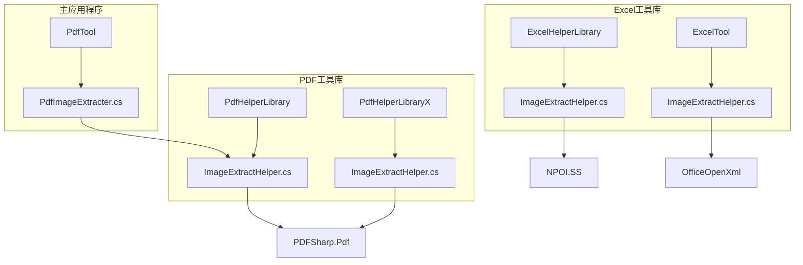
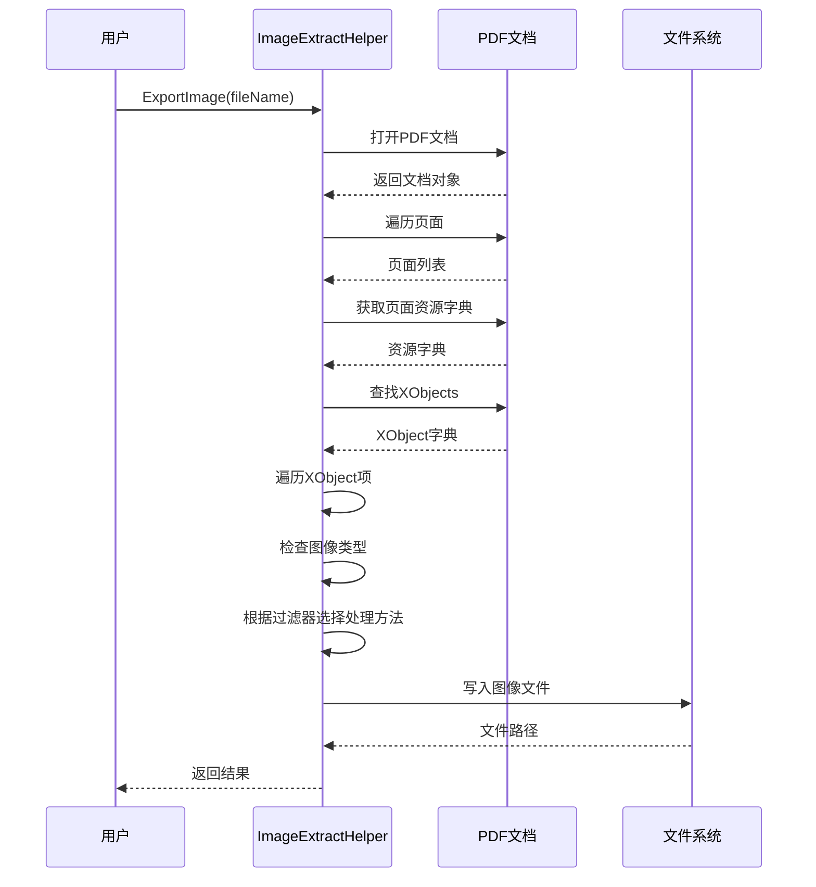
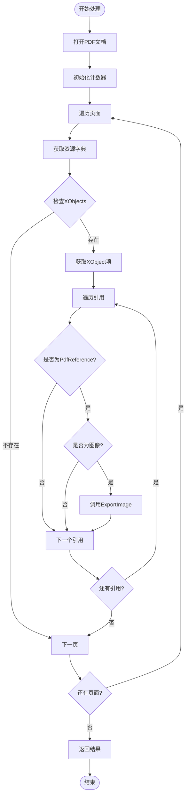
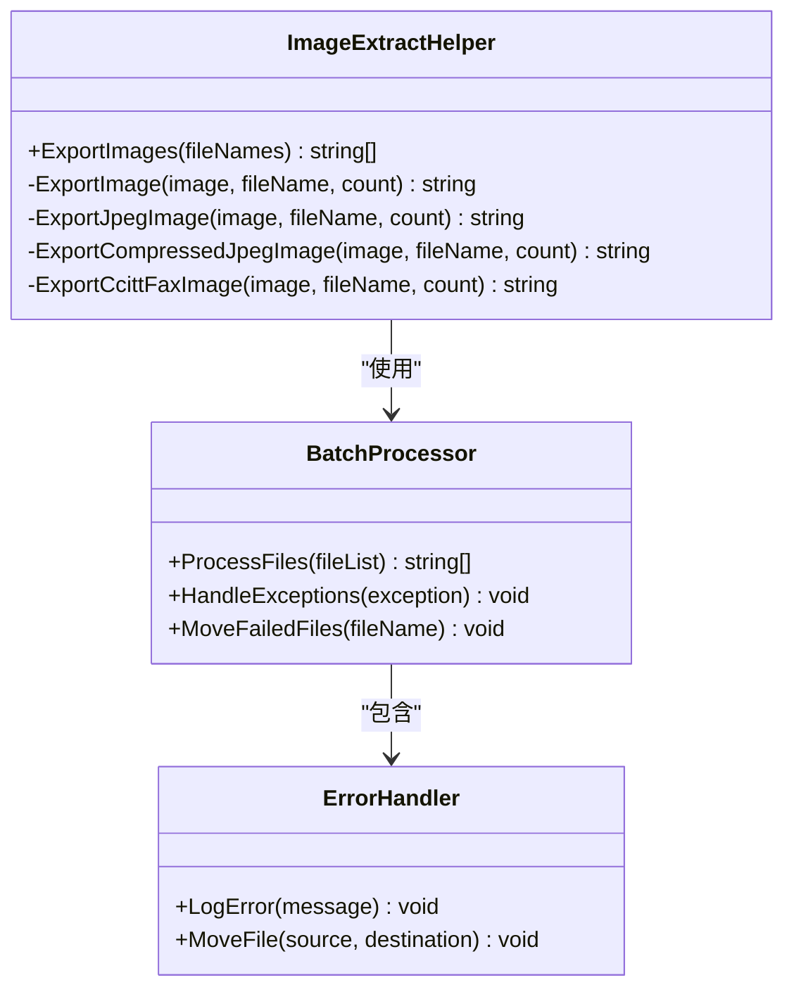
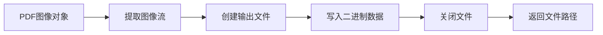
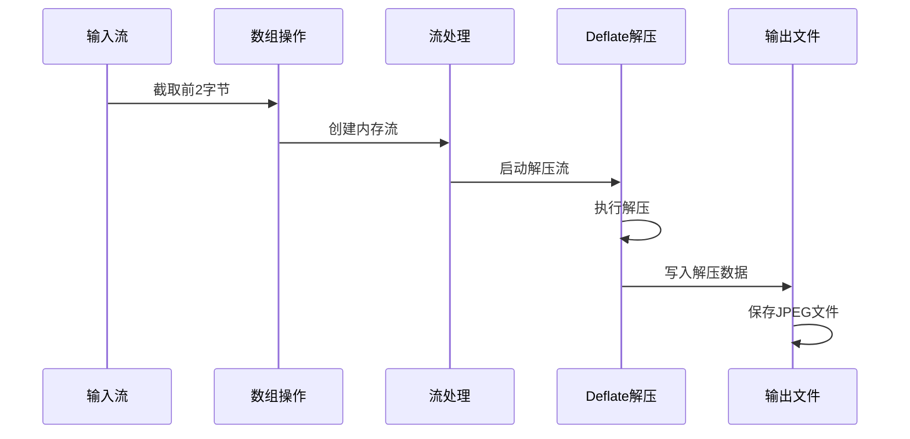
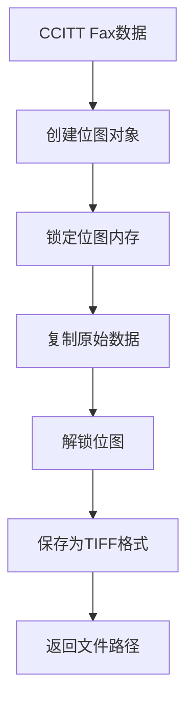
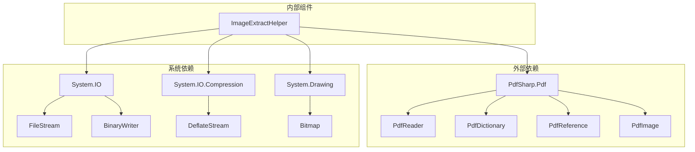

# ImageExtractHelper - PDF图片提取助手

<cite>
**本文档中引用的文件**
- [ImageExtractHelper.cs](file://PdfHelperLibrary/ImageExtractHelper.cs)
- [ImageExtractHelper.cs](file://PdfHelperLibraryX/ImageExtractHelper.cs)
- [ImageExtractHelper.cs](file://ExcelHelperLibrary/ImageExtractHelper.cs)
- [ImageExtractHelper.cs](file://ExcelTool/Helpers/ImageExtractHelper.cs)
- [PdfImageExtracter.cs](file://PdfTool/PdfImageExtracter.cs)
- [PdfTool.csproj](file://PdfTool/PdfTool.csproj)
- [PdfHelperLibrary.csproj](file://PdfHelperLibrary/PdfHelperLibrary.csproj)
</cite>

## 目录
1. [简介](#简介)
2. [项目结构](#项目结构)
3. [核心组件](#核心组件)
4. [架构概览](#架构概览)
5. [详细组件分析](#详细组件分析)
6. [依赖关系分析](#依赖关系分析)
7. [性能考虑](#性能考虑)
8. [故障排除指南](#故障排除指南)
9. [结论](#结论)

## 简介

ImageExtractHelper是一个专门用于从PDF文件中提取嵌入图像的静态工具类。该类提供了强大的图片提取功能，支持多种压缩格式的图像处理，包括JPEG、PNG和CCITT Fax编码。通过解析PDF对象树和页面资源字典，它能够准确识别并导出各种类型的嵌入图像。

该工具类在PDFTool项目中扮演着关键角色，为用户提供了一个简单而高效的PDF图片提取解决方案。它不仅支持单个文件的图片提取，还提供了批量处理能力，大大提高了工作效率。

## 项目结构

ImageExtractHelper类在项目中的组织结构体现了清晰的模块化设计：

**图表来源**
- [PdfHelperLibrary.csproj](file://PdfHelperLibrary/PdfHelperLibrary.csproj#L1-L127)
- [PdfTool.csproj](file://PdfTool/PdfTool.csproj#L1-L204)

**章节来源**
- [PdfHelperLibrary.csproj](file://PdfHelperLibrary/PdfHelperLibrary.csproj#L1-L127)
- [PdfTool.csproj](file://PdfTool/PdfTool.csproj#L1-L204)

## 核心组件

ImageExtractHelper类包含以下核心组件：

### 主要方法
- **ExportImage**: 单文件图片提取入口点
- **ExportImages**: 批量文件图片提取
- **ExportJpegImage**: JPEG图像导出
- **ExportCompressedJpegImage**: 压缩JPEG图像处理
- **ExportCcittFaxImage**: CCITT Fax图像处理

### 数据结构
- 静态类设计，提供全局访问接口
- 支持多种PDF压缩格式的处理
- 文件命名规则自动化

**章节来源**
- [ImageExtractHelper.cs](file://PdfHelperLibrary/ImageExtractHelper.cs#L1-L182)

## 架构概览

ImageExtractHelper采用分层架构设计，从PDF文档解析到图像导出形成完整的处理流程：

**图表来源**
- [ImageExtractHelper.cs](file://PdfHelperLibrary/ImageExtractHelper.cs#L17-L46)
- [ImageExtractHelper.cs](file://PdfHelperLibrary/ImageExtractHelper.cs#L48-L86)

## 详细组件分析

### ExportImage方法分析

ExportImage方法是单文件图片提取的核心入口，实现了完整的PDF文档解析流程：

**图表来源**
- [ImageExtractHelper.cs](file://PdfHelperLibrary/ImageExtractHelper.cs#L17-L46)

该方法的关键特性：
- **异常处理**: 完整的try-catch机制确保处理稳定性
- **资源管理**: 自动释放PDF文档资源
- **进度跟踪**: 通过计数器跟踪提取进度

**章节来源**
- [ImageExtractHelper.cs](file://PdfHelperLibrary/ImageExtractHelper.cs#L17-L46)

### ExportImages批量处理分析

ExportImages方法提供了批量处理能力，支持同时处理多个PDF文件：

**图表来源**
- [ImageExtractHelper.cs](file://PdfHelperLibrary/ImageExtractHelper.cs#L48-L86)

批量处理的优化特性：
- **并发处理**: 支持多文件同时处理
- **错误隔离**: 单个文件失败不影响其他文件
- **日志记录**: DEBUG模式下的详细处理日志

**章节来源**
- [ImageExtractHelper.cs](file://PdfHelperLibrary/ImageExtractHelper.cs#L48-L86)

### 图像处理算法分析

#### JPEG图像处理

ExportJpegImage方法处理原生JPEG格式的图像：

**图表来源**
- [ImageExtractHelper.cs](file://PdfHelperLibrary/ImageExtractHelper.cs#L107-L117)

#### 压缩JPEG处理

ExportCompressedJpegImage方法处理FlateDecode压缩的JPEG图像：

**图表来源**
- [ImageExtractHelper.cs](file://PdfHelperLibrary/ImageExtractHelper.cs#L134-L154)

#### CCITT Fax图像处理

ExportCcittFaxImage方法处理黑白图像的CCITT Fax压缩：

**图表来源**
- [ImageExtractHelper.cs](file://PdfHelperLibrary/ImageExtractHelper.cs#L157-L177)

**章节来源**
- [ImageExtractHelper.cs](file://PdfHelperLibrary/ImageExtractHelper.cs#L107-L177)

### 文件命名规则

ImageExtractHelper采用智能的文件命名规则：

| 图像类型 | 文件扩展名 | 命名格式 | 示例 |
|---------|-----------|----------|------|
| JPEG | .jpeg | `{filename}_{count}.jpeg` | `document_1.jpeg` |
| TIFF | .tiff | `{filename}_{count}.tiff` | `document_1.tiff` |
| PNG | .png | `{filename}_{count}.png` | `document_1.png` |

命名规则特点：
- **唯一性**: 通过计数器确保文件名唯一
- **关联性**: 保留原始文件名便于识别
- **有序性**: 按提取顺序排列文件

**章节来源**
- [ImageExtractHelper.cs](file://PdfHelperLibrary/ImageExtractHelper.cs#L111-L117)
- [ImageExtractHelper.cs](file://PdfHelperLibrary/ImageExtractHelper.cs#L166-L167)

## 依赖关系分析

ImageExtractHelper类的依赖关系展现了清晰的层次结构：

**图表来源**
- [ImageExtractHelper.cs](file://PdfHelperLibrary/ImageExtractHelper.cs#L1-L9)
- [PdfHelperLibrary.csproj](file://PdfHelperLibrary/PdfHelperLibrary.csproj#L39-L78)

主要依赖项：
- **PdfSharp.Pdf**: PDF文档解析核心库
- **System.IO**: 文件系统操作
- **System.IO.Compression**: 压缩算法支持
- **System.Drawing**: 图像处理功能

**章节来源**
- [ImageExtractHelper.cs](file://PdfHelperLibrary/ImageExtractHelper.cs#L1-L9)
- [PdfHelperLibrary.csproj](file://PdfHelperLibrary/PdfHelperLibrary.csproj#L39-L78)

## 性能考虑

### 内存管理
- **流式处理**: 使用MemoryStream避免大文件内存溢出
- **及时释放**: 确保所有资源在使用后立即释放
- **缓冲区优化**: 合理设置读写缓冲区大小

### 并发处理
- **异步支持**: 可扩展为异步处理模式
- **线程安全**: 静态类设计确保线程安全性
- **资源池化**: 可考虑引入对象池减少GC压力

### 错误处理
- **优雅降级**: 单个文件失败不影响整体处理
- **详细日志**: DEBUG模式提供完整处理轨迹
- **异常恢复**: 自动移动失败文件避免重复处理

## 故障排除指南

### 常见问题及解决方案

| 问题类型 | 症状描述 | 可能原因 | 解决方案 |
|---------|---------|---------|---------|
| 文件无法打开 | 抛出IOException | 文件被占用或权限不足 | 检查文件访问权限，关闭占用进程 |
| 图像提取失败 | 返回空字符串 | PDF文档损坏或无图像 | 验证PDF完整性，检查图像存在性 |
| 内存溢出 | OutOfMemoryException | 大文件处理 | 分批处理或增加内存限制 |
| 编码错误 | 解码失败 | 不支持的压缩格式 | 添加新的解码器支持 |

### 调试技巧
- **启用DEBUG模式**: 查看详细的处理日志
- **检查临时文件**: 验证中间处理文件的完整性
- **监控内存使用**: 关注内存消耗情况
- **验证PDF结构**: 确认PDF对象树的正确性

**章节来源**
- [ImageExtractHelper.cs](file://PdfHelperLibrary/ImageExtractHelper.cs#L42-L45)
- [ImageExtractHelper.cs](file://PdfHelperLibrary/ImageExtractHelper.cs#L78-L83)

## 结论

ImageExtractHelper类是一个功能强大且设计精良的PDF图片提取工具。它通过清晰的架构设计、完善的错误处理机制和高效的处理算法，为用户提供了可靠的图片提取服务。

### 主要优势
- **多格式支持**: 全面覆盖PDF图像的各种压缩格式
- **批量处理**: 高效处理多个文件的图片提取需求
- **错误容错**: 完善的异常处理确保系统稳定性
- **易于集成**: 清晰的API设计便于在其他项目中使用

### 应用场景
- **文档数字化**: 将PDF中的图片提取出来用于其他用途
- **内容分析**: 为后续的图像分析和处理做准备
- **批量转换**: 大规模PDF文档的图片提取任务
- **数据备份**: 提取重要文档中的嵌入图片作为备份

该工具类在PDFTool项目中发挥着重要作用，为用户提供了一个专业级的PDF图片提取解决方案。其设计理念和实现方式值得在类似项目中借鉴和应用。