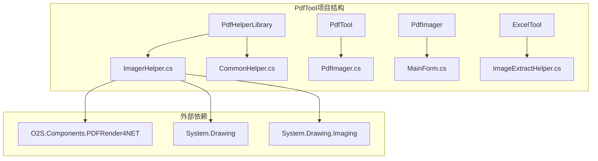
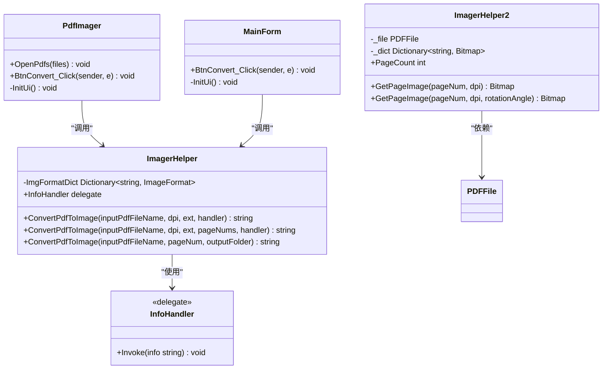
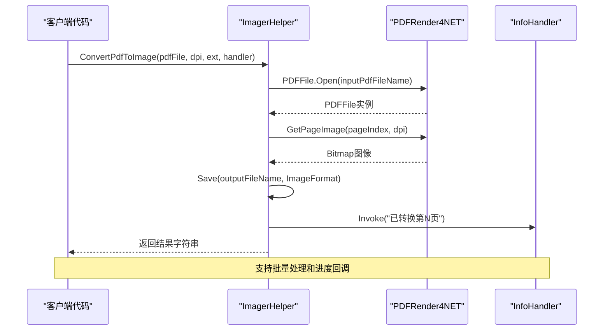
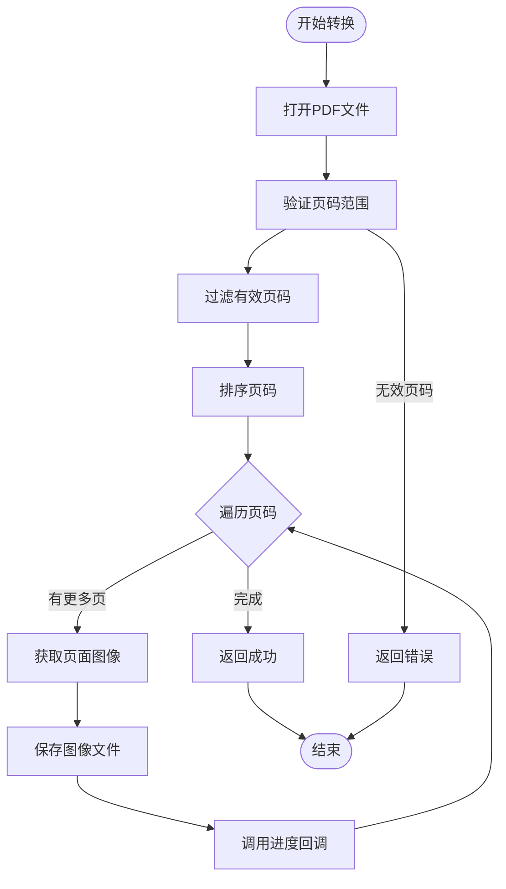
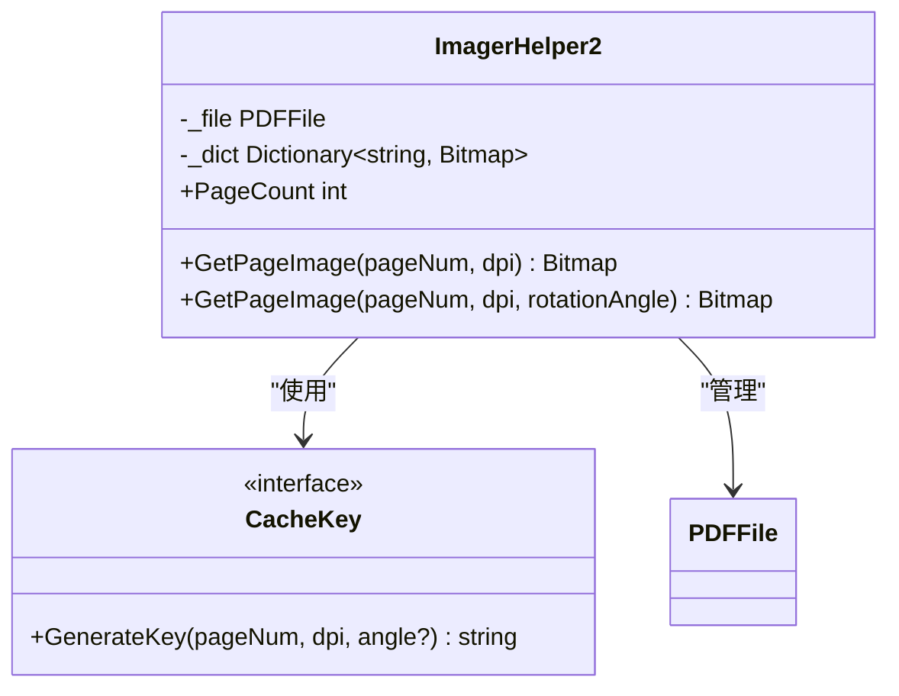
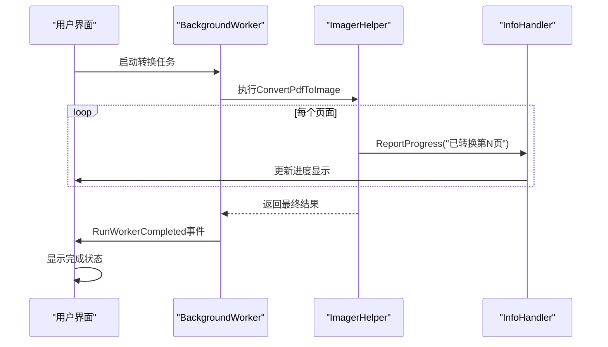
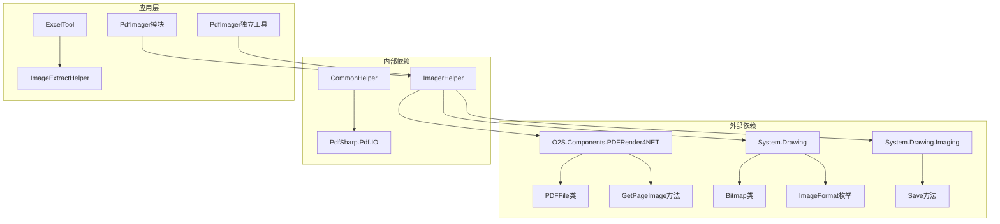
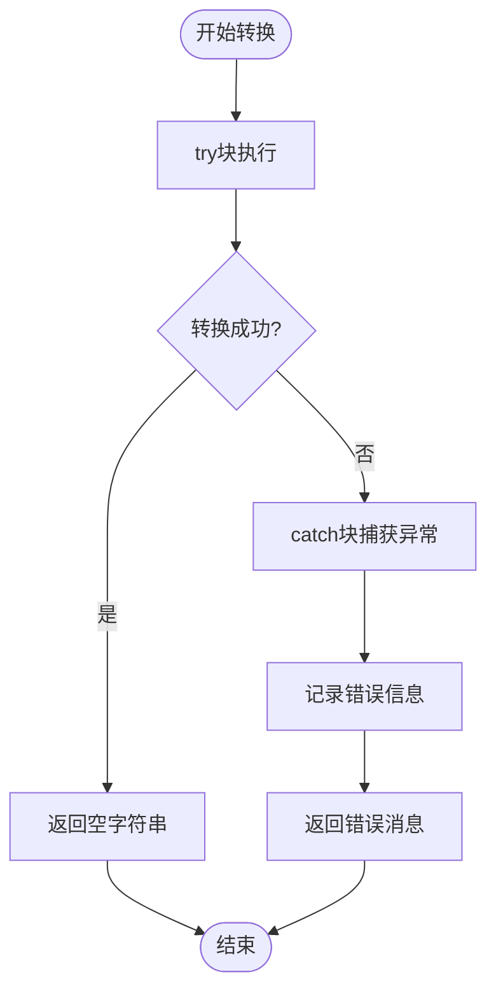

# ImagerHelper - PDF转图像助手

<cite>
**本文档中引用的文件**
- [ImagerHelper.cs](file://PdfHelperLibrary/ImagerHelper.cs)
- [PdfImager.cs](file://PdfTool/PdfImager.cs)
- [MainForm.cs](file://PdfImager/MainForm.cs)
- [CommonHelper.cs](file://PdfHelperLibrary/CommonHelper.cs)
</cite>

## 目录
1. [简介](#简介)
2. [项目结构](#项目结构)
3. [核心组件](#核心组件)
4. [架构概览](#架构概览)
5. [详细组件分析](#详细组件分析)
6. [依赖关系分析](#依赖关系分析)
7. [性能考虑](#性能考虑)
8. [故障排除指南](#故障排除指南)
9. [结论](#结论)

## 简介

ImagerHelper是PdfTool项目中的一个核心图像处理类，专门负责将PDF页面渲染为多种格式的图像文件。该类提供了三种主要的PDF转图像转换方法，支持全页转换、指定页码转换和单页转换，并具备强大的进度回调机制和多格式输出支持。

该类基于O2S.Components.PDFRender4NET库进行底层PDF页面渲染，支持PNG、JPG、BMP、GIF、TIFF、EMF、WMF等多种图像格式输出。通过精心设计的接口和资源管理机制，确保了高效的批量转换能力和良好的内存使用效率。

## 项目结构

ImagerHelper类位于PdfHelperLibrary项目中，作为PDF处理工具链的核心组件之一。该项目采用模块化架构，包含多个相关的辅助类和工具程序。

**图表来源**
- [ImagerHelper.cs](file://PdfHelperLibrary/ImagerHelper.cs#L1-L10)
- [PdfImager.cs](file://PdfTool/PdfImager.cs#L1-L10)

**章节来源**
- [ImagerHelper.cs](file://PdfHelperLibrary/ImagerHelper.cs#L1-L192)
- [PdfImager.cs](file://PdfTool/PdfImager.cs#L1-L218)

## 核心组件

ImagerHelper类包含两个主要的静态类和一个辅助类，每个都承担着特定的功能职责：

### 主要类结构

1. **ImagerHelper** - 静态工具类，提供PDF转图像的核心功能
2. **ImagerHelper2** - 面向对象的PDF页面缓存和处理类
3. **InfoHandler委托** - 定义进度回调处理函数

### 支持的图像格式

ImagerHelper内部维护了一个图像格式映射字典，支持以下格式：
- PNG (Portable Network Graphics)
- JPG/JPEG (Joint Photographic Experts Group)
- BMP (Bitmap)
- GIF (Graphics Interchange Format)
- TIFF/TIF (Tagged Image File Format)
- EMF (Enhanced Metafile)
- WMF (Windows Metafile)

**章节来源**
- [ImagerHelper.cs](file://PdfHelperLibrary/ImagerHelper.cs#L16-L26)

## 架构概览

ImagerHelper采用了分层架构设计，将PDF处理逻辑与用户界面分离，提供了灵活的转换接口和强大的扩展能力。

**图表来源**
- [ImagerHelper.cs](file://PdfHelperLibrary/ImagerHelper.cs#L13-L126)
- [PdfImager.cs](file://PdfTool/PdfImager.cs#L13-L218)
- [MainForm.cs](file://PdfImager/MainForm.cs#L11-L153)

## 详细组件分析

### ConvertPdfToImage方法详解

ImagerHelper提供了三个重载的ConvertPdfToImage方法，每个都有特定的使用场景和参数配置。

#### 方法一：全页转换 (ConvertPdfToImage - 全页模式)

这是最常用的转换方法，适用于需要将整个PDF文档转换为图像文件的场景。

**图表来源**
- [ImagerHelper.cs](file://PdfHelperLibrary/ImagerHelper.cs#L36-L54)

**关键参数说明：**
- `inputPdfFileName`: 输入的PDF文件路径
- `dpi`: 图像分辨率，控制输出图像的质量和大小
- `ext`: 输出图像格式扩展名
- `handler`: 进度回调处理器，用于报告转换进度

#### 方法二：指定页码转换 (ConvertPdfToImage - 指定页模式)

该方法允许用户选择特定的页面进行转换，提供了更精细的控制能力。

**图表来源**
- [ImagerHelper.cs](file://PdfHelperLibrary/ImagerHelper.cs#L70-L91)

**关键特性：**
- 自动验证页码的有效性（1 ≤ 页码 ≤ 总页数）
- 内置页码去重和排序功能
- 支持连续和非连续的页码组合

#### 方法三：单页转换 (ConvertPdfToImage - 单页模式)

专为快速预览和简单转换设计的方法，使用默认的300 DPI设置。

**章节来源**
- [ImagerHelper.cs](file://PdfHelperLibrary/ImagerHelper.cs#L36-L126)

### ImagerHelper2类分析

ImagerHelper2是一个面向对象的实现，提供了更高级的页面缓存和旋转功能。

#### 缓存机制

**图表来源**
- [ImagerHelper.cs](file://PdfHelperLibrary/ImagerHelper.cs#L129-L191)

**缓存策略：**
- 基于页面编号和DPI的键值缓存
- 支持带旋转角度的复合键缓存
- 自动内存管理，避免重复渲染

#### 旋转功能实现

ImagerHelper2支持常见的旋转角度（0°、90°、180°、270°），并通过GDI+的RotateFlip方法实现高质量的图像旋转。

**章节来源**
- [ImagerHelper.cs](file://PdfHelperLibrary/ImagerHelper.cs#L129-L191)

### 进度回调系统

ImagerHelper集成了强大的进度回调机制，通过InfoHandler委托实现异步进度报告。

**图表来源**
- [PdfImager.cs](file://PdfTool/PdfImager.cs#L67-L98)
- [MainForm.cs](file://PdfImager/MainForm.cs#L54-L76)

**章节来源**
- [PdfImager.cs](file://PdfTool/PdfImager.cs#L67-L98)
- [MainForm.cs](file://PdfImager/MainForm.cs#L54-L76)

## 依赖关系分析

ImagerHelper的依赖关系体现了清晰的分层架构和单一职责原则。

**图表来源**
- [ImagerHelper.cs](file://PdfHelperLibrary/ImagerHelper.cs#L1-L10)
- [CommonHelper.cs](file://PdfHelperLibrary/CommonHelper.cs#L1-L5)

### 关键依赖说明

1. **O2S.Components.PDFRender4NET**: 提供PDF页面渲染的核心功能
2. **System.Drawing**: 处理图像操作和格式转换
3. **System.Drawing.Imaging**: 提供图像编码和解码支持
4. **PdfSharp.Pdf.IO**: 用于PDF文档基本信息提取

**章节来源**
- [ImagerHelper.cs](file://PdfHelperLibrary/ImagerHelper.cs#L1-L10)
- [CommonHelper.cs](file://PdfHelperLibrary/CommonHelper.cs#L1-L29)

## 性能考虑

### 内存管理优化

ImagerHelper在设计时充分考虑了内存使用效率：

1. **自动资源释放**: 使用using语句确保PDF文件和图像资源及时释放
2. **智能缓存策略**: ImagerHelper2提供基于键值的内存缓存，避免重复渲染
3. **流式处理**: 支持大文件的分页处理，减少内存峰值

### 并发处理能力

通过BackgroundWorker模式，ImagerHelper能够：
- 在后台线程执行耗时的PDF转换操作
- 实现UI线程的非阻塞响应
- 提供实时的进度反馈

### 性能调优建议

1. **DPI选择**: 根据用途选择合适的DPI值（通常150-600 DPI足够）
2. **格式选择**: PNG适合文本和图标，JPG适合照片内容
3. **批处理策略**: 对大量文件使用队列处理而非并发处理

## 故障排除指南

### 常见问题及解决方案

#### GDI+资源泄漏问题

**问题描述**: 长时间运行后出现GDI+资源耗尽错误

**解决方案**:
1. 确保使用using语句管理资源
2. 及时释放不需要的图像对象
3. 考虑使用ImagerHelper2的缓存机制

#### PDF文件损坏或加密

**问题描述**: 转换过程中出现异常

**解决方案**:
1. 使用CommonHelper验证PDF文件有效性
2. 检查PDF文件是否受密码保护
3. 验证文件完整性

#### 大文件处理性能问题

**问题描述**: 处理大型PDF文件时速度过慢

**解决方案**:
1. 减少DPI值以降低图像质量
2. 分批处理页面而非一次性加载
3. 使用ImagerHelper2的缓存功能

**章节来源**
- [ImagerHelper.cs](file://PdfHelperLibrary/ImagerHelper.cs#L36-L126)

### 错误处理机制

ImagerHelper提供了完善的错误处理和诊断功能：

**图表来源**
- [ImagerHelper.cs](file://PdfHelperLibrary/ImagerHelper.cs#L36-L126)

## 结论

ImagerHelper作为PdfTool项目的核心图像处理组件，展现了优秀的软件设计原则和实用价值。其三大核心方法提供了灵活的PDF转图像解决方案，从简单的单页预览到复杂的批量处理都能胜任。

### 主要优势

1. **功能完整**: 支持多种转换模式和图像格式
2. **性能优秀**: 通过缓存和资源管理实现高效处理
3. **易于集成**: 清晰的API设计便于各种应用场景
4. **扩展性强**: 面向对象的ImagerHelper2提供了进一步的功能扩展

### 应用场景

- **PdfTool模块**: 集成在主应用程序中，提供PDF图像转换功能
- **PdfImager独立工具**: 独立的GUI应用程序，专注于批量图像转换
- **ExcelTool**: 在Excel数据提取过程中处理嵌入的PDF图像

ImagerHelper的设计充分体现了现代C#编程的最佳实践，为PDF处理领域提供了一个可靠、高效的图像转换解决方案。