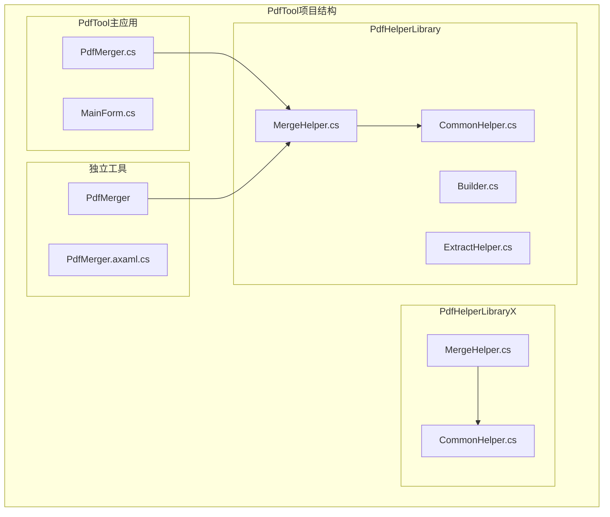
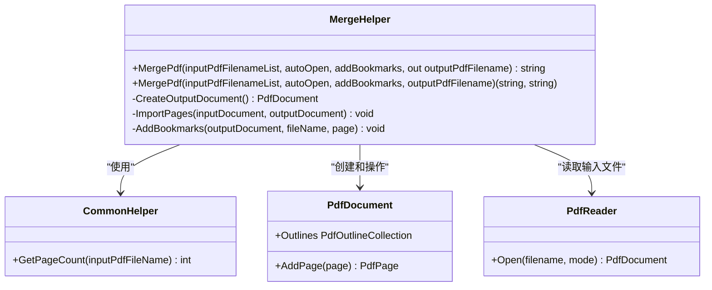
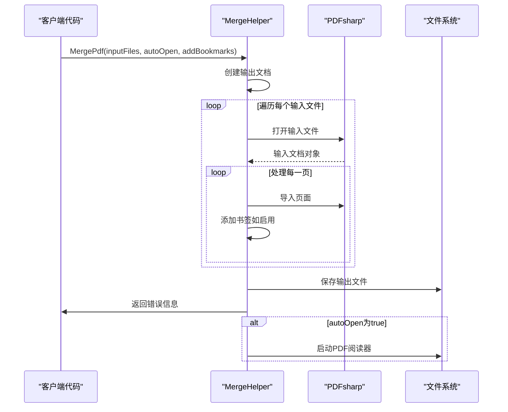
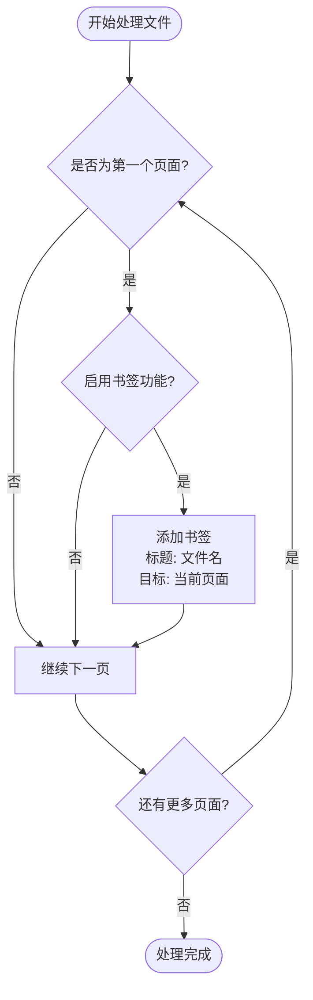
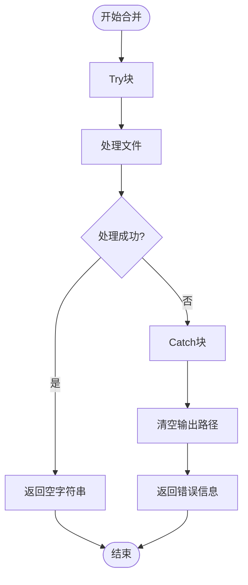
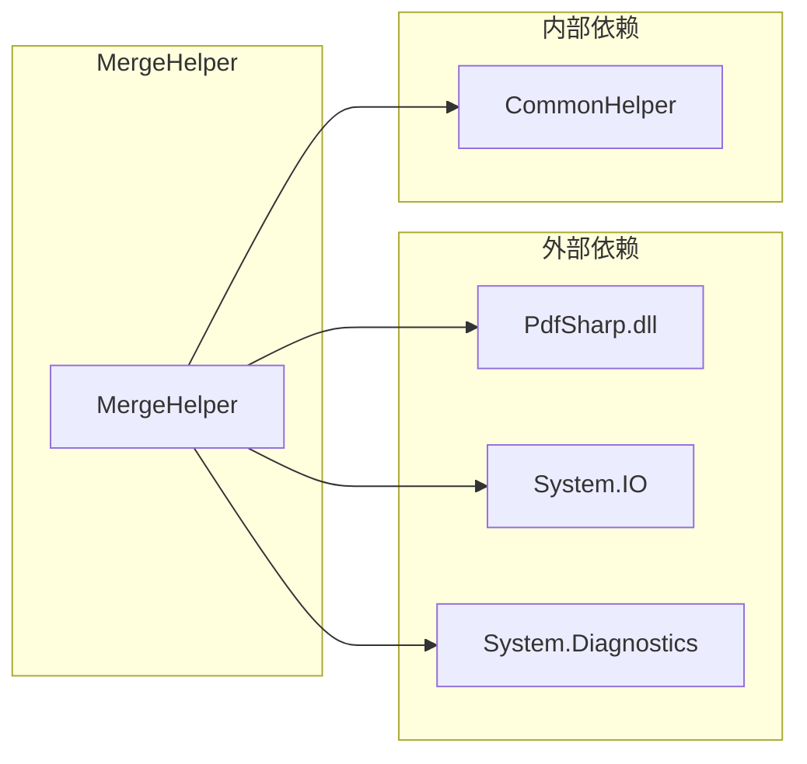

# MergeHelper - PDF合并助手

<cite>
**本文档引用的文件**
- [MergeHelper.cs](file://PdfHelperLibrary/MergeHelper.cs)
- [MergeHelper.cs](file://PdfHelperLibraryX/MergeHelper.cs)
- [CommonHelper.cs](file://PdfHelperLibrary/CommonHelper.cs)
- [PdfMerger.cs](file://PdfTool/PdfMerger.cs)
- [MainForm.cs](file://PdfMerger/MainForm.cs)
- [PdfMerger.axaml.cs](file://PdfToolX/PdfMerger.axaml.cs)
- [MergeHelper.cs](file://WordHelperLibrary/MergeHelper.cs)
</cite>

## 目录
1. [简介](#简介)
2. [项目结构](#项目结构)
3. [核心组件](#核心组件)
4. [架构概览](#架构概览)
5. [详细组件分析](#详细组件分析)
6. [依赖关系分析](#依赖关系分析)
7. [性能考虑](#性能考虑)
8. [故障排除指南](#故障排除指南)
9. [结论](#结论)

## 简介

MergeHelper是PdfTool项目中的核心PDF合并功能组件，专门负责将多个PDF文件合并成一个单一的PDF文档。该类提供了两种重载的MergePdf方法，支持不同的使用场景和需求。通过PDFsharp库实现PDF文档的逐页导入和合并，并可选地添加书签功能以增强文档导航体验。

MergeHelper类在PdfTool主应用程序和独立的PdfMerger工具中都有广泛应用，体现了良好的代码复用性和模块化设计。它不仅处理基本的PDF合并操作，还包含了完善的异常处理机制和内存管理策略。

## 项目结构

PdfTool项目采用分层架构设计，MergeHelper类位于PdfHelperLibrary中，作为PDF处理功能的核心组件之一。



**图表来源**
- [MergeHelper.cs](file://PdfHelperLibrary/MergeHelper.cs#L1-L75)
- [MergeHelper.cs](file://PdfHelperLibraryX/MergeHelper.cs#L1-L39)
- [PdfMerger.cs](file://PdfTool/PdfMerger.cs#L1-L154)

**章节来源**
- [MergeHelper.cs](file://PdfHelperLibrary/MergeHelper.cs#L1-L75)
- [MergeHelper.cs](file://PdfHelperLibraryX/MergeHelper.cs#L1-L39)

## 核心组件

MergeHelper类包含以下核心组件：

### 主要方法
1. **字符串返回版本** (`MergePdf`) - 返回错误信息，输出路径通过out参数
2. **元组返回版本** (`MergePdf`) - 返回错误信息和输出路径的元组
3. **书签功能** - 可选的PDF大纲书签添加
4. **自动打开功能** - 合并完成后自动启动PDF阅读器

### 依赖组件
- **PDFsharp库** - 核心PDF处理引擎
- **CommonHelper** - 提供页面计数等辅助功能
- **系统进程管理** - 支持自动打开合并后的文件

**章节来源**
- [MergeHelper.cs](file://PdfHelperLibrary/MergeHelper.cs#L16-L72)
- [CommonHelper.cs](file://PdfHelperLibrary/CommonHelper.cs#L10-L28)

## 架构概览

MergeHelper采用了简洁而高效的架构设计，主要特点包括：



**图表来源**
- [MergeHelper.cs](file://PdfHelperLibrary/MergeHelper.cs#L14-L72)
- [CommonHelper.cs](file://PdfHelperLibrary/CommonHelper.cs#L10-L28)

## 详细组件分析

### 方法一：字符串返回版本

这是最常用的重载方法，提供详细的错误处理和灵活的输出控制。

#### 方法签名
```csharp
public static string MergePdf(
    List<string> inputPdfFilenameList, 
    bool autoOpen, 
    bool addBookmarks, 
    out string outputPdfFilename
)
```

#### 参数说明
- `inputPdfFilenameList`: 要合并的PDF文件路径列表
- `autoOpen`: 是否合并完成后自动打开输出文件
- `addBookmarks`: 是否为每个输入文件添加书签
- `outputPdfFilename`: 输出文件路径（通过out参数返回）

#### 实现机制



**图表来源**
- [MergeHelper.cs](file://PdfHelperLibrary/MergeHelper.cs#L16-L41)

#### 内部处理流程

1. **文档初始化** - 创建新的PDF文档对象
2. **文件遍历** - 依次处理每个输入文件
3. **页面导入** - 使用PDFsharp的导入模式读取页面
4. **书签添加** - 仅在第一个页面添加书签
5. **输出保存** - 保存合并后的文档
6. **自动打开** - 根据参数决定是否启动阅读器

**章节来源**
- [MergeHelper.cs](file://PdfHelperLibrary/MergeHelper.cs#L16-L41)

### 方法二：元组返回版本

这个版本提供了更现代的错误处理方式，返回值是一个包含错误信息和输出路径的元组。

#### 方法签名
```csharp
public static (string, string) MergePdf(
    List<string> inputPdfFilenameList, 
    bool autoOpen, 
    bool addBookmarks, 
    string outputPdfFilename
)
```

#### 参数说明
- `inputPdfFilenameList`: 要合并的PDF文件路径列表
- `autoOpen`: 是否合并完成后自动打开输出文件
- `addBookmarks`: 是否为每个输入文件添加书签
- `outputPdfFilename`: 指定的输出文件路径（可为空）

#### 实现差异

与字符串版本的主要区别在于：
- 使用指定的输出文件路径（如果为空则自动生成）
- 返回值类型为元组，包含错误信息和输出路径
- 更符合.NET 7+的Tuple语法风格

**章节来源**
- [MergeHelper.cs](file://PdfHelperLibrary/MergeHelper.cs#L44-L72)

### 书签功能实现

MergeHelper支持为合并后的PDF添加书签，增强文档导航体验：



**图表来源**
- [MergeHelper.cs](file://PdfHelperLibrary/MergeHelper.cs#L25-L28)

**章节来源**
- [MergeHelper.cs](file://PdfHelperLibrary/MergeHelper.cs#L25-L28)

### 异常处理机制

MergeHelper实现了全面的异常处理策略：



**图表来源**
- [MergeHelper.cs](file://PdfHelperLibrary/MergeHelper.cs#L18-L41)

异常处理特点：
- 捕获所有异常类型，提供详细的错误信息
- 确保资源正确清理
- 返回清晰的错误消息给调用者

**章节来源**
- [MergeHelper.cs](file://PdfHelperLibrary/MergeHelper.cs#L37-L41)

## 依赖关系分析

MergeHelper的依赖关系体现了良好的模块化设计：



**图表来源**
- [MergeHelper.cs](file://PdfHelperLibrary/MergeHelper.cs#L1-L8)

### 关键依赖说明

1. **PDFsharp库** - 核心PDF处理能力
2. **System.IO** - 文件系统操作
3. **System.Diagnostics** - 进程启动功能
4. **CommonHelper** - 页面计数等辅助功能

**章节来源**
- [MergeHelper.cs](file://PdfHelperLibrary/MergeHelper.cs#L1-L8)
- [CommonHelper.cs](file://PdfHelperLibrary/CommonHelper.cs#L1-L6)

## 性能考虑

### 内存使用优化

对于大文件合并场景，MergeHelper采用了以下优化策略：

1. **流式处理** - 逐页导入，避免一次性加载整个文档
2. **及时释放** - 处理完每个文件后立即释放资源
3. **合理缓存** - 利用PDFsharp的内存管理机制

### 大文件合并建议

针对大文件合并场景，建议采取以下措施：

| 场景 | 建议配置 | 注意事项 |
|------|----------|----------|
| 小文件（<10MB） | 默认设置 | 无需特殊处理 |
| 中等文件（10-100MB） | 启用自动垃圾回收 | 监控内存使用 |
| 大文件（>100MB） | 分批处理 | 考虑使用临时文件 |
| 超大文件（>1GB） | 流式处理 | 实现进度报告 |

### 性能监控

建议在生产环境中实施以下监控指标：
- 内存使用峰值
- 处理时间统计
- 错误率跟踪
- 文件大小分布

## 故障排除指南

### 常见问题及解决方案

#### 1. 文件访问冲突
**症状**: 合并过程中出现"文件被占用"错误
**解决方案**: 
- 确保源文件没有被其他程序锁定
- 在合并前关闭所有PDF阅读器
- 使用文件锁定检测机制

#### 2. 内存不足错误
**症状**: 处理大文件时出现OutOfMemoryException
**解决方案**:
- 分批处理大型文件集
- 增加系统虚拟内存
- 使用64位运行环境

#### 3. PDF格式不兼容
**症状**: 某些PDF文件无法正确合并
**解决方案**:
- 验证输入文件的PDF版本兼容性
- 使用PDF修复工具预处理文件
- 实现格式检测和转换

#### 4. 书签功能失效
**症状**: 添加书签后PDF显示异常
**解决方案**:
- 检查PDF阅读器对书签的支持
- 验证文件名编码格式
- 更新PDFsharp库版本

**章节来源**
- [MergeHelper.cs](file://PdfHelperLibrary/MergeHelper.cs#L37-L41)

### 调试技巧

1. **日志记录** - 记录详细的处理步骤和参数
2. **异常堆栈** - 保留完整的异常信息用于诊断
3. **性能分析** - 监控各阶段的执行时间
4. **资源监控** - 跟踪内存和文件句柄使用情况

## 结论

MergeHelper类作为PdfTool项目的核心PDF合并组件，展现了优秀的软件设计原则：

### 设计优势
1. **双重接口** - 提供字符串和元组两种返回方式，满足不同编程风格需求
2. **功能丰富** - 支持自动打开、书签添加等实用功能
3. **异常安全** - 完善的错误处理和资源管理
4. **代码复用** - 在多个项目组件中重复使用

### 技术特色
- 基于PDFsharp的可靠PDF处理引擎
- 流式处理确保内存效率
- 模块化设计便于维护和扩展
- 兼容多种.NET版本和应用场景

### 应用价值
MergeHelper不仅服务于PdfTool主应用，也为独立的PdfMerger工具提供了强大的PDF合并能力。其设计充分考虑了实际使用场景中的各种需求，包括大文件处理、异常恢复和用户体验优化，是PDF处理领域的一个优秀实践案例。