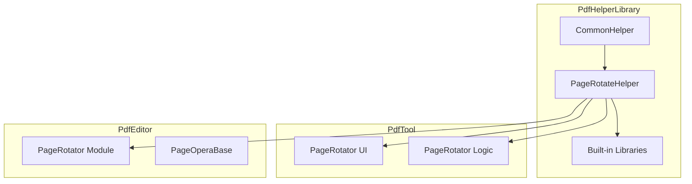
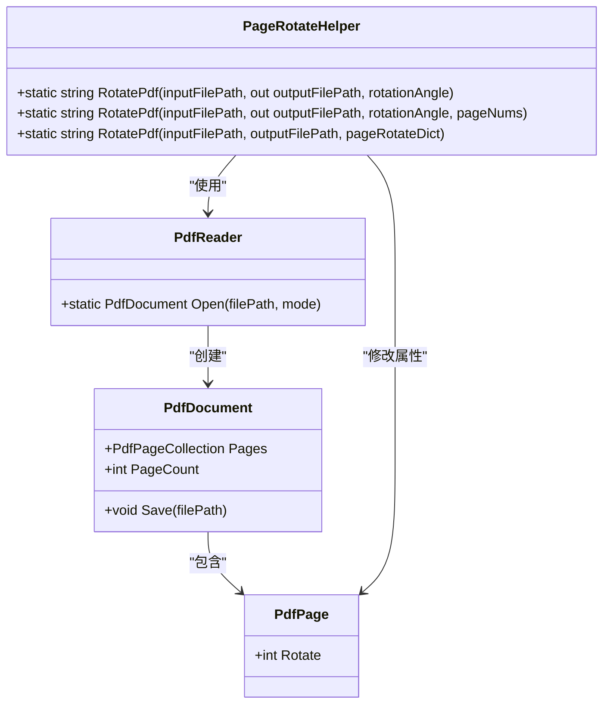
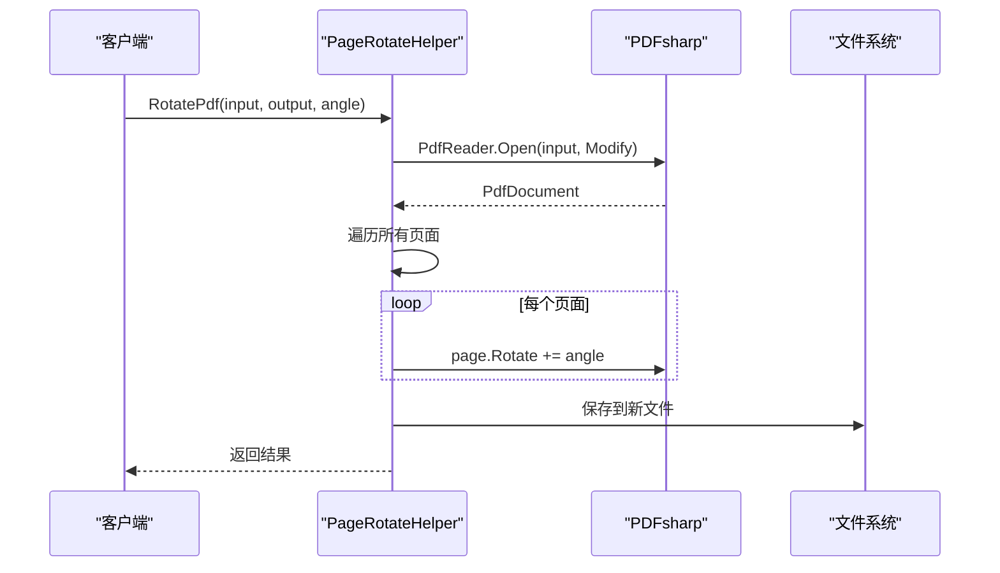
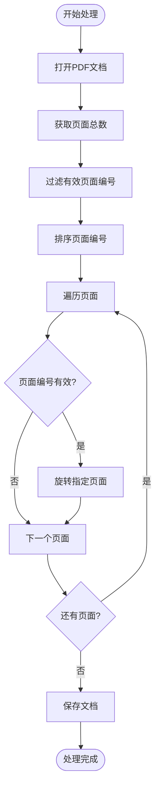
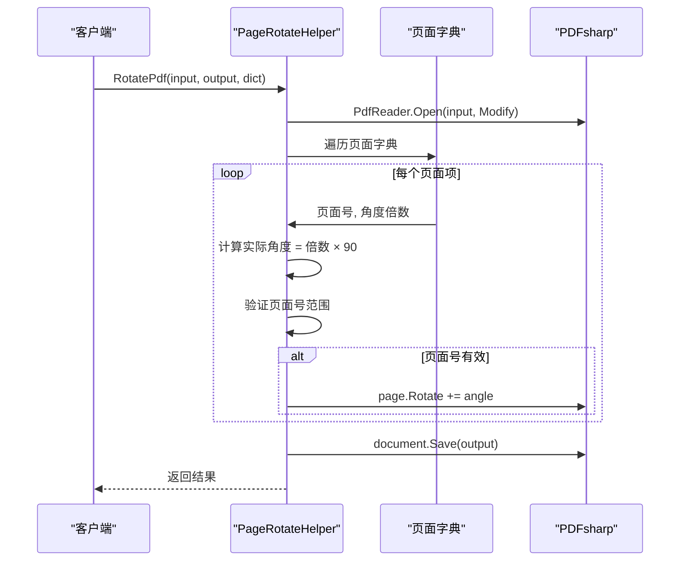
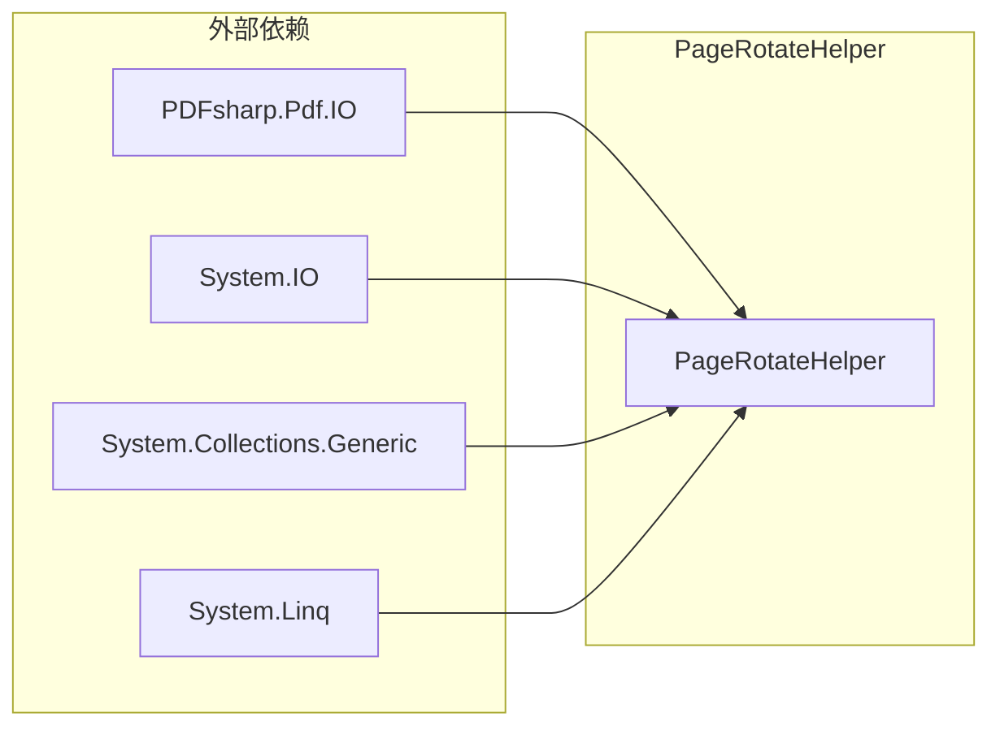

# PageRotateHelper - PDF页面旋转助手

<cite>
**本文档中引用的文件**
- [PageRotateHelper.cs](file://PdfHelperLibrary/PageRotateHelper.cs)
- [PageRotator.cs](file://PdfTool/PageRotator.cs)
- [PageRotator.cs](file://PdfEditor/Modules/PageRotator.cs)
- [CommonHelper.cs](file://PdfHelperLibrary/CommonHelper.cs)
- [Config.cs](file://PdfTool/Config.cs)
</cite>

## 目录
1. [简介](#简介)
2. [项目结构](#项目结构)
3. [核心组件](#核心组件)
4. [架构概览](#架构概览)
5. [详细组件分析](#详细组件分析)
6. [依赖关系分析](#依赖关系分析)
7. [性能考虑](#性能考虑)
8. [故障排除指南](#故障排除指南)
9. [结论](#结论)

## 简介

PageRotateHelper是PdfHelperLibrary库中的一个静态工具类，专门用于处理PDF文档的页面旋转功能。该类提供了三种重载的`RotatePdf`方法，支持对整个PDF文档、指定页面列表或每个页面设置不同的旋转角度。它基于PDFsharp库的Page.Rotate属性进行底层操作，为用户提供了灵活且强大的PDF页面旋转解决方案。

该类在PdfTool项目中被广泛使用，特别是在PageRotator模块中，为用户提供了一个直观的图形界面来执行PDF页面旋转操作。无论是在命令行应用程序还是图形界面应用中，PageRotateHelper都展现了其在PDF处理领域的专业性和可靠性。

## 项目结构

PageRotateHelper类位于PdfHelperLibrary项目中，作为PDF处理功能的核心组件之一。该项目采用模块化设计，将不同的PDF处理功能分离到独立的类中，便于维护和扩展。

**图表来源**
- [PageRotateHelper.cs](file://PdfHelperLibrary/PageRotateHelper.cs#L1-L95)
- [PageRotator.cs](file://PdfTool/PageRotator.cs#L1-L213)
- [PageRotator.cs](file://PdfEditor/Modules/PageRotator.cs#L1-L248)

**章节来源**
- [PageRotateHelper.cs](file://PdfHelperLibrary/PageRotateHelper.cs#L1-L95)
- [CommonHelper.cs](file://PdfHelperLibrary/CommonHelper.cs#L1-L29)

## 核心组件

PageRotateHelper类包含三个主要的重载方法，每个方法都针对不同的使用场景进行了优化：

### 方法签名概览

| 方法 | 参数类型 | 功能描述 |
|------|----------|----------|
| `RotatePdf(inputFilePath, out outputFilePath, rotationAngle)` | 字符串, 输出字符串, 整数 | 旋转所有页面 |
| `RotatePdf(inputFilePath, out outputFilePath, rotationAngle, pageNums)` | 字符串, 输出字符串, 整数, 列表 | 旋转指定页面 |
| `RotatePdf(inputFilePath, outputFilePath, pageRotateDict)` | 字符串, 字符串, 字典 | 为不同页面设置不同角度 |

### 旋转角度处理机制

PageRotateHelper使用PDFsharp的Page.Rotate属性进行页面旋转，支持以下特性：
- **角度叠加计算**：每次调用都会在现有旋转基础上增加新的角度值
- **90度倍数限制**：推荐使用90的倍数作为旋转角度
- **负角度支持**：支持逆时针旋转（如-90度）
- **范围验证**：自动验证页面编号的有效性

**章节来源**
- [PageRotateHelper.cs](file://PdfHelperLibrary/PageRotateHelper.cs#L14-L94)

## 架构概览

PageRotateHelper采用了简洁而高效的架构设计，通过静态方法提供无状态的服务。整个系统遵循单一职责原则，专注于PDF页面旋转这一核心功能。

**图表来源**
- [PageRotateHelper.cs](file://PdfHelperLibrary/PageRotateHelper.cs#L14-L94)

## 详细组件分析

### 第一种重载方法：旋转所有页面

这是最简单的旋转方法，适用于需要统一旋转整个PDF文档的场景。

**图表来源**
- [PageRotateHelper.cs](file://PdfHelperLibrary/PageRotateHelper.cs#L14-L36)

#### 关键特性
- **全文档处理**：自动遍历所有页面
- **输出文件命名**：基于输入文件名和旋转角度生成新文件名
- **异常处理**：完整的错误捕获和返回机制

### 第二种重载方法：旋转指定页面

这种方法允许用户精确控制哪些页面需要旋转，提供了更高的灵活性。

**图表来源**
- [PageRotateHelper.cs](file://PdfHelperLibrary/PageRotateHelper.cs#L39-L64)

#### 输入验证机制
- **边界检查**：确保页面编号在有效范围内（1 ≤ pageNum ≤ pageCount）
- **重复处理**：自动去重和排序页面编号
- **空列表处理**：优雅处理空页面列表的情况

### 第三种重载方法：字典驱动的旋转

这是最灵活的方法，允许为每个页面单独设置旋转角度。

**图表来源**
- [PageRotateHelper.cs](file://PdfHelperLibrary/PageRotateHelper.cs#L67-L94)

#### 字典格式规范
- **键**：页面编号（从0开始）
- **值**：旋转角度的90度倍数
- **角度计算**：实际角度 = 倍数 × 90

**章节来源**
- [PageRotateHelper.cs](file://PdfHelperLibrary/PageRotateHelper.cs#L14-L94)

## 依赖关系分析

PageRotateHelper类的依赖关系相对简单，主要依赖于PDFsharp库和.NET框架的基础功能。

**图表来源**
- [PageRotateHelper.cs](file://PdfHelperLibrary/PageRotateHelper.cs#L1-L6)

### 外部库依赖

| 库 | 版本要求 | 用途 |
|----|----------|------|
| PDFsharp | 最新版 | PDF文档读写和页面操作 |
| System.IO | .NET Framework | 文件路径处理 |
| System.Collections.Generic | .NET Framework | 列表和字典操作 |
| System.Linq | .NET Framework | 查询和过滤操作 |

### 内部依赖关系

PageRotateHelper与CommonHelper类存在间接依赖关系，通过CommonHelper的GetPageCount方法获取PDF文档的页面数量信息。

**章节来源**
- [PageRotateHelper.cs](file://PdfHelperLibrary/PageRotateHelper.cs#L1-L95)
- [CommonHelper.cs](file://PdfHelperLibrary/CommonHelper.cs#L1-L29)

## 性能考虑

PageRotateHelper在设计时充分考虑了性能优化，采用了多种策略来提高处理效率：

### 内存管理
- **流式处理**：使用PDFsharp的流式API，避免一次性加载整个文档到内存
- **及时释放**：方法执行完成后立即释放PDF文档对象
- **异常安全**：确保在异常情况下也能正确释放资源

### 处理效率
- **批量操作**：对于大量页面的操作，采用批量处理模式
- **早期验证**：在开始处理前验证输入参数的有效性
- **最小化I/O**：只在必要时进行文件读写操作

### 并发处理
虽然PageRotateHelper本身不支持并发处理，但其设计允许在外部实现并发控制：
- **无状态设计**：静态方法确保线程安全性
- **独立处理**：每个PDF文件的处理都是独立的
- **可扩展性**：可以轻松集成到多线程处理框架中

## 故障排除指南

### 常见问题及解决方案

#### 1. 文件访问权限问题
**症状**：抛出UnauthorizedAccessException异常
**原因**：目标文件被其他程序占用或没有写入权限
**解决方案**：
- 确保目标文件夹有写入权限
- 关闭可能占用PDF文件的其他程序
- 使用Try-Catch块捕获异常并提供用户友好的错误消息

#### 2. PDF文件损坏
**症状**：PdfReaderException异常
**原因**：输入的PDF文件格式不正确或已损坏
**解决方案**：
- 验证PDF文件的完整性
- 尝试使用其他PDF阅读器打开文件
- 提供文件修复建议

#### 3. 页面编号无效
**症状**：某些页面未被旋转
**原因**：提供的页面编号超出文档的实际页面范围
**解决方案**：
- 在调用前验证页面编号的有效性
- 使用CommonHelper.GetPageCount获取正确的页面总数
- 实现页面编号的自动修正逻辑

#### 4. 旋转角度溢出
**症状**：页面显示方向异常
**原因**：累积的旋转角度超过360度
**解决方案**：
- 实现角度模运算（% 360）
- 限制最大旋转次数
- 提供角度重置功能

### 调试技巧

#### 错误信息解析
PageRotateHelper提供了详细的错误信息返回机制：
- 成功时返回空字符串
- 失败时返回具体的异常消息
- 支持多层次的异常信息传递

#### 日志记录建议
在实际应用中，建议添加以下日志记录：
- 输入参数验证结果
- 页面处理进度跟踪
- 异常发生的具体位置
- 处理时间统计信息

**章节来源**
- [PageRotateHelper.cs](file://PdfHelperLibrary/PageRotateHelper.cs#L32-L36)
- [PageRotateHelper.cs](file://PdfHelperLibrary/PageRotateHelper.cs#L60-L64)
- [PageRotateHelper.cs](file://PdfHelperLibrary/PageRotateHelper.cs#L88-L91)

## 结论

PageRotateHelper是一个设计精良、功能完备的PDF页面旋转工具类。它通过三种重载方法满足了从简单到复杂的各种旋转需求，同时保持了代码的简洁性和易用性。

### 主要优势

1. **功能全面**：支持全文档旋转、选择性旋转和个性化旋转
2. **易于使用**：简洁的API设计，直观的方法签名
3. **错误处理**：完善的异常处理机制，提供有用的错误信息
4. **性能优化**：高效的内存管理和处理流程
5. **可扩展性**：良好的架构设计支持未来的功能扩展

### 应用场景

PageRotateHelper在PdfTool项目中得到了广泛应用，包括：
- **命令行工具**：批量处理PDF文件的旋转
- **图形界面应用**：提供用户友好的旋转操作界面
- **Web服务**：作为后端服务处理PDF旋转请求
- **自动化脚本**：集成到更大的文档处理工作流中

### 发展建议

1. **异步支持**：考虑添加异步版本的方法以提高响应性
2. **进度回调**：为长时间运行的操作提供进度通知
3. **批量优化**：针对大量文件处理的性能优化
4. **格式支持**：扩展对更多PDF格式的支持

PageRotateHelper展示了优秀的软件设计原则，通过合理的抽象和封装，为上层应用提供了强大而易用的PDF处理能力。它的成功应用证明了模块化设计和清晰接口的重要性。