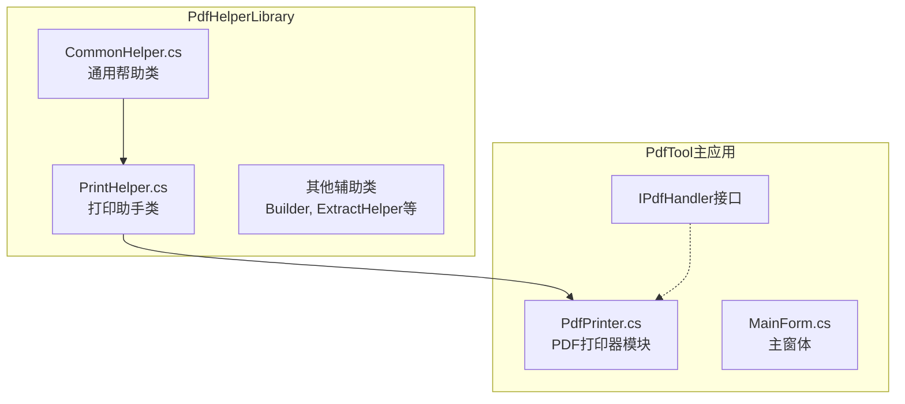
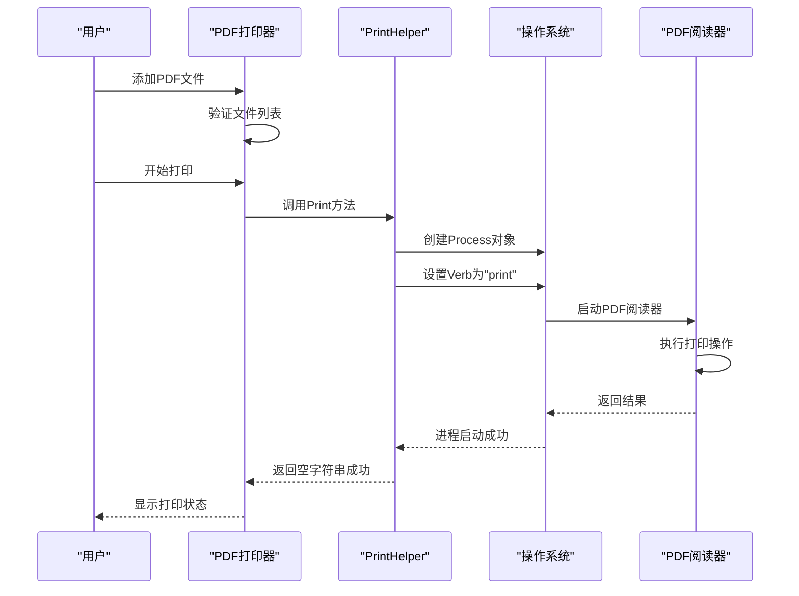
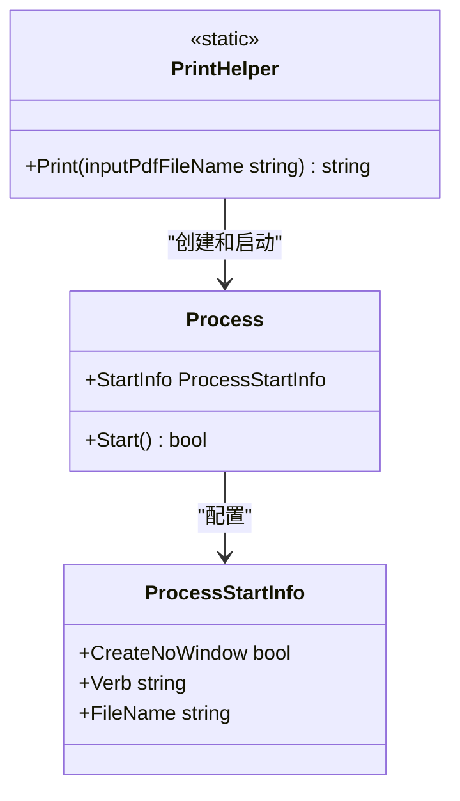
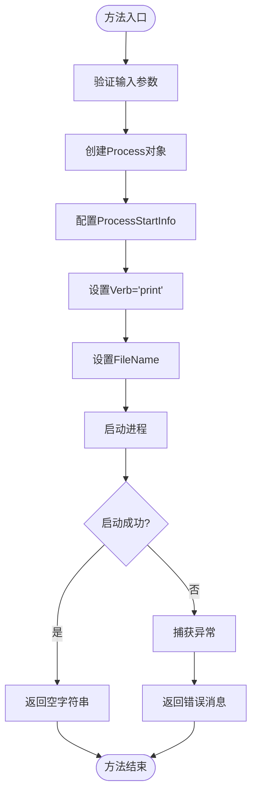
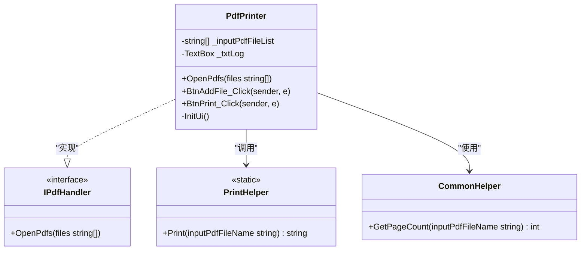
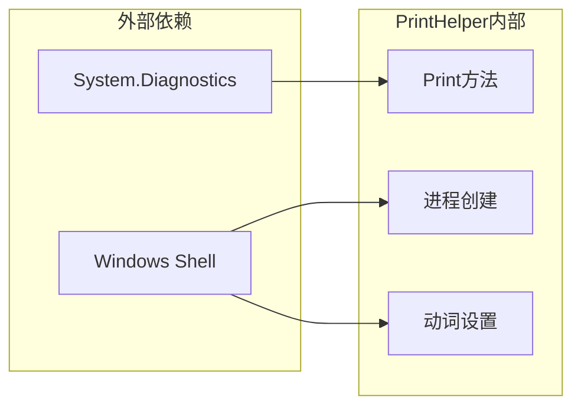

# PrintHelper - PDF打印助手

<cite>
**本文档中引用的文件**
- [PrintHelper.cs](file://PdfHelperLibrary/PrintHelper.cs)
- [PdfPrinter.cs](file://PdfTool/PdfPrinter.cs)
- [CommonHelper.cs](file://PdfHelperLibrary/CommonHelper.cs)
- [Common.cs](file://PdfTool/Common.cs)
- [PdfHelperLibrary.csproj](file://PdfHelperLibrary/PdfHelperLibrary.csproj)
</cite>

## 目录
1. [简介](#简介)
2. [项目结构](#项目结构)
3. [核心组件](#核心组件)
4. [架构概览](#架构概览)
5. [详细组件分析](#详细组件分析)
6. [依赖关系分析](#依赖关系分析)
7. [性能考虑](#性能考虑)
8. [故障排除指南](#故障排除指南)
9. [结论](#结论)

## 简介

PrintHelper类是PdfHelperLibrary库中的一个简化PDF打印工具，提供了通过系统默认PDF阅读器进行后台静默打印的功能。该类利用Windows系统的文件关联机制，通过调用PDF阅读器的"print"动词来实现打印操作，无需用户交互即可完成打印任务。

PrintHelper的设计理念是提供最简化的打印功能，特别适用于需要快速批量打印PDF文件的场景。它依赖于外部PDF阅读器应用程序（如Adobe Acrobat Reader）来执行实际的打印操作，因此具有良好的兼容性和稳定性。

## 项目结构

PrintHelper类位于PdfHelperLibrary项目中，作为PDF处理库的核心组件之一。该项目采用标准的.NET类库结构，包含多个专门的PDF处理辅助类。

**图表来源**
- [PrintHelper.cs](file://PdfHelperLibrary/PrintHelper.cs#L1-L34)
- [PdfPrinter.cs](file://PdfTool/PdfPrinter.cs#L1-L110)
- [CommonHelper.cs](file://PdfHelperLibrary/CommonHelper.cs#L1-L29)

**章节来源**
- [PdfHelperLibrary.csproj](file://PdfHelperLibrary/PdfHelperLibrary.csproj#L1-L127)

## 核心组件

PrintHelper类是一个静态类，提供了一个简洁的Print方法，用于执行PDF文件的打印操作。该类的设计遵循单一职责原则，专注于提供最基础的打印功能。

### 主要特性

- **静态方法设计**：Print方法为静态方法，无需实例化即可使用
- **异常处理**：内置try-catch机制，确保程序稳定性
- **系统集成**：深度集成Windows文件关联机制
- **无界面设计**：完全后台运行，不显示任何用户界面

**章节来源**
- [PrintHelper.cs](file://PdfHelperLibrary/PrintHelper.cs#L1-L34)

## 架构概览

PrintHelper类在整个PDF处理生态系统中扮演着关键的基础角色。它与PdfTool主应用程序紧密集成，为用户提供便捷的PDF打印功能。

**图表来源**
- [PdfPrinter.cs](file://PdfTool/PdfPrinter.cs#L50-L70)
- [PrintHelper.cs](file://PdfHelperLibrary/PrintHelper.cs#L11-L31)

## 详细组件分析

### PrintHelper类分析

PrintHelper类采用极简设计，只包含一个核心方法，体现了"简单即美"的设计哲学。

#### 类结构图

**图表来源**
- [PrintHelper.cs](file://PdfHelperLibrary/PrintHelper.cs#L9-L31)

#### Print方法实现

Print方法的核心逻辑非常简洁，但包含了关键的技术细节：

1. **进程创建**：使用System.Diagnostics.Process类创建新的进程
2. **参数配置**：设置ProcessStartInfo的各个属性
3. **动词设置**：通过设置Verb属性为"print"来触发打印操作
4. **异常处理**：捕获并返回异常信息

#### 方法签名分析

**图表来源**
- [PrintHelper.cs](file://PdfHelperLibrary/PrintHelper.cs#L11-L31)

**章节来源**
- [PrintHelper.cs](file://PdfHelperLibrary/PrintHelper.cs#L1-L34)

### PdfPrinter模块集成

PdfPrinter类作为用户界面层，负责管理PDF文件的选择和打印流程。它实现了IPdfHandler接口，确保了模块间的松耦合设计。

#### 模块交互图

**图表来源**
- [PdfPrinter.cs](file://PdfTool/PdfPrinter.cs#L13-L110)
- [Common.cs](file://PdfTool/Common.cs#L13-L16)
- [CommonHelper.cs](file://PdfHelperLibrary/CommonHelper.cs#L11-L26)

#### 打印流程分析

PdfPrinter模块中的打印流程展示了PrintHelper的实际应用场景：

1. **文件验证**：检查是否已添加PDF文件
2. **异步处理**：使用BackgroundWorker进行后台打印
3. **进度报告**：实时更新打印状态
4. **结果反馈**：向用户显示打印结果

**章节来源**
- [PdfPrinter.cs](file://PdfTool/PdfPrinter.cs#L43-L70)

## 依赖关系分析

PrintHelper类的依赖关系相对简单，主要依赖于.NET框架的基本功能。

**图表来源**
- [PrintHelper.cs](file://PdfHelperLibrary/PrintHelper.cs#L1-L2)
- [PdfPrinter.cs](file://PdfTool/PdfPrinter.cs#L1-L7)

### 关键依赖项

| 依赖项 | 版本要求 | 用途 | 备注 |
|--------|----------|------|------|
| System.Diagnostics | .NET Framework 4.7.2+ | 进程管理 | 提供Process类功能 |
| Windows Shell | Windows操作系统 | 文件关联 | 触发PDF阅读器打印 |
| PDF阅读器 | Adobe Acrobat Reader等 | 实际打印 | 系统默认PDF阅读器 |

**章节来源**
- [PdfHelperLibrary.csproj](file://PdfHelperLibrary/PdfHelperLibrary.csproj#L35-L118)

## 性能考虑

PrintHelper类的设计注重性能和效率，但由于其依赖外部应用程序，性能受限于系统环境和PDF阅读器的响应速度。

### 性能特点

- **内存占用低**：静态方法设计，无额外内存开销
- **启动速度快**：直接调用系统进程，避免复杂初始化
- **并发友好**：支持多线程同时调用
- **资源释放及时**：Process对象自动管理资源

### 性能限制

- **外部依赖**：打印性能受PDF阅读器影响
- **同步阻塞**：当前实现为同步调用，可能阻塞UI线程
- **错误处理开销**：异常捕获机制增加少量开销

## 故障排除指南

### 常见问题及解决方案

#### 1. 打印失败问题

**症状**：Print方法返回错误消息
**原因**：PDF阅读器未正确安装或文件路径无效
**解决方案**：
- 确保系统已安装PDF阅读器（如Adobe Acrobat Reader）
- 验证PDF文件路径的有效性
- 检查文件权限设置

#### 2. 默认打印机设置

**症状**：打印到错误的打印机
**原因**：系统默认打印机设置不正确
**解决方案**：
- 在系统设置中配置正确的默认打印机
- 确保目标打印机处于可用状态

#### 3. 大文件打印问题

**症状**：大PDF文件打印缓慢或失败
**原因**：PDF阅读器内存限制
**解决方案**：
- 分割大文件为较小的PDF片段
- 增加系统虚拟内存设置
- 使用专业PDF处理软件预处理

**章节来源**
- [PrintHelper.cs](file://PdfHelperLibrary/PrintHelper.cs#L27-L30)

## 结论

PrintHelper类提供了一个简洁而有效的PDF打印解决方案，特别适合需要快速批量打印的场景。其设计优势包括：

### 主要优势

1. **简单易用**：单方法API，易于集成和使用
2. **系统集成度高**：充分利用Windows文件关联机制
3. **稳定性好**：依赖成熟的PDF阅读器应用程序
4. **扩展性强**：可与其他PDF处理功能无缝结合

### 适用场景

- 批量PDF文件打印
- 自动化办公流程
- 快速预览打印效果
- 临时打印需求

### 局限性

由于依赖外部PDF阅读器，PrintHelper在以下方面存在限制：
- 无法控制打印机选择
- 无法设置打印份数
- 无法调整打印质量
- 受制于外部应用程序的版本和功能

对于需要更高级打印控制的应用场景，建议考虑使用专业的PDF打印库或API。然而，对于大多数日常办公需求，PrintHelper提供的基础打印功能已经足够满足。