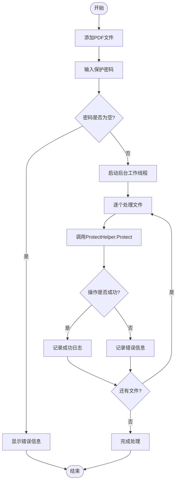

# ProtectHelper - PDF保护与解密助手

<cite>
**本文档中引用的文件**
- [ProtectHelper.cs](file://PdfHelperLibrary/ProtectHelper.cs)
- [PdfProtector.cs](file://PdfTool/PdfProtector.cs)
- [Common.cs](file://PdfTool/Common.cs)
- [CommonHelper.cs](file://PdfHelperLibrary/CommonHelper.cs)
- [PdfHelperLibrary.csproj](file://PdfHelperLibrary/PdfHelperLibrary.csproj)
</cite>

## 目录
1. [简介](#简介)
2. [项目结构](#项目结构)
3. [核心组件](#核心组件)
4. [架构概览](#架构概览)
5. [详细组件分析](#详细组件分析)
6. [依赖关系分析](#依赖关系分析)
7. [性能考虑](#性能考虑)
8. [故障排除指南](#故障排除指南)
9. [结论](#结论)

## 简介

ProtectHelper类是PdfTool项目中专门用于处理PDF文档加密保护和密码移除的核心工具类。该类提供了两个主要功能：`Protect`方法用于创建受密码保护的PDF文档，而`Unprotect`方法则用于移除现有PDF文档的安全设置。通过使用PdfSharp库，该类实现了对PDF文档访问权限的精细控制，包括禁止打印、复制内容、添加注释等操作。

ProtectHelper类的设计遵循了单一职责原则，专注于PDF文档的安全保护功能。它不仅提供了基本的加密功能，还支持多种权限级别的自定义配置，使开发者能够根据具体需求创建不同安全级别的PDF文档。

## 项目结构

PdfTool项目采用模块化架构设计，其中ProtectHelper类位于PdfHelperLibrary库中，作为独立的帮助类提供核心功能。PdfTool主应用程序通过集成这个库来实现PDF保护功能。

**图表来源**
- [PdfProtector.cs](file://PdfTool/PdfProtector.cs#L1-L171)
- [ProtectHelper.cs](file://PdfHelperLibrary/ProtectHelper.cs#L1-L69)

**章节来源**
- [PdfProtector.cs](file://PdfTool/PdfProtector.cs#L1-L171)
- [ProtectHelper.cs](file://PdfHelperLibrary/ProtectHelper.cs#L1-L69)

## 核心组件

ProtectHelper类包含两个静态方法，每个方法都针对不同的PDF安全需求：

### Protect 方法
Protect方法负责创建新的受密码保护的PDF文档。该方法接受输入PDF文件路径、输出PDF文件路径和密码参数，然后执行以下操作：
- 打开输入的PDF文档
- 创建新的PDF文档实例
- 复制所有页面到新文档
- 设置安全设置，包括用户密码和所有者密码
- 配置详细的权限控制选项

### Unprotect 方法  
Unprotect方法用于移除现有PDF文档的安全设置。该方法需要输入PDF文件路径、输出PDF文件路径和密码参数，执行以下步骤：
- 使用所有者密码打开受保护的PDF文档
- 创建新的PDF文档实例
- 复制所有页面到新文档
- 清除所有安全设置，将文档安全级别设置为None

**章节来源**
- [ProtectHelper.cs](file://PdfHelperLibrary/ProtectHelper.cs#L12-L68)

## 架构概览

ProtectHelper类采用了简洁而有效的架构设计，通过静态方法提供无状态的功能服务。这种设计模式使得类可以轻松地被各种应用程序集成，无需实例化即可使用其功能。

**图表来源**
- [ProtectHelper.cs](file://PdfHelperLibrary/ProtectHelper.cs#L12-L68)

## 详细组件分析

### Protect 方法详细分析

Protect方法实现了完整的PDF文档加密流程，从文档读取到安全设置配置，再到最终保存。

**图表来源**
- [ProtectHelper.cs](file://PdfHelperLibrary/ProtectHelper.cs#L12-L42)

#### 权限控制配置详解

Protect方法设置了多个权限控制选项，每个选项都对应特定的PDF功能限制：

| 权限名称 | 默认值 | 功能描述 |
|---------|--------|----------|
| PermitAccessibilityExtractContent | false | 禁止无障碍访问提取内容 |
| PermitAnnotations | false | 禁止添加注释和标记 |
| PermitAssembleDocument | false | 禁止文档拼接和拆分 |
| PermitExtractContent | false | 禁止内容提取和复制 |
| PermitFormsFill | true | 允许填写表单字段 |
| PermitFullQualityPrint | false | 禁止高质量打印 |
| PermitModifyDocument | true | 允许修改文档内容 |
| PermitPrint | false | 禁止打印功能 |

**章节来源**
- [ProtectHelper.cs](file://PdfHelperLibrary/ProtectHelper.cs#L12-L42)

### Unprotect 方法详细分析

Unprotect方法实现了PDF文档安全设置的移除过程，通过使用所有者密码打开受保护文档，然后创建一个全新的无密码版本。

**图表来源**
- [ProtectHelper.cs](file://PdfHelperLibrary/ProtectHelper.cs#L45-L68)

**章节来源**
- [ProtectHelper.cs](file://PdfHelperLibrary/ProtectHelper.cs#L45-L68)

### PdfProtector 用户界面集成

PdfProtector类作为用户界面组件，集成了ProtectHelper的功能，提供了直观的操作界面。

**图表来源**
- [PdfProtector.cs](file://PdfTool/PdfProtector.cs#L52-L83)

**章节来源**
- [PdfProtector.cs](file://PdfTool/PdfProtector.cs#L52-L83)

## 依赖关系分析

ProtectHelper类依赖于PdfSharp库提供的PDF处理功能，该库是.NET平台上最流行的PDF处理解决方案之一。

**图表来源**
- [ProtectHelper.cs](file://PdfHelperLibrary/ProtectHelper.cs#L1-L5)
- [PdfHelperLibrary.csproj](file://PdfHelperLibrary/PdfHelperLibrary.csproj#L43-L44)

### 关键依赖项说明

1. **PdfSharp.Pdf**: 提供PDF文档的基本对象模型
2. **PdfSharp.Pdf.IO**: 提供PDF文档的读写功能
3. **System**: 提供基础的异常处理和字符串操作功能

**章节来源**
- [ProtectHelper.cs](file://PdfHelperLibrary/ProtectHelper.cs#L1-L5)
- [PdfHelperLibrary.csproj](file://PdfHelperLibrary/PdfHelperLibrary.csproj#L43-L44)

## 性能考虑

ProtectHelper类在设计时考虑了性能优化，采用了以下策略：

### 内存管理
- 使用using语句确保资源及时释放
- 避免在内存中缓存大型PDF文档
- 采用流式处理方式处理文档

### 异常处理
- 实现了完善的异常捕获机制
- 提供详细的错误信息反馈
- 支持部分文件处理失败的情况

### 并发处理
- PdfProtector类使用BackgroundWorker进行异步处理
- 避免UI线程阻塞
- 提供进度报告功能

## 故障排除指南

### 常见问题及解决方案

#### 1. 密码验证失败
**问题**: Unprotect方法返回"解除保护失败"错误
**原因**: 提供的密码不正确或不是所有者密码
**解决方案**: 确保使用正确的所有者密码，注意区分用户密码和所有者密码

#### 2. 文件格式不支持
**问题**: Protect方法抛出异常
**原因**: 输入文件不是有效的PDF格式
**解决方案**: 验证输入文件的PDF格式完整性

#### 3. 权限不足
**问题**: 无法保存受保护的PDF
**原因**: 输出目录没有写入权限
**解决方案**: 检查目标目录的访问权限

**章节来源**
- [ProtectHelper.cs](file://PdfHelperLibrary/ProtectHelper.cs#L39-L42)
- [ProtectHelper.cs](file://PdfHelperLibrary/ProtectHelper.cs#L62-L65)

## 结论

ProtectHelper类为PdfTool项目提供了强大而灵活的PDF文档保护功能。通过其简洁的API设计和丰富的权限控制选项，开发者可以轻松实现各种PDF安全需求。该类的成功实施展示了如何在保持代码简洁性的同时，提供企业级的安全功能。

主要优势包括：
- **简单易用**: 静态方法设计降低了使用复杂度
- **功能完整**: 支持多种权限级别的精确控制
- **错误处理**: 完善的异常处理机制
- **性能优化**: 考虑了内存和并发处理的最佳实践

对于需要在.NET应用程序中实现PDF文档保护功能的开发者来说，ProtectHelper类提供了一个可靠、高效的解决方案。其模块化的设计也便于未来的功能扩展和维护。