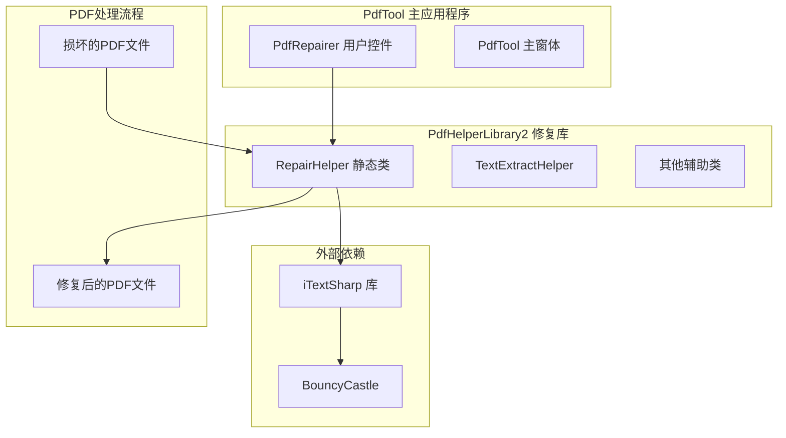
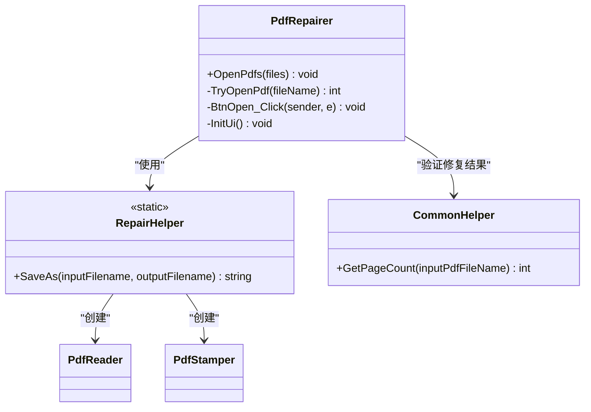
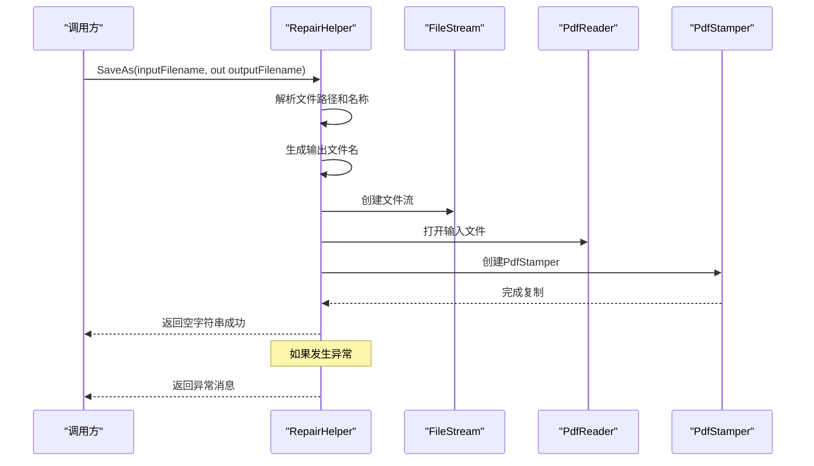
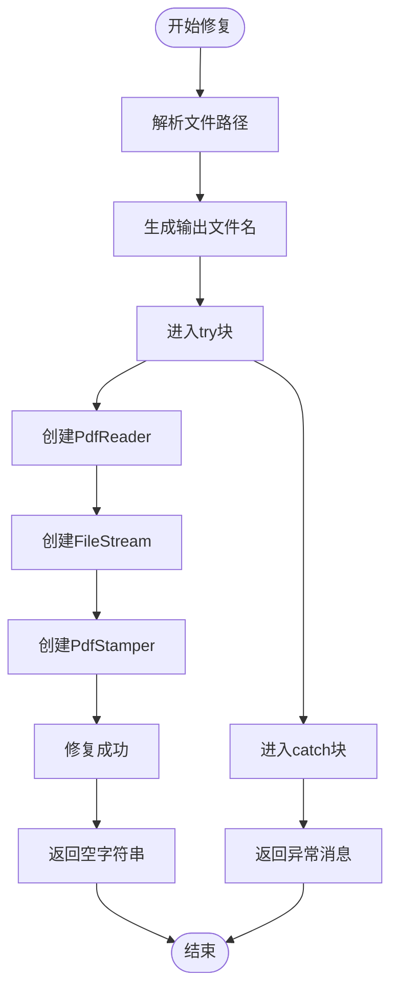
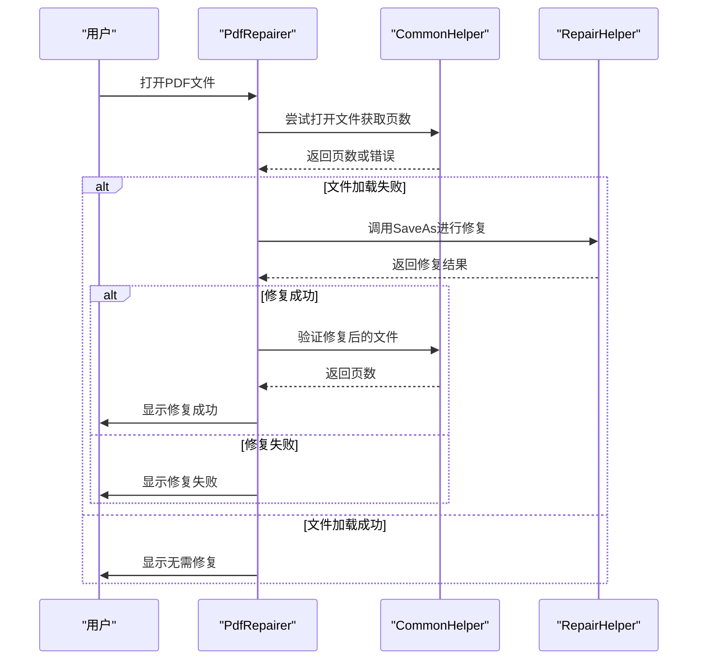
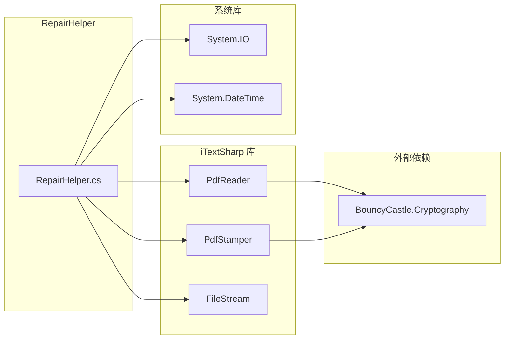

# RepairHelper - PDF修复助手

<cite>
**本文档中引用的文件**
- [RepairHelper.cs](file://PdfHelperLibrary2/RepairHelper.cs)
- [PdfRepairer.cs](file://PdfTool/PdfRepairer.cs)
- [PdfRepairer.Designer.cs](file://PdfTool/PdfRepairer.Designer.cs)
- [CommonHelper.cs](file://PdfHelperLibrary/CommonHelper.cs)
- [PdfHelperLibrary2.csproj](file://PdfHelperLibrary2/PdfHelperLibrary2.csproj)
</cite>

## 目录
1. [简介](#简介)
2. [项目结构](#项目结构)
3. [核心组件](#核心组件)
4. [架构概览](#架构概览)
5. [详细组件分析](#详细组件分析)
6. [依赖关系分析](#依赖关系分析)
7. [性能考虑](#性能考虑)
8. [故障排除指南](#故障排除指南)
9. [结论](#结论)

## 简介

RepairHelper类是PdfHelperLibrary2项目中的一个静态工具类，专门设计用于通过"另存为"操作修复损坏的PDF文件。该类利用iTextSharp库的功能，通过重新创建PDF文档来修复某些类型的文件损坏问题。这是PDF修复领域中一种简单而有效的基础修复手段。

RepairHelper的核心理念是通过重新解析和重建PDF文件结构来消除格式错误、编码问题或其他可能导致文件损坏的因素。虽然这种方法不能修复所有类型的损坏，但对于许多常见的PDF损坏情况（如格式错误、索引损坏等）能够提供有效的解决方案。

## 项目结构

RepairHelper类位于PdfHelperLibrary2项目中，该项目是一个专门的PDF处理库，与主应用程序PdfTool分离，体现了良好的模块化设计原则。

**图表来源**
- [PdfRepairer.cs](file://PdfTool/PdfRepairer.cs#L1-L111)
- [RepairHelper.cs](file://PdfHelperLibrary2/RepairHelper.cs#L1-L40)
- [PdfHelperLibrary2.csproj](file://PdfHelperLibrary2/PdfHelperLibrary2.csproj#L37-L38)

**章节来源**
- [PdfHelperLibrary2.csproj](file://PdfHelperLibrary2/PdfHelperLibrary2.csproj#L1-L58)

## 核心组件

RepairHelper类包含一个核心静态方法SaveAs，该方法实现了PDF修复的主要逻辑。该方法接受输入文件路径作为参数，尝试修复文件并通过out参数返回输出文件路径。

### 主要功能特性

- **自动文件命名**：根据输入文件名和当前时间自动生成唯一的输出文件名
- **异常处理**：完善的错误捕获机制，提供详细的错误信息
- **资源管理**：使用using语句确保所有资源得到正确释放
- **iTextSharp集成**：直接利用iTextSharp的强大PDF处理能力

**章节来源**
- [RepairHelper.cs](file://PdfHelperLibrary2/RepairHelper.cs#L12-L36)

## 架构概览

RepairHelper类采用简洁的静态方法设计模式，专注于单一职责——PDF文件修复。其架构体现了以下设计原则：

**图表来源**
- [RepairHelper.cs](file://PdfHelperLibrary2/RepairHelper.cs#L10-L36)
- [PdfRepairer.cs](file://PdfTool/PdfRepairer.cs#L16-L111)
- [CommonHelper.cs](file://PdfHelperLibrary/CommonHelper.cs#L11-L26)

## 详细组件分析

### SaveAs方法深度分析

SaveAs方法是RepairHelper类的核心功能，其实现展示了PDF修复的基本策略：

#### 方法签名和参数处理

**图表来源**
- [RepairHelper.cs](file://PdfHelperLibrary2/RepairHelper.cs#L12-L36)

#### 文件命名策略

SaveAs方法采用智能的文件命名策略，确保不会覆盖原始文件：

- **前缀保留**：保持输入文件的基本名称不变
- **时间戳追加**：添加精确到毫秒的时间戳，确保唯一性
- **修复标识**：在文件名中明确标注"repaired"字样

#### 修复机制原理

修复过程基于以下核心原理：

1. **重新解析**：使用PdfReader重新读取损坏的PDF文件
2. **结构重建**：通过PdfStamper创建新的PDF文档结构
3. **数据重写**：将原始数据重新写入新文件，消除损坏因素

#### 错误处理机制

**图表来源**
- [RepairHelper.cs](file://PdfHelperLibrary2/RepairHelper.cs#L17-L36)

**章节来源**
- [RepairHelper.cs](file://PdfHelperLibrary2/RepairHelper.cs#L12-L36)

### PdfRepairer模块集成

PdfRepairer用户控件集成了RepairHelper的功能，提供了完整的PDF修复工作流程：

#### 修复流程控制

**图表来源**
- [PdfRepairer.cs](file://PdfTool/PdfRepairer.cs#L32-L54)
- [CommonHelper.cs](file://PdfHelperLibrary/CommonHelper.cs#L11-L26)

#### 日志记录和用户反馈

PdfRepairer提供了详细的日志记录功能，帮助用户了解修复过程：

- **进度跟踪**：显示每个文件的处理状态
- **错误报告**：详细记录修复失败的原因
- **成功确认**：确认修复后的文件状态

**章节来源**
- [PdfRepairer.cs](file://PdfTool/PdfRepairer.cs#L32-L70)

## 依赖关系分析

RepairHelper类的依赖关系相对简单但关键：

**图表来源**
- [RepairHelper.cs](file://PdfHelperLibrary2/RepairHelper.cs#L1-L4)
- [PdfHelperLibrary2.csproj](file://PdfHelperLibrary2/PdfHelperLibrary2.csproj#L37-L38)

### 关键依赖说明

- **iTextSharp**：提供PDF文件处理的核心功能
- **BouncyCastle**：提供加密和安全功能支持
- **System.IO**：文件系统操作支持
- **System**：基本类型和异常处理

**章节来源**
- [PdfHelperLibrary2.csproj](file://PdfHelperLibrary2/PdfHelperLibrary2.csproj#L34-L38)

## 性能考虑

RepairHelper类的设计考虑了以下性能因素：

### 内存管理
- 使用using语句确保及时释放资源
- 流式处理避免大文件占用过多内存
- 异常安全的资源管理模式

### 文件I/O优化
- 单次读取和写入操作
- 最小化的文件访问次数
- 合理的缓冲区大小设置

### 并发处理
- 静态方法设计支持并发调用
- 无状态设计避免线程安全问题

## 故障排除指南

### 常见问题及解决方案

#### 修复失败的情况
- **文件权限不足**：确保程序有读写目标目录的权限
- **磁盘空间不足**：检查目标位置是否有足够空间
- **文件被占用**：关闭可能占用文件的其他程序

#### 修复效果评估
- **验证修复结果**：使用CommonHelper的GetPageCount方法验证修复后的文件
- **手动检查**：打开修复后的文件确认内容完整性
- **备份重要文件**：在修复前备份原始文件以防万一

**章节来源**
- [PdfRepairer.cs](file://PdfTool/PdfRepairer.cs#L39-L54)

## 结论

RepairHelper类提供了一个简单而有效的PDF文件修复解决方案。通过利用iTextSharp库的强大功能，它能够处理许多常见的PDF损坏问题。虽然这种方法不是万能的，但对于许多实际应用场景来说已经足够有效。

### 主要优势
- **实现简单**：代码简洁，易于理解和维护
- **依赖最小**：只需要iTextSharp这一核心依赖
- **效果显著**：对大多数常见损坏类型有效
- **易于集成**：可以轻松集成到更大的PDF处理流程中

### 适用场景
- 格式错误导致的PDF损坏
- 索引结构损坏
- 轻微的编码问题
- 文件传输过程中产生的损坏

### 局限性
- 对于严重损坏的文件可能无效
- 无法修复逻辑结构上的错误
- 可能丢失某些元数据信息

RepairHelper类为PDF文件修复提供了一个可靠的基础工具，是PdfTool应用程序中PdfRepairer模块的重要组成部分。通过合理的错误处理和用户反馈机制，它为用户提供了一个简单易用的PDF修复解决方案。