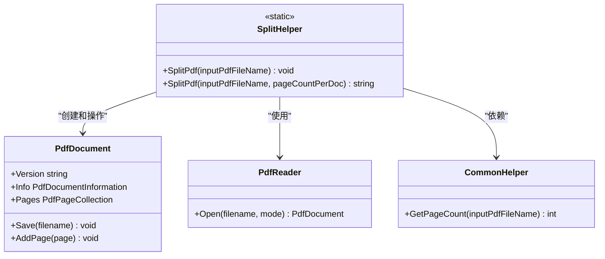
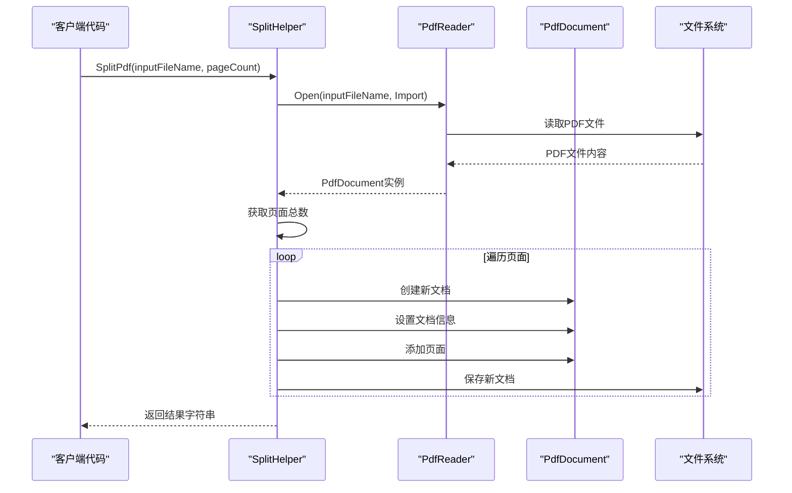
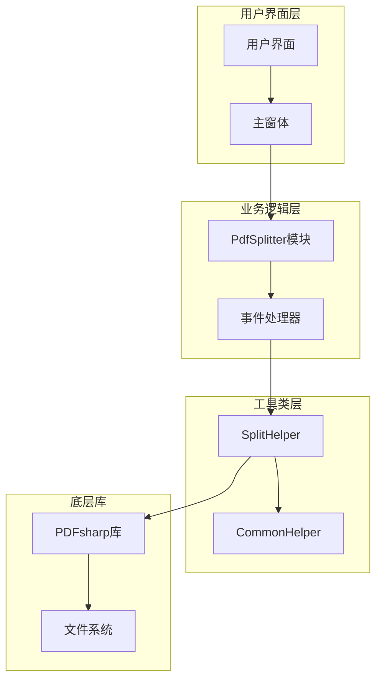
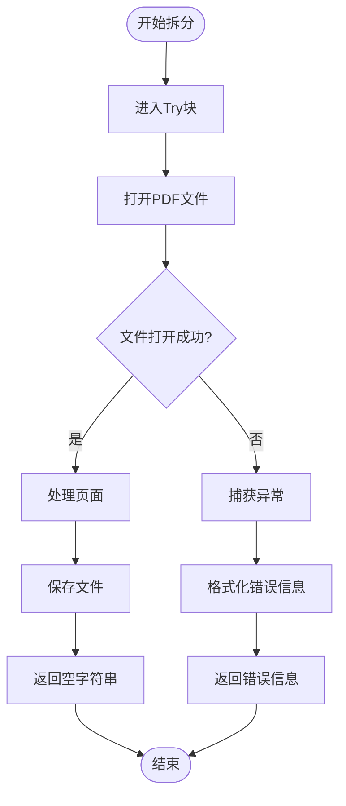

# SplitHelper - PDF拆分助手

<cite>
**本文档中引用的文件**
- [SplitHelper.cs](file://PdfHelperLibrary/SplitHelper.cs)
- [SplitHelper.cs](file://PdfHelperLibraryX/SplitHelper.cs)
- [PdfSplitter.cs](file://PdfTool/PdfSplitter.cs)
- [CommonHelper.cs](file://PdfHelperLibrary/CommonHelper.cs)
- [PdfHelperLibrary.csproj](file://PdfHelperLibrary/PdfHelperLibrary.csproj)
</cite>

## 目录
1. [简介](#简介)
2. [类结构概述](#类结构概述)
3. [核心方法详解](#核心方法详解)
4. [使用示例](#使用示例)
5. [内部实现机制](#内部实现机制)
6. [集成方式](#集成方式)
7. [异常处理](#异常处理)
8. [性能考虑](#性能考虑)
9. [最佳实践](#最佳实践)
10. [故障排除](#故障排除)

## 简介

SplitHelper是一个专门用于PDF文档拆分的静态工具类，基于PDFsharp库实现。该类提供了两种主要的PDF拆分功能：
- **单页拆分**：将PDF文档的每一页拆分为独立的PDF文件
- **批量拆分**：按照指定的页数将PDF文档拆分为多个子文档

该类设计简洁高效，在PdfTool主应用程序的PdfSplitter模块中发挥着核心作用，为用户提供灵活的PDF文档管理功能。

## 类结构概述



**图表来源**
- [SplitHelper.cs](file://PdfHelperLibrary/SplitHelper.cs#L1-L70)
- [CommonHelper.cs](file://PdfHelperLibrary/CommonHelper.cs#L1-L29)

**节来源**
- [SplitHelper.cs](file://PdfHelperLibrary/SplitHelper.cs#L1-L70)
- [CommonHelper.cs](file://PdfHelperLibrary/CommonHelper.cs#L1-L29)

## 核心方法详解

### 方法一：单页拆分 - SplitPdf(string inputPdfFileName)

#### 方法签名
```csharp
public static void SplitPdf(string inputPdfFileName)
```

#### 参数说明
| 参数名 | 类型 | 描述 | 约束条件 |
|--------|------|------|----------|
| inputPdfFileName | string | 输入PDF文件的完整路径 | 必须是有效的PDF文件路径，文件必须存在且可访问 |

#### 功能描述
该方法将输入的PDF文档按页拆分，每一页生成一个独立的PDF文件。输出文件名格式为：`原文件名 - Page X.pdf`，其中X表示页码。

#### 返回值
无返回值（void），成功时正常执行，失败时抛出异常。

#### 实现特点
- **简单高效**：直接遍历PDF的所有页面，逐页创建新文档
- **保持元数据**：保留原始文档的标题和创建者信息
- **版本兼容**：确保输出文档与输入文档的PDF版本一致

### 方法二：批量拆分 - SplitPdf(string inputPdfFileName, int pageCountPerDoc)

#### 方法签名
```csharp
public static string SplitPdf(string inputPdfFileName, int pageCountPerDoc)
```

#### 参数说明
| 参数名 | 类型 | 描述 | 约束条件 |
|--------|------|------|----------|
| inputPdfFileName | string | 输入PDF文件的完整路径 | 必须是有效的PDF文件路径，文件必须存在且可访问 |
| pageCountPerDoc | int | 每个输出文档包含的页数 | 必须大于0，通常建议不超过100000 |

#### 功能描述
该方法将PDF文档按照指定的页数进行批量拆分。对于多页文档，会创建多个子文档，每个子文档包含指定数量的页面。

#### 返回值
- **空字符串("")**：表示拆分操作成功完成
- **错误信息字符串**：当发生异常时返回详细的错误描述，如文件不存在、权限不足等

#### 实现特点
- **智能分组**：自动计算剩余页面数量，避免越界
- **灵活命名**：根据页面范围生成有意义的文件名
- **异常安全**：完整的try-catch机制确保异常不会导致程序崩溃

**节来源**
- [SplitHelper.cs](file://PdfHelperLibrary/SplitHelper.cs#L13-L70)

## 使用示例

### 基本单页拆分示例

以下展示了如何使用SplitHelper进行基本的单页拆分：

```csharp
// 单页拆分示例
string inputFilePath = @"C:\Documents\example.pdf";
try
{
    // 调用单页拆分方法
    SplitHelper.SplitPdf(inputFilePath);
    Console.WriteLine("PDF拆分完成！");
}
catch (Exception ex)
{
    Console.WriteLine($"拆分失败：{ex.Message}");
}
```

### 批量拆分示例

以下是批量拆分的实际应用场景：

```csharp
// 批量拆分示例
string inputFilePath = @"C:\Documents\large_document.pdf";
int pagesPerDocument = 10; // 每个文档10页

// 调用批量拆分方法
string result = SplitHelper.SplitPdf(inputFilePath, pagesPerDocument);

if (string.IsNullOrEmpty(result))
{
    Console.WriteLine("批量拆分成功完成！");
}
else
{
    Console.WriteLine($"拆分失败：{result}");
}
```

### 在PdfTool中的实际应用

在PdfTool主应用程序中，SplitHelper被集成到PdfSplitter模块中：

```csharp
// PdfTool中的调用示例
private void BtnSplit_Click(object sender, EventArgs e)
{
    if (_inputPdfFileList.Count == 0)
    {
        _txtLog.AppendText("未添加需要拆分的PDF文件\r\n");
        return;
    }
    
    foreach (var fileName in _inputPdfFileList)
    {
        // 调用SplitHelper进行批量拆分
        var splitResult = SplitHelper.SplitPdf(fileName, (int)_numPagePerDoc.Value);
        
        if (string.IsNullOrWhiteSpace(splitResult))
            _txtLog.AppendText($"{fileName} 拆分完成\r\n");
        else
            _txtLog.AppendText($"{fileName} {splitResult}\r\n");
    }
    _txtLog.AppendText("拆分完成\r\n");
}
```

**节来源**
- [PdfSplitter.cs](file://PdfTool/PdfSplitter.cs#L54-L66)

## 内部实现机制

### PDF文档读取流程



**图表来源**
- [SplitHelper.cs](file://PdfHelperLibrary/SplitHelper.cs#L39-L60)

### 关键实现步骤

#### 1. 文件路径处理
```csharp
var path = Path.GetDirectoryName(inputPdfFileName);
var fileName = Path.GetFileNameWithoutExtension(inputPdfFileName);
var prefixFileName = Path.Combine(path, fileName);
```

#### 2. 页面遍历算法
```csharp
for (var i = 0; i < pageCount;)
{
    var subPageCount = Math.Min(pageCountPerDoc, pageCount - i);
    // 处理页面范围
    for (var j = 0; j < subPageCount; j++)
    {
        outputDocument.AddPage(inputDocument.Pages[i + j]);
    }
    i += subPageCount;
}
```

#### 3. 文件命名策略
- **单页模式**：`原文件名 - Page X.pdf`
- **批量模式**：`原文件名 - Page X-Y.pdf` 或 `原文件名 - Page X.pdf`

**节来源**
- [SplitHelper.cs](file://PdfHelperLibrary/SplitHelper.cs#L39-L60)

## 集成方式

### 在PdfTool中的集成架构



**图表来源**
- [PdfSplitter.cs](file://PdfTool/PdfSplitter.cs#L1-L230)
- [SplitHelper.cs](file://PdfHelperLibrary/SplitHelper.cs#L1-L70)

### 集成特点

1. **松耦合设计**：PdfSplitter模块通过静态方法调用SplitHelper，降低组件间的依赖性
2. **异常隔离**：SplitHelper的异常处理不会影响整个应用程序的稳定性
3. **可扩展性**：新的拆分需求可以通过扩展现有方法来满足

**节来源**
- [PdfSplitter.cs](file://PdfTool/PdfSplitter.cs#L1-L230)

## 异常处理

### 支持的异常类型

SplitHelper类针对不同类型的异常提供了相应的处理策略：

| 异常类型 | 处理方式 | 错误信息格式 |
|----------|----------|--------------|
| FileNotFoundException | 抛出异常并捕获 | "拆分失败，原因：文件不存在" |
| UnauthorizedAccessException | 抛出异常并捕获 | "拆分失败，原因：访问被拒绝" |
| IOException | 抛出异常并捕获 | "拆分失败，原因：IO错误" |
| PdfReaderException | 特殊处理 | "拆分失败，原因：PDF格式错误" |
| 其他异常 | 通用异常处理 | "拆分失败，原因：具体异常消息" |

### 异常处理流程



**图表来源**
- [SplitHelper.cs](file://PdfHelperLibrary/SplitHelper.cs#L39-L66)

### 常见异常场景

1. **文件权限问题**：文件被其他程序占用或没有读取权限
2. **磁盘空间不足**：无法创建新的PDF文件
3. **PDF格式损坏**：输入文件不是有效的PDF格式
4. **路径过长**：Windows系统对文件路径长度有限制

**节来源**
- [SplitHelper.cs](file://PdfHelperLibrary/SplitHelper.cs#L39-L66)

## 性能考虑

### 内存使用优化

1. **流式处理**：每次只加载和处理一个页面，避免大量内存占用
2. **及时释放**：使用using语句确保资源及时释放
3. **版本控制**：保持PDF版本一致性，减少转换开销

### 处理大文件的策略

```csharp
// 大文件处理的最佳实践
public static string SplitLargePdf(string filePath, int pagesPerDoc)
{
    try
    {
        // 检查文件大小（可选）
        var fileInfo = new FileInfo(filePath);
        if (fileInfo.Length > 100 * 1024 * 1024) // 100MB
        {
            // 大文件提示
            Console.WriteLine("警告：这是一个大文件，可能需要较长时间处理");
        }
        
        return SplitHelper.SplitPdf(filePath, pagesPerDoc);
    }
    catch (Exception ex)
    {
        return $"处理大文件时出错：{ex.Message}";
    }
}
```

### 并发处理建议

虽然SplitHelper是静态方法，但可以考虑以下并发策略：
- **批量处理**：将多个文件放入队列，使用后台线程处理
- **进度报告**：对于大型文档，提供处理进度反馈
- **取消机制**：允许用户中断长时间运行的操作

## 最佳实践

### 文件路径处理

```csharp
// 推荐的路径处理方式
public static string SafeSplitPdf(string inputPath, int pagesPerDoc)
{
    // 验证输入路径
    if (!File.Exists(inputPath))
    {
        return "输入文件不存在";
    }
    
    // 规范化路径
    string normalizedPath = Path.GetFullPath(inputPath);
    
    // 检查路径长度
    if (normalizedPath.Length > 260) // Windows最大路径长度
    {
        return "文件路径过长，请将文件移动到更短的路径下";
    }
    
    return SplitHelper.SplitPdf(normalizedPath, pagesPerDoc);
}
```

### 错误日志记录

```csharp
// 完整的错误处理示例
public static void LogAndSplitPdf(string inputPath, int pagesPerDoc)
{
    try
    {
        string result = SplitHelper.SplitPdf(inputPath, pagesPerDoc);
        
        if (string.IsNullOrEmpty(result))
        {
            Logger.LogSuccess($"成功拆分文件：{inputPath}");
        }
        else
        {
            Logger.LogError($"拆分文件失败：{inputPath}，错误：{result}");
        }
    }
    catch (Exception ex)
    {
        Logger.LogError($"处理文件时发生意外错误：{inputPath}，异常：{ex.Message}");
    }
}
```

### 用户体验优化

1. **进度指示**：对于大型文档，显示处理进度
2. **批量操作**：支持同时处理多个文件
3. **预览功能**：在拆分前预览文档结构
4. **撤销机制**：提供撤销拆分操作的功能

## 故障排除

### 常见问题及解决方案

#### 1. 文件无法打开
**症状**：返回"拆分失败，原因：文件不存在"或权限错误
**解决方案**：
- 检查文件路径是否正确
- 确认文件没有被其他程序占用
- 验证当前用户是否有读取权限

#### 2. 输出文件名冲突
**症状**：某些页面没有生成对应的文件
**解决方案**：
- 确保输出目录有足够的写入权限
- 检查文件名是否包含非法字符
- 验证目标目录是否存在

#### 3. 大文件处理缓慢
**症状**：处理大型PDF文档时响应时间过长
**解决方案**：
- 分批处理大文件
- 增加系统内存
- 使用SSD存储提高I/O性能

#### 4. PDF格式不兼容
**症状**：返回"拆分失败，原因：PDF格式错误"
**解决方案**：
- 使用PDF修复工具检查源文件
- 确认PDF版本符合要求
- 尝试重新导出PDF文件

### 调试技巧

```csharp
// 调试辅助方法
public static void DebugSplitPdf(string inputPath, int pagesPerDoc)
{
    try
    {
        // 检查文件基本信息
        var fileInfo = new FileInfo(inputPath);
        Console.WriteLine($"文件大小：{fileInfo.Length} 字节");
        Console.WriteLine($"最后修改时间：{fileInfo.LastWriteTime}");
        
        // 获取页面信息
        int pageCount = CommonHelper.GetPageCount(inputPath);
        Console.WriteLine($"总页数：{pageCount}");
        
        // 执行拆分
        string result = SplitHelper.SplitPdf(inputPath, pagesPerDoc);
        
        if (string.IsNullOrEmpty(result))
        {
            Console.WriteLine("拆分成功完成");
        }
        else
        {
            Console.WriteLine($"拆分失败：{result}");
        }
    }
    catch (Exception ex)
    {
        Console.WriteLine($"调试时发生错误：{ex.Message}");
    }
}
```

### 性能监控

```csharp
// 性能监控示例
public static void MonitorSplitPerformance(string inputPath, int pagesPerDoc)
{
    Stopwatch stopwatch = new Stopwatch();
    stopwatch.Start();
    
    string result = SplitHelper.SplitPdf(inputPath, pagesPerDoc);
    
    stopwatch.Stop();
    TimeSpan elapsed = stopwatch.Elapsed;
    
    Console.WriteLine($"拆分耗时：{elapsed.TotalMilliseconds} 毫秒");
    Console.WriteLine($"平均处理速度：{(double)CommonHelper.GetPageCount(inputPath) / elapsed.TotalSeconds:F2} 页/秒");
}
```

**节来源**
- [CommonHelper.cs](file://PdfHelperLibrary/CommonHelper.cs#L11-L28)

## 总结

SplitHelper类作为PDF文档拆分的核心工具，以其简洁的API设计和强大的功能特性，在PdfTool应用程序中发挥着重要作用。通过深入理解其实现机制和使用方法，开发者可以更好地利用这一工具来构建高效的PDF处理应用程序。

关键要点：
- **双方法设计**：满足单页和批量拆分的不同需求
- **异常安全**：完善的错误处理机制确保程序稳定性
- **性能优化**：合理的内存管理和文件处理策略
- **易于集成**：清晰的接口设计便于在各种应用场景中使用

通过遵循本文档提供的最佳实践和故障排除指南，可以充分发挥SplitHelper类的潜力，为用户提供优质的PDF文档处理体验。