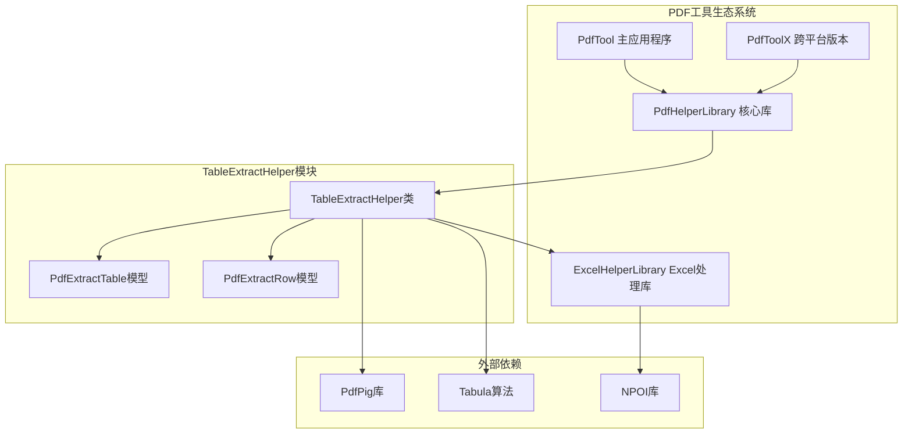
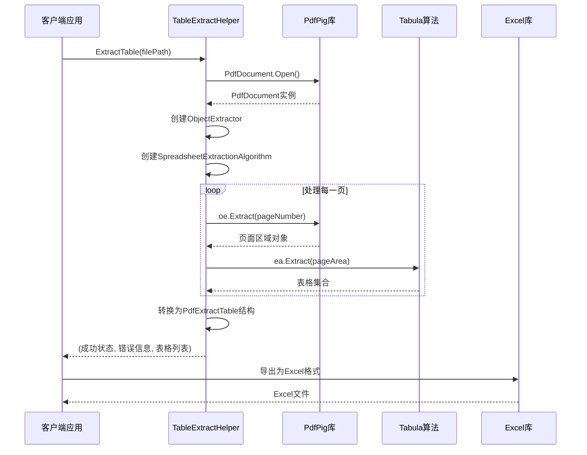
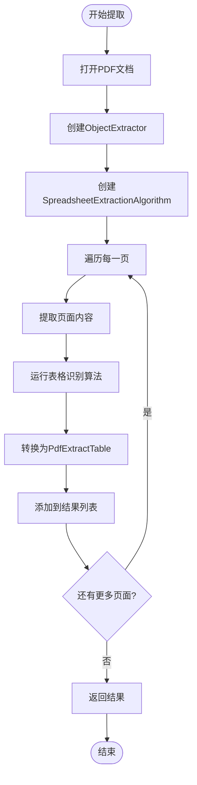
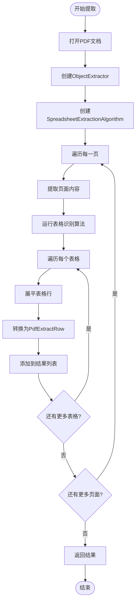
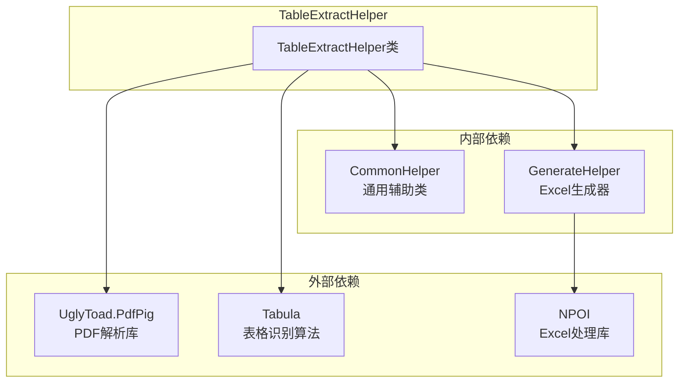

# TableExtractHelper - PDF表格提取助手

<cite>
**本文档中引用的文件**
- [TableExtractHelper.cs](file://PdfHelperLibrary/TableExtractHelper.cs)
- [PdfTableExtracter.cs](file://PdfTool/PdfTableExtracter.cs)
- [PdfTableExtracter.axaml.cs](file://PdfToolX/PdfTableExtracter.axaml.cs)
- [GenerateHelper.cs](file://ExcelHelperLibrary/GenerateHelper.cs)
- [CommonHelper.cs](file://PdfHelperLibrary/CommonHelper.cs)
- [PdfHelperLibrary.csproj](file://PdfHelperLibrary/PdfHelperLibrary.csproj)
</cite>

## 目录
1. [简介](#简介)
2. [项目结构](#项目结构)
3. [核心组件](#核心组件)
4. [架构概览](#架构概览)
5. [详细组件分析](#详细组件分析)
6. [依赖关系分析](#依赖关系分析)
7. [性能考虑](#性能考虑)
8. [故障排除指南](#故障排除指南)
9. [结论](#结论)

## 简介

TableExtractHelper是一个专门用于从PDF文档中提取表格数据的静态工具类，基于PdfPig库的强大功能。该类提供了两个主要的表格提取方法：`ExtractTable`和`ExtractTableRows`，分别返回不同层次的数据结构，满足不同的应用场景需求。

该类的核心优势在于：
- 支持从文件路径和内存流两种输入方式提取表格
- 内置智能的表格识别算法，能够处理复杂的PDF布局
- 提供灵活的数据输出格式，支持转换为CSV和Excel格式
- 具备良好的错误处理机制和状态反馈

## 项目结构

TableExtractHelper类位于PdfHelperLibrary项目中，作为PDF处理工具链的重要组成部分。该项目采用分层架构设计，将表格提取功能与其他PDF处理功能分离，确保了模块化和可维护性。



**图表来源**
- [PdfHelperLibrary.csproj](file://PdfHelperLibrary/PdfHelperLibrary.csproj#L1-L127)
- [TableExtractHelper.cs](file://PdfHelperLibrary/TableExtractHelper.cs#L1-L106)

**章节来源**
- [PdfHelperLibrary.csproj](file://PdfHelperLibrary/PdfHelperLibrary.csproj#L1-L127)
- [TableExtractHelper.cs](file://PdfHelperLibrary/TableExtractHelper.cs#L1-L106)

## 核心组件

TableExtractHelper类包含以下核心组件：

### 静态方法集合
- **ExtractTable方法族**：提供从PDF文件中提取完整表格结构的方法
- **ExtractTableRows方法族**：提供从PDF文件中提取扁平化行数据的方法

### 数据模型
- **PdfExtractTable**：表示完整的表格结构，包含多行数据
- **PdfExtractRow**：表示表格中的单行数据，包含多个单元格

### 内部算法引擎
- **ObjectExtractor**：负责从PDF页面中提取对象元素
- **SpreadsheetExtractionAlgorithm**：专门的电子表格提取算法

**章节来源**
- [TableExtractHelper.cs](file://PdfHelperLibrary/TableExtractHelper.cs#L10-L106)

## 架构概览

TableExtractHelper采用了经典的三层架构模式，结合了PDF解析、表格识别和数据转换三个关键阶段。



**图表来源**
- [TableExtractHelper.cs](file://PdfHelperLibrary/TableExtractHelper.cs#L51-L93)
- [PdfTableExtracter.cs](file://PdfTool/PdfTableExtracter.cs#L58-L85)

## 详细组件分析

### ExtractTable方法详解

`ExtractTable`方法提供了最完整的表格数据提取功能，返回包含完整表格结构的列表。

#### 方法签名
```csharp
public static (bool, string, List<PdfExtractTable>) ExtractTable(string inputPdfFileName)
public static (bool, string, List<PdfExtractTable>) ExtractTable(Stream inputPdfStrean)
```

#### 返回值结构
- **bool success**：操作是否成功的标志
- **string errorMessage**：错误信息（如果失败）
- **List<PdfExtractTable> tables**：提取到的表格列表

#### 数据结构对比

| 特性 | ExtractTable方法 | ExtractTableRows方法 |
|------|------------------|---------------------|
| 返回类型 | List\<PdfExtractTable\> | List\<PdfExtractRow\> |
| 数据组织 | 表格级别结构 | 行级别扁平化 |
| 适用场景 | 需要保持表格结构 | 需要逐行处理数据 |
| 性能特点 | 内存占用较高 | 内存占用较低 |
| 处理复杂度 | 中等 | 较低 |

#### 内部处理流程



**图表来源**
- [TableExtractHelper.cs](file://PdfHelperLibrary/TableExtractHelper.cs#L51-L70)

**章节来源**
- [TableExtractHelper.cs](file://PdfHelperLibrary/TableExtractHelper.cs#L15-L48)

### ExtractTableRows方法详解

`ExtractTableRows`方法提供了更灵活的行级数据提取功能，适用于需要逐行处理表格数据的场景。

#### 方法签名
```csharp
public static (bool, string, List<PdfExtractRow>) ExtractTableRows(string inputPdfFileName)
public static (bool, string, List<PdfExtractRow>) ExtractTableRows(Stream inputPdfStrean)
```

#### 数据处理逻辑

该方法与ExtractTable方法共享相同的底层PDF解析和表格识别逻辑，但在数据转换阶段有所不同：



**图表来源**
- [TableExtractHelper.cs](file://PdfHelperLibrary/TableExtractHelper.cs#L73-L93)

**章节来源**
- [TableExtractHelper.cs](file://PdfHelperLibrary/TableExtractHelper.cs#L33-L48)

### 数据模型分析

#### PdfExtractTable类
```csharp
public class PdfExtractTable
{
    public List<PdfExtractRow> Rows;
}
```
- **Rows属性**：包含表格中所有行的列表
- **用途**：保持表格的二维结构，便于后续的行列操作

#### PdfExtractRow类
```csharp
public class PdfExtractRow
{
    public List<string> Cells;
}
```
- **Cells属性**：包含行中所有单元格文本的列表
- **用途**：提供行级别的数据访问接口

**章节来源**
- [TableExtractHelper.cs](file://PdfHelperLibrary/TableExtractHelper.cs#L96-L105)

### 算法引擎分析

#### ObjectExtractor的作用
ObjectExtractor是PdfPig库提供的核心组件，负责：
- 解析PDF页面的布局信息
- 提取页面上的所有图形元素
- 识别表格边界和结构

#### SpreadsheetExtractionAlgorithm的作用
该算法专门针对电子表格类型的PDF文档设计：
- 检测表格的行列结构
- 识别合并单元格
- 处理复杂的表格布局

**章节来源**
- [TableExtractHelper.cs](file://PdfHelperLibrary/TableExtractHelper.cs#L54-L69)

## 依赖关系分析

TableExtractHelper类依赖于多个外部库和内部组件，形成了一个完整的PDF表格提取生态系统。



**图表来源**
- [PdfHelperLibrary.csproj](file://PdfHelperLibrary/PdfHelperLibrary.csproj#L71-L94)
- [TableExtractHelper.cs](file://PdfHelperLibrary/TableExtractHelper.cs#L1-L9)

### 关键依赖项说明

| 依赖项 | 版本要求 | 作用 | 必需性 |
|--------|----------|------|--------|
| UglyToad.PdfPig | 0.1.8+ | PDF文档解析 | 必需 |
| Tabula | 0.1.3+ | 表格识别算法 | 必需 |
| NPOI | 最新版本 | Excel文件生成 | 可选 |
| Microsoft.Bcl.HashCode | 6.0.0+ | 哈希计算优化 | 可选 |

**章节来源**
- [PdfHelperLibrary.csproj](file://PdfHelperLibrary/PdfHelperLibrary.csproj#L36-L94)

## 性能考虑

### 内存使用优化
- **流式处理**：支持从Stream直接读取，减少内存占用
- **延迟加载**：只在需要时才解析和处理PDF内容
- **垃圾回收友好**：及时释放PDF文档资源

### 处理速度优化
- **并行处理**：可以考虑对多页PDF进行并行处理
- **缓存机制**：对于重复处理的PDF文件，可以实现缓存策略
- **算法选择**：根据PDF复杂度选择合适的解析参数

### 准确性影响因素

#### PDF质量因素
- **边框检测**：清晰的表格边框有助于提高识别准确率
- **字体一致性**：统一的字体大小和样式提高识别效果
- **分辨率**：高分辨率PDF提供更好的识别基础

#### 算法参数调优
- **ClipPaths设置**：启用ClipPaths选项改善复杂图形的处理
- **页面范围限制**：只处理特定页面范围，提高效率
- **容错机制**：合理设置错误容忍度

## 故障排除指南

### 常见问题及解决方案

#### 表格识别不准确
**症状**：提取的表格结构混乱，行列错位
**原因**：PDF表格结构复杂，边框不清晰
**解决方案**：
- 检查PDF原始质量
- 尝试调整解析参数
- 使用图像预处理增强表格边框

#### 内存占用过高
**症状**：处理大型PDF文件时出现内存不足
**原因**：一次性加载整个文档
**解决方案**：
- 分页处理大型文档
- 及时释放不再使用的资源
- 使用流式处理替代全量加载

#### 字体编码问题
**症状**：提取的文本包含乱码或特殊字符
**原因**：PDF字体编码与系统编码不匹配
**解决方案**：
- 检查PDF的字体嵌入情况
- 使用适当的字符编码转换
- 考虑使用OCR处理扫描件

**章节来源**
- [TableExtractHelper.cs](file://PdfHelperLibrary/TableExtractHelper.cs#L17-L48)

### 实际应用示例

#### 基本使用示例
```csharp
// 从文件路径提取表格
var (success, error, tables) = TableExtractHelper.ExtractTable("document.pdf");

// 从内存流提取表格
using var stream = new FileStream("document.pdf", FileMode.Open);
var (success, error, tables) = TableExtractHelper.ExtractTable(stream);
```

#### Excel导出示例
```csharp
// 将提取的表格转换为Excel格式
var commonTable = new ExcelHelperLibrary.CommonTable
{
    Rows = tables.SelectMany(table => table.Rows)
       .Select(row => new ExcelHelperLibrary.CommonRow { Cells = row.Cells })
       .ToList()
};
ExcelHelperLibrary.GenerateHelper.GenerateExcel("output.xlsx", new List<ExcelHelperLibrary.CommonTable> { commonTable });
```

**章节来源**
- [PdfTableExtracter.cs](file://PdfTool/PdfTableExtracter.cs#L62-L83)
- [GenerateHelper.cs](file://ExcelHelperLibrary/GenerateHelper.cs#L10-L47)

## 结论

TableExtractHelper类是一个功能强大且设计精良的PDF表格提取工具，它成功地将复杂的PDF解析技术封装成简洁易用的API。通过提供两种不同的数据提取模式（表格级和行级），它能够满足从简单数据导出到复杂表格分析的各种需求。

### 主要优势
- **API设计简洁**：提供直观的方法签名和清晰的返回值结构
- **算法先进**：基于PdfPig和Tabula的成熟算法，识别准确率高
- **扩展性强**：支持多种输入源和输出格式
- **错误处理完善**：提供详细的错误信息和状态反馈

### 应用前景
随着数字化办公的普及，PDF表格提取将成为日常工作中的重要环节。TableExtractHelper类为开发者提供了一个可靠的基础工具，可以进一步扩展为更高级的PDF处理解决方案。

### 发展建议
- 考虑添加对OCR的支持，处理扫描件PDF
- 实现增量处理功能，支持部分页面提取
- 提供更多的配置选项，满足不同场景需求
- 增加对复杂表格（如合并单元格、嵌套表格）的处理能力