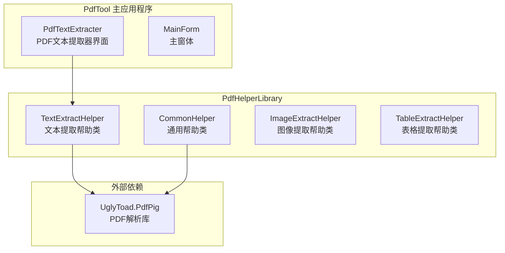
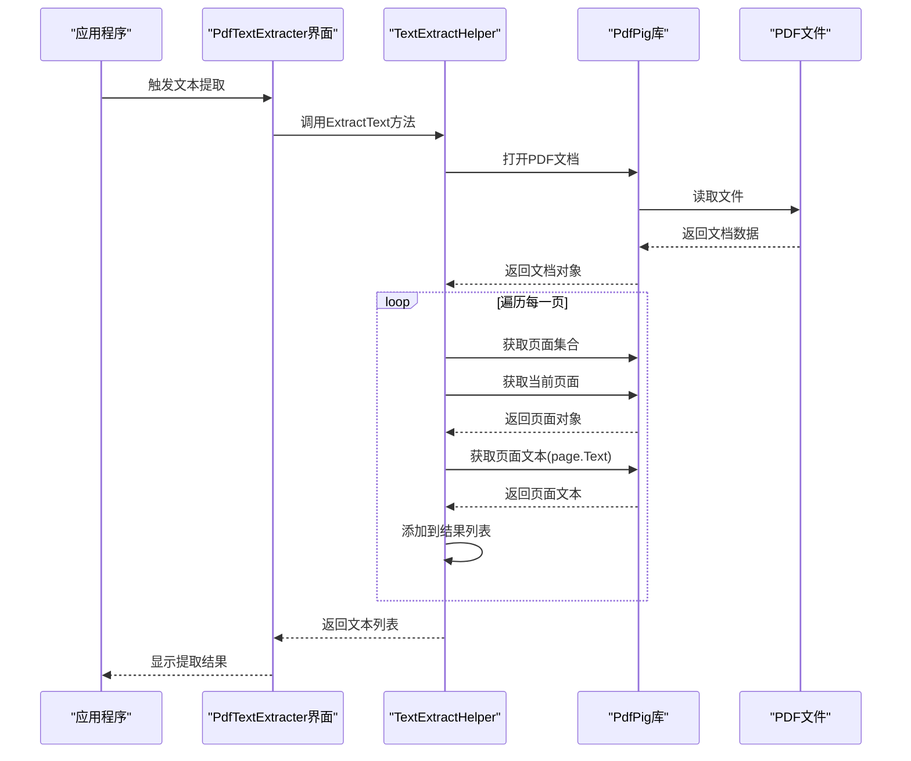
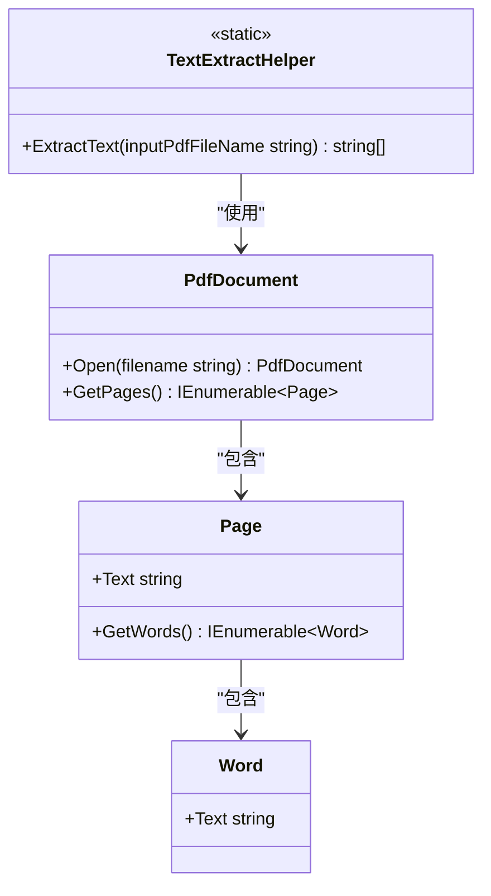
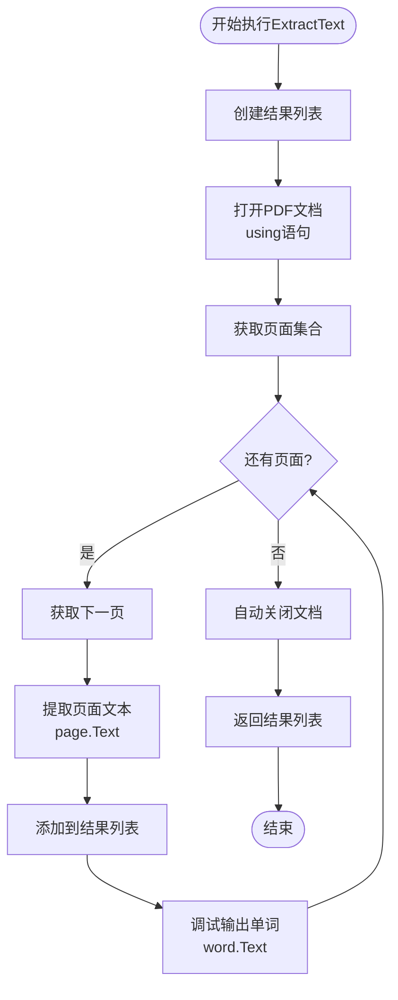
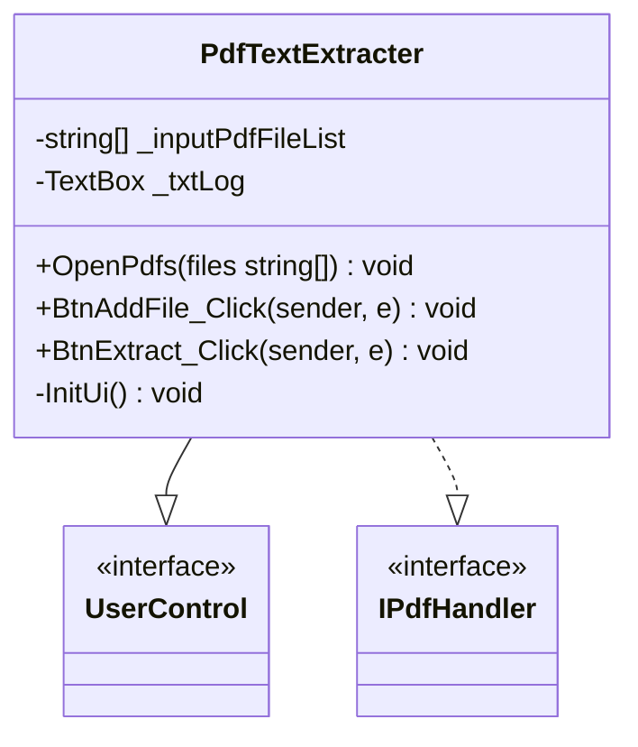
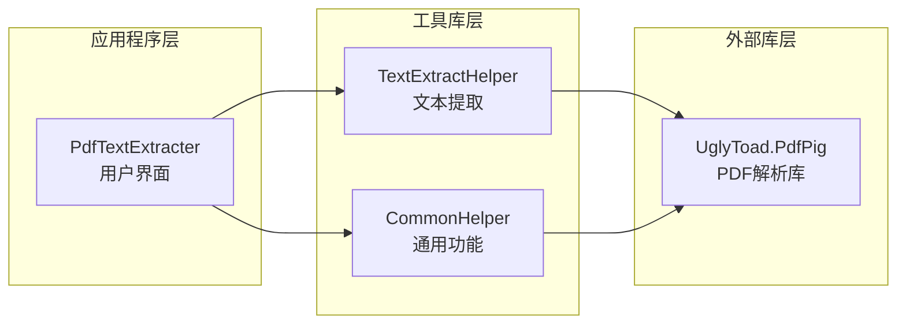

# TextExtractHelper - PDF文本提取助手

<cite>
**本文档中引用的文件**
- [TextExtractHelper.cs](file://PdfHelperLibrary/TextExtractHelper.cs)
- [PdfTextExtracter.cs](file://PdfTool/PdfTextExtracter.cs)
- [CommonHelper.cs](file://PdfHelperLibrary/CommonHelper.cs)
- [PdfHelperLibrary.csproj](file://PdfHelperLibrary/PdfHelperLibrary.csproj)
- [PdfTool.csproj](file://PdfTool/PdfTool.csproj)
</cite>

## 目录
1. [简介](#简介)
2. [项目结构](#项目结构)
3. [核心组件](#核心组件)
4. [架构概览](#架构概览)
5. [详细组件分析](#详细组件分析)
6. [依赖关系分析](#依赖关系分析)
7. [性能考虑](#性能考虑)
8. [故障排除指南](#故障排除指南)
9. [结论](#结论)

## 简介

TextExtractHelper 是一个专门用于从 PDF 文档中提取纯文本内容的静态工具类。该类基于 PdfPig 库实现，提供了简单而高效的文本提取功能，特别适用于需要快速获取 PDF 文件中纯文本内容的场景。

该类的核心设计理念是提供简洁的 API 接口，通过单一方法调用即可完成整个 PDF 文档的文本提取过程，每个页面的文本内容被组织成独立的字符串列表返回。

## 项目结构

TextExtractHelper 类位于 PdfHelperLibrary 项目中，作为 PDF 处理工具库的核心组件之一。该项目采用分层架构设计，包含多个专门的辅助类库。

**图表来源**
- [TextExtractHelper.cs](file://PdfHelperLibrary/TextExtractHelper.cs#L1-L35)
- [PdfTextExtracter.cs](file://PdfTool/PdfTextExtracter.cs#L1-L119)
- [PdfHelperLibrary.csproj](file://PdfHelperLibrary/PdfHelperLibrary.csproj#L74-L94)

**章节来源**
- [TextExtractHelper.cs](file://PdfHelperLibrary/TextExtractHelper.cs#L1-L35)
- [PdfHelperLibrary.csproj](file://PdfHelperLibrary/PdfHelperLibrary.csproj#L1-L127)

## 核心组件

TextExtractHelper 类的核心功能围绕 ExtractText 方法展开，该方法实现了以下关键特性：

### 主要功能特性

1. **单方法接口设计**：提供简洁的静态方法接口，便于集成和使用
2. **页面级文本提取**：按页面顺序提取文本，保持文档结构
3. **自动资源管理**：使用 using 语句确保 PDF 文档正确释放
4. **调试支持**：在调试模式下输出单词级别的文本信息

### 数据结构设计

- **输入参数**：接受 PDF 文件路径字符串
- **返回值**：返回 List<string> 类型，每个元素对应一个页面的完整文本内容
- **内存管理**：自动处理 PDF 文档的打开和关闭操作

**章节来源**
- [TextExtractHelper.cs](file://PdfHelperLibrary/TextExtractHelper.cs#L11-L31)

## 架构概览

TextExtractHelper 在整体架构中扮演着底层数据提取的角色，为上层应用提供原始的文本数据。

**图表来源**
- [TextExtractHelper.cs](file://PdfHelperLibrary/TextExtractHelper.cs#L11-L31)
- [PdfTextExtracter.cs](file://PdfTool/PdfTextExtracter.cs#L57-L66)

## 详细组件分析

### TextExtractHelper 类分析

TextExtractHelper 类是一个静态工具类，提供了简洁的文本提取功能。

#### 类结构图

**图表来源**
- [TextExtractHelper.cs](file://PdfHelperLibrary/TextExtractHelper.cs#L11-L31)

#### ExtractText 方法详细分析

ExtractText 方法的实现逻辑清晰明了：

1. **初始化阶段**：创建空的字符串列表用于存储结果
2. **文档打开**：使用 using 语句确保资源正确释放
3. **页面遍历**：获取文档的所有页面并逐页处理
4. **文本提取**：从每一页获取完整的文本内容
5. **调试输出**：在调试模式下输出单词级别的文本信息
6. **结果返回**：返回包含所有页面文本的列表

#### 方法流程图

**图表来源**
- [TextExtractHelper.cs](file://PdfHelperLibrary/TextExtractHelper.cs#L11-L31)

**章节来源**
- [TextExtractHelper.cs](file://PdfHelperLibrary/TextExtractHelper.cs#L11-L31)

### PdfTextExtracter 界面组件分析

PdfTextExtracter 是 TextExtractHelper 的上层应用界面，负责用户交互和任务调度。

#### 界面组件架构

**图表来源**
- [PdfTextExtracter.cs](file://PdfTool/PdfTextExtracter.cs#L13-L119)

#### 用户交互流程

1. **文件选择**：用户通过对话框选择一个或多个 PDF 文件
2. **文件验证**：系统显示每个文件的页数信息
3. **后台处理**：使用 BackgroundWorker 进行异步文本提取
4. **进度报告**：实时更新日志窗口显示处理状态
5. **结果展示**：将提取的文本内容显示在日志区域

**章节来源**
- [PdfTextExtracter.cs](file://PdfTool/PdfTextExtracter.cs#L30-L80)

## 依赖关系分析

TextExtractHelper 的依赖关系相对简单，主要依赖于 PdfPig 库提供的 PDF 解析功能。

**图表来源**
- [PdfHelperLibrary.csproj](file://PdfHelperLibrary/PdfHelperLibrary.csproj#L74-L94)
- [PdfTool.csproj](file://PdfTool/PdfTool.csproj#L187-L189)

### 外部依赖详情

TextExtractHelper 依赖以下 PdfPig 组件：
- **UglyToad.PdfPig**：核心 PDF 解析功能
- **UglyToad.PdfPig.Core**：基础核心功能
- **UglyToad.PdfPig.DocumentLayoutAnalysis**：文档布局分析
- **UglyToad.PdfPig.Fonts**：字体处理功能

**章节来源**
- [PdfHelperLibrary.csproj](file://PdfHelperLibrary/PdfHelperLibrary.csproj#L74-L94)

## 性能考虑

TextExtractHelper 在设计时充分考虑了性能优化：

### 内存管理
- 使用 using 语句确保 PDF 文档在使用后立即释放
- 自动垃圾回收机制处理临时对象
- 避免长时间持有大对象引用

### 并发处理
- 支持异步处理模式（通过 PdfTextExtracter）
- 后台线程处理避免阻塞用户界面
- 渐进式结果报告机制

### 适用场景
- **简单文本提取**：适用于不需要保留格式的纯文本提取
- **批量处理**：支持多文件同时处理
- **实时反馈**：提供处理进度和结果反馈

## 故障排除指南

### 常见问题及解决方案

#### 1. PDF 文件无法打开
**问题描述**：ExtractText 方法抛出异常
**可能原因**：
- 文件不存在或路径错误
- 文件损坏或格式不正确
- 权限不足

**解决方案**：
- 检查文件路径是否正确
- 验证文件完整性
- 确保有适当的文件访问权限

#### 2. 提取结果为空
**问题描述**：返回的文本列表为空或包含空字符串
**可能原因**：
- PDF 文件中没有可提取的文本
- 文档是扫描件而非可搜索的文本
- 字体编码问题

**解决方案**：
- 确认 PDF 包含可搜索的文本
- 考虑使用 OCR 技术处理扫描件
- 检查字体编码设置

#### 3. 性能问题
**问题描述**：大文件处理速度慢
**解决方案**：
- 分批处理大型文档
- 考虑使用更高效的 PDF 库
- 实现进度报告机制

**章节来源**
- [TextExtractHelper.cs](file://PdfHelperLibrary/TextExtractHelper.cs#L11-L31)
- [PdfTextExtracter.cs](file://PdfTool/PdfTextExtracter.cs#L52-L56)

## 结论

TextExtractHelper 是一个设计精良的 PDF 文本提取工具，具有以下优势：

### 主要优点
1. **简洁易用**：单一方法接口，易于集成和使用
2. **高效可靠**：基于成熟的 PdfPig 库，性能稳定
3. **资源友好**：自动管理资源，避免内存泄漏
4. **扩展性强**：良好的架构设计便于功能扩展

### 适用场景
- 简单的纯文本提取需求
- 批量 PDF 文档处理
- 需要快速原型开发的项目
- 对格式保留要求不高的应用场景

### 局限性
- 不支持复杂的版式信息提取
- 对扫描件或图片格式的 PDF 处理能力有限
- 无法保留原文档的视觉格式

对于需要更复杂 PDF 处理功能的应用场景，建议结合其他专业的 PDF 处理库或服务。TextExtractHelper 为基本的文本提取需求提供了一个可靠且高效的解决方案。