# 核心库与API

<cite>
**本文档中引用的文件**  
- [PdfHelperLibrary.csproj](file://PdfHelperLibrary/PdfHelperLibrary.csproj)
- [CommonHelper.cs](file://PdfHelperLibrary/CommonHelper.cs)
- [SplitHelper.cs](file://PdfHelperLibrary/SplitHelper.cs)
- [MergeHelper.cs](file://PdfHelperLibrary/MergeHelper.cs)
- [Builder.cs](file://PdfHelperLibrary/Builder.cs)
- [ExtractHelper.cs](file://PdfHelperLibrary/ExtractHelper.cs)
- [ImageExtractHelper.cs](file://PdfHelperLibrary/ImageExtractHelper.cs)
- [TableExtractHelper.cs](file://PdfHelperLibrary/TableExtractHelper.cs)
- [TextExtractHelper.cs](file://PdfHelperLibrary/TextExtractHelper.cs)
- [WatermarkHelper.cs](file://PdfHelperLibrary/WatermarkHelper.cs)
- [CompressHelper.cs](file://PdfHelperLibrary/CompressHelper.cs)
- [ProtectHelper.cs](file://PdfHelperLibrary/ProtectHelper.cs)
- [SealHelper.cs](file://PdfHelperLibrary/SealHelper.cs)
- [PageRotateHelper.cs](file://PdfHelperLibrary/PageRotateHelper.cs)
- [PrintHelper.cs](file://PdfHelperLibrary/PrintHelper.cs)
</cite>

## 目录
1. [简介](#简介)
2. [项目结构](#项目结构)
3. [核心组件](#核心组件)
4. [架构概述](#架构概述)
5. [详细组件分析](#详细组件分析)
6. [依赖分析](#依赖分析)
7. [性能考虑](#性能考虑)
8. [故障排除指南](#故障排除指南)
9. [结论](#结论)

## 简介
`PdfHelperLibrary` 是一个功能丰富的PDF处理核心库，提供了一系列静态帮助类，用于执行常见的PDF操作，如拆分、合并、提取、压缩、保护、添加水印和印章等。该库基于 `PDFsharp` 和 `PdfPig` 等第三方库构建，为上层应用（如 `PdfTool` 和 `PdfMerger`）提供了统一、稳定的API接口。本文档旨在为二次开发和系统集成提供详尽的技术参考。

## 项目结构
`PdfHelperLibrary` 项目是一个 .NET Framework 4.7.2 类库，其结构清晰，每个功能模块都封装在独立的Helper类文件中。这种设计遵循了单一职责原则，使得代码易于维护和扩展。

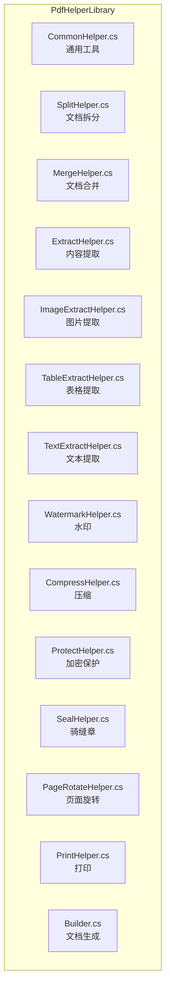

**图示来源**
- [PdfHelperLibrary.csproj](file://PdfHelperLibrary/PdfHelperLibrary.csproj)

**本节来源**
- [PdfHelperLibrary.csproj](file://PdfHelperLibrary/PdfHelperLibrary.csproj)

## 核心组件
`PdfHelperLibrary` 的核心由多个静态Helper类构成，每个类负责一个特定的PDF处理领域。这些类通过简洁的静态方法暴露功能，外部调用者无需实例化对象即可直接使用。库的核心依赖于 `PDFsharp` 进行PDF文档的创建、修改和渲染，以及 `PdfPig` 和 `Tabula` 进行内容的解析和提取。

**本节来源**
- [CommonHelper.cs](file://PdfHelperLibrary/CommonHelper.cs)
- [SplitHelper.cs](file://PdfHelperLibrary/SplitHelper.cs)
- [MergeHelper.cs](file://PdfHelperLibrary/MergeHelper.cs)

## 架构概述
该库采用分层架构，上层为应用层（如 `PdfTool`），中层为业务逻辑层（即 `PdfHelperLibrary`），底层为第三方库（`PDFsharp`, `PdfPig`, `Tabula`）。`PdfHelperLibrary` 作为中间层，封装了底层库的复杂性，向上层提供了简单、一致的API。其内部各Helper类之间相互独立，通过 `CommonHelper` 提供的通用方法进行协作。

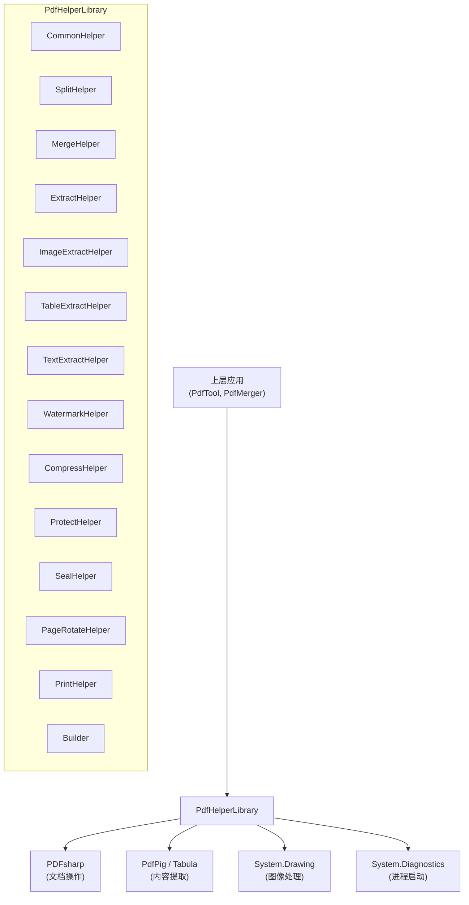

**图示来源**
- [PdfHelperLibrary.csproj](file://PdfHelperLibrary/PdfHelperLibrary.csproj)
- [CommonHelper.cs](file://PdfHelperLibrary/CommonHelper.cs)

## 详细组件分析
本节将深入分析 `PdfHelperLibrary` 中每个核心Helper类的公共API，包括方法签名、参数、返回值、异常处理和内部实现逻辑。

### CommonHelper 分析
`CommonHelper` 类提供了最基础的通用工具方法。

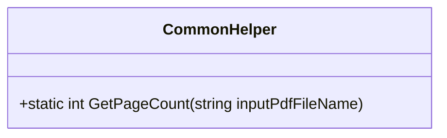

**图示来源**
- [CommonHelper.cs](file://PdfHelperLibrary/CommonHelper.cs#L9-L28)

#### GetPageCount 方法
获取指定PDF文件的总页数。

- **方法签名**: `public static int GetPageCount(string inputPdfFileName)`
- **参数**:
  - `inputPdfFileName` (string): 要查询的PDF文件的完整路径。
- **返回值**: 返回一个整数，表示PDF文档的页数。
- **异常处理**:
  - 捕获 `PdfReaderException` 并重新抛出，附加文件名信息。
  - 捕获其他 `Exception` 并重新抛出，附加文件名信息。
- **内部逻辑**: 使用 `PdfReader.Open` 以导入模式打开PDF文档，读取 `PageCount` 属性后立即释放资源。

**本节来源**
- [CommonHelper.cs](file://PdfHelperLibrary/CommonHelper.cs#L9-L28)

### SplitHelper 分析
`SplitHelper` 类提供了将一个PDF文件拆分为多个文件的功能。

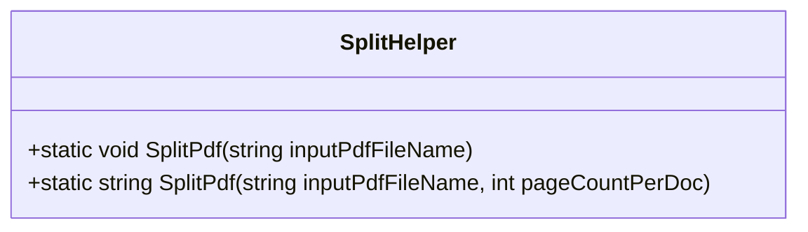

**图示来源**
- [SplitHelper.cs](file://PdfHelperLibrary/SplitHelper.cs#L11-L70)

#### SplitPdf (无返回值) 方法
将PDF文件的每一页拆分为一个独立的PDF文件。

- **方法签名**: `public static void SplitPdf(string inputPdfFileName)`
- **参数**:
  - `inputPdfFileName` (string): 要拆分的源PDF文件路径。
- **返回值**: 无。
- **内部逻辑**: 遍历源文档的每一页，为每一页创建一个新的 `PdfDocument`，将该页添加进去，并以“原文件名 - Page X.pdf”的格式保存。

#### SplitPdf (带返回值) 方法
将PDF文件按指定页数拆分为多个文档。

- **方法签名**: `public static string SplitPdf(string inputPdfFileName, int pageCountPerDoc)`
- **参数**:
  - `inputPdfFileName` (string): 要拆分的源PDF文件路径。
  - `pageCountPerDoc` (int): 每个拆分后文档的页数。
- **返回值**: 返回一个字符串。如果操作成功，返回空字符串；如果失败，返回包含错误信息的描述。
- **内部逻辑**: 计算需要拆分的文档数量，循环创建新文档，每次添加 `pageCountPerDoc` 页（或剩余页数），并以“原文件名 - Page X - Y.pdf”的格式保存。

**本节来源**
- [SplitHelper.cs](file://PdfHelperLibrary/SplitHelper.cs#L11-L70)

### MergeHelper 分析
`MergeHelper` 类提供了将多个PDF文件合并为一个文件的功能。

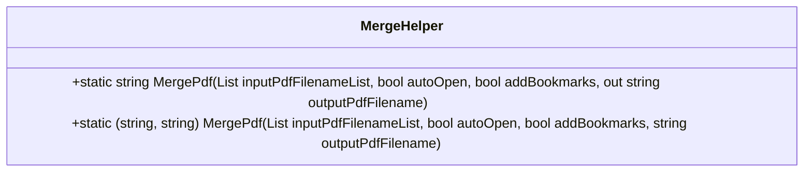

**图示来源**
- [MergeHelper.cs](file://PdfHelperLibrary/MergeHelper.cs#L14-L75)

#### MergePdf (out参数) 方法
合并PDF文件列表，并可选择自动打开结果文件和添加书签。

- **方法签名**: `public static string MergePdf(List<string> inputPdfFilenameList, bool autoOpen, bool addBookmarks, out string outputPdfFilename)`
- **参数**:
  - `inputPdfFilenameList` (List<string>): 要合并的PDF文件路径列表。
  - `autoOpen` (bool): 是否在合并完成后自动打开生成的文件。
  - `addBookmarks` (bool): 是否为每个源文件的第一页添加书签。
  - `outputPdfFilename` (out string): 输出文件的路径，由方法内部生成。
- **返回值**: 返回一个字符串。成功时为空字符串，失败时为错误信息。
- **内部逻辑**: 创建一个空的 `PdfDocument`，遍历输入列表，将每个文件的所有页面逐页添加到输出文档中。如果 `addBookmarks` 为 `true`，则在添加每个文件的第一页时创建一个书签。输出文件名基于输入列表中第一个文件的路径生成。

#### MergePdf (元组返回) 方法
功能与上述方法类似，但允许调用者指定输出文件名。

- **方法签名**: `public static (string, string) MergePdf(List<string> inputPdfFilenameList, bool autoOpen, bool addBookmarks, string outputPdfFilename)`
- **参数**: 前三个参数同上，`outputPdfFilename` (string) 为可选的输出文件路径。
- **返回值**: 返回一个元组 `(string, string)`，第一个元素是错误信息（成功时为空），第二个元素是实际的输出文件路径。
- **内部逻辑**: 如果 `outputPdfFilename` 为空，则生成一个默认文件名；否则使用指定的路径。

**本节来源**
- [MergeHelper.cs](file://PdfHelperLibrary/MergeHelper.cs#L14-L75)

### Builder 分析
`Builder` 类提供了从图像创建PDF文件的功能。

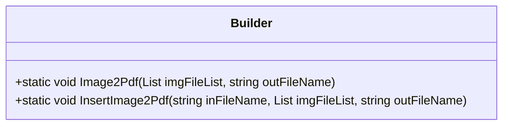

**图示来源**
- [Builder.cs](file://PdfHelperLibrary/Builder.cs#L15-L55)

#### Image2Pdf 方法
将一组图像文件合并成一个PDF文件。

- **方法签名**: `public static void Image2Pdf(List<string> imgFileList, string outFileName)`
- **参数**:
  - `imgFileList` (List<string>): 要转换的图像文件路径列表。
  - `outFileName` (string): 输出PDF文件的路径。
- **内部逻辑**: 创建一个新的 `PdfDocument`，对列表中的每个图像文件，创建一个新页面，将图像缩放至页面大小并绘制上去。如果图像宽度大于高度，则将页面方向设为横向。

#### InsertImage2Pdf 方法
将一组图像文件作为新页面插入到一个现有的PDF文件末尾。

- **方法签名**: `public static void InsertImage2Pdf(string inFileName, List<string> imgFileList, string outFileName)`
- **参数**:
  - `inFileName` (string): 现有PDF文件的路径。
  - `imgFileList` (List<string>): 要插入的图像文件路径列表。
  - `outFileName` (string): 输出文件的路径。
- **内部逻辑**: 使用 `PdfReader.Open` 打开现有文档，然后对每个图像文件执行与 `Image2Pdf` 相同的添加页面操作。

**本节来源**
- [Builder.cs](file://PdfHelperLibrary/Builder.cs#L15-L55)

### ExtractHelper 分析
`ExtractHelper` 类提供了从PDF中提取指定页面范围或删除指定页面的功能。

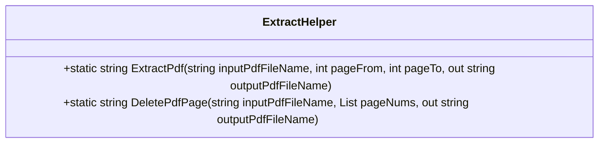

**图示来源**
- [ExtractHelper.cs](file://PdfHelperLibrary/ExtractHelper.cs#L12-L77)

#### ExtractPdf 方法
提取PDF文件中指定页码范围的内容。

- **方法签名**: `public static string ExtractPdf(string inputPdfFileName, int pageFrom, int pageTo, out string outputPdfFileName)`
- **参数**:
  - `inputPdfFileName` (string): 源文件路径。
  - `pageFrom` (int): 起始页码（从1开始）。
  - `pageTo` (int): 结束页码。
  - `outputPdfFileName` (out string): 输出文件路径。
- **返回值**: 错误信息字符串。
- **内部逻辑**: 创建一个新文档，将 `pageFrom` 到 `pageTo` 范围内的页面（已做边界检查）复制到新文档中。

#### DeletePdfPage 方法
删除PDF文件中指定页码的页面。

- **方法签名**: `public static string DeletePdfPage(string inputPdfFileName, List<int> pageNums, out string outputPdfFileName)`
- **参数**:
  - `pageNums` (List<int>): 要删除的页码列表。
- **内部逻辑**: 创建一个新文档，遍历源文档的所有页面，如果当前页码不在 `pageNums` 列表中，则将其添加到新文档。

**本节来源**
- [ExtractHelper.cs](file://PdfHelperLibrary/ExtractHelper.cs#L12-L77)

### ImageExtractHelper 分析
`ImageExtractHelper` 类提供了从PDF文件中提取嵌入图片的功能。

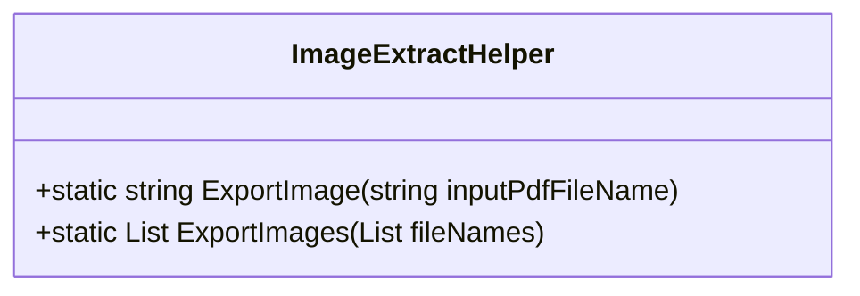

**图示来源**
- [ImageExtractHelper.cs](file://PdfHelperLibrary/ImageExtractHelper.cs#L15-L182)

#### ExportImage 方法
从单个PDF文件中提取所有图片。

- **方法签名**: `public static string ExportImage(string inputPdfFileName)`
- **返回值**: 成功时返回提取的图片数量信息，失败时返回错误信息。
- **内部逻辑**: 使用 `PdfReader` 打开文档，遍历每一页的资源字典，查找类型为 `/Image` 的外部对象（XObject）。根据图像的编码过滤器（如 `/DCTDecode` 对应JPEG）调用相应的私有方法（如 `ExportJpegImage`）将原始数据流写入文件。

#### ExportImages 方法
批量处理多个PDF文件的图片提取。

- **方法签名**: `public static List<string> ExportImages(List<string> fileNames)`
- **返回值**: 返回一个包含所有成功提取的图片文件路径的列表。
- **内部逻辑**: 遍历文件名列表，对每个文件调用 `ExportImage` 方法，并收集返回的文件路径。

**本节来源**
- [ImageExtractHelper.cs](file://PdfHelperLibrary/ImageExtractHelper.cs#L15-L182)

### TableExtractHelper 分析
`TableExtractHelper` 类利用 `Tabula` 库从PDF中提取表格数据。

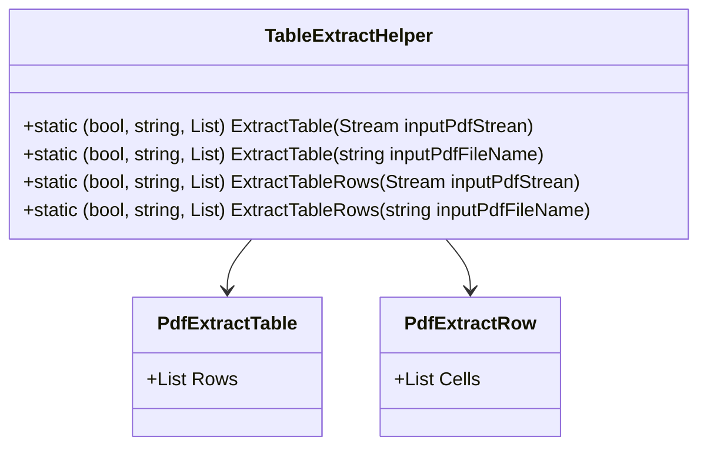

**图示来源**
- [TableExtractHelper.cs](file://PdfHelperLibrary/TableExtractHelper.cs#L13-L106)

#### ExtractTable 方法
提取PDF中的所有表格。

- **方法签名**: `public static (bool, string, List<PdfExtractTable>) ExtractTable(...)`
- **参数**: 支持 `Stream` 或 `string` (文件路径) 两种输入。
- **返回值**: 一个三元组 `(bool success, string message, List<PdfExtractTable> tables)`。`PdfExtractTable` 包含一个 `Rows` 列表，而 `PdfExtractRow` 包含一个 `Cells` 字符串列表。
- **内部逻辑**: 使用 `PdfPig` 的 `PdfDocument.Open` 解析PDF，然后使用 `Tabula` 的 `ObjectExtractor` 和 `SpreadsheetExtractionAlgorithm` 算法来识别和提取表格。

**本节来源**
- [TableExtractHelper.cs](file://PdfHelperLibrary/TableExtractHelper.cs#L13-L106)

### TextExtractHelper 分析
`TextExtractHelper` 类提供了从PDF中提取纯文本的功能。

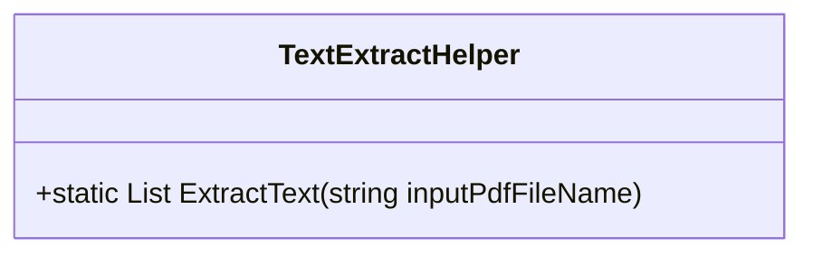

**图示来源**
- [TextExtractHelper.cs](file://PdfHelperLibrary/TextExtractHelper.cs#L9-L35)

#### ExtractText 方法
提取PDF中每一页的文本内容。

- **方法签名**: `public static List<string> ExtractText(string inputPdfFileName)`
- **返回值**: 返回一个字符串列表，列表中的每个元素对应PDF中一页的文本。
- **内部逻辑**: 使用 `PdfPig` 打开文档，遍历每一页，获取 `page.Text` 属性。

**本节来源**
- [TextExtractHelper.cs](file://PdfHelperLibrary/TextExtractHelper.cs#L9-L35)

### WatermarkHelper 分析
`WatermarkHelper` 类提供了为PDF文件添加文本水印的功能。

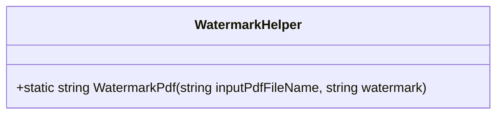

**图示来源**
- [WatermarkHelper.cs](file://PdfHelperLibrary/WatermarkHelper.cs#L20-L160)

#### WatermarkPdf 方法
为PDF文件的每一页添加一个文本水印。

- **方法签名**: `public static string WatermarkPdf(string inputPdfFileName, string watermark)`
- **参数**:
  - `watermark` (string): 要作为水印显示的文本。
- **内部逻辑**: 复制源文件，使用 `XGraphics.FromPdfPage` 以 `Prepend` 模式在每一页的底层绘制水印。水印文本会经过旋转，使其对角线贯穿页面，并使用半透明的红色画笔绘制。

**本节来源**
- [WatermarkHelper.cs](file://PdfHelperLibrary/WatermarkHelper.cs#L20-L160)

### CompressHelper 分析
`CompressHelper` 类提供了压缩PDF文件大小的功能。

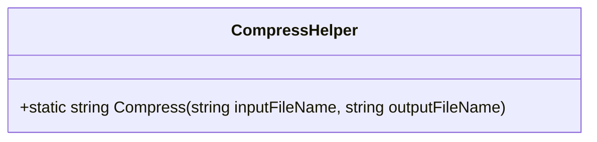

**图示来源**
- [CompressHelper.cs](file://PdfHelperLibrary/CompressHelper.cs#L13-L33)

#### Compress 方法
通过压缩内容流来减小PDF文件大小。

- **方法签名**: `public static string Compress(string inputFileName, string outputFileName)`
- **内部逻辑**: 以修改模式打开输入文件，设置 `CompressContentStreams` 选项为 `true`，然后保存到输出文件。

**本节来源**
- [CompressHelper.cs](file://PdfHelperLibrary/CompressHelper.cs#L13-L33)

### ProtectHelper 分析
`ProtectHelper` 类提供了对PDF文件进行密码保护和解除保护的功能。

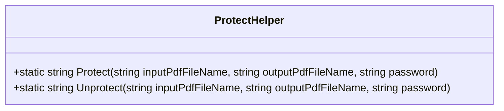

**图示来源**
- [ProtectHelper.cs](file://PdfHelperLibrary/ProtectHelper.cs#L10-L69)

#### Protect 方法
为PDF文件设置密码和权限。

- **方法签名**: `public static string Protect(...)`
- **内部逻辑**: 创建一个新文档，复制源文档的页面，然后配置 `SecuritySettings`。它设置了用户和所有者密码，并限制了打印、内容提取和注释等权限。

#### Unprotect 方法
移除PDF文件的密码保护。

- **方法签名**: `public static string Unprotect(...)`
- **内部逻辑**: 使用密码打开受保护的文档，创建一个新文档并复制页面，然后将新文档的安全级别设置为 `None`。

**本节来源**
- [ProtectHelper.cs](file://PdfHelperLibrary/ProtectHelper.cs#L10-L69)

### SealHelper 分析
`SealHelper` 类提供了为PDF文件添加骑缝章的功能。

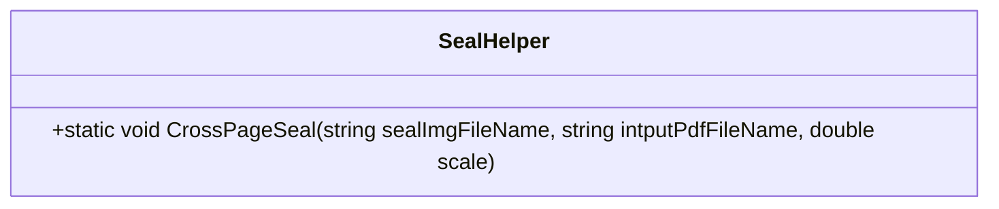

**图示来源**
- [SealHelper.cs](file://PdfHelperLibrary/SealHelper.cs#L12-L101)

#### CrossPageSeal 方法
将一个印章图片平均分割，分别添加到PDF的每一页边缘。

- **方法签名**: `public static void CrossPageSeal(...)`
- **内部逻辑**: 加载印章图片，根据页数计算每页应显示的图片部分宽度。遍历每一页，裁剪出对应的部分，将其绘制到页面的右下角区域。

**本节来源**
- [SealHelper.cs](file://PdfHelperLibrary/SealHelper.cs#L12-L101)

### PageRotateHelper 分析
`PageRotateHelper` 类提供了旋转PDF页面的功能。

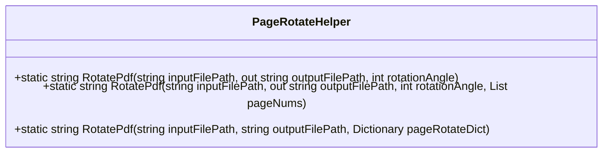

**图示来源**
- [PageRotateHelper.cs](file://PdfHelperLibrary/PageRotateHelper.cs#L12-L95)

#### RotatePdf 方法 (重载1)
将整个文档的所有页面旋转指定角度。

- **方法签名**: `public static string RotatePdf(string inputFilePath, out string outputFilePath, int rotationAngle)`
- **内部逻辑**: 遍历所有页面，将 `Rotate` 属性增加 `rotationAngle`（通常为90的倍数）。

#### RotatePdf 方法 (重载2)
仅旋转指定页码的页面。

- **内部逻辑**: 只对 `pageNums` 列表中指定的页面进行旋转操作。

#### RotatePdf 方法 (重载3)
根据字典配置，为不同页面设置不同的旋转角度。

- **内部逻辑**: 字典的键是页码（从0开始），值是旋转次数（乘以90度）。

**本节来源**
- [PageRotateHelper.cs](file://PdfHelperLibrary/PageRotateHelper.cs#L12-L95)

### PrintHelper 分析
`PrintHelper` 类提供了打印PDF文件的功能。

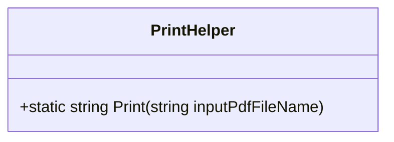

**图示来源**
- [PrintHelper.cs](file://PdfHelperLibrary/PrintHelper.cs#L9-L34)

#### Print 方法
调用系统默认的PDF阅读器来打印文件。

- **方法签名**: `public static string Print(string inputPdfFileName)`
- **内部逻辑**: 使用 `Process.Start` 启动一个进程，其 `Verb` 设置为 `"print"`，从而触发系统的打印操作。

**本节来源**
- [PrintHelper.cs](file://PdfHelperLibrary/PrintHelper.cs#L9-L34)

## 依赖分析
`PdfHelperLibrary` 的功能实现依赖于多个外部库和.NET框架组件。

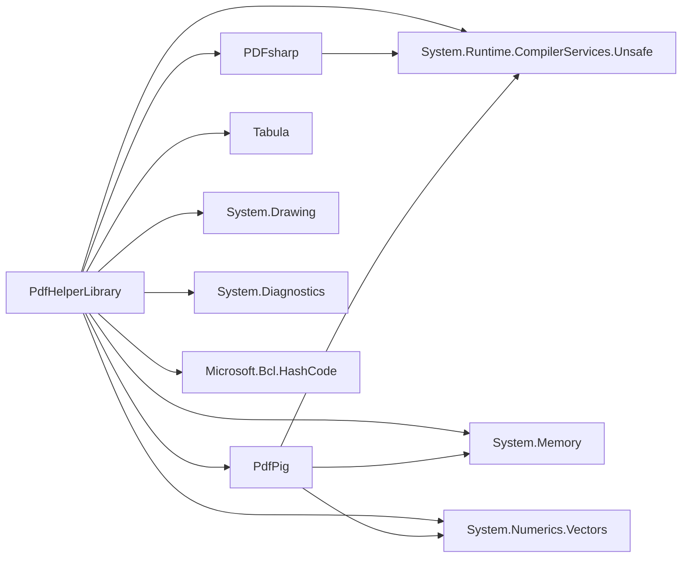

**图示来源**
- [PdfHelperLibrary.csproj](file://PdfHelperLibrary/PdfHelperLibrary.csproj#L35-L95)

**本节来源**
- [PdfHelperLibrary.csproj](file://PdfHelperLibrary/PdfHelperLibrary.csproj#L1-L127)

## 性能考虑
- **内存管理**: 大多数Helper类都使用 `using` 语句确保 `PdfDocument` 和 `FileStream` 等非托管资源被及时释放，防止内存泄漏。
- **I/O操作**: 所有文件操作都直接在磁盘上进行，对于大文件可能会成为性能瓶颈。建议在高并发场景下考虑异步I/O或内存流。
- **算法效率**: `ImageExtractHelper` 和 `TableExtractHelper` 的算法复杂度取决于PDF的复杂度和页数，处理大型文档时可能需要较长时间。

## 故障排除指南
- **文件访问被拒绝**: 确保目标文件没有被其他程序（如PDF阅读器）锁定。`CompressHelper` 和 `SealHelper` 等修改文件的方法尤其需要注意。
- **提取失败**: 某些PDF文件可能使用了特殊的编码或加密方式，导致 `PdfPig` 或 `PDFsharp` 无法正确解析。检查输入文件是否有效。
- **水印/印章不显示**: 检查 `WatermarkHelper` 中的水印颜色是否与背景色对比度足够，或 `SealHelper` 中的印章图片路径是否正确。
- **合并后文件损坏**: 确保输入的PDF文件列表中的所有文件都是有效的。`MergeHelper` 在处理损坏的文件时可能会失败。

**本节来源**
- [CompressHelper.cs](file://PdfHelperLibrary/CompressHelper.cs#L13-L33)
- [SealHelper.cs](file://PdfHelperLibrary/SealHelper.cs#L12-L101)
- [WatermarkHelper.cs](file://PdfHelperLibrary/WatermarkHelper.cs#L20-L160)

## 结论
`PdfHelperLibrary` 是一个功能全面、结构清晰的PDF处理库。它通过一系列静态Helper类，为开发者提供了从基础的拆分、合并到高级的表格、图片提取等一系列API。该库封装了底层技术的复杂性，使得集成和二次开发变得简单高效。通过本文档，开发者可以快速了解每个API的用途和使用方法，为构建更强大的PDF应用奠定基础。