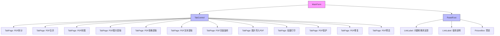
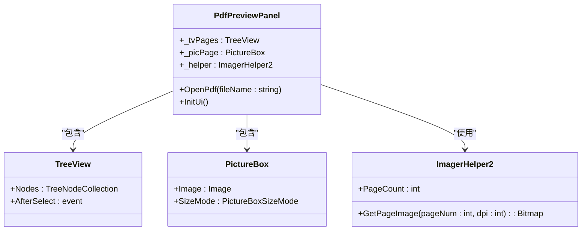
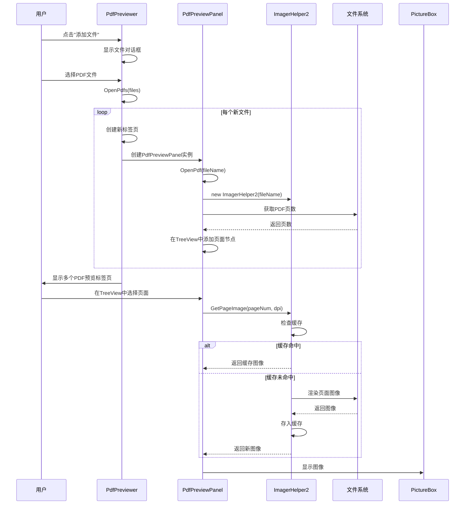

# 用户界面组件

<cite>
**本文档中引用的文件**  
- [MainForm.cs](file://PdfTool/MainForm.cs)
- [PdfPreviewPanel.cs](file://PdfTool/PdfPreviewPanel.cs)
- [PdfPreviewPanel.Designer.cs](file://PdfTool/PdfPreviewPanel.Designer.cs)
- [PdfPreviewer.cs](file://PdfTool/PdfPreviewer.cs)
- [PdfPreviewer.Designer.cs](file://PdfTool/PdfPreviewer.Designer.cs)
- [Config.cs](file://PdfTool/Config.cs)
- [Common.cs](file://PdfTool/Common.cs)
- [ImagerHelper.cs](file://PdfHelperLibrary/ImagerHelper.cs)
</cite>

## 目录
1. [简介](#简介)
2. [主窗口布局结构](#主窗口布局结构)
3. [PdfPreviewPanel控件实现机制](#pdfpreviewpanel控件实现机制)
4. [PdfPreviewer模块协调机制](#pdfpreviewer模块协调机制)
5. [自定义建议](#自定义建议)
6. [无障碍访问与高DPI适配](#无障碍访问与高dpi适配)
7. [组件复用示例](#组件复用示例)

## 简介
本项目是一个功能丰富的PDF处理工具集，提供多种PDF操作功能，包括拆分、合并、转图、提取等。其用户界面基于Windows Forms构建，采用模块化设计，通过多标签页组织不同功能模块。核心UI组件包括主窗口（MainForm）、PDF预览器（PdfPreviewer）和PDF预览面板（PdfPreviewPanel），这些组件共同实现了直观的文件操作和预览体验。

## 主窗口布局结构

主窗口采用标准的Windows应用程序布局，包含多标签页导航、拖拽区域和状态栏等关键UI元素。窗口通过代码动态构建UI，而非使用可视化设计器。



**图示来源**  
- [MainForm.cs](file://PdfTool/MainForm.cs#L128-L148)

**本节来源**  
- [MainForm.cs](file://PdfTool/MainForm.cs#L79-L148)

### 多标签页导航
主窗口使用TabControl组件实现多标签页导航，每个标签页对应一个PDF处理功能模块。标签页包括"PDF拆分"、"PDF合并"、"PDF转图"等共12个功能模块。每个标签页的内容区域动态加载相应的功能控件，如PdfSplitter、PdfMerger等。

### 拖拽区域
主窗口启用了拖拽功能，用户可以将PDF文件直接拖拽到窗口中进行处理。窗口通过处理DragEnter和DragDrop事件来实现此功能。当检测到文件拖拽进入时，设置拖拽效果为复制（DragDropEffects.Copy）；当文件被释放时，提取文件列表并根据当前选中的标签页类型分发处理。

### 状态栏
窗口底部设有状态栏（PanelFoot），包含三个主要元素：两个链接标签（"问题和需求反馈"和"使用说明"）和一个赞赏图标。链接标签点击后会打开相应的网页，赞赏图标点击后会跳转到赞赏页面。状态栏使用Anchor布局，确保在窗口大小改变时保持在底部右侧位置。

## PdfPreviewPanel控件实现机制

PdfPreviewPanel是PDF预览的核心控件，负责单个PDF文档的页面导航和渲染显示。



**图示来源**  
- [PdfPreviewPanel.cs](file://PdfTool/PdfPreviewPanel.cs#L8-L74)
- [ImagerHelper.cs](file://PdfHelperLibrary/ImagerHelper.cs#L129-L168)

**本节来源**  
- [PdfPreviewPanel.cs](file://PdfTool/PdfPreviewPanel.cs#L8-L74)

### 渲染PDF页面
PdfPreviewPanel使用PdfHelperLibrary中的ImagerHelper2类来渲染PDF页面。当调用OpenPdf方法时，首先获取PDF文档的页数，并在左侧的TreeView中创建相应数量的节点。然后创建ImagerHelper2实例用于后续的页面图像生成。

### 支持缩放与滚动
控件通过PictureBox的SizeMode属性设置为PictureBoxSizeMode.Zoom来实现自动缩放功能，确保整个页面在可视区域内完整显示。滚动功能由PictureBox的父容器自动提供，当页面图像大于显示区域时，会出现滚动条。

### 响应鼠标事件
控件主要通过TreeView的AfterSelect事件来响应用户交互。当用户在页面列表中选择不同页面时，触发TvPages_AfterSelect事件处理程序，该程序会计算选中页面的页码（减1以适应0基索引），然后调用ImagerHelper2的GetPageImage方法获取对应页面的图像并显示在PictureBox中。

## PdfPreviewer模块协调机制

PdfPreviewer模块负责管理多个PDF文档的预览，协调文档加载、页面缓存和UI更新。



**图示来源**  
- [PdfPreviewer.cs](file://PdfTool/PdfPreviewer.cs#L13-L74)
- [PdfPreviewPanel.cs](file://PdfTool/PdfPreviewPanel.cs#L26-L49)
- [ImagerHelper.cs](file://PdfHelperLibrary/ImagerHelper.cs#L149-L156)

**本节来源**  
- [PdfPreviewer.cs](file://PdfTool/PdfPreviewer.cs#L13-L74)
- [Common.cs](file://PdfTool/Common.cs#L13-L17)

### 文档加载
PdfPreviewer通过OpenPdfs方法加载PDF文档。该方法接收文件路径列表，过滤掉已加载的文件，然后为每个新文件创建一个PdfPreviewPanel实例和对应的标签页。标签页的Text属性显示文件名，ToolTipText属性显示完整路径，便于用户识别。

### 页面缓存
页面缓存机制由ImagerHelper2类实现。该类内部维护一个Dictionary<string, Bitmap>类型的缓存字典，使用"页码_dpi"作为键来存储已渲染的页面图像。当请求特定页面和分辨率的图像时，首先检查缓存中是否存在，如果存在则直接返回，否则渲染新图像并存入缓存。

### UI更新
UI更新是自动触发的。当用户通过拖拽或点击"添加文件"按钮添加PDF文件时，PdfPreviewer会自动创建新的标签页并加载预览面板。页面切换通过TreeView的事件机制自动更新PictureBox的显示内容，无需手动调用UI更新方法。

## 自定义建议

### 修改主题颜色
要修改应用程序的主题颜色，可以通过以下方式实现：

1. **状态栏元素颜色**：修改MainForm中创建的LinkLabel控件的ActiveLinkColor、LinkColor等属性
2. **按钮颜色**：在PdfPreviewer的InitUi方法中，可以为"添加文件"按钮设置BackColor和ForeColor属性
3. **整体主题**：考虑使用第三方主题库或自定义绘制控件来实现更完整的主题支持

**本节来源**  
- [MainForm.cs](file://PdfTool/MainForm.cs#L94-L112)
- [PdfPreviewer.cs](file://PdfTool/PdfPreviewer.cs#L57-L63)

### 调整预览分辨率
当前预览分辨率在PdfPreviewPanel中硬编码为100 DPI。要调整预览分辨率，可以：

1. **修改默认DPI值**：在PdfPreviewPanel的TvPages_AfterSelect方法中，将GetPageImage的第二个参数从100改为其他值
2. **添加DPI选择控件**：在PdfPreviewer中添加一个下拉框或数值输入控件，让用户选择预览分辨率
3. **配置文件支持**：将默认DPI值移到Config类中作为常量，便于统一管理

**本节来源**  
- [PdfPreviewPanel.cs](file://PdfTool/PdfPreviewPanel.cs#L48)
- [Config.cs](file://PdfTool/Config.cs#L5-L6)

## 无障碍访问与高DPI适配

### 无障碍访问考虑
项目在无障碍访问方面有以下特点：

1. **键盘导航**：Windows Forms原生支持Tab键导航，用户可以通过Tab键在界面元素间移动
2. **屏幕阅读器兼容**：使用标准的Windows Forms控件，与主流屏幕阅读器兼容
3. **链接标签**：使用LinkLabel控件而非普通标签，提供更好的语义化信息

然而，项目缺少一些重要的无障碍特性：
- 未设置控件的AccessibleName和AccessibleDescription属性
- 缺少键盘快捷键支持
- 拖拽功能对键盘用户不友好

**本节来源**  
- [MainForm.cs](file://PdfTool/MainForm.cs#L94-L112)
- [PdfPreviewer.cs](file://PdfTool/PdfPreviewer.cs#L57-L63)

### 高DPI适配情况
项目通过以下方式处理高DPI显示：

1. **启用视觉样式**：在Program.cs中调用Application.EnableVisualStyles()，确保使用现代Windows视觉样式
2. **字体自适应**：在所有设计器文件中设置AutoScaleMode为Font，使控件随系统字体缩放
3. **锚定布局**：使用Anchor和Dock属性进行相对布局，适应不同分辨率

但项目存在以下高DPI适配问题：
- 图像资源（如赞赏图标）可能在高DPI下显示模糊
- 未使用DPI感知的API进行精确缩放计算
- 动态创建的控件未明确设置DPI感知属性

**本节来源**  
- [Program.cs](file://PdfTool/Program.cs#L17-L19)
- [MainForm.Designer.cs](file://PdfTool/MainForm.Designer.cs#L32)
- [PdfPreviewer.Designer.cs](file://PdfTool/PdfPreviewer.Designer.cs#L32)

## 组件复用示例

要在其他项目中复用这些UI组件，可以按照以下步骤操作：

1. **引用必要组件**：将PdfPreviewer和PdfPreviewPanel类复制到新项目中
2. **确保依赖项**：确保项目引用了PdfHelperLibrary及其依赖的PDF渲染库
3. **集成到主窗体**：在主窗体中创建PdfPreviewer实例并添加到控件集合

```csharp
// 在其他项目中复用PdfPreviewer的示例代码
var pdfPreviewer = new PdfPreviewer();
pdfPreviewer.Dock = DockStyle.Fill;
this.Controls.Add(pdfPreviewer);

// 通过IPdfHandler接口调用功能
if (pdfPreviewer is IPdfHandler handler)
{
    handler.OpenPdfs(new List<string> { "example.pdf" });
}
```

**本节来源**  
- [PdfPreviewer.cs](file://PdfTool/PdfPreviewer.cs#L13)
- [Common.cs](file://PdfTool/Common.cs#L13-L17)
- [MainForm.cs](file://PdfTool/MainForm.cs#L163)