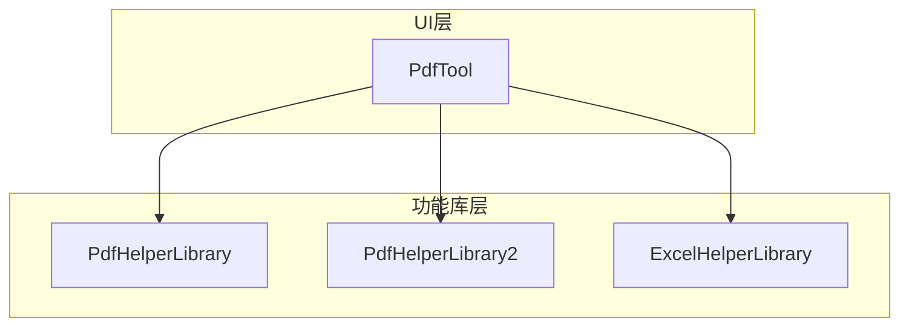
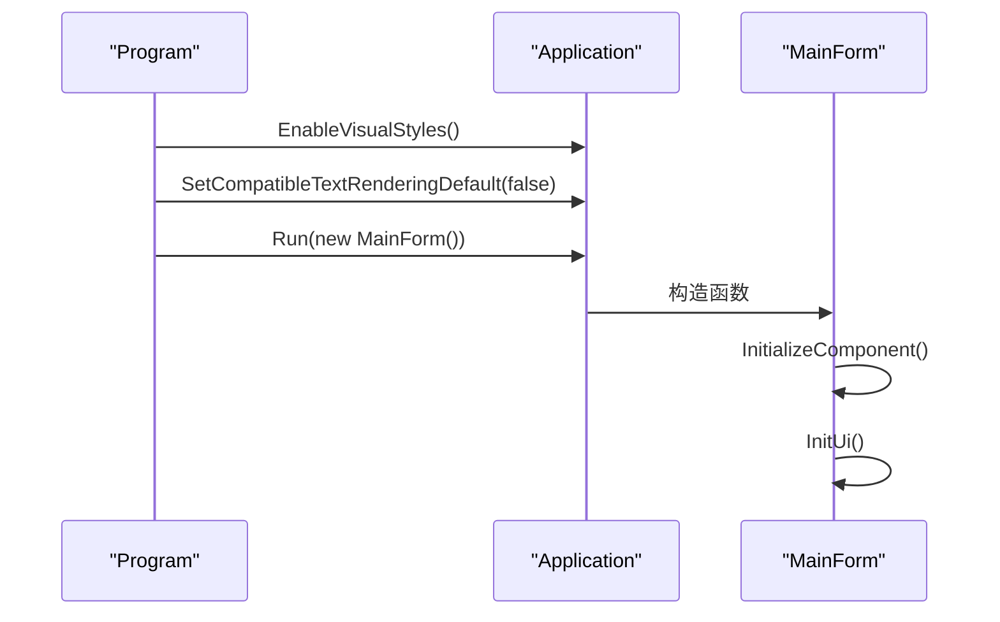
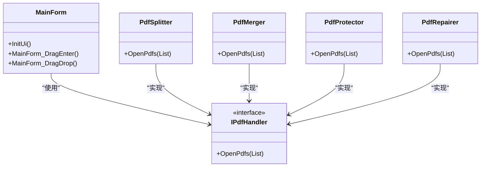

# 项目概述

<cite>
**本文档引用的文件**  
- [Program.cs](file://PdfTool/Program.cs)
- [MainForm.cs](file://PdfTool/MainForm.cs)
- [PdfTool.csproj](file://PdfTool/PdfTool.csproj)
- [Common.cs](file://PdfTool/Common.cs)
- [Config.cs](file://PdfTool/Config.cs)
- [PdfSplitter.cs](file://PdfTool/PdfSplitter.cs)
- [PdfMerger.cs](file://PdfTool/PdfMerger.cs)
- [PdfProtector.cs](file://PdfTool/PdfProtector.cs)
- [PdfRepairer.cs](file://PdfTool/PdfRepairer.cs)
- [PdfHelperLibrary.csproj](file://PdfHelperLibrary/PdfHelperLibrary.csproj)
- [PdfHelperLibrary2.csproj](file://PdfHelperLibrary2/PdfHelperLibrary2.csproj)
- [ExcelHelperLibrary.csproj](file://ExcelHelperLibrary/ExcelHelperLibrary.csproj)
</cite>

## 目录
1. [项目简介](#项目简介)
2. [核心功能集](#核心功能集)
3. [目标用户群体](#目标用户群体)
4. [技术架构与依赖关系](#技术架构与依赖关系)
5. [主入口点与初始化流程](#主入口点与初始化流程)
6. [主窗体与界面构建](#主窗体与界面构建)
7. [系统整体视图](#系统整体视图)

## 项目简介

PdfTool 是一个功能丰富的桌面级PDF处理工具，旨在为用户提供一站式PDF文档管理解决方案。该项目采用Windows Forms技术栈开发，提供直观的图形用户界面，支持多种常见的PDF操作功能。通过集成多个功能库，PdfTool实现了对PDF文档的全面处理能力，包括拆分、合并、转换、内容提取、保护、压缩和修复等核心功能。项目设计注重用户体验，支持文件拖拽操作，并提供了清晰的日志输出和操作反馈。

**Section sources**
- [MainForm.cs](file://PdfTool/MainForm.cs#L1-L194)

## 核心功能集

PdfTool 提供了全面的PDF处理功能，主要包含以下核心模块：

- **PDF拆分**：支持按指定页数拆分PDF文档，也可提取指定页码范围的内容或删除特定页面
- **PDF合并**：将多个PDF文件合并为单个文档，支持自动添加书签以标识原始文件
- **PDF转图**：将PDF页面转换为图像文件（如PNG、JPG等格式）
- **内容提取**：支持提取PDF中的文本、表格和图片内容
- **PDF保护**：为PDF文档添加密码保护，限制打印、复制和修改权限，同时也支持解除保护
- **PDF压缩**：减小PDF文件体积，优化存储和传输效率
- **PDF修复**：修复损坏或无法正常打开的PDF文件
- **批量打印**：支持对多个PDF文件进行批量打印操作
- **页面旋转**：调整PDF页面的显示方向
- **图片导入**：将图片文件导入并转换为PDF文档

这些功能通过标签页形式组织在主界面中，用户可以方便地在不同功能模块间切换使用。

**Section sources**
- [MainForm.cs](file://PdfTool/MainForm.cs#L136-L149)
- [PdfSplitter.cs](file://PdfTool/PdfSplitter.cs#L42-L105)
- [PdfMerger.cs](file://PdfTool/PdfMerger.cs#L59-L71)
- [PdfProtector.cs](file://PdfTool/PdfProtector.cs#L52-L84)

## 目标用户群体

PdfTool 主要面向以下三类用户群体：

- **办公人员**：日常需要处理大量PDF文档的行政、财务、人事等岗位人员，可用于合同、报表、发票等文档的整理和归档
- **文档管理员**：负责企业文档管理系统的技术人员，可用于批量处理、格式转换和文档安全保护
- **普通用户**：需要对个人PDF文件进行简单编辑和管理的非专业用户，操作界面直观易用，无需专业知识即可上手

项目设计充分考虑了不同用户的需求，提供了简洁明了的操作界面和清晰的功能划分，确保各类用户都能快速掌握使用方法。

## 技术架构与依赖关系

PdfTool 项目采用分层架构设计，将用户界面与核心功能实现分离。项目主要依赖于以下几个功能库：

- **PdfHelperLibrary**：核心PDF处理库，提供PDF拆分、合并、提取、保护等基本功能
- **PdfHelperLibrary2**：扩展PDF处理库，提供PDF修复等高级功能
- **ExcelHelperLibrary**：辅助功能库，用于处理与Excel相关的操作

项目采用Windows Forms作为UI框架，充分利用了.NET Framework 4.7.2的特性。通过Fody和Costura等工具，实现了程序集的自动打包和资源嵌入，使最终生成的可执行文件更加独立和便携。

**Diagram sources**
- [PdfTool.csproj](file://PdfTool/PdfTool.csproj#L179-L190)
- [PdfHelperLibrary.csproj](file://PdfHelperLibrary/PdfHelperLibrary.csproj#L1-L27)
- [PdfHelperLibrary2.csproj](file://PdfHelperLibrary2/PdfHelperLibrary2.csproj#L1-L27)
- [ExcelHelperLibrary.csproj](file://ExcelHelperLibrary/ExcelHelperLibrary.csproj#L1-L27)

**Section sources**
- [PdfTool.csproj](file://PdfTool/PdfTool.csproj#L179-L190)

## 主入口点与初始化流程

项目的主入口点位于Program.cs文件中，遵循标准的Windows Forms应用程序模式。Main方法使用[STAThread]属性标记，确保UI线程的正确初始化。应用程序首先启用视觉样式，设置文本渲染默认值，然后创建并运行主窗体实例。

**Diagram sources**
- [Program.cs](file://PdfTool/Program.cs#L1-L23)
- [MainForm.cs](file://PdfTool/MainForm.cs#L15-L23)

**Section sources**
- [Program.cs](file://PdfTool/Program.cs#L1-L23)

## 主窗体与界面构建

主窗体MainForm是应用程序的核心界面组件，继承自System.Windows.Forms.Form。窗体的初始化过程分为两个关键步骤：InitializeComponent()由设计器生成，负责创建和配置所有UI控件；InitUi()方法由开发者编写，负责动态构建界面布局和设置窗体属性。

InitUi()方法执行了以下关键操作：
- 设置窗体基本属性（大小、位置、图标、标题）
- 创建底部状态栏，包含反馈链接和赞赏按钮
- 动态创建TabControl并添加各个功能模块的标签页
- 为每个标签页加载相应的用户控件（如PdfSplitter、PdfMerger等）
- 设置拖拽文件支持，允许用户直接将PDF文件拖入应用程序

特别地，IPdfHandler接口的定义使得所有功能模块都实现了统一的OpenPdfs方法，从而实现了拖拽文件的统一处理逻辑。

**Diagram sources**
- [MainForm.cs](file://PdfTool/MainForm.cs#L15-L194)
- [Common.cs](file://PdfTool/Common.cs#L13-L17)
- [PdfSplitter.cs](file://PdfTool/PdfSplitter.cs#L12-L13)
- [PdfMerger.cs](file://PdfTool/PdfMerger.cs#L12-L13)
- [PdfProtector.cs](file://PdfTool/PdfProtector.cs#L14-L15)
- [PdfRepairer.cs](file://PdfTool/PdfRepairer.cs#L13-L14)

**Section sources**
- [MainForm.cs](file://PdfTool/MainForm.cs#L79-L194)
- [Common.cs](file://PdfTool/Common.cs#L13-L17)

## 系统整体视图

PdfTool项目采用模块化设计，将不同的PDF处理功能封装为独立的用户控件，通过主窗体统一管理和展示。这种设计模式提高了代码的可维护性和可扩展性，新功能的添加只需实现相应的用户控件并注册到主界面即可。

项目的技术生态以.NET Framework为基础，结合Windows Forms UI框架和多个专用功能库，构建了一个稳定高效的PDF处理平台。通过ProjectReference方式引用功能库，确保了版本控制和依赖管理的可靠性。同时，项目还利用了Fody等编译时织入工具，优化了程序集的打包和部署。

对于初学者而言，系统提供了直观的操作界面和清晰的功能划分；对于开发者而言，项目的分层架构和模块化设计使得代码理解和二次开发变得更加容易。整体而言，PdfTool不仅是一个实用的工具软件，也是一个良好的.NET桌面应用程序开发范例。