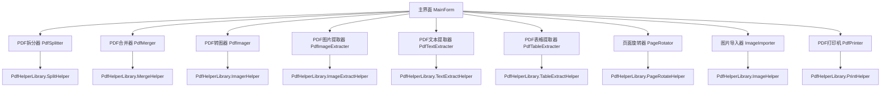
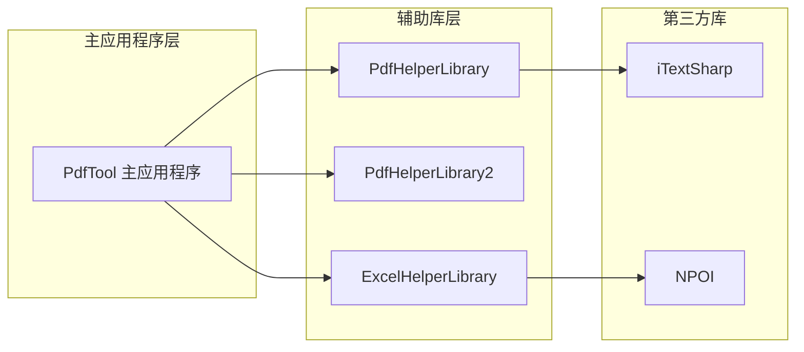
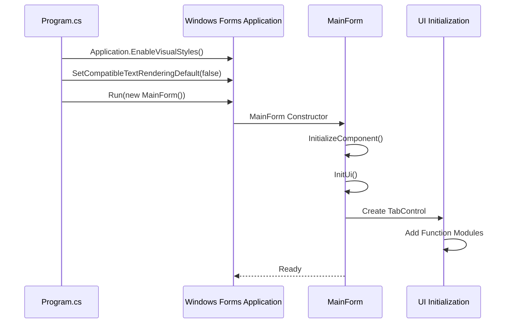

# 项目概述

<cite>
**本文档引用文件**  
- [Program.cs](file://PdfTool/Program.cs)
- [MainForm.cs](file://PdfTool/MainForm.cs)
- [Config.cs](file://PdfTool/Config.cs)
- [PdfTool.csproj](file://PdfTool/PdfTool.csproj)
- [Common.cs](file://PdfTool/Common.cs)
- [PdfSplitter.cs](file://PdfTool/PdfSplitter.cs)
- [PdfMerger.cs](file://PdfTool/PdfMerger.cs)
- [PdfImager.cs](file://PdfTool/PdfImager.cs)
- [PdfImageExtracter.cs](file://PdfTool/PdfImageExtracter.cs)
- [PdfTextExtracter.cs](file://PdfTool/PdfTextExtracter.cs)
- [PdfTableExtracter.cs](file://PdfTool/PdfTableExtracter.cs)
- [PageRotator.cs](file://PdfTool/PageRotator.cs)
- [ImageImporter.cs](file://PdfTool/ImageImporter.cs)
- [PdfPrinter.cs](file://PdfTool/PdfPrinter.cs)
- [PdfHelperLibrary.csproj](file://PdfHelperLibrary/PdfHelperLibrary.csproj)
- [ExcelHelperLibrary.csproj](file://ExcelHelperLibrary/ExcelHelperLibrary.csproj)
</cite>

## 目录
1. [项目定位与设计初衷](#项目定位与设计初衷)
2. [主要功能模块](#主要功能模块)
3. [目标用户与应用场景](#目标用户与应用场景)
4. [系统架构与技术栈](#系统架构与技术栈)
5. [程序启动流程](#程序启动流程)
6. [全局配置管理](#全局配置管理)
7. [学习路径指引](#学习路径指引)

## 项目定位与设计初衷

PdfTool项目是一款专为办公自动化场景设计的多功能PDF处理桌面应用程序。项目的设计初衷是为行政人员、财务人员和文档管理员等非技术用户群体提供一个集成化、易用且功能强大的PDF处理工具集，解决日常工作中频繁遇到的PDF文件处理需求。

该工具旨在替代多个独立的PDF处理软件，通过一个统一的界面集成常见的PDF操作功能，如拆分、合并、转换、提取等，从而提高工作效率，减少在不同工具间切换的成本。项目采用简洁直观的用户界面设计，支持文件拖拽操作，降低了用户的学习门槛。

**Section sources**
- [MainForm.cs](file://PdfTool/MainForm.cs#L1-L194)
- [PdfTool.csproj](file://PdfTool/PdfTool.csproj#L1-L204)

## 主要功能模块

PdfTool集成了多个核心功能模块，每个模块对应一个独立的处理任务，通过标签页形式组织在主界面中：

- **PDF拆分**：支持按页数拆分、指定页码范围提取、删除指定页码等功能
- **PDF合并**：将多个PDF文件合并为一个文档，支持自动添加书签
- **PDF转图**：将PDF页面转换为PNG、JPG或BMP格式的图片，可自定义DPI和输出范围
- **PDF图片提取**：从PDF文件中提取所有嵌入的图片资源
- **PDF文本提取**：提取PDF文档中的文本内容，保留基本的文本结构
- **PDF表格提取**：识别并提取PDF中的表格数据，自动导出为Excel文件
- **PDF页面旋转**：对PDF页面进行90°、180°或270°旋转，支持批量操作
- **图片导入PDF**：将BMP、JPG、TIF、PNG等格式的图片导入并生成PDF文件
- **批量打印**：将PDF文件发送到默认打印机进行批量打印
- **PDF保护**：为PDF文件添加密码保护和权限控制
- **PDF修复**：修复损坏的PDF文件
- **PDF预览**：提供PDF文件的可视化预览功能

这些功能模块均实现了`IPdfHandler`接口，确保了统一的文件处理接口规范。

**Diagram sources**
- [MainForm.cs](file://PdfTool/MainForm.cs#L128-L163)
- [PdfSplitter.cs](file://PdfTool/PdfSplitter.cs#L12-L229)
- [PdfMerger.cs](file://PdfTool/PdfMerger.cs#L12-L153)

**Section sources**
- [PdfSplitter.cs](file://PdfTool/PdfSplitter.cs#L1-L230)
- [PdfMerger.cs](file://PdfTool/PdfMerger.cs#L1-L154)
- [PdfImager.cs](file://PdfTool/PdfImager.cs#L1-L218)
- [PdfImageExtracter.cs](file://PdfTool/PdfImageExtracter.cs#L1-L119)
- [PdfTextExtracter.cs](file://PdfTool/PdfTextExtracter.cs#L1-L119)
- [PdfTableExtracter.cs](file://PdfTool/PdfTableExtracter.cs#L1-L130)
- [PageRotator.cs](file://PdfTool/PageRotator.cs#L1-L213)
- [ImageImporter.cs](file://PdfTool/ImageImporter.cs#L1-L129)
- [PdfPrinter.cs](file://PdfTool/PdfPrinter.cs#L1-L110)

## 目标用户与应用场景

PdfTool的目标用户主要包括：

- **行政人员**：处理日常办公文档，如合并多个合同文件、拆分大型报告、提取会议纪要中的文本内容等
- **财务人员**：处理发票、报表等财务文档，如提取发票中的表格数据、将扫描的财务凭证转换为图片格式等
- **文档管理员**：负责文档归档和管理，如批量打印文档、为敏感文档添加密码保护、修复损坏的存档文件等

典型应用场景包括：
- 将扫描的多页发票合并为一个PDF文件
- 从年度财务报告中提取特定页码的表格数据并导出为Excel
- 将产品手册拆分为单个章节的独立文件
- 批量将图像素材转换为PDF格式进行归档
- 旋转方向错误的PDF页面以统一文档方向
- 提取合同文档中的关键条款文本进行分析

**Section sources**
- [MainForm.cs](file://PdfTool/MainForm.cs#L27-L30)

## 系统架构与技术栈

PdfTool采用典型的WinForms桌面应用程序架构，遵循分层设计模式。系统整体架构由主应用程序层和多个辅助库层组成：

- **主应用程序层 (PdfTool)**：负责用户界面展示、用户交互处理和业务流程控制
- **辅助库层 (PdfHelperLibrary系列)**：提供底层PDF处理功能的实现
- **依赖管理**：通过NuGet包管理器集成第三方依赖

主应用程序PdfTool通过项目引用方式集成`PdfHelperLibrary`、`PdfHelperLibrary2`和`ExcelHelperLibrary`等底层库，实现了功能扩展。这种分层架构使得界面逻辑与业务逻辑分离，提高了代码的可维护性和可扩展性。

**Diagram sources**
- [PdfTool.csproj](file://PdfTool/PdfTool.csproj#L179-L190)
- [PdfHelperLibrary.csproj](file://PdfHelperLibrary/PdfHelperLibrary.csproj)
- [ExcelHelperLibrary.csproj](file://ExcelHelperLibrary/ExcelHelperLibrary.csproj)

**Section sources**
- [PdfTool.csproj](file://PdfTool/PdfTool.csproj#L1-L204)

## 程序启动流程

PdfTool的程序启动流程遵循标准的WinForms应用程序模式，从`Program.cs`文件的`Main`方法开始：

1. 调用`Application.EnableVisualStyles()`启用视觉样式
2. 调用`Application.SetCompatibleTextRenderingDefault(false)`设置文本渲染模式
3. 创建`MainForm`实例并通过`Application.Run()`启动主窗体

主窗体`MainForm`在构造函数中完成初始化，包括：
- 调用`InitializeComponent()`加载设计器生成的UI组件
- 调用`InitUi()`方法进行动态UI构建
- 设置窗体的基本属性（大小、标题、图标等）
- 创建并配置标签页控件，为每个功能模块创建对应的用户控件实例

这种启动流程确保了应用程序的稳定性和可预测性。

**Diagram sources**
- [Program.cs](file://PdfTool/Program.cs#L1-L23)
- [MainForm.cs](file://PdfTool/MainForm.cs#L15-L23)

**Section sources**
- [Program.cs](file://PdfTool/Program.cs#L1-L23)
- [MainForm.cs](file://PdfTool/MainForm.cs#L1-L194)

## 全局配置管理

PdfTool通过静态类`Config`实现全局配置管理，为整个应用程序提供统一的配置常量。当前实现的配置项包括：

- `ControlMargin`：控件边距，值为20像素
- `ControlPadding`：控件内边距，值为12像素

这些配置常量在各个功能模块的UI构建过程中被广泛引用，确保了界面元素布局的一致性。通过集中管理这些UI相关的配置值，当需要调整界面布局时，只需修改`Config`类中的常量值即可全局生效，无需在多个文件中逐一修改。

这种配置管理方式简单有效，适用于小型到中型应用程序的配置需求。

**Section sources**
- [Config.cs](file://PdfTool/Config.cs#L1-L9)

## 学习路径指引

对于初学者，建议按照以下路径学习和使用PdfTool：

1. **了解基本架构**：首先理解WinForms应用程序的基本结构，熟悉`Program.cs`和`MainForm.cs`的作用
2. **掌握核心接口**：学习`IPdfHandler`接口的定义和实现方式，理解各功能模块的统一接口规范
3. **分析功能模块**：选择一个简单的功能模块（如`PdfPrinter`）进行深入分析，理解其UI构建、事件处理和业务逻辑
4. **探索辅助库**：研究`PdfHelperLibrary`中的具体实现，了解如何使用底层库进行PDF处理
5. **实践扩展开发**：尝试添加新的功能模块，实践分层架构的扩展方式

对于高级用户，可以重点关注：
- 各`Helper`类的实现细节和异常处理机制
- 背景工作线程（BackgroundWorker）在长时间操作中的应用
- 项目间的依赖关系和版本管理
- UI动态构建模式与传统设计器模式的对比

**Section sources**
- [Common.cs](file://PdfTool/Common.cs#L13-L17)
- [MainForm.cs](file://PdfTool/MainForm.cs#L79-L190)
- [PdfSplitter.cs](file://PdfTool/PdfSplitter.cs#L109-L227)