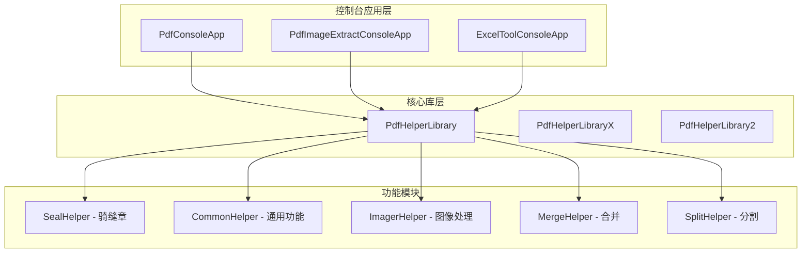
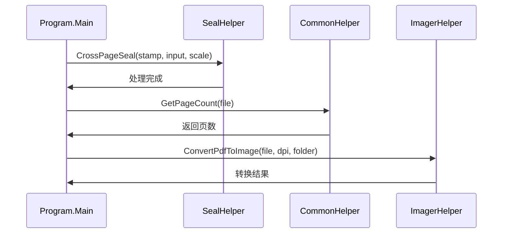
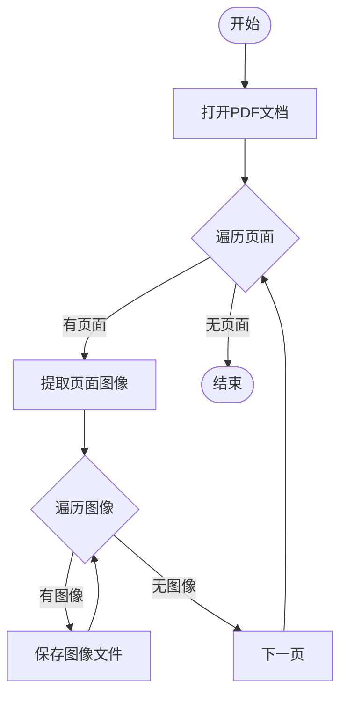
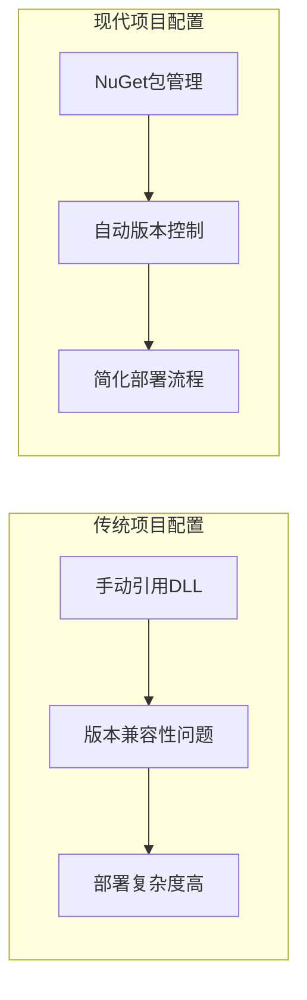
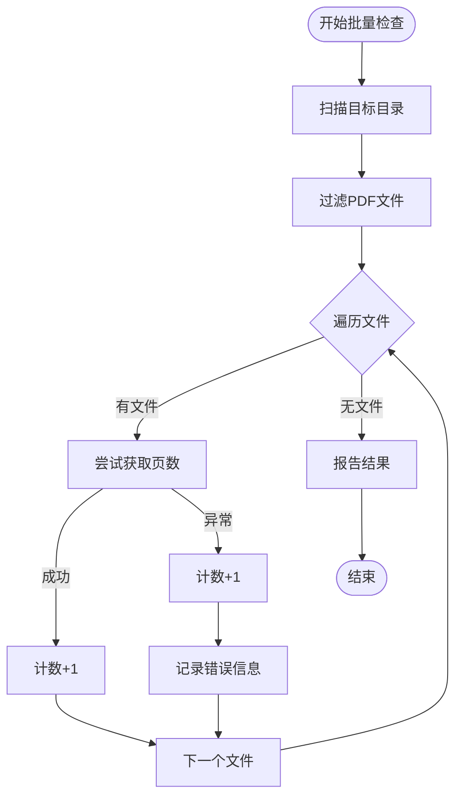
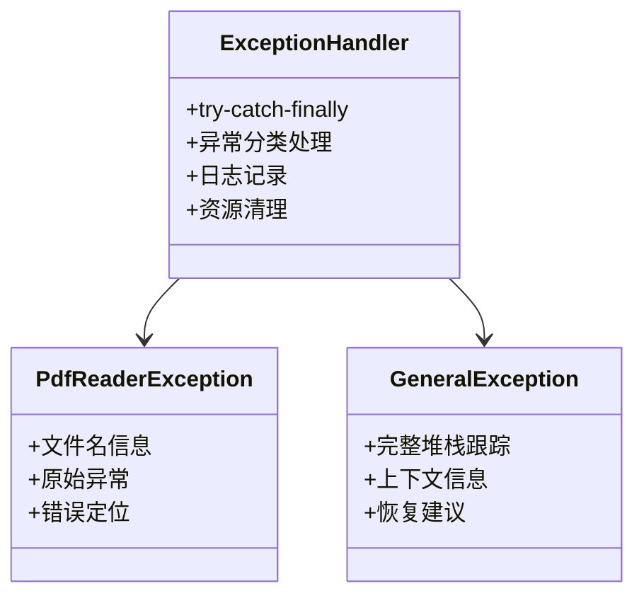
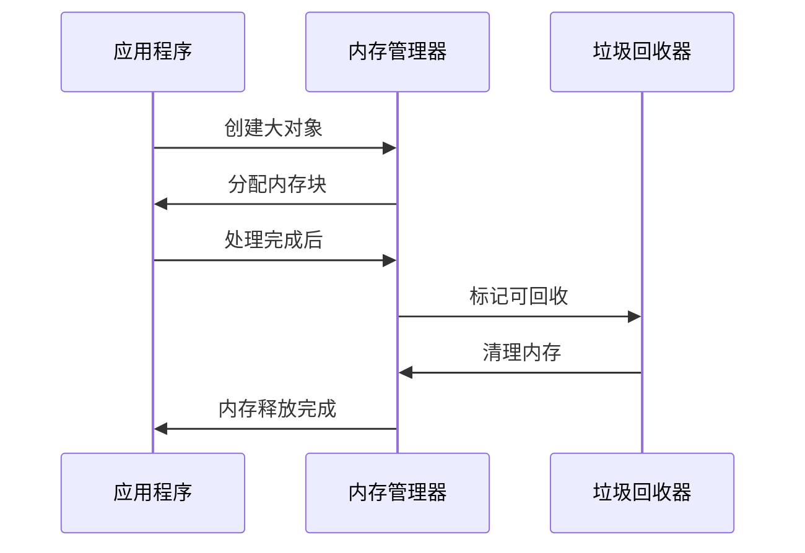
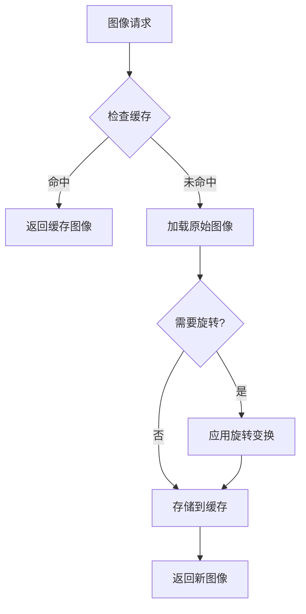
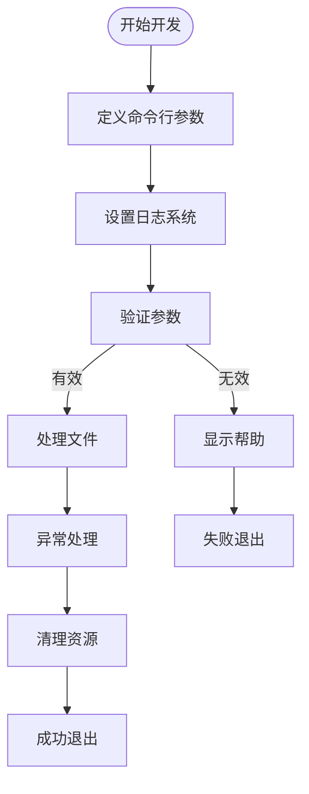
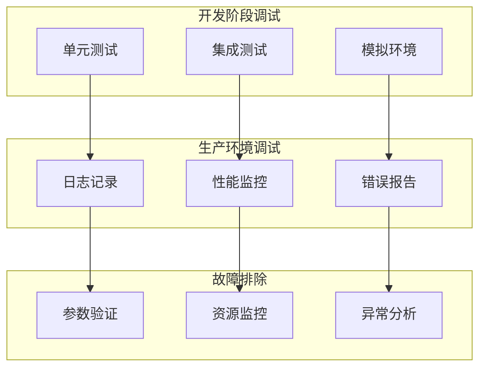

# 命令行工具集成

<cite>
**本文档中引用的文件**
- [PdfConsoleApp/Program.cs](file://PdfConsoleApp/Program.cs)
- [PdfImageExtractConsoleApp/Program.cs](file://PdfImageExtractConsoleApp/Program.cs)
- [ExcelToolConsoleApp/Program.cs](file://ExcelToolConsoleApp/Program.cs)
- [PdfConsoleApp/PdfConsoleApp.csproj](file://PdfConsoleApp/PdfConsoleApp.csproj)
- [PdfImageExtractConsoleApp/PdfImageExtractConsoleApp.csproj](file://PdfImageExtractConsoleApp/PdfImageExtractConsoleApp.csproj)
- [PdfHelperLibrary/SealHelper.cs](file://PdfHelperLibrary/SealHelper.cs)
- [PdfHelperLibrary/CommonHelper.cs](file://PdfHelperLibrary/CommonHelper.cs)
- [PdfHelperLibrary/ImagerHelper.cs](file://PdfHelperLibrary/ImagerHelper.cs)
- [PdfHelperLibraryX/PdfHelperLibraryX.csproj](file://PdfHelperLibraryX/PdfHelperLibraryX.csproj)
- [PdfHelperLibraryX3/PdfHelperLibraryX3.csproj](file://PdfHelperLibraryX3/PdfHelperLibraryX3.csproj)
</cite>

## 目录
1. [简介](#简介)
2. [项目结构概览](#项目结构概览)
3. [核心控制台应用分析](#核心控制台应用分析)
4. [PdfHelperLibrary核心组件](#pdfhelperlibrary核心组件)
5. [命令行参数设计](#命令行参数设计)
6. [批量处理与自动化](#批量处理与自动化)
7. [异常处理与日志记录](#异常处理与日志记录)
8. [性能优化策略](#性能优化策略)
9. [新控制台工具开发指南](#新控制台工具开发指南)
10. [最佳实践与调试策略](#最佳实践与调试策略)
11. [总结](#总结)

## 简介

本文档深入解析了PDF工具库中的命令行控制台应用设计与使用方法，重点分析了PdfConsoleApp和PdfImageExtractConsoleApp两个核心工具。这些工具通过静态调用PdfHelperLibrary中的Helper类（如SealHelper、CommonHelper、ImagerHelper）实现了无界面的批处理功能，为开发者提供了强大的PDF处理自动化解决方案。

## 项目结构概览

PDF工具库采用模块化架构设计，主要包含以下核心组件：



**图表来源**
- [PdfConsoleApp/Program.cs](file://PdfConsoleApp/Program.cs#L1-L88)
- [PdfImageExtractConsoleApp/Program.cs](file://PdfImageExtractConsoleApp/Program.cs#L1-L110)
- [PdfHelperLibrary/SealHelper.cs](file://PdfHelperLibrary/SealHelper.cs#L1-L101)

## 核心控制台应用分析

### PdfConsoleApp设计模式

PdfConsoleApp采用了简洁而高效的静态调用模式，直接通过命名空间访问PdfHelperLibrary中的Helper类：



**图表来源**
- [PdfConsoleApp/Program.cs](file://PdfConsoleApp/Program.cs#L12-L88)

### PdfImageExtractConsoleApp架构

该应用展示了传统的PDF图像提取实现方式，使用Aspose.PDF和iTextSharp库进行底层操作：



**图表来源**
- [PdfImageExtractConsoleApp/Program.cs](file://PdfImageExtractConsoleApp/Program.cs#L25-L54)

**章节来源**
- [PdfConsoleApp/Program.cs](file://PdfConsoleApp/Program.cs#L1-L88)
- [PdfImageExtractConsoleApp/Program.cs](file://PdfImageExtractConsoleApp/Program.cs#L1-L110)

## PdfHelperLibrary核心组件

### SealHelper - 骑缝章功能

SealHelper提供了专业的PDF骑缝章添加功能，支持动态缩放和精确位置控制：

| 方法名称 | 参数 | 功能描述 | 默认行为 |
|---------|------|----------|----------|
| CrossPageSeal | sealImgFileName, intputPdfFileName, scale | 添加骑缝章到多页PDF | scale默认为1.0 |
| ScaleImage | Image, double | 缩放图像以适应页面分割 | 使用高质量插值算法 |
| CropImage | Bitmap, int, int, int, int | 裁剪图像为指定尺寸 | 支持任意矩形裁剪 |
| DrawSealOnPage | PdfPage, XImage | 在页面上绘制印章 | 自动计算居中位置 |

### CommonHelper - 通用功能

提供基础的PDF文档信息查询功能：

| 方法名称 | 输入参数 | 返回类型 | 异常处理 |
|---------|----------|----------|----------|
| GetPageCount | string inputPdfFileName | int | 抛出PdfReaderException或通用Exception |

### ImagerHelper - 图像处理

ImagerHelper提供了丰富的PDF转图像功能，支持多种输出格式和精度控制：

| 方法重载 | DPI设置 | 输出格式 | 页面范围 | 事件回调 |
|---------|---------|----------|----------|----------|
| ConvertPdfToImage | 固定600 | PNG/JPEG/BMP/GIF/TIFF | 全部页面 | 可选 |
| ConvertPdfToImage | 可配置 | 支持扩展名映射 | 指定页码列表 | 必需 |
| ConvertPdfToImage | 固定300 | PNG | 单页 | 无 |

**章节来源**
- [PdfHelperLibrary/SealHelper.cs](file://PdfHelperLibrary/SealHelper.cs#L1-L101)
- [PdfHelperLibrary/CommonHelper.cs](file://PdfHelperLibrary/CommonHelper.cs#L1-L29)
- [PdfHelperLibrary/ImagerHelper.cs](file://PdfHelperLibrary/ImagerHelper.cs#L1-L192)

## 命令行参数设计

### .NET Framework vs .NET Core项目差异

不同版本的PdfHelperLibrary项目展现了不同的技术演进路径：

| 项目类型 | 目标框架 | 包管理器 | 主要依赖 |
|---------|----------|----------|----------|
| 传统项目 | .NET Framework 4.8 | 手动引用 | Aspose.PDF, iTextSharp |
| 现代项目 | .NET 8.0 | NuGet包管理 | PDFsharp, SixLabors.ImageSharp |

### 项目配置最佳实践



**图表来源**
- [PdfHelperLibrary/PdfHelperLibrary.csproj](file://PdfHelperLibrary/PdfHelperLibrary.csproj#L1-L27)
- [PdfHelperLibraryX/PdfHelperLibraryX.csproj](file://PdfHelperLibraryX/PdfHelperLibraryX.csproj#L1-L18)

**章节来源**
- [PdfHelperLibrary/PdfHelperLibrary.csproj](file://PdfHelperLibrary/PdfHelperLibrary.csproj#L1-L27)
- [PdfHelperLibraryX/PdfHelperLibraryX.csproj](file://PdfHelperLibraryX/PdfHelperLibraryX.csproj#L1-L18)
- [PdfHelperLibraryX3/PdfHelperLibraryX3.csproj](file://PdfHelperLibraryX3/PdfHelperLibraryX3.csproj#L1-L15)

## 批量处理与自动化

### 批量检查异常文件示例

PdfConsoleApp展示了如何实现大规模文件处理：



**图表来源**
- [PdfConsoleApp/Program.cs](file://PdfConsoleApp/Program.cs#L21-L39)

### 自动化脚本编排策略

| 处理阶段 | 实现方式 | 错误恢复 | 性能优化 |
|---------|----------|----------|----------|
| 文件发现 | Directory.GetFiles + SearchOption.AllDirectories | 跳过权限不足的文件 | 并行处理 |
| 任务分发 | foreach循环 | 异常隔离 | 内存池复用 |
| 结果汇总 | Console.Out/Console.Error | 日志持久化 | 流式输出 |

**章节来源**
- [PdfConsoleApp/Program.cs](file://PdfConsoleApp/Program.cs#L21-L39)

## 异常处理与日志记录

### 异常处理层次结构



**图表来源**
- [PdfHelperLibrary/CommonHelper.cs](file://PdfHelperLibrary/CommonHelper.cs#L18-L25)

### 日志输出策略

| 输出流 | 使用场景 | 格式要求 | 示例 |
|-------|----------|----------|------|
| Console.Out | 成功状态、进度信息 | 简洁明了 | "检查完成，共{files.Count}个文件" |
| Console.Error | 错误信息、异常详情 | 包含上下文 | "{ex.Message}" |
| 文件日志 | 长期存储、审计追踪 | 结构化格式 | JSON/XML格式 |

**章节来源**
- [PdfHelperLibrary/CommonHelper.cs](file://PdfHelperLibrary/CommonHelper.cs#L18-L25)
- [PdfConsoleApp/Program.cs](file://PdfConsoleApp/Program.cs#L35-L36)

## 性能优化策略

### 内存管理优化



### 并行处理策略

| 优化技术 | 适用场景 | 性能提升 | 注意事项 |
|---------|----------|----------|----------|
| Parallel.ForEach | 大规模文件处理 | 2-4倍 | 内存使用增加 |
| Stream处理 | 大文件操作 | 减少内存占用 | IO延迟增加 |
| 对象池 | 频繁创建销毁 | 30-50%提升 | 内存泄漏风险 |
| 异步I/O | 网络密集型操作 | 20-30%提升 | 代码复杂度增加 |

### 缓存机制

ImagerHelper2类展示了智能缓存设计：



**图表来源**
- [PdfHelperLibrary/ImagerHelper.cs](file://PdfHelperLibrary/ImagerHelper.cs#L129-L191)

**章节来源**
- [PdfHelperLibrary/ImagerHelper.cs](file://PdfHelperLibrary/ImagerHelper.cs#L129-L191)

## 新控制台工具开发指南

### 项目模板配置

创建新的控制台工具应遵循以下项目配置模式：

```xml
<Project Sdk="Microsoft.NET.Sdk">
  <PropertyGroup>
    <OutputType>Exe</OutputType>
    <TargetFramework>net8.0</TargetFramework>
    <RootNamespace>YourNamespace</RootNamespace>
    <AssemblyName>YourToolName</AssemblyName>
  </PropertyGroup>
  
  <ItemGroup>
    <ProjectReference Include="..\PdfHelperLibrary\PdfHelperLibrary.csproj" />
  </ItemGroup>
</Project>
```

### 核心开发模式



### 推荐的Program.cs结构

```csharp
// 建议的程序入口结构
static void Main(string[] args)
{
    try
    {
        // 参数验证
        if (!ValidateArguments(args))
        {
            ShowHelp();
            return;
        }
        
        // 初始化
        InitializeLogging();
        
        // 执行任务
        ProcessFiles(args);
        
        // 清理
        Cleanup();
        
        Environment.Exit(0);
    }
    catch (Exception ex)
    {
        LogError(ex);
        Environment.Exit(1);
    }
}
```

**章节来源**
- [PdfConsoleApp/PdfConsoleApp.csproj](file://PdfConsoleApp/PdfConsoleApp.csproj#L1-L59)
- [PdfImageExtractConsoleApp/PdfImageExtractConsoleApp.csproj](file://PdfImageExtractConsoleApp/PdfImageExtractConsoleApp.csproj#L1-L136)

## 最佳实践与调试策略

### 错误码设计

| 错误级别 | 返回码 | 描述 | 处理建议 |
|---------|--------|------|----------|
| 成功 | 0 | 操作成功完成 | 正常退出 |
| 参数错误 | 1 | 命令行参数无效 | 显示帮助信息 |
| 文件错误 | 2 | 文件不存在或权限不足 | 检查文件路径和权限 |
| 内部错误 | 3 | 系统内部错误 | 记录详细日志 |
| 网络错误 | 4 | 网络连接失败 | 重试机制 |

### 调试策略



### 性能监控指标

| 指标类型 | 监控内容 | 告警阈值 | 优化目标 |
|---------|----------|----------|----------|
| CPU使用率 | 处理器占用 | >80% | 算法优化 |
| 内存使用 | 堆内存占用 | >2GB | 内存池复用 |
| IO性能 | 文件读写速度 | <1MB/s | 异步IO |
| 并发处理 | 同时处理文件数 | >100 | 资源限制 |

### 调试技巧

1. **参数验证**：在Main方法中添加严格的参数验证
2. **渐进式处理**：先处理少量文件验证逻辑正确性
3. **日志分级**：使用不同级别的日志记录关键操作
4. **资源监控**：监控内存和CPU使用情况
5. **异常包装**：包装原始异常提供上下文信息

**章节来源**
- [PdfHelperLibrary/CommonHelper.cs](file://PdfHelperLibrary/CommonHelper.cs#L18-L25)
- [PdfConsoleApp/Program.cs](file://PdfConsoleApp/Program.cs#L21-L39)

## 总结

PDF工具库的命令行控制台应用展现了优秀的软件架构设计原则：

1. **模块化设计**：通过PdfHelperLibrary实现功能分离，控制台应用专注于用户交互
2. **静态调用模式**：简单高效，避免复杂的依赖注入
3. **异常处理策略**：分层异常处理，提供清晰的错误信息
4. **性能优化**：智能缓存、并行处理、内存管理
5. **可扩展性**：良好的接口设计支持功能扩展

这些设计模式为开发者提供了构建可靠、高性能命令行工具的参考框架，特别适合需要处理大量PDF文件的企业级应用场景。通过复用核心库的API，开发者可以快速构建自己的自动化处理管道，实现业务需求的快速迭代和部署。