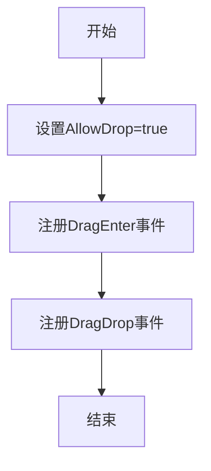
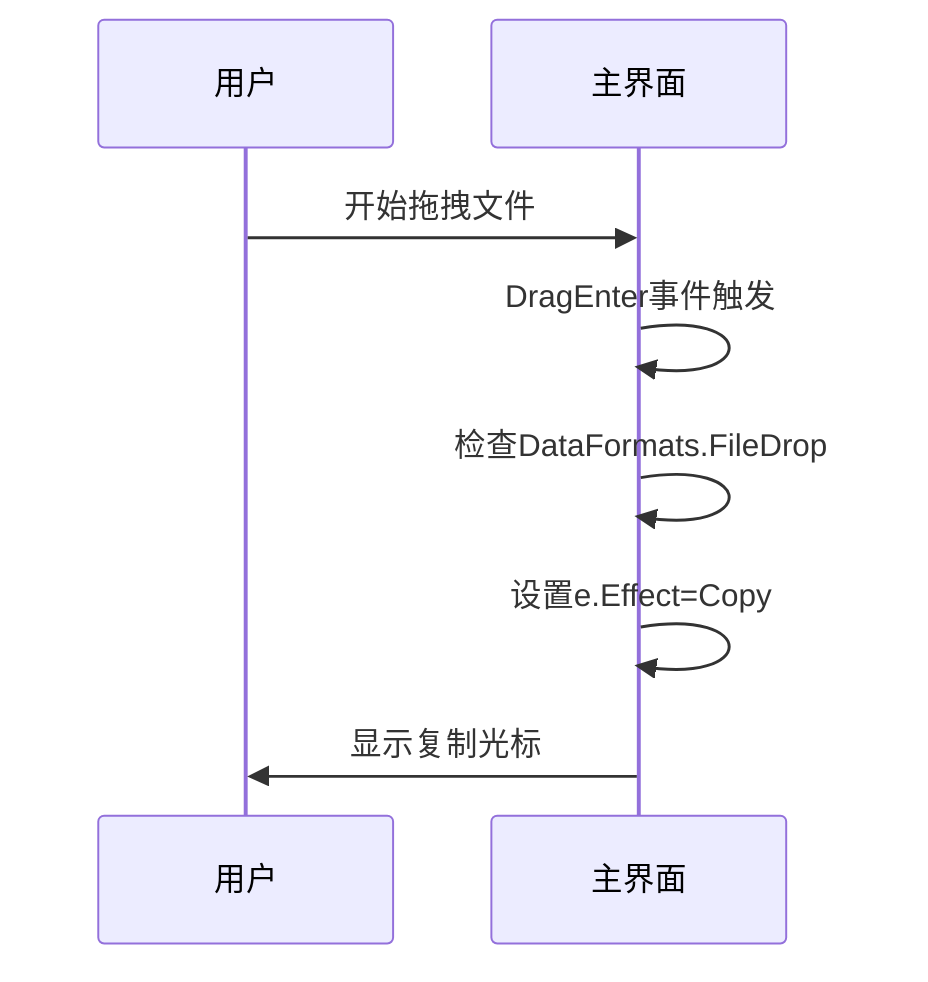
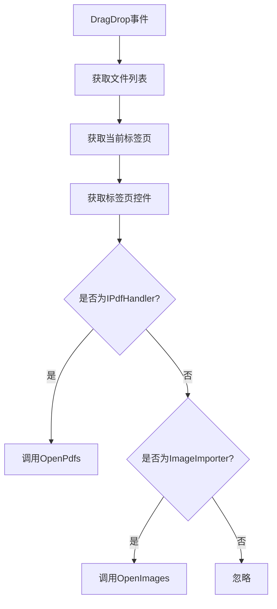
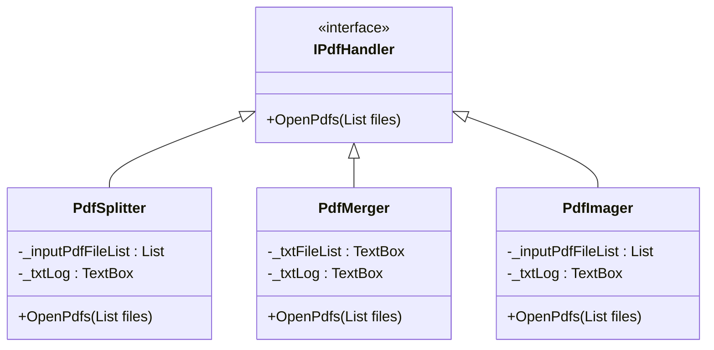

# 拖拽操作集成

<cite>
**本文档引用的文件**
- [MainForm.cs](file://PdfTool\MainForm.cs)
- [Common.cs](file://PdfTool\Common.cs)
- [ImageImporter.cs](file://PdfTool\ImageImporter.cs)
- [PdfSplitter.cs](file://PdfTool\PdfSplitter.cs)
- [PdfMerger.cs](file://PdfTool\PdfMerger.cs)
- [PdfImager.cs](file://PdfTool\PdfImager.cs)
</cite>

## 目录
1. [拖拽功能概述](#拖拽功能概述)
2. [主界面拖拽事件处理](#主界面拖拽事件处理)
3. [IPdfHandler接口设计与实现](#ipdfhandler接口设计与实现)
4. [拖拽功能扩展与自定义](#拖拽功能扩展与自定义)
5. [常见问题排查](#常见问题排查)

## 拖拽功能概述

在PdfTool应用程序中，实现了基于Windows Forms的拖拽功能，允许用户将文件从文件资源管理器直接拖拽到应用程序主界面。该功能通过处理`DragEnter`和`DragDrop`事件实现，支持根据当前选中的标签页动态调用相应的功能模块。

拖拽功能的核心机制包括：
- 设置`AllowDrop`属性启用拖拽支持
- 检测`DataFormats.FileDrop`数据格式
- 根据拖拽文件类型和当前标签页调用相应的处理方法
- 使用`DragDropEffects.Copy`提供视觉反馈

**Section sources**
- [MainForm.cs](file://PdfTool\MainForm.cs#L19-L23)
- [MainForm.cs](file://PdfTool\MainForm.cs#L79-L81)

## 主界面拖拽事件处理

### AllowDrop属性设置

在`MainForm`的`InitUi`方法中，通过设置`AllowDrop = true`启用窗体的拖拽功能。这是实现拖拽操作的前提条件，允许窗体接收拖拽事件。



**Diagram sources**
- [MainForm.cs](file://PdfTool\MainForm.cs#L81)

### DragEnter事件处理

`MainForm_DragEnter`事件处理器负责确定拖拽操作的效果。当检测到拖拽数据包含文件时，将`e.Effect`设置为`DragDropEffects.Copy`，向用户提供视觉反馈，表明可以在此处释放文件。

该事件处理逻辑简单高效，仅检查`e.Data.GetDataPresent(DataFormats.FileDrop)`来确认拖拽数据是否为文件列表。



**Diagram sources**
- [MainForm.cs](file://PdfTool\MainForm.cs#L33-L39)

### DragDrop事件处理

`MainForm_DragDrop`事件处理器是拖拽功能的核心，负责处理实际的文件导入逻辑：

1. 获取拖拽的文件路径列表
2. 根据当前选中的标签页确定目标控件
3. 检查控件是否实现`IPdfHandler`接口
4. 调用相应的文件处理方法

对于PDF文件，系统会过滤出以".pdf"结尾的文件并调用`OpenPdfs`方法；对于图片文件，会调用`ImageImporter`的`OpenImages`方法。



**Diagram sources**
- [MainForm.cs](file://PdfTool\MainForm.cs#L41-L59)

**Section sources**
- [MainForm.cs](file://PdfTool\MainForm.cs#L41-L59)

## IPdfHandler接口设计与实现

### 接口契约设计

`IPdfHandler`接口定义了PDF处理模块的标准契约，位于`Common.cs`文件中。该接口采用依赖倒置原则，使主界面能够以统一的方式与不同的PDF处理模块交互。

```csharp
internal interface IPdfHandler
{
    void OpenPdfs(List<string> files);
}
```

这种设计模式的优点包括：
- **松耦合**：主界面不直接依赖具体实现
- **可扩展性**：可以轻松添加新的PDF处理模块
- **可测试性**：便于单元测试和模拟

### 功能模块实现

多个PDF处理模块实现了`IPdfHandler`接口，展示了接口的一致性应用。

#### PdfSplitter实现

`PdfSplitter`类实现了`IPdfHandler`接口，提供PDF拆分功能。当用户拖拽PDF文件到"PDF拆分"标签页时，`OpenPdfs`方法会将文件路径添加到日志文本框，并显示每份PDF的页数信息。



**Diagram sources**
- [Common.cs](file://PdfTool\Common.cs#L13-L16)
- [PdfSplitter.cs](file://PdfTool\PdfSplitter.cs#L12)
- [PdfMerger.cs](file://PdfTool\PdfMerger.cs#L12)
- [PdfImager.cs](file://PdfTool\PdfImager.cs#L13)

#### 其他模块实现

- `PdfMerger`：在合并器界面中显示文件信息和页数
- `PdfImager`：在转图器界面中准备转换操作
- `ImageImporter`：特殊处理图片文件导入，支持BMP、JPG、TIF、PNG格式

这些实现展示了如何根据具体需求定制`OpenPdfs`方法的行为，同时保持接口的一致性。

**Section sources**
- [PdfSplitter.cs](file://PdfTool\PdfSplitter.cs#L33-L42)
- [PdfMerger.cs](file://PdfTool\PdfMerger.cs#L33-L40)
- [PdfImager.cs](file://PdfTool\PdfImager.cs#L36-L45)
- [ImageImporter.cs](file://PdfTool\ImageImporter.cs#L29-L35)

## 拖拽功能扩展与自定义

### 支持更多文件类型

要扩展支持的文件类型，可以修改`MainForm_DragDrop`方法中的文件过滤逻辑。例如，要支持Word文档，可以添加：

```csharp
var wordFiles = files.Where(a => 
    a.EndsWith(".doc", StringComparison.OrdinalIgnoreCase) || 
    a.EndsWith(".docx", StringComparison.OrdinalIgnoreCase)).ToList();
```

然后添加相应的处理逻辑，如检查控件是否实现`IWordHandler`接口。

### 修改拖拽反馈效果

可以通过修改`DragEnter`事件中的`e.Effect`值来改变拖拽反馈效果：

- `DragDropEffects.None`：禁止拖拽
- `DragDropEffects.Move`：移动操作
- `DragDropEffects.Link`：链接操作
- `DragDropEffects.All`：支持所有操作

还可以通过检查文件类型来提供更精确的反馈，例如只对支持的文件类型显示`Copy`效果。

### 自定义拖拽逻辑

开发者可以创建新的接口和实现类来扩展拖拽功能：

1. 定义新的处理接口，如`IDocumentHandler`
2. 在具体模块中实现该接口
3. 在`MainForm_DragDrop`中添加相应的类型检查和方法调用

这种扩展方式保持了代码的整洁性和可维护性。

**Section sources**
- [MainForm.cs](file://PdfTool\MainForm.cs#L45-L57)

## 常见问题排查

### 拖拽无响应

如果拖拽功能无响应，请检查以下几点：

1. **AllowDrop属性**：确保`MainForm`的`AllowDrop`属性已设置为`true`
2. **事件注册**：确认`DragEnter`和`DragDrop`事件已正确注册
3. **窗体层级**：确保没有其他控件遮挡主窗体，阻止事件传递

```csharp
// 正确的初始化顺序
AllowDrop = true;
DragEnter += MainForm_DragEnter;
DragDrop += MainForm_Drop;
```

### 文件过滤失败

当文件过滤不工作时，可能的原因包括：

- **路径大小写**：使用`StringComparison.OrdinalIgnoreCase`确保大小写不敏感
- **扩展名错误**：检查文件扩展名是否正确，包括点号
- **空文件列表**：验证`e.Data.GetData(DataFormats.FileDrop)`返回的数组是否为空

### 类型转换异常

在使用`is`操作符进行类型检查时，确保：

- 目标类型已正确导入命名空间
- 控件实例已正确创建
- 继承关系正确

使用`as`操作符可以更安全地进行类型转换：

```csharp
var pdfHandler = control as IPdfHandler;
if (pdfHandler != null)
{
    pdfHandler.OpenPdfs(pdfFiles);
}
```

**Section sources**
- [MainForm.cs](file://PdfTool\MainForm.cs#L49-L50)
- [MainForm.cs](file://PdfTool\MainForm.cs#L53-L54)