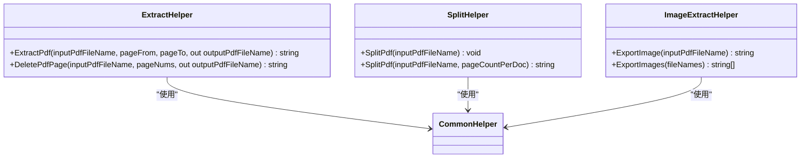

# 高级使用与集成

<cite>
**本文档引用的文件**   
- [Program.cs](file://PdfConsoleApp/Program.cs)
- [Program.cs](file://PdfImageExtractConsoleApp/Program.cs)
- [MainForm.cs](file://PdfTool/MainForm.cs)
- [Common.cs](file://PdfTool/Common.cs)
- [CommonHelper.cs](file://PdfHelperLibrary/CommonHelper.cs)
- [ExtractHelper.cs](file://PdfHelperLibrary/ExtractHelper.cs)
- [ImageExtractHelper.cs](file://PdfHelperLibrary/ImageExtractHelper.cs)
- [MergeHelper.cs](file://PdfHelperLibrary/MergeHelper.cs)
- [SplitHelper.cs](file://PdfHelperLibrary/SplitHelper.cs)
- [Builder.cs](file://PdfHelperLibrary/Builder.cs)
- [TextExtractHelper.cs](file://PdfHelperLibrary/TextExtractHelper.cs)
- [TableExtractHelper.cs](file://PdfHelperLibrary/TableExtractHelper.cs)
</cite>

## 目录
1. [拖拽操作实现机制](#拖拽操作实现机制)
2. [命令行控制台应用](#命令行控制台应用)
3. [核心逻辑复用架构](#核心逻辑复用架构)
4. [自动化脚本集成](#自动化脚本集成)
5. [错误码说明](#错误码说明)
6. [日志输出建议](#日志输出建议)

## 拖拽操作实现机制

本项目中的拖拽操作通过Windows Forms的DragDrop事件系统实现，为用户提供直观的文件处理体验。拖拽功能在主窗体中实现，支持将PDF文件或其他相关文件直接拖入应用程序界面，系统会根据当前活动的标签页自动调用相应的处理模块。

拖拽操作的核心实现包含两个关键事件处理程序：`MainForm_DragEnter`和`MainForm_DragDrop`。当用户将文件拖入应用程序时，`DragEnter`事件首先被触发，系统检查拖拽的数据是否包含文件（通过`DataFormats.FileDrop`判断），如果是，则将拖拽效果设置为复制（`DragDropEffects.Copy`），为用户提供视觉反馈。

**Diagram sources**
- [MainForm.cs](file://PdfTool/MainForm.cs#L33-L60)

在`DragDrop`事件处理程序中，系统获取拖拽的文件列表，过滤出PDF文件，然后根据当前选中的标签页获取对应的处理控件，并调用其`OpenPdfs`方法开始处理。这种设计实现了高度的模块化，不同的功能模块（如PDF拆分、合并、转图等）可以通过实现`IPdfHandler`接口来响应拖拽操作，而无需修改主窗体的拖拽逻辑。

**Section sources**
- [MainForm.cs](file://PdfTool/MainForm.cs#L33-L60)
- [Common.cs](file://PdfTool/Common.cs#L13-L16)

## 命令行控制台应用

### PdfConsoleApp

`PdfConsoleApp`是一个命令行控制台应用程序，旨在为开发者提供直接调用PDF处理功能的接口。该应用通过调用`PdfHelperLibrary`中的静态方法来执行各种PDF操作，无需图形用户界面，特别适合批处理和自动化场景。

`PdfConsoleApp`的主要设计目的是提供一个简单的测试和演示环境，展示如何通过代码调用PDF处理功能。从代码示例可以看出，该应用包含了多种使用场景的测试代码，包括骑缝章添加、批量文件检查和文件合并等。

**Diagram sources**
- [Program.cs](file://PdfConsoleApp/Program.cs#L12-L85)

### PdfImageExtractConsoleApp

`PdfImageExtractConsoleApp`是一个专门用于从PDF文件中提取图像的命令行工具。该应用实现了两种不同的图像提取方法，展示了如何使用不同的PDF处理库（Aspose.Pdf和iTextSharp）来实现相同的功能。

该工具的主要功能是遍历PDF文档的每一页，识别页面中的所有图像资源，并将其提取为PNG格式的独立文件。应用通过`ExtractImages1`方法实现核心功能，该方法使用Aspose.Pdf库来处理PDF文档和图像提取。

**Diagram sources**
- [Program.cs](file://PdfImageExtractConsoleApp/Program.cs#L25-L53)

**Section sources**
- [Program.cs](file://PdfImageExtractConsoleApp/Program.cs#L17-L53)

## 核心逻辑复用架构

### 核心库设计

`PdfHelperLibrary`是整个项目的核心，包含了所有PDF处理功能的实现。该库被设计为一个独立的类库，可以被多个前端应用程序（如WinForms应用、控制台应用等）复用，实现了业务逻辑与用户界面的完全分离。

库中的每个功能模块都被封装为静态帮助类，如`ExtractHelper`、`MergeHelper`、`SplitHelper`等，每个类负责特定的PDF操作。这种设计模式使得功能调用非常简单直接，开发者只需引用相应的帮助类并调用其静态方法即可。

**Diagram sources**
- [ExtractHelper.cs](file://PdfHelperLibrary/ExtractHelper.cs)
- [MergeHelper.cs](file://PdfHelperLibrary/MergeHelper.cs)
- [SplitHelper.cs](file://PdfHelperLibrary/SplitHelper.cs)

### 功能模块详解

#### 提取功能

`ExtractHelper`类提供了PDF内容提取的核心功能，包括按页数范围提取PDF和删除指定页面。该类的方法设计遵循统一的返回值模式：返回字符串类型的错误信息，空字符串表示成功，同时通过`out`参数返回输出文件名。

**Diagram sources**
- [ExtractHelper.cs](file://PdfHelperLibrary/ExtractHelper.cs#L20-L73)
- [SplitHelper.cs](file://PdfHelperLibrary/SplitHelper.cs)
- [ImageExtractHelper.cs](file://PdfHelperLibrary/ImageExtractHelper.cs)

#### 合并与生成功能

`MergeHelper`和`Builder`类提供了PDF文件合并和从图像生成PDF的功能。`MergeHelper`支持合并多个PDF文件，并可选择是否自动打开结果文件和是否添加书签。`Builder`类则专注于从图像文件创建PDF文档，支持自动检测图像方向并设置页面方向。

**Section sources**
- [MergeHelper.cs](file://PdfHelperLibrary/MergeHelper.cs)
- [Builder.cs](file://PdfHelperLibrary/Builder.cs)

## 自动化脚本集成

### API使用示例

基于`PdfHelperLibrary`提供的API，开发者可以轻松构建自动化脚本或将其集成到其他系统中。以下是一些常见的使用场景示例：

**Diagram sources**
- [MergeHelper.cs](file://PdfHelperLibrary/MergeHelper.cs)
- [ImageExtractHelper.cs](file://PdfHelperLibrary/ImageExtractHelper.cs)
- [SplitHelper.cs](file://PdfHelperLibrary/SplitHelper.cs)

### 集成建议

1. **错误处理**：所有核心方法都返回字符串类型的错误信息，空字符串表示成功。建议在调用这些方法时检查返回值，并根据需要进行错误处理。

2. **路径处理**：注意输入和输出文件路径的处理，建议使用`Path`类的相关方法来确保路径的正确性。

3. **资源管理**：虽然大多数方法内部处理了资源管理，但在批量处理大量文件时，仍需注意内存使用情况。

4. **并发处理**：对于大量文件的处理，可以考虑使用并行处理来提高效率，但需要注意PDF处理库的线程安全性。

**Section sources**
- [CommonHelper.cs](file://PdfHelperLibrary/CommonHelper.cs)
- [ExtractHelper.cs](file://PdfHelperLibrary/ExtractHelper.cs)
- [MergeHelper.cs](file://PdfHelperLibrary/MergeHelper.cs)

## 错误码说明

本系统采用字符串形式的错误信息返回机制，而不是传统的错误码。这种方法提供了更详细的错误描述，便于问题诊断。以下是常见的错误信息类型：

| 错误类型 | 示例信息 | 说明 |
|---------|--------|------|
| 文件访问错误 | "文件不存在" 或 "权限不足" | 表示无法访问指定的文件 |
| PDF格式错误 | "PDF文档损坏" 或 "无效的PDF文件" | 表示文件不是有效的PDF格式或已损坏 |
| 参数错误 | "页码超出范围" 或 "无效的参数" | 表示传入的参数不符合要求 |
| 内存错误 | "内存不足" 或 "资源耗尽" | 表示系统资源不足 |
| 未知错误 | 具体的异常消息 | 其他未预期的错误情况 |

当方法调用失败时，返回的字符串包含具体的错误信息，而`out`参数的输出文件名将为空字符串。开发者应检查返回值以确定操作是否成功，并根据需要处理错误情况。

**Section sources**
- [CommonHelper.cs](file://PdfHelperLibrary/CommonHelper.cs#L18-L25)
- [ExtractHelper.cs](file://PdfHelperLibrary/ExtractHelper.cs#L40-L44)
- [MergeHelper.cs](file://PdfHelperLibrary/MergeHelper.cs#L38-L41)

## 日志输出建议

虽然核心库本身不包含日志记录功能，但前端应用程序通常会实现日志输出。建议在集成这些功能时，遵循以下日志输出最佳实践：

1. **操作日志**：记录每个操作的开始和结束，包括输入文件、输出文件和操作结果。

2. **错误日志**：详细记录所有错误信息，包括错误发生的时间、上下文和具体的错误消息。

3. **性能日志**：对于批量处理操作，记录处理时间和性能指标，便于性能优化。

4. **调试日志**：在开发和调试阶段，可以启用详细的调试信息输出，帮助诊断问题。

在`PdfTool`主应用程序中，可以看到多个模块都包含了`_txtLog`文本框用于显示处理日志，这为用户提供了实时的处理反馈。在自动化脚本中，建议将类似的日志信息输出到文件或标准输出，以便于监控和故障排除。

**Section sources**
- [PdfMerger.cs](file://PdfTool/PdfMerger.cs#L86-L96)
- [PdfImager.cs](file://PdfTool/PdfImager.cs#L203-L212)