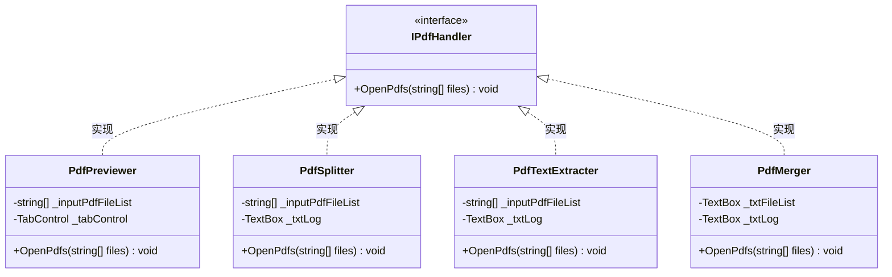
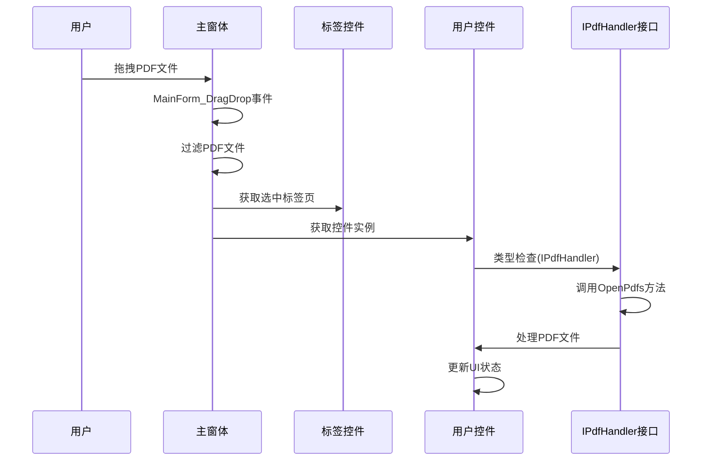
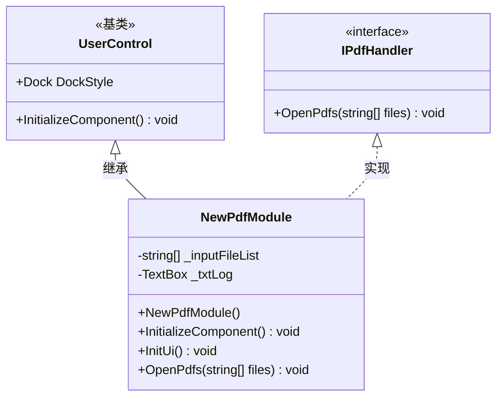
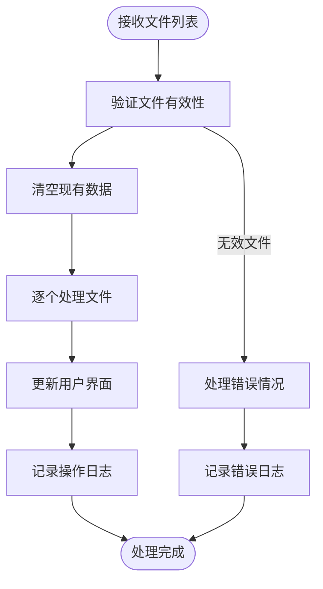
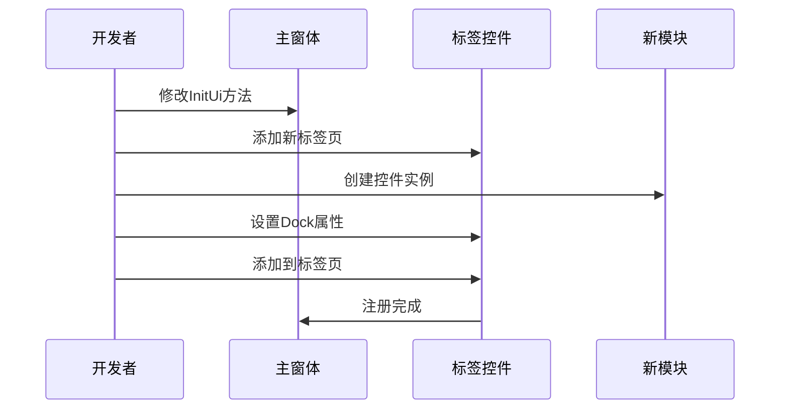
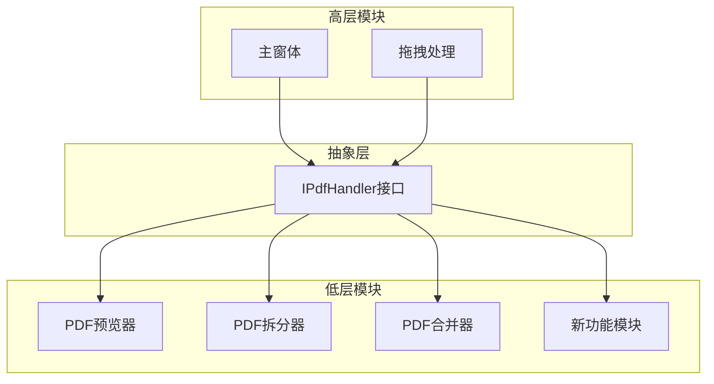
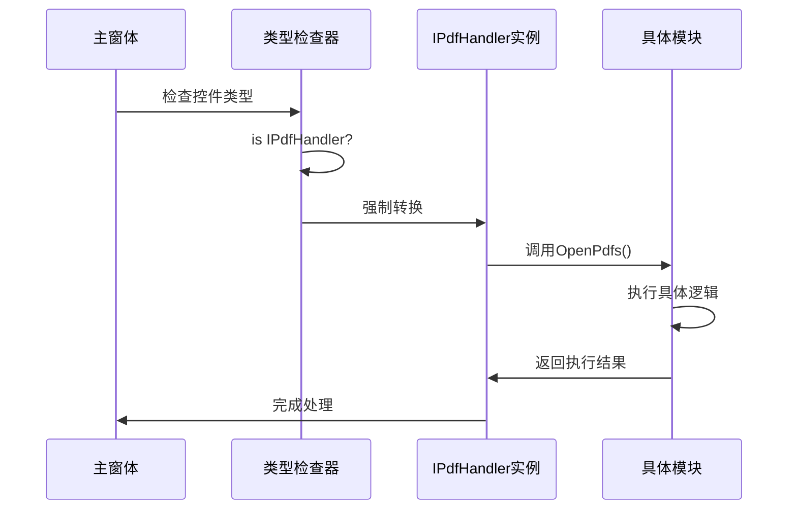
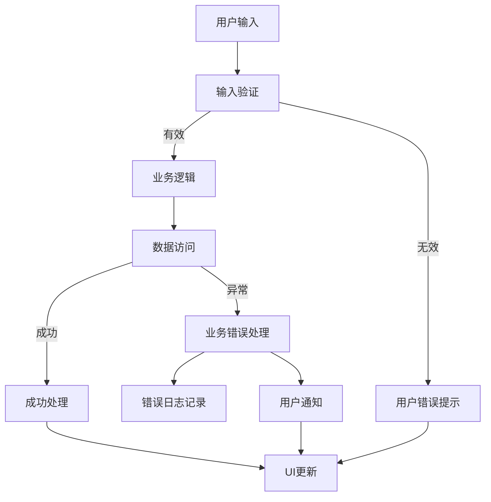

# 功能扩展机制

<cite>
**本文档引用的文件**
- [Common.cs](file://PdfTool/Common.cs)
- [MainForm.cs](file://PdfTool/MainForm.cs)
- [PdfPreviewer.cs](file://PdfTool/PdfPreviewer.cs)
- [PdfSplitter.cs](file://PdfTool/PdfSplitter.cs)
- [PdfTextExtracter.cs](file://PdfTool/PdfTextExtracter.cs)
- [PdfMerger.cs](file://PdfTool/PdfMerger.cs)
- [ImageImporter.cs](file://PdfTool/ImageImporter.cs)
- [Config.cs](file://PdfTool/Config.cs)
</cite>

## 目录
1. [概述](#概述)
2. [IPdfHandler接口设计](#ipdfhandler接口设计)
3. [核心架构分析](#核心架构分析)
4. [扩展开发流程](#扩展开发流程)
5. [实际代码示例](#实际代码示例)
6. [接口设计意图与架构作用](#接口设计意图与架构作用)
7. [常见实现错误与调试技巧](#常见实现错误与调试技巧)
8. [最佳实践指南](#最佳实践指南)
9. [总结](#总结)

## 概述

PdfTool项目采用了一种基于接口的插件化架构设计，通过实现`IPdfHandler`接口来扩展PDF处理功能。这种设计模式实现了松耦合的模块化架构，使得新功能模块能够无缝集成到主应用程序中，同时保持代码的可维护性和可扩展性。

该扩展机制的核心特点包括：
- 基于接口的标准化扩展点
- 支持拖拽文件操作的统一处理
- 标签页系统的自动集成
- 类型安全的运行时多态调用

## IPdfHandler接口设计

### 接口定义

`IPdfHandler`接口是PdfTool扩展系统的核心抽象，定义了PDF文件处理的标准契约：



**图表来源**
- [Common.cs](file://PdfTool/Common.cs#L12-L15)
- [PdfPreviewer.cs](file://PdfTool/PdfPreviewer.cs#L13)
- [PdfSplitter.cs](file://PdfTool/PdfSplitter.cs#L12)
- [PdfTextExtracter.cs](file://PdfTool/PdfTextExtracter.cs#L13)
- [PdfMerger.cs](file://PdfTool/PdfMerger.cs#L12)

### 接口方法规范

接口定义了单一的`OpenPdfs`方法，该方法接受PDF文件路径列表作为参数，负责处理这些文件并更新相应的用户界面状态。

**节来源**
- [Common.cs](file://PdfTool/Common.cs#L12-L15)

## 核心架构分析

### 主窗体拖拽处理机制

PdfTool的主窗体实现了统一的拖拽文件处理逻辑，通过类型检查和接口识别来分发PDF文件处理请求：



**图表来源**
- [MainForm.cs](file://PdfTool/MainForm.cs#L33-L58)

### 标签页系统集成

主窗体通过反射式的方式创建和管理各个功能模块的标签页：

```mermaid
flowchart TD
Start([应用启动]) --> CreateTabs[创建标签页集合]
CreateTabs --> AddTab1[添加"PDF拆分"标签]
CreateTabs --> AddTab2[添加"PDF合并"标签]
CreateTabs --> AddTab3[添加"PDF转图"标签]
CreateTabs --> AddTabN[添加其他功能标签]
AddTab1 --> CreateSplitter[创建PdfSplitter控件]
AddTab2 --> CreateMerger[创建PdfMerger控件]
AddTab3 --> CreateImager[创建PdfImager控件]
AddTabN --> CreateOther[创建其他控件]
CreateSplitter --> SetDock[设置Dock样式]
CreateMerger --> SetDock
CreateImager --> SetDock
CreateOther --> SetDock
SetDock --> AddToTab[添加到标签页]
AddToTab --> Complete([初始化完成])
```

**图表来源**
- [MainForm.cs](file://PdfTool/MainForm.cs#L135-L163)

**节来源**
- [MainForm.cs](file://PdfTool/MainForm.cs#L135-L163)

## 扩展开发流程

### 第一步：创建UserControl类

开发新的PDF处理功能需要创建一个继承自`UserControl`的类，并实现`IPdfHandler`接口：



### 第二步：实现OpenPdfs方法

`OpenPdfs`方法是扩展模块的核心入口点，负责处理传入的PDF文件列表：



### 第三步：集成到标签页系统

新模块需要在MainForm中注册到相应的标签页：



**节来源**
- [MainForm.cs](file://PdfTool/MainForm.cs#L151-L163)

## 实际代码示例

### 完整的新模块实现示例

以下是一个完整的PDF水印添加功能模块的实现示例：

```csharp
// 示例：PDF水印添加模块实现
public partial class PdfWatermarker : UserControl, IPdfHandler
{
    #region 构造函数
    public PdfWatermarker()
    {
        InitializeComponent();
        InitUi();
    }
    #endregion

    #region 属性
    private readonly List<string> _inputPdfFileList = new List<string>();
    private TextBox _txtLog;
    private TextBox _txtWatermarkText;
    private ComboBox _cmbWatermarkPosition;
    #endregion

    #region 方法
    public void OpenPdfs(List<string> files)
    {
        _txtLog.Clear();
        _inputPdfFileList.Clear();
        _inputPdfFileList.AddRange(files);
        
        foreach (var fileName in _inputPdfFileList)
        {
            var pageCount = PdfHelperLibrary.CommonHelper.GetPageCount(fileName);
            _txtLog.AppendText($"【页数：{pageCount}】{fileName}\r\n");
        }
    }
    
    private void ApplyWatermark()
    {
        if (_inputPdfFileList.Count == 0)
        {
            _txtLog.AppendText("未添加需要添加水印的PDF文件\r\n");
            return;
        }
        
        var watermarkText = _txtWatermarkText.Text;
        var position = _cmbWatermarkPosition.SelectedItem.ToString();
        
        foreach (var fileName in _inputPdfFileList)
        {
            try
            {
                var result = PdfHelperLibrary.WatermarkHelper.AddWatermark(
                    fileName, watermarkText, position, out var outputPdfFile);
                
                if (string.IsNullOrWhiteSpace(result))
                {
                    _txtLog.AppendText($"{fileName} 水印添加完成: {outputPdfFile}\r\n");
                }
                else
                {
                    _txtLog.AppendText($"{fileName} 水印添加失败: {result}\r\n");
                }
            }
            catch (Exception ex)
            {
                _txtLog.AppendText($"{fileName} 水印添加异常: {ex.Message}\r\n");
            }
        }
        
        _txtLog.AppendText("水印添加完成\r\n");
    }
    #endregion

    #region UI初始化
    private void InitUi()
    {
        // 创建UI控件...
        var btnAddFile = new Button
        {
            AutoSize = true,
            Location = new Point(Config.ControlMargin, Config.ControlMargin),
            Parent = this,
            Text = "添加文件"
        };
        btnAddFile.Click += (sender, e) => AddFiles();
        
        var btnApply = new Button
        {
            AutoSize = true,
            Location = new Point(btnAddFile.Right + Config.ControlPadding, btnAddFile.Top),
            Parent = this,
            Text = "应用水印"
        };
        btnApply.Click += (sender, e) => ApplyWatermark();
        
        _txtLog = new TextBox
        {
            Anchor = AnchorStyles.Left | AnchorStyles.Top | AnchorStyles.Right | AnchorStyles.Bottom,
            Location = new Point(Config.ControlMargin, btnAddFile.Bottom + Config.ControlPadding),
            Multiline = true,
            Parent = this,
            ReadOnly = true,
            ScrollBars = ScrollBars.Both,
            Size = new Size(ClientSize.Width - Config.ControlMargin * 2, 
                           ClientSize.Height - Config.ControlMargin - btnAddFile.Bottom - Config.ControlPadding),
            WordWrap = false
        };
    }
    #endregion
    
    private void AddFiles()
    {
        var openDlg = new OpenFileDialog 
        { 
            Filter = "PDF文件(*.pdf)|*.pdf|所有文件(*.*)|*.*", 
            Multiselect = true 
        };
        
        if (openDlg.ShowDialog() == DialogResult.OK)
        {
            OpenPdfs(openDlg.FileNames.ToList());
        }
    }
}
```

### 在MainForm中注册新模块

```csharp
// 在MainForm.InitUi方法中添加新模块
tabControl.TabPages["tpPdfWatermarker"].Controls.Add(
    new PdfWatermarker { Dock = DockStyle.Fill });
```

## 接口设计意图与架构作用

### 松耦合架构设计

`IPdfHandler`接口的设计体现了面向对象设计原则中的依赖倒置原则（DIP）和开闭原则（OCP）：



### 运行时多态调用机制

接口设计支持运行时的动态类型识别和方法调用：



**图表来源**
- [MainForm.cs](file://PdfTool/MainForm.cs#L48-L51)

### 扩展性保证

接口设计确保了新功能模块的无缝集成：

| 特性 | 优势 | 实现方式 |
|------|------|----------|
| 类型安全 | 编译时检查接口实现 | 显式实现IPdfHandler接口 |
| 运行时兼容 | 支持不同版本的向后兼容 | 接口版本控制 |
| 插件化 | 独立开发和部署 | 标准化的接口契约 |
| 可测试性 | 支持单元测试和模拟 | 接口隔离测试 |

**节来源**
- [MainForm.cs](file://PdfTool/MainForm.cs#L48-L51)

## 常见实现错误与调试技巧

### 常见实现错误

#### 错误1：未正确实现IPdfHandler接口

```csharp
// 错误示例：缺少接口实现
public partial class MyPdfModule : UserControl
{
    // 缺少IPdfHandler接口实现
    public void OpenPdfs(List<string> files)
    {
        // 实现细节
    }
}
```

#### 错误2：UI更新线程安全问题

```csharp
// 错误示例：直接在非UI线程更新UI
private void ProcessFiles()
{
    foreach (var file in files)
    {
        // 在后台线程中直接更新UI控件
        _txtLog.AppendText($"处理文件: {file}\r\n"); // 可能引发跨线程访问异常
    }
}
```

#### 错误3：文件处理异常未捕获

```csharp
// 错误示例：忽略异常处理
public void OpenPdfs(List<string> files)
{
    foreach (var file in files)
    {
        // 没有异常处理
        var result = PdfHelperLibrary.SomeOperation(file);
        _txtLog.AppendText($"{file}: {result}\r\n");
    }
}
```

### 调试技巧

#### 调试接口实现

```csharp
public void OpenPdfs(List<string> files)
{
    // 添加调试信息
    Debug.WriteLine($"OpenPdfs called with {files.Count} files");
    
    try
    {
        // 验证输入参数
        if (files == null || !files.Any())
        {
            Debug.WriteLine("Empty file list received");
            return;
        }
        
        // 处理文件
        foreach (var file in files)
        {
            Debug.WriteLine($"Processing file: {file}");
            
            // 文件存在性检查
            if (!File.Exists(file))
            {
                Debug.WriteLine($"File not found: {file}");
                continue;
            }
            
            // 执行处理逻辑
            ProcessSingleFile(file);
        }
    }
    catch (Exception ex)
    {
        Debug.WriteLine($"Error in OpenPdfs: {ex.Message}");
        throw; // 重新抛出异常以便上层处理
    }
}
```

#### 调试UI更新

```csharp
private void UpdateLog(string message)
{
    // 确保UI更新在正确的线程上执行
    if (_txtLog.InvokeRequired)
    {
        _txtLog.Invoke((Action)(() => 
        {
            _txtLog.AppendText(message + "\r\n");
        }));
    }
    else
    {
        _txtLog.AppendText(message + "\r\n");
    }
}
```

#### 单元测试策略

```csharp
[Test]
public void TestOpenPdfs_ValidFiles_ShouldProcessWithoutErrors()
{
    // Arrange
    var module = new PdfWatermarker();
    var validFiles = new List<string> { "test1.pdf", "test2.pdf" };
    
    // Act
    module.OpenPdfs(validFiles);
    
    // Assert
    Assert.That(module._inputPdfFileList.Count, Is.EqualTo(validFiles.Count));
    // 验证UI状态更新等
}
```

### 性能优化建议

#### 批量处理优化

```csharp
public void OpenPdfs(List<string> files)
{
    // 使用异步处理避免UI阻塞
    Task.Run(() =>
    {
        var processedFiles = new List<string>();
        
        foreach (var file in files)
        {
            try
            {
                // 批量处理逻辑
                ProcessFileInBackground(file);
                processedFiles.Add(file);
            }
            catch (Exception ex)
            {
                UpdateLogOnUIThread($"处理失败 {file}: {ex.Message}");
            }
        }
        
        // 更新UI
        UpdateLogOnUIThread($"共处理 {processedFiles.Count} 个文件");
    });
}
```

## 最佳实践指南

### 设计原则

#### 单一职责原则
每个PDF处理模块应该专注于单一的PDF处理任务，避免功能过于复杂。

#### 开闭原则
通过接口设计实现对扩展开放，对修改关闭。新功能应该通过实现接口而不是修改现有代码来添加。

#### 依赖注入
推荐使用构造函数注入来获取必要的服务依赖：

```csharp
public class AdvancedPdfProcessor : UserControl, IPdfHandler
{
    private readonly IPdfHelper _pdfHelper;
    
    public AdvancedPdfProcessor(IPdfHelper pdfHelper)
    {
        _pdfHelper = pdfHelper ?? throw new ArgumentNullException(nameof(pdfHelper));
        InitializeComponent();
        InitUi();
    }
}
```

### 错误处理最佳实践

#### 分层错误处理



#### 错误分类处理

```csharp
public void OpenPdfs(List<string> files)
{
    var errors = new Dictionary<string, string>();
    var successes = new List<string>();
    
    foreach (var file in files)
    {
        try
        {
            // 文件存在性检查
            if (!File.Exists(file))
            {
                errors[file] = "文件不存在";
                continue;
            }
            
            // 文件格式验证
            if (!IsValidPdfFile(file))
            {
                errors[file] = "不是有效的PDF文件";
                continue;
            }
            
            // 处理文件
            ProcessPdfFile(file);
            successes.Add(file);
        }
        catch (UnauthorizedAccessException ex)
        {
            errors[file] = $"访问被拒绝: {ex.Message}";
        }
        catch (IOException ex)
        {
            errors[file] = $"IO错误: {ex.Message}";
        }
        catch (Exception ex)
        {
            errors[file] = $"未知错误: {ex.Message}";
        }
    }
    
    // 报告处理结果
    ReportResults(successes, errors);
}
```

### 用户体验优化

#### 进度指示器

```csharp
private async Task ProcessWithProgress(List<string> files)
{
    var progressBar = new ProgressBar();
    progressBar.Minimum = 0;
    progressBar.Maximum = files.Count;
    
    for (int i = 0; i < files.Count; i++)
    {
        try
        {
            await ProcessFileAsync(files[i]);
            progressBar.Value = i + 1;
        }
        catch (Exception ex)
        {
            UpdateLog($"文件 {files[i]} 处理失败: {ex.Message}");
        }
    }
}
```

#### 批量操作确认

```csharp
private bool ConfirmBatchOperation(int fileCount)
{
    if (fileCount > 10)
    {
        var result = MessageBox.Show(
            $"您选择了 {fileCount} 个文件进行处理。是否继续？",
            "批量操作确认",
            MessageBoxButtons.YesNo,
            MessageBoxIcon.Question);
        
        return result == DialogResult.Yes;
    }
    
    return true;
}
```

## 总结

PdfTool的`IPdfHandler`接口扩展机制提供了一个优雅且强大的框架，用于构建可扩展的PDF处理应用程序。通过遵循本文档提供的指导原则和最佳实践，开发者可以：

1. **快速集成新功能**：通过实现标准接口，新功能模块能够无缝集成到现有系统中
2. **保持代码质量**：接口约束确保了实现的一致性和可靠性
3. **简化维护工作**：模块化设计使得功能维护更加便捷
4. **支持团队协作**：标准化的接口促进了团队间的协作开发

这种基于接口的扩展机制不仅适用于PDF处理功能，也可以作为其他类似应用程序的架构参考。随着项目的发展，这种设计模式将继续发挥其价值，支持更多创新功能的快速开发和部署。

通过深入理解接口设计原理、掌握正确的实现方法和调试技巧，开发者能够充分发挥PdfTool扩展机制的潜力，创造出更加丰富和实用的PDF处理工具。