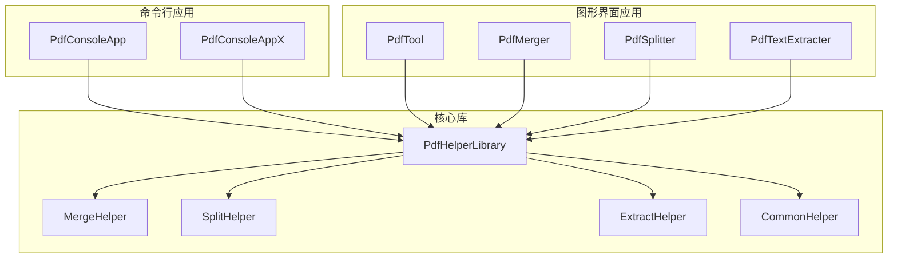
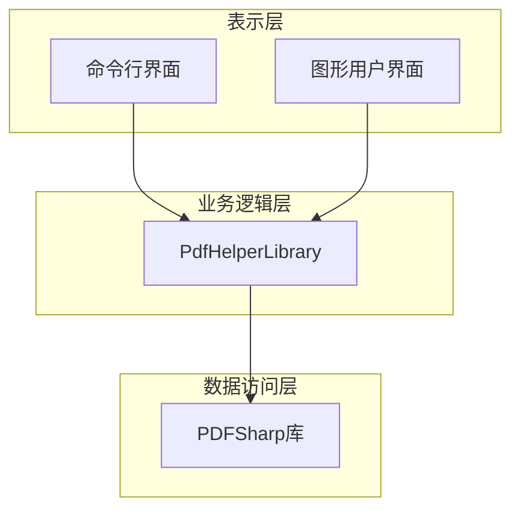
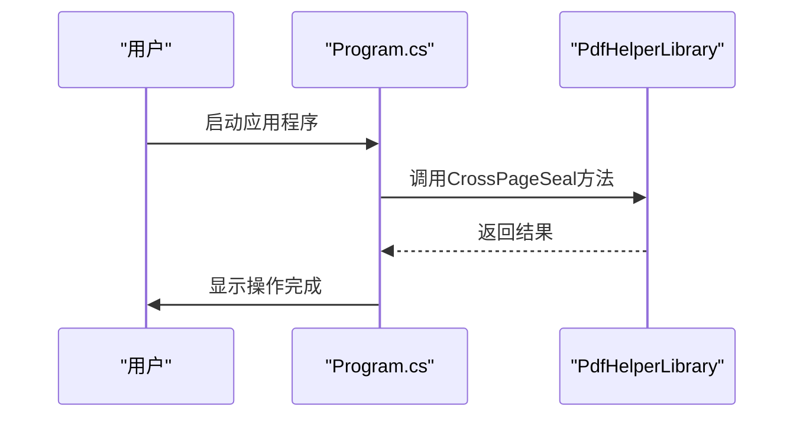
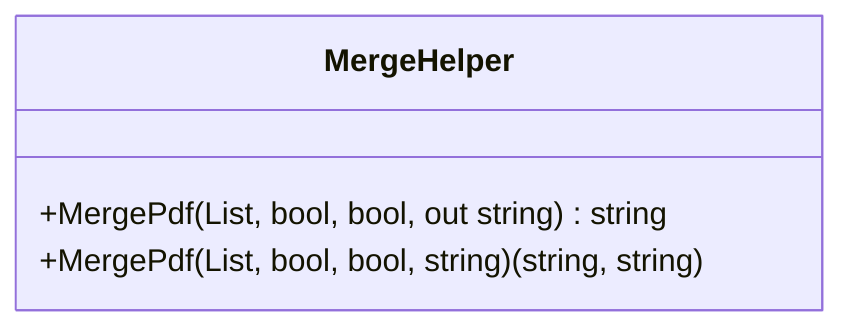
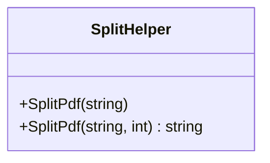
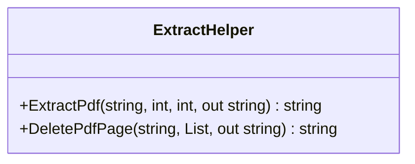
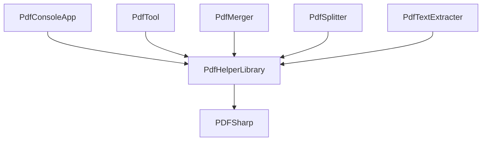

# 命令行自动化

<cite>
**本文档中引用的文件**   
- [Program.cs](file://PdfConsoleApp/Program.cs)
- [MergeHelper.cs](file://PdfHelperLibrary/MergeHelper.cs)
- [SplitHelper.cs](file://PdfHelperLibrary/SplitHelper.cs)
- [ExtractHelper.cs](file://PdfHelperLibrary/ExtractHelper.cs)
- [CommonHelper.cs](file://PdfHelperLibrary/CommonHelper.cs)
- [PdfMerger.cs](file://PdfTool/PdfMerger.cs)
- [PdfSplitter.cs](file://PdfTool/PdfSplitter.cs)
- [PdfTextExtracter.cs](file://PdfTool/PdfTextExtracter.cs)
</cite>

## 目录
1. [简介](#简介)
2. [项目结构](#项目结构)
3. [核心组件](#核心组件)
4. [架构概述](#架构概述)
5. [详细组件分析](#详细组件分析)
6. [依赖关系分析](#依赖关系分析)
7. [性能考虑](#性能考虑)
8. [故障排除指南](#故障排除指南)
9. [结论](#结论)

## 简介
本文档介绍如何利用PdfToolConsoleApp项目实现PDF处理任务的自动化。通过分析Program.cs中的入口点逻辑，说明如何将图形界面中的功能（如合并、拆分、提取）封装为可由命令行调用的服务。文档提供具体的参数设计模式、批处理脚本示例以及与核心PdfHelperLibrary的依赖关系，指导用户构建自动化工作流，包括定时任务集成和错误日志记录。

## 项目结构
PdfTool项目包含多个子项目，其中PdfConsoleApp和PdfConsoleAppX是命令行应用程序，用于自动化PDF处理任务。核心功能由PdfHelperLibrary提供，该库包含各种PDF操作的静态帮助类。图形界面应用程序（如PdfTool）和命令行应用程序共享相同的底层库，实现了功能的一致性和代码的重用。

**图表来源**
- [PdfConsoleApp/Program.cs](file://PdfConsoleApp/Program.cs)
- [PdfHelperLibrary/MergeHelper.cs](file://PdfHelperLibrary/MergeHelper.cs)
- [PdfHelperLibrary/SplitHelper.cs](file://PdfHelperLibrary/SplitHelper.cs)
- [PdfHelperLibrary/ExtractHelper.cs](file://PdfHelperLibrary/ExtractHelper.cs)
- [PdfHelperLibrary/CommonHelper.cs](file://PdfHelperLibrary/CommonHelper.cs)

**章节来源**
- [PdfConsoleApp/Program.cs](file://PdfConsoleApp/Program.cs)
- [PdfConsoleAppX/Program.cs](file://PdfConsoleAppX/Program.cs)
- [PdfHelperLibrary](file://PdfHelperLibrary)

## 核心组件
PdfConsoleApp项目的核心组件包括Program.cs中的入口点逻辑和PdfHelperLibrary中的各种帮助类。Program.cs文件包含多个注释掉的代码块，展示了不同的PDF处理场景，如骑缝章添加、批量文件检查、文件合并和图像转换。这些代码直接调用PdfHelperLibrary中的静态方法，实现了具体的PDF操作。

**章节来源**
- [Program.cs](file://PdfConsoleApp/Program.cs)
- [MergeHelper.cs](file://PdfHelperLibrary/MergeHelper.cs)
- [SplitHelper.cs](file://PdfHelperLibrary/SplitHelper.cs)
- [ExtractHelper.cs](file://PdfHelperLibrary/ExtractHelper.cs)

## 架构概述
PdfToolConsoleApp项目的架构基于分层设计，上层是命令行应用程序，下层是核心功能库。命令行应用程序负责解析用户输入和调用相应的服务方法，而PdfHelperLibrary负责实现具体的PDF操作。这种设计使得图形界面和命令行界面可以共享相同的业务逻辑，提高了代码的可维护性和可重用性。

**图表来源**
- [Program.cs](file://PdfConsoleApp/Program.cs)
- [PdfMerger.cs](file://PdfTool/PdfMerger.cs)
- [PdfSplitter.cs](file://PdfTool/PdfSplitter.cs)
- [PdfTextExtracter.cs](file://PdfTool/PdfTextExtracter.cs)

## 详细组件分析

### 入口点逻辑分析
PdfConsoleApp的Program.cs文件包含多个独立的PDF处理场景，每个场景都通过直接调用PdfHelperLibrary中的静态方法来实现。这些场景包括骑缝章添加、批量文件检查、文件合并和图像转换。代码中使用了大量的注释来分隔不同的功能块，使得每个功能块可以独立启用或禁用。

**图表来源**
- [Program.cs](file://PdfConsoleApp/Program.cs)

**章节来源**
- [Program.cs](file://PdfConsoleApp/Program.cs)

### 合并功能分析
合并功能由PdfHelperLibrary中的MergeHelper类实现。该类提供两个重载的MergePdf方法，一个使用out参数返回输出文件名，另一个使用元组返回结果和输出文件名。方法接受PDF文件列表、是否自动打开和是否添加书签等参数，实现了灵活的合并策略。

**图表来源**
- [MergeHelper.cs](file://PdfHelperLibrary/MergeHelper.cs)

**章节来源**
- [MergeHelper.cs](file://PdfHelperLibrary/MergeHelper.cs)
- [PdfMerger.cs](file://PdfTool/PdfMerger.cs)

### 拆分功能分析
拆分功能由PdfHelperLibrary中的SplitHelper类实现。该类提供两个方法：SplitPdf用于将PDF文件拆分为单页文件，另一个重载的SplitPdf方法用于按指定页数拆分PDF文件。拆分后的文件名包含原始文件名和页码信息，便于用户识别。

**图表来源**
- [SplitHelper.cs](file://PdfHelperLibrary/SplitHelper.cs)

**章节来源**
- [SplitHelper.cs](file://PdfHelperLibrary/SplitHelper.cs)
- [PdfSplitter.cs](file://PdfTool/PdfSplitter.cs)

### 提取功能分析
提取功能由PdfHelperLibrary中的ExtractHelper类实现。该类提供ExtractPdf方法用于提取指定页码范围的PDF内容，以及DeletePdfPage方法用于删除指定页码的PDF页面。这些方法在处理大型PDF文件时非常有用，可以精确控制输出内容。

**图表来源**
- [ExtractHelper.cs](file://PdfHelperLibrary/ExtractHelper.cs)

**章节来源**
- [ExtractHelper.cs](file://PdfHelperLibrary/ExtractHelper.cs)
- [PdfSplitter.cs](file://PdfTool/PdfSplitter.cs)

## 依赖关系分析
PdfConsoleApp项目的主要依赖关系集中在PdfHelperLibrary上。该库使用PDFSharp库进行底层PDF操作，提供了合并、拆分、提取等核心功能。命令行应用程序通过直接引用这些帮助类来实现自动化任务，而无需关心具体的实现细节。这种依赖关系使得项目具有良好的模块化特性，便于维护和扩展。

**图表来源**
- [PdfConsoleApp.csproj](file://PdfConsoleApp/PdfConsoleApp.csproj)
- [PdfHelperLibrary.csproj](file://PdfHelperLibrary/PdfHelperLibrary.csproj)
- [PdfTool.csproj](file://PdfTool/PdfTool.csproj)

**章节来源**
- [PdfConsoleApp/Program.cs](file://PdfConsoleApp/Program.cs)
- [PdfHelperLibrary](file://PdfHelperLibrary)

## 性能考虑
在设计自动化工作流时，需要考虑性能因素。PdfConsoleApp中的代码示例展示了如何使用Directory.GetFiles方法递归获取目录中的所有PDF文件，并使用foreach循环逐个处理。对于大型文件集合，建议使用异步处理或并行处理来提高效率。此外，错误处理机制（如try-catch块）可以防止单个文件的处理失败影响整个批处理过程。

## 故障排除指南
当自动化任务失败时，可以通过检查控制台输出来诊断问题。PdfConsoleApp中的代码使用Console.Error.WriteLine输出错误信息，Console.Out.WriteLine输出成功信息。对于常见的PDF处理错误，如文件无法读取或格式不正确，应确保输入文件的有效性。如果遇到性能问题，可以考虑优化文件遍历策略或使用更高效的PDF处理库。

**章节来源**
- [Program.cs](file://PdfConsoleApp/Program.cs)
- [CommonHelper.cs](file://PdfHelperLibrary/CommonHelper.cs)

## 结论
PdfToolConsoleApp项目通过将图形界面功能封装为可由命令行调用的服务，实现了PDF处理任务的自动化。核心的PdfHelperLibrary提供了合并、拆分、提取等常用功能，使得开发者可以轻松构建定制化的自动化工作流。通过合理设计参数和批处理脚本，可以实现复杂的PDF处理任务，提高工作效率。