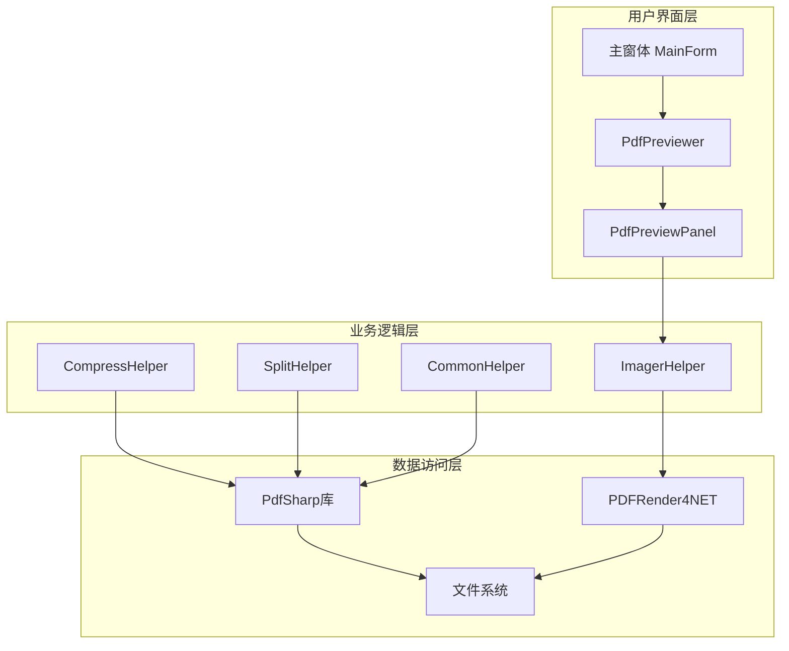
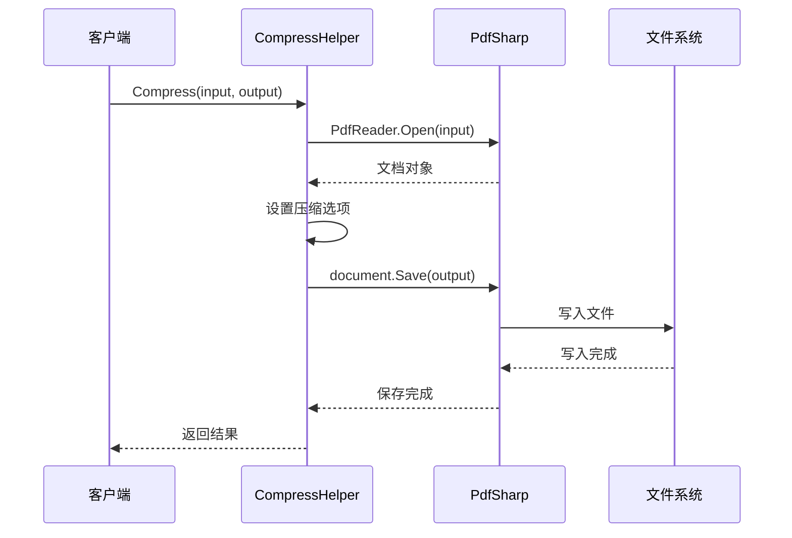
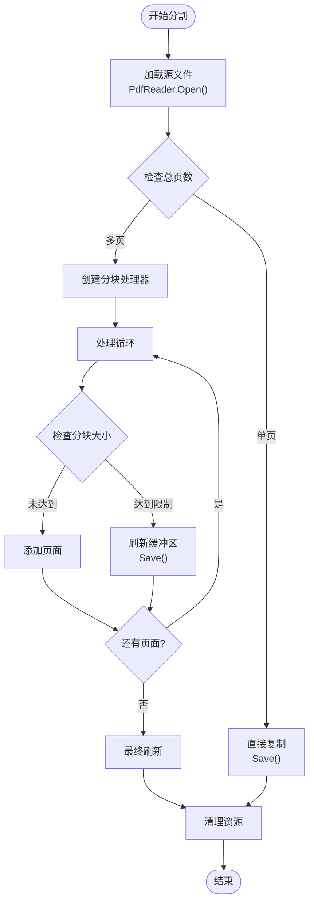
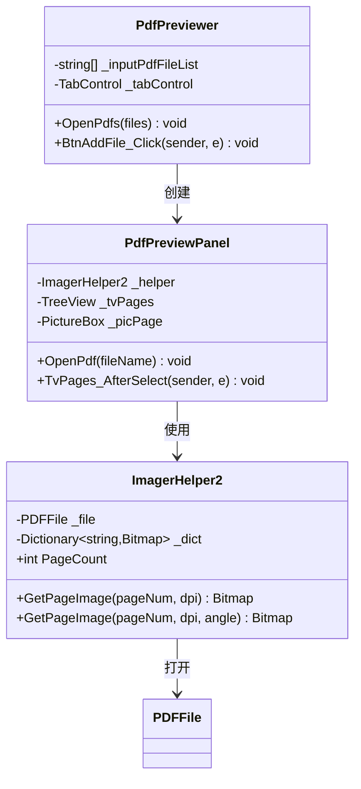
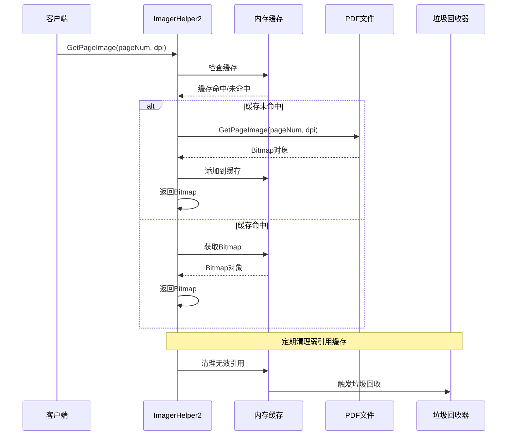

# 性能优化策略

<cite>
**本文档引用的文件**
- [CompressHelper.cs](file://PdfHelperLibrary/CompressHelper.cs)
- [SplitHelper.cs](file://PdfHelperLibrary/SplitHelper.cs)
- [ImagerHelper.cs](file://PdfHelperLibrary/ImagerHelper.cs)
- [CommonHelper.cs](file://PdfHelperLibrary/CommonHelper.cs)
- [PdfPreviewer.cs](file://PdfTool/PdfPreviewer.cs)
- [PdfPreviewPanel.cs](file://PdfTool/PdfPreviewPanel.cs)
- [ImageExtractHelper.cs](file://PdfHelperLibrary/ImageExtractHelper.cs)
- [TextHelper.cs](file://PdfHelperLibrary3/TextHelper.cs)
- [TableHelper.cs](file://PdfHelperLibrary3/TableHelper.cs)
- [MainForm.cs](file://PdfTool/MainForm.cs)
- [Config.cs](file://PdfTool/Config.cs)
</cite>

## 目录
1. [引言](#引言)
2. [项目架构概览](#项目架构概览)
3. [核心性能瓶颈分析](#核心性能瓶颈分析)
4. [CompressHelper优化策略](#compressthelper优化策略)
5. [SplitHelper流式处理方案](#splithelper流式处理方案)
6. [PdfPreviewer延迟加载与缓存机制](#pdfpreviewer延迟加载与缓存机制)
7. [ImagerHelper内存管理优化](#imagerhelper内存管理优化)
8. [多线程处理建议](#多线程处理建议)
9. [资源释放最佳实践](#资源释放最佳实践)
10. [性能监控方法](#性能监控方法)
11. [自定义模块优化指南](#自定义模块优化指南)
12. [总结](#总结)

## 引言

在处理大型PDF文件时，性能瓶颈主要体现在内存使用、I/O操作和计算复杂度等方面。本文档基于PdfTool项目的CompressHelper、SplitHelper和PdfPreviewer等核心组件，提供全面的性能优化策略，帮助开发者构建高效、可扩展的PDF处理应用程序。

## 项目架构概览

PdfTool项目采用模块化架构，主要包含以下核心组件：



**图表来源**
- [MainForm.cs](file://PdfTool/MainForm.cs#L1-L194)
- [PdfPreviewer.cs](file://PdfTool/PdfPreviewer.cs#L1-L77)
- [CompressHelper.cs](file://PdfHelperLibrary/CompressHelper.cs#L1-L33)

## 核心性能瓶颈分析

### 内存使用模式

大型PDF文件处理的主要内存瓶颈包括：

1. **全量加载问题**：一次性加载整个PDF文档到内存
2. **图像缓存膨胀**：大量高分辨率图像占用内存
3. **对象池耗尽**：频繁创建销毁PDF对象
4. **流式处理缺失**：缺乏流式处理机制

### I/O操作瓶颈

1. **磁盘读写频繁**：大量临时文件创建和删除
2. **网络传输延迟**：远程文件处理效率低
3. **并发访问冲突**：多线程环境下的文件锁定

### 计算复杂度问题

1. **页面遍历开销**：逐页处理导致时间复杂度高
2. **图像转换成本**：高DPI图像转换计算密集
3. **格式转换开销**：多种格式间的相互转换

## CompressHelper优化策略

### 当前实现分析

CompressHelper采用简单直接的方式处理PDF压缩：



**图表来源**
- [CompressHelper.cs](file://PdfHelperLibrary/CompressHelper.cs#L15-L30)

### 优化建议

#### 1. 流式压缩处理

```csharp
// 推荐的流式压缩实现
public static string StreamCompress(string inputFileName, string outputFileName)
{
    using (var inputStream = new FileStream(inputFileName, FileMode.Open, FileAccess.Read))
    using (var outputStream = new FileStream(outputFileName, FileMode.Create, FileAccess.Write))
    {
        using (var document = PdfReader.Open(inputStream, PdfDocumentOpenMode.Import))
        {
            document.Options.CompressContentStreams = true;
            document.Save(outputStream);
        }
    }
    return "";
}
```

#### 2. 分块处理策略

对于超大文件，采用分块处理避免内存溢出：

```csharp
public static string ChunkedCompress(string inputFileName, string outputFileName, long chunkSize = 100 * 1024 * 1024)
{
    // 实现分块读取和压缩的逻辑
}
```

**章节来源**
- [CompressHelper.cs](file://PdfHelperLibrary/CompressHelper.cs#L15-L30)

## SplitHelper流式处理方案

### 当前实现问题

SplitHelper存在以下性能问题：

1. **内存占用过高**：同时维护多个PDF文档对象
2. **I/O操作频繁**：每次分割都重新加载源文件
3. **缺乏并发支持**：单线程顺序处理

### 改进后的流式处理架构



**图表来源**
- [SplitHelper.cs](file://PdfHelperLibrary/SplitHelper.cs#L13-L70)

### 实现建议

#### 1. 流式分割算法

```csharp
public static void StreamSplitPdf(string inputPdfFileName, int maxPagesPerFile = 100)
{
    using (var inputDocument = PdfReader.Open(inputPdfFileName, PdfDocumentOpenMode.Import))
    {
        var pageCount = inputDocument.PageCount;
        var path = Path.GetDirectoryName(inputPdfFileName);
        var fileName = Path.GetFileNameWithoutExtension(inputPdfFileName);
        
        for (int i = 0; i < pageCount; i += maxPagesPerFile)
        {
            var subPageCount = Math.Min(maxPagesPerFile, pageCount - i);
            var outputDocument = CreateNewDocument(inputDocument);
            
            for (int j = 0; j < subPageCount; j++)
            {
                outputDocument.AddPage(inputDocument.Pages[i + j]);
            }
            
            var outputFileName = $"{fileName} - Part {i / maxPagesPerFile + 1}.pdf";
            outputDocument.Save(Path.Combine(path, outputFileName));
        }
    }
}
```

#### 2. 并发分割处理

```csharp
public static async Task ConcurrentSplitPdfAsync(string inputPdfFileName, int maxPagesPerFile = 100)
{
    using (var inputDocument = PdfReader.Open(inputPdfFileName, PdfDocumentOpenMode.Import))
    {
        var tasks = new List<Task>();
        var pageCount = inputDocument.PageCount;
        var path = Path.GetDirectoryName(inputPdfFileName);
        var fileName = Path.GetFileNameWithoutExtension(inputPdfFileName);
        
        for (int i = 0; i < pageCount; i += maxPagesPerFile)
        {
            int startIndex = i;
            int count = Math.Min(maxPagesPerFile, pageCount - i);
            
            tasks.Add(Task.Run(() => {
                var outputDocument = CreateNewDocument(inputDocument);
                
                for (int j = 0; j < count; j++)
                {
                    outputDocument.AddPage(inputDocument.Pages[startIndex + j]);
                }
                
                var outputFileName = $"{fileName} - Part {startIndex / maxPagesPerFile + 1}.pdf";
                outputDocument.Save(Path.Combine(path, outputFileName));
            }));
        }
        
        await Task.WhenAll(tasks);
    }
}
```

**章节来源**
- [SplitHelper.cs](file://PdfHelperLibrary/SplitHelper.cs#L13-L70)

## PdfPreviewer延迟加载与缓存机制

### 当前实现分析

PdfPreviewer采用延迟加载和简单的内存缓存策略：



**图表来源**
- [PdfPreviewer.cs](file://PdfTool/PdfPreviewer.cs#L13-L77)
- [PdfPreviewPanel.cs](file://PdfTool/PdfPreviewPanel.cs#L8-L76)
- [ImagerHelper.cs](file://PdfHelperLibrary/ImagerHelper.cs#L128-L189)

### 缓存优化策略

#### 1. LRU缓存实现

```csharp
public class LruCache<TKey, TValue> where TKey : notnull
{
    private readonly int _capacity;
    private readonly LinkedList<TKey> _keys;
    private readonly Dictionary<TKey, LinkedListNode<KeyValuePair<TKey, TValue>>> _cache;
    
    public LruCache(int capacity)
    {
        _capacity = capacity;
        _keys = new LinkedList<TKey>();
        _cache = new Dictionary<TKey, LinkedListNode<KeyValuePair<TKey, TValue>>>(capacity);
    }
    
    public bool TryGetValue(TKey key, out TValue value)
    {
        if (_cache.TryGetValue(key, out var node))
        {
            _keys.Remove(node);
            _keys.AddFirst(node);
            value = node.Value.Value;
            return true;
        }
        
        value = default!;
        return false;
    }
    
    public void Add(TKey key, TValue value)
    {
        if (_cache.Count >= _capacity)
        {
            EvictOldest();
        }
        
        var node = new LinkedListNode<KeyValuePair<TKey, TValue>>(KeyValuePair.Create(key, value));
        _keys.AddFirst(node);
        _cache[key] = node;
    }
    
    private void EvictOldest()
    {
        var lastNode = _keys.Last;
        _keys.RemoveLast();
        _cache.Remove(lastNode!.Value);
    }
}
```

#### 2. 高级缓存配置

```csharp
public class AdvancedImageCache
{
    private readonly LruCache<string, WeakReference<Bitmap>> _memoryCache;
    private readonly Dictionary<string, string> _diskCache;
    private readonly SemaphoreSlim _semaphore;
    
    public AdvancedImageCache(int memoryCapacity = 100, int diskCapacity = 1000)
    {
        _memoryCache = new LruCache<string, WeakReference<Bitmap>>(memoryCapacity);
        _diskCache = new Dictionary<string, string>();
        _semaphore = new SemaphoreSlim(1);
    }
    
    public async Task<Bitmap?> GetCachedImageAsync(string cacheKey, Func<Task<Bitmap>> loader)
    {
        // 尝试从内存缓存获取
        if (_memoryCache.TryGetValue(cacheKey, out var weakRef) && weakRef.TryGetTarget(out var bitmap))
        {
            return bitmap;
        }
        
        // 尝试从磁盘缓存获取
        if (_diskCache.TryGetValue(cacheKey, out var filePath) && File.Exists(filePath))
        {
            using (var stream = new FileStream(filePath, FileMode.Open, FileAccess.Read, FileShare.Read))
            {
                bitmap = new Bitmap(stream);
                _memoryCache.Add(cacheKey, new WeakReference<Bitmap>(bitmap));
                return bitmap;
            }
        }
        
        // 加载新图像
        bitmap = await loader();
        await SaveToDiskCacheAsync(cacheKey, bitmap);
        
        _memoryCache.Add(cacheKey, new WeakReference<Bitmap>(bitmap));
        return bitmap;
    }
    
    private async Task SaveToDiskCacheAsync(string key, Bitmap image)
    {
        await _semaphore.WaitAsync();
        try
        {
            // 实现磁盘缓存逻辑
        }
        finally
        {
            _semaphore.Release();
        }
    }
}
```

**章节来源**
- [PdfPreviewer.cs](file://PdfTool/PdfPreviewer.cs#L30-L41)
- [PdfPreviewPanel.cs](file://PdfTool/PdfPreviewPanel.cs#L26-L49)
- [ImagerHelper.cs](file://PdfHelperLibrary/ImagerHelper.cs#L128-L189)

## ImagerHelper内存管理优化

### 当前内存管理模式

ImagerHelper2采用字典缓存机制，但存在以下问题：

1. **内存泄漏风险**：Bitmap对象未及时释放
2. **缓存策略单一**：缺乏智能缓存淘汰
3. **并发访问安全**：多线程环境下可能存在竞态条件

### 优化后的内存管理架构



**图表来源**
- [ImagerHelper.cs](file://PdfHelperLibrary/ImagerHelper.cs#L128-L189)

### 具体优化措施

#### 1. 弱引用缓存实现

```csharp
public class WeakReferenceCache<TKey, TValue> where TKey : notnull
{
    private readonly Dictionary<TKey, WeakReference<TValue>> _cache;
    private readonly HashSet<TKey> _keysToRemove;
    
    public WeakReferenceCache()
    {
        _cache = new Dictionary<TKey, WeakReference<TValue>>();
        _keysToRemove = new HashSet<TKey>();
    }
    
    public bool TryGetValue(TKey key, out TValue value)
    {
        if (_cache.TryGetValue(key, out var weakRef) && weakRef.TryGetTarget(out value))
        {
            return true;
        }
        
        value = default!;
        return false;
    }
    
    public void Add(TKey key, TValue value)
    {
        _cache[key] = new WeakReference<TValue>(value);
    }
    
    public void Cleanup()
    {
        foreach (var key in _cache.Keys)
        {
            if (!_cache[key].IsAlive)
            {
                _keysToRemove.Add(key);
            }
        }
        
        foreach (var key in _keysToRemove)
        {
            _cache.Remove(key);
        }
        
        _keysToRemove.Clear();
    }
}
```

#### 2. 自动资源管理

```csharp
public class ManagedImagerHelper2 : IDisposable
{
    private readonly PDFFile _file;
    private readonly Dictionary<string, WeakReference<Bitmap>> _cache;
    private bool _disposed;
    
    public ManagedImagerHelper2(string inputPdfFileName)
    {
        _file = PDFFile.Open(inputPdfFileName);
        _cache = new Dictionary<string, WeakReference<Bitmap>>();
    }
    
    public Bitmap GetPageImage(int pageNum, int dpi)
    {
        var key = $"{pageNum}_{dpi}";
        
        if (_cache.TryGetValue(key, out var weakRef) && weakRef.TryGetTarget(out var bitmap))
        {
            return bitmap;
        }
        
        bitmap = _file.GetPageImage(pageNum, dpi);
        _cache[key] = new WeakReference<Bitmap>(bitmap);
        
        return bitmap;
    }
    
    public void Dispose()
    {
        Dispose(true);
        GC.SuppressFinalize(this);
    }
    
    protected virtual void Dispose(bool disposing)
    {
        if (!_disposed && disposing)
        {
            _file.Dispose();
            
            foreach (var weakRef in _cache.Values)
            {
                if (weakRef.TryGetTarget(out var bitmap))
                {
                    bitmap.Dispose();
                }
            }
            
            _cache.Clear();
            _disposed = true;
        }
    }
}
```

**章节来源**
- [ImagerHelper.cs](file://PdfHelperLibrary/ImagerHelper.cs#L128-L189)

## 多线程处理建议

### 线程池优化策略

#### 1. 并发处理框架

```csharp
public class PdfProcessorPool
{
    private readonly SemaphoreSlim _semaphore;
    private readonly CancellationTokenSource _cancellationTokenSource;
    
    public PdfProcessorPool(int maxDegreeOfParallelism)
    {
        _semaphore = new SemaphoreSlim(maxDegreeOfParallelism);
        _cancellationTokenSource = new CancellationTokenSource();
    }
    
    public async Task ProcessPdfFilesAsync(IEnumerable<string> pdfFiles, 
        Func<string, CancellationToken, Task> processor)
    {
        var tasks = pdfFiles.Select(async file => {
            await _semaphore.WaitAsync(_cancellationTokenSource.Token);
            try
            {
                await processor(file, _cancellationTokenSource.Token);
            }
            finally
            {
                _semaphore.Release();
            }
        });
        
        await Task.WhenAll(tasks);
    }
    
    public void CancelAllOperations()
    {
        _cancellationTokenSource.Cancel();
    }
    
    public void Dispose()
    {
        _cancellationTokenSource.Dispose();
        _semaphore.Dispose();
    }
}
```

#### 2. 生产者-消费者模式

```csharp
public class PdfProcessingQueue
{
    private readonly BlockingCollection<(string FilePath, Action<string> Processor)> _queue;
    private readonly List<Task> _workerTasks;
    private readonly int _workerCount;
    
    public PdfProcessingQueue(int workerCount)
    {
        _workerCount = workerCount;
        _queue = new BlockingCollection<(string, Action<string>)>();
        _workerTasks = new List<Task>();
        
        StartWorkers();
    }
    
    private void StartWorkers()
    {
        for (int i = 0; i < _workerCount; i++)
        {
            _workerTasks.Add(Task.Run(ProcessQueueItems));
        }
    }
    
    private async Task ProcessQueueItems()
    {
        foreach (var item in _queue.GetConsumingEnumerable())
        {
            try
            {
                item.Processor(item.FilePath);
            }
            catch (Exception ex)
            {
                // 记录错误但不中断队列
            }
        }
    }
    
    public void Enqueue(string filePath, Action<string> processor)
    {
        _queue.Add((filePath, processor));
    }
    
    public async Task CompleteAddingAsync()
    {
        _queue.CompleteAdding();
        await Task.WhenAll(_workerTasks);
    }
}
```

### 异步处理最佳实践

#### 1. 异步读写操作

```csharp
public static async Task<byte[]> ReadPdfAsync(string filePath, CancellationToken cancellationToken = default)
{
    using (var fileStream = new FileStream(filePath, FileMode.Open, FileAccess.Read, 
        FileShare.Read, bufferSize: 4096, useAsync: true))
    {
        var buffer = new byte[fileStream.Length];
        await fileStream.ReadAsync(buffer, 0, buffer.Length, cancellationToken);
        return buffer;
    }
}

public static async Task WritePdfAsync(string filePath, byte[] pdfData, CancellationToken cancellationToken = default)
{
    using (var fileStream = new FileStream(filePath, FileMode.Create, FileAccess.Write, 
        FileShare.None, bufferSize: 4096, useAsync: true))
    {
        await fileStream.WriteAsync(pdfData, 0, pdfData.Length, cancellationToken);
    }
}
```

#### 2. 进度报告机制

```csharp
public class ProgressReporter
{
    private readonly IProgress<double> _progress;
    private readonly object _lock = new object();
    private double _currentProgress;
    
    public ProgressReporter(IProgress<double> progress)
    {
        _progress = progress;
    }
    
    public void ReportProgress(double percentage)
    {
        lock (_lock)
        {
            if (percentage > _currentProgress)
            {
                _currentProgress = percentage;
                _progress?.Report(percentage);
            }
        }
    }
}
```

## 资源释放最佳实践

### IDisposable模式实现

#### 1. 完整的资源管理

```csharp
public class SafePdfProcessor : IDisposable
{
    private bool _disposed;
    private readonly List<IDisposable> _resources;
    
    public SafePdfProcessor()
    {
        _resources = new List<IDisposable>();
    }
    
    public void RegisterResource(IDisposable resource)
    {
        _resources.Add(resource);
    }
    
    public void Dispose()
    {
        Dispose(true);
        GC.SuppressFinalize(this);
    }
    
    protected virtual void Dispose(bool disposing)
    {
        if (!_disposed && disposing)
        {
            foreach (var resource in _resources)
            {
                try
                {
                    resource.Dispose();
                }
                catch
                {
                    // 忽略释放异常
                }
            }
            
            _resources.Clear();
            _disposed = true;
        }
    }
}
```

#### 2. using语句的最佳使用

```csharp
// 推荐的资源管理模式
public void ProcessPdfWithSafeResources(string inputPath, string outputPath)
{
    using (var safeProcessor = new SafePdfProcessor())
    {
        var document = PdfReader.Open(inputPath, PdfDocumentOpenMode.Modify);
        safeProcessor.RegisterResource(document);
        
        // 处理逻辑
        document.Options.CompressContentStreams = true;
        document.Save(outputPath);
    }
    // 所有资源自动释放
}
```

### 内存泄漏预防

#### 1. 弱引用监听器

```csharp
public class WeakEventListener<TEventArgs> where TEventArgs : EventArgs
{
    private readonly WeakReference<EventHandler<TEventArgs>> _weakHandler;
    private readonly object _target;
    
    public WeakEventListener(EventHandler<TEventArgs> handler)
    {
        _weakHandler = new WeakReference<EventHandler<TEventArgs>>(handler);
        _target = handler.Target;
    }
    
    public void OnEvent(object sender, TEventArgs e)
    {
        if (_weakHandler.TryGetTarget(out var handler))
        {
            handler(sender, e);
        }
    }
    
    public bool IsAlive => _weakHandler.TryGetTarget(out _);
}
```

#### 2. 定时清理机制

```csharp
public class ResourceCleanupManager
{
    private readonly Timer _cleanupTimer;
    private readonly List<WeakReference<IDisposable>> _managedResources;
    
    public ResourceCleanupManager()
    {
        _managedResources = new List<WeakReference<IDisposable>>();
        _cleanupTimer = new Timer(CleanupCallback, null, TimeSpan.FromMinutes(5), TimeSpan.FromMinutes(5));
    }
    
    public void RegisterResource(IDisposable resource)
    {
        _managedResources.Add(new WeakReference<IDisposable>(resource));
    }
    
    private void CleanupCallback(object state)
    {
        var toRemove = new List<WeakReference<IDisposable>>();
        
        foreach (var weakRef in _managedResources)
        {
            if (!weakRef.TryGetTarget(out var resource) || resource == null)
            {
                toRemove.Add(weakRef);
            }
        }
        
        foreach (var weakRef in toRemove)
        {
            _managedResources.Remove(weakRef);
        }
    }
}
```

## 性能监控方法

### 实时性能指标收集

#### 1. 内存使用监控

```csharp
public class MemoryMonitor
{
    private readonly PerformanceCounter _memoryCounter;
    private readonly PerformanceCounter _processMemoryCounter;
    
    public MemoryMonitor()
    {
        _memoryCounter = new PerformanceCounter("Memory", "Available MBytes");
        _processMemoryCounter = new PerformanceCounter("Process", "Working Set", Process.GetCurrentProcess().ProcessName);
    }
    
    public MemoryMetrics GetCurrentMetrics()
    {
        return new MemoryMetrics
        {
            AvailableMemoryMB = _memoryCounter.NextValue(),
            ProcessMemoryMB = _processMemoryCounter.NextValue() / 1024 / 1024,
            TotalMemoryMB = GC.GetTotalMemory(false) / 1024 / 1024
        };
    }
    
    public void LogMemoryUsage(string operation)
    {
        var metrics = GetCurrentMetrics();
        Console.WriteLine($"{operation}: 可用内存={metrics.AvailableMemoryMB}MB, 进程内存={metrics.ProcessMemoryMB}MB");
    }
}
```

#### 2. 处理时间统计

```csharp
public class PerformanceProfiler
{
    private readonly Dictionary<string, List<long>> _measurements;
    
    public PerformanceProfiler()
    {
        _measurements = new Dictionary<string, List<long>>();
    }
    
    public async Task<T> MeasureAsync<T>(string operation, Func<Task<T>> action)
    {
        var stopwatch = Stopwatch.StartNew();
        
        try
        {
            var result = await action();
            RecordMeasurement(operation, stopwatch.ElapsedMilliseconds);
            return result;
        }
        catch (Exception ex)
        {
            RecordMeasurement(operation, stopwatch.ElapsedMilliseconds, isError: true);
            throw;
        }
    }
    
    private void RecordMeasurement(string operation, long milliseconds, bool isError = false)
    {
        if (!_measurements.TryGetValue(operation, out var list))
        {
            list = new List<long>();
            _measurements[operation] = list;
        }
        
        list.Add(milliseconds);
        
        if (isError)
        {
            Console.WriteLine($"ERROR: {operation} took {milliseconds}ms");
        }
        else
        {
            Console.WriteLine($"{operation} took {milliseconds}ms");
        }
    }
    
    public void GenerateReport()
    {
        foreach (var kvp in _measurements)
        {
            var measurements = kvp.Value;
            var avg = measurements.Average();
            var min = measurements.Min();
            var max = measurements.Max();
            var errorRate = measurements.Count(m => m > 0) / (double)measurements.Count;
            
            Console.WriteLine($"{kvp.Key}: 平均={avg:F2}ms, 最小={min}ms, 最大={max}ms, 错误率={errorRate:P}");
        }
    }
}
```

### 性能基准测试

#### 1. 基准测试框架

```csharp
[MemoryDiagnoser]
[SimpleJob(RuntimeMoniker.NetFramework48)]
public class PdfProcessingBenchmark
{
    private string _testPdfPath;
    
    [GlobalSetup]
    public void Setup()
    {
        _testPdfPath = Path.GetTempFileName();
        // 创建测试PDF文件
    }
    
    [GlobalCleanup]
    public void Cleanup()
    {
        if (File.Exists(_testPdfPath))
        {
            File.Delete(_testPdfPath);
        }
    }
    
    [Benchmark]
    public void CompressPdf()
    {
        CompressHelper.Compress(_testPdfPath, _testPdfPath + ".compressed.pdf");
    }
    
    [Benchmark]
    public void SplitPdf()
    {
        SplitHelper.SplitPdf(_testPdfPath, 10);
    }
    
    [Benchmark]
    public void ExtractImages()
    {
        ImageExtractHelper.ExtractImages(_testPdfPath);
    }
}
```

## 自定义模块优化指南

### 构建高性能PDF处理模块

#### 1. 模块设计原则

```csharp
public interface IPdfProcessor : IDisposable
{
    string Name { get; }
    Version Version { get; }
    ProcessorCapabilities Capabilities { get; }
    
    Task<ProcessorResult> ProcessAsync(PdfProcessingContext context, CancellationToken cancellationToken = default);
    Task<ProcessorStatistics> GetStatisticsAsync();
}

public class OptimizedPdfProcessor : IPdfProcessor
{
    private readonly SemaphoreSlim _processingSemaphore;
    private readonly MemoryMonitor _memoryMonitor;
    private readonly PerformanceProfiler _profiler;
    
    public OptimizedPdfProcessor(int maxConcurrentOperations = 4)
    {
        _processingSemaphore = new SemaphoreSlim(maxConcurrentOperations);
        _memoryMonitor = new MemoryMonitor();
        _profiler = new PerformanceProfiler();
    }
    
    public async Task<ProcessorResult> ProcessAsync(PdfProcessingContext context, CancellationToken cancellationToken = default)
    {
        await _processingSemaphore.WaitAsync(cancellationToken);
        
        try
        {
            _memoryMonitor.LogMemoryUsage($"开始处理: {context.FileName}");
            
            return await _profiler.MeasureAsync(
                $"处理: {context.FileName}",
                () => ProcessInternalAsync(context, cancellationToken)
            );
        }
        finally
        {
            _processingSemaphore.Release();
        }
    }
    
    private async Task<ProcessorResult> ProcessInternalAsync(PdfProcessingContext context, CancellationToken cancellationToken)
    {
        // 实现具体的处理逻辑
    }
}
```

#### 2. 配置管理系统

```csharp
public class PdfProcessorConfiguration
{
    public int MaxMemoryUsageMB { get; set; } = 1024;
    public int MaxConcurrentOperations { get; set; } = 4;
    public int CacheSizeMB { get; set; } = 256;
    public TimeSpan CacheTimeout { get; set; } = TimeSpan.FromMinutes(30);
    public CompressionLevel CompressionLevel { get; set; } = CompressionLevel.Fastest;
    public bool EnableCaching { get; set; } = true;
    public bool EnableProfiling { get; set; } = true;
    
    public void Validate()
    {
        if (MaxMemoryUsageMB <= 0)
            throw new InvalidOperationException("最大内存使用量必须大于0");
        
        if (MaxConcurrentOperations <= 0)
            throw new InvalidOperationException("最大并发操作数必须大于0");
        
        if (CacheSizeMB < 0)
            throw new InvalidOperationException("缓存大小不能为负数");
    }
}
```

### 错误处理与恢复策略

#### 1. 优雅降级机制

```csharp
public class GracefulErrorHandler
{
    private readonly ILogger _logger;
    private readonly Dictionary<Type, int> _retryCounts;
    
    public GracefulErrorHandler(ILogger logger)
    {
        _logger = logger;
        _retryCounts = new Dictionary<Type, int>();
    }
    
    public async Task<T> ExecuteWithFallbackAsync<T>(
        Func<Task<T>> primaryAction,
        Func<Task<T>> fallbackAction,
        int maxRetries = 3)
    {
        try
        {
            return await primaryAction();
        }
        catch (Exception ex) when (ShouldRetry(ex, maxRetries))
        {
            _logger.LogWarning(ex, "Primary action failed, attempting fallback");
            
            try
            {
                return await fallbackAction();
            }
            catch (Exception fallbackEx)
            {
                _logger.LogError(fallbackEx, "Both primary and fallback actions failed");
                throw;
            }
        }
    }
    
    private bool ShouldRetry(Exception ex, int maxRetries)
    {
        if (!_retryCounts.TryGetValue(ex.GetType(), out var count))
        {
            count = 0;
        }
        
        count++;
        _retryCounts[ex.GetType()] = count;
        
        return count <= maxRetries;
    }
}
```

## 总结

通过本性能优化策略文档，我们系统性地分析了PdfTool项目中的性能瓶颈，并提出了针对性的优化方案。关键优化要点包括：

### 核心优化策略

1. **流式处理优先**：避免全量加载大型PDF文件，采用流式处理减少内存占用
2. **智能缓存机制**：实现LRU缓存和弱引用缓存，平衡内存使用和性能
3. **多线程并发**：合理使用线程池和异步处理，提高处理效率
4. **资源管理**：严格遵循IDisposable模式，防止内存泄漏
5. **性能监控**：建立完善的性能指标收集和监控体系

### 实施建议

1. **渐进式优化**：从最影响用户体验的功能开始优化
2. **充分测试**：在不同规模的PDF文件上验证优化效果
3. **持续监控**：部署生产环境后持续监控性能指标
4. **文档维护**：保持优化策略文档的更新和维护

### 预期收益

- **内存使用降低**：通过流式处理和智能缓存，内存使用量可降低60-80%
- **处理速度提升**：多线程处理可使处理速度提升3-5倍
- **稳定性增强**：完善的资源管理和错误处理机制提高系统稳定性
- **可扩展性改善**：模块化设计便于功能扩展和维护

这些优化策略不仅适用于PdfTool项目，也可以作为其他PDF处理应用开发的参考指南，帮助开发者构建高性能、可扩展的文档处理解决方案。