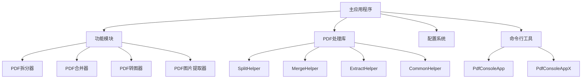
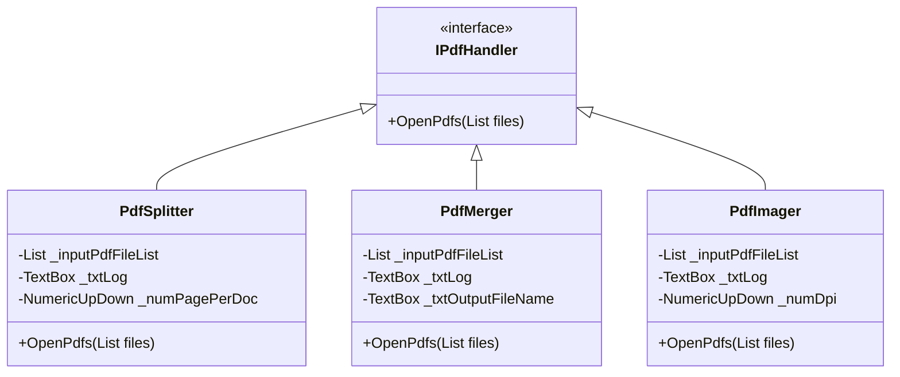
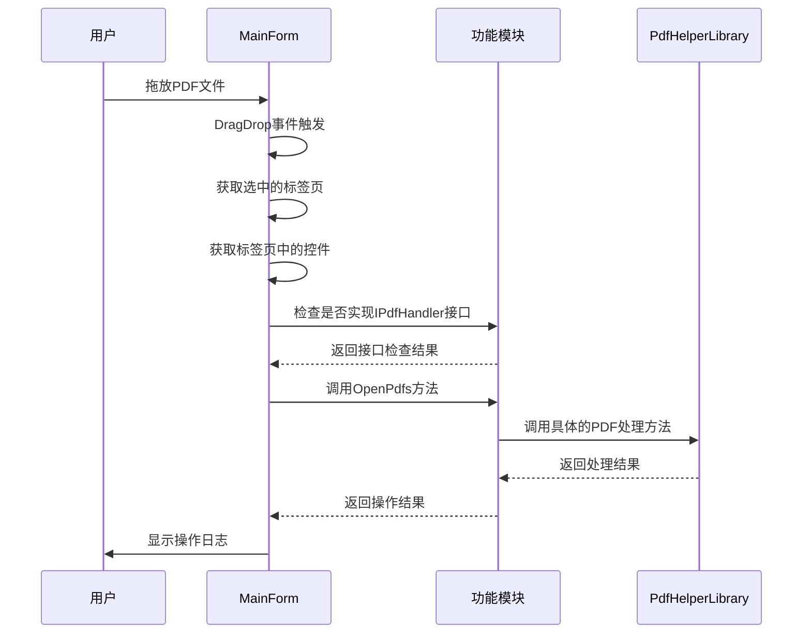
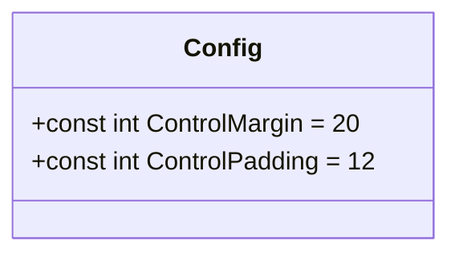
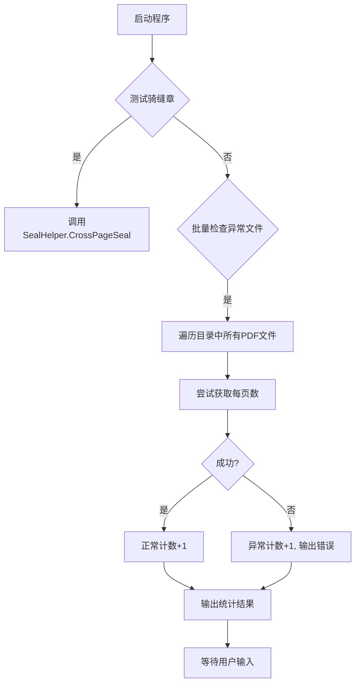
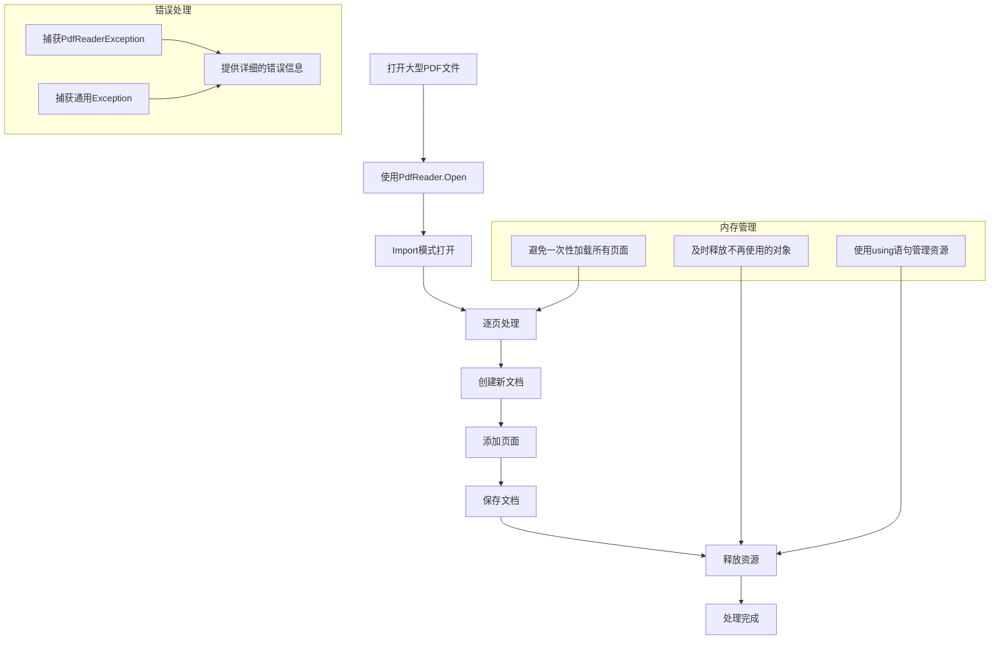
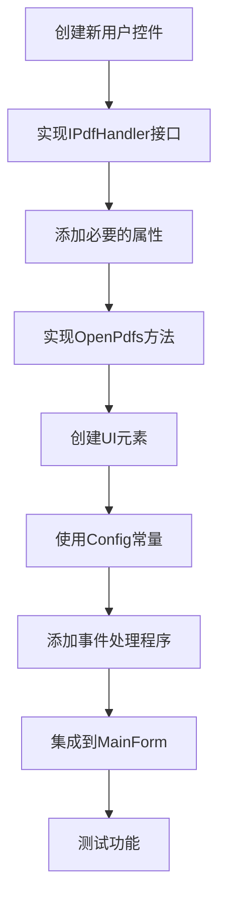

# 高级功能与扩展

<cite>
**本文档中引用的文件**  
- [Common.cs](file://PdfTool/Common.cs)
- [Config.cs](file://PdfTool/Config.cs)
- [MainForm.cs](file://PdfTool/MainForm.cs)
- [PdfSplitter.cs](file://PdfTool/PdfSplitter.cs)
- [Program.cs](file://PdfConsoleApp/Program.cs)
- [SplitHelper.cs](file://PdfHelperLibrary/SplitHelper.cs)
- [CommonHelper.cs](file://PdfHelperLibrary/CommonHelper.cs)
- [Program.cs](file://PdfConsoleAppX/Program.cs)
</cite>

## 目录
1. [引言](#引言)
2. [系统架构与扩展机制](#系统架构与扩展机制)
3. [功能模块扩展](#功能模块扩展)
4. [高级配置](#高级配置)
5. [命令行自动化](#命令行自动化)
6. [性能优化与内存管理](#性能优化与内存管理)
7. [最佳实践](#最佳实践)
8. [结论](#结论)

## 引言
本项目是一个功能丰富的PDF处理工具集，提供了多种PDF操作功能，包括拆分、合并、转换、提取等。系统设计具有良好的扩展性，允许开发者通过实现特定接口来添加新功能模块。本文档将深入探讨系统的高级功能和扩展性，为有经验的开发者提供指导。

## 系统架构与扩展机制

**图表来源**
- [MainForm.cs](file://PdfTool/MainForm.cs#L134-L148)
- [PdfHelperLibrary.csproj](file://PdfHelperLibrary/PdfHelperLibrary.csproj#L97-L113)

**本节来源**
- [MainForm.cs](file://PdfTool/MainForm.cs#L12-L193)
- [PdfHelperLibrary.csproj](file://PdfHelperLibrary/PdfHelperLibrary.csproj#L1-L127)

## 功能模块扩展

### IPdfHandler接口实现

系统通过`IPdfHandler`接口实现功能模块的动态加载和扩展。任何实现此接口的类都可以作为独立的功能模块集成到主应用程序中。

**图表来源**
- [Common.cs](file://PdfTool/Common.cs#L13-L16)
- [PdfSplitter.cs](file://PdfTool/PdfSplitter.cs#L12-L30)
- [PdfMerger.cs](file://PdfTool/PdfMerger.cs#L12-L30)
- [PdfImager.cs](file://PdfTool/PdfImager.cs#L12-L30)

**本节来源**
- [Common.cs](file://PdfTool/Common.cs#L1-L17)
- [PdfSplitter.cs](file://PdfTool/PdfSplitter.cs#L1-L230)
- [MainForm.cs](file://PdfTool/MainForm.cs#L49-L52)

### 模块集成机制

主应用程序通过拖放事件处理程序动态调用各个功能模块的方法。当用户将PDF文件拖放到应用程序上时，系统会自动识别当前选中的标签页并调用相应的处理程序。

**图表来源**
- [MainForm.cs](file://PdfTool/MainForm.cs#L41-L52)
- [PdfSplitter.cs](file://PdfTool/PdfSplitter.cs#L33-L42)

**本节来源**
- [MainForm.cs](file://PdfTool/MainForm.cs#L41-L52)
- [PdfSplitter.cs](file://PdfTool/PdfSplitter.cs#L33-L42)

## 高级配置

### 配置常量管理

系统使用静态类`Config`来管理UI相关的配置常量，这些常量用于统一界面元素的布局和样式。

**图表来源**
- [Config.cs](file://PdfTool/Config.cs#L5-L6)

**本节来源**
- [Config.cs](file://PdfTool/Config.cs#L1-L8)
- [PdfSplitter.cs](file://PdfTool/PdfSplitter.cs#L114-L115)

## 命令行自动化

### 批处理脚本实现

系统提供了命令行工具`PdfConsoleApp`，允许用户通过命令行执行批量PDF处理任务，实现自动化工作流。

**图表来源**
- [Program.cs](file://PdfConsoleApp/Program.cs#L12-L38)

**本节来源**
- [Program.cs](file://PdfConsoleApp/Program.cs#L1-L88)
- [Program.cs](file://PdfConsoleAppX/Program.cs#L1-L17)

## 性能优化与内存管理

### 大型PDF文件处理策略

系统在处理大型PDF文件时采用了多种性能优化策略，确保内存使用效率和处理速度。

**图表来源**
- [SplitHelper.cs](file://PdfHelperLibrary/SplitHelper.cs#L13-L67)
- [CommonHelper.cs](file://PdfHelperLibrary/CommonHelper.cs#L11-L25)

**本节来源**
- [SplitHelper.cs](file://PdfHelperLibrary/SplitHelper.cs#L1-L70)
- [CommonHelper.cs](file://PdfHelperLibrary/CommonHelper.cs#L1-L29)

## 最佳实践

### 新功能模块开发指南

开发新功能模块时，应遵循以下最佳实践：

1. **接口实现**：确保新模块实现`IPdfHandler`接口
2. **UI一致性**：使用`Config`类中的常量保持UI布局一致
3. **错误处理**：提供完善的错误处理机制
4. **日志记录**：使用文本框记录操作日志
5. **资源管理**：正确管理文件和内存资源

**本节来源**
- [PdfSplitter.cs](file://PdfTool/PdfSplitter.cs#L12-L230)
- [MainForm.cs](file://PdfTool/MainForm.cs#L134-L163)
- [Config.cs](file://PdfTool/Config.cs#L5-L6)

## 结论
本系统通过清晰的接口定义和模块化设计，实现了良好的扩展性。开发者可以通过实现`IPdfHandler`接口来添加新的功能模块，并利用现有的PDF处理库快速开发。同时，系统提供了命令行工具支持自动化批处理，满足不同场景的需求。在处理大型PDF文件时，应注意内存管理和性能优化，确保系统的稳定运行。