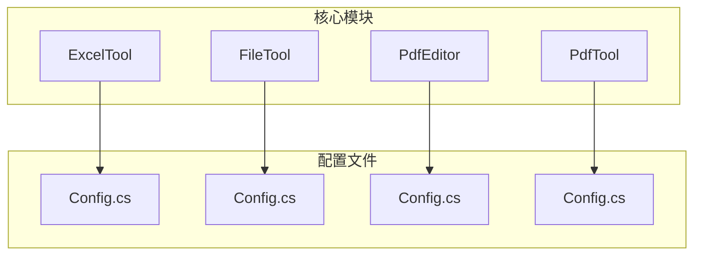
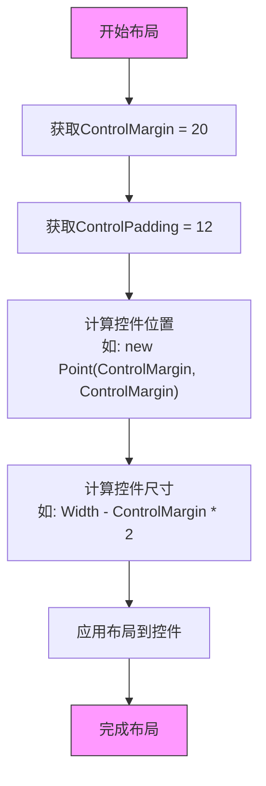

# 高级配置自定义

<cite>
**本文档引用的文件**  
- [Config.cs](file://ExcelTool/Config.cs)
- [Config.cs](file://FileTool/Config.cs)
- [Config.cs](file://PdfEditor/Config.cs)
- [Config.cs](file://PdfTool/Config.cs)
- [DataExtracter.cs](file://ExcelTool/Modules/DataExtracter.cs)
- [DataViewer.cs](file://ExcelTool/Modules/DataViewer.cs)
- [ImageExtracter.cs](file://ExcelTool/Modules/ImageExtracter.cs)
- [TableSplitter.cs](file://ExcelTool/Modules/TableSplitter.cs)
- [MainForm.cs](file://PdfImager/MainForm.cs)
</cite>

## 目录
1. [引言](#引言)
2. [项目结构](#项目结构)
3. [核心配置结构](#核心配置结构)
4. [UI布局中的配置应用](#ui布局中的配置应用)
5. [配置项修改与扩展指南](#配置项修改与扩展指南)
6. [配置对用户体验的影响](#配置对用户体验的影响)
7. [多DPI环境下的界面一致性最佳实践](#多dpi环境下的界面一致性最佳实践)
8. [结论](#结论)

## 引言
本文件深入解析PDF工具项目中的配置系统，重点分析`Config.cs`文件中定义的全局常量，如`ControlMargin`和`ControlPadding`在用户界面布局中的具体应用。文档旨在指导开发者如何安全地修改现有配置或添加新的全局配置项，并探讨这些配置对用户体验的影响以及在不同DPI环境下保持界面一致性的最佳实践。

## 项目结构
该项目包含多个子模块，每个模块对应不同的文档处理功能，如Excel处理、PDF编辑、文件批量操作等。大多数模块都包含一个`Config.cs`文件，用于定义UI布局相关的常量。这些配置文件在各个模块中保持一致，确保了跨工具的视觉统一性。



**图示来源**  
- [ExcelTool/Config.cs](file://ExcelTool/Config.cs#L1-L14)
- [FileTool/Config.cs](file://FileTool/Config.cs#L1-L8)
- [PdfEditor/Config.cs](file://PdfEditor/Config.cs#L1-L8)
- [PdfTool/Config.cs](file://PdfTool/Config.cs#L1-L8)

**本节来源**  
- [ExcelTool/Config.cs](file://ExcelTool/Config.cs#L1-L14)
- [FileTool/Config.cs](file://FileTool/Config.cs#L1-L8)
- [PdfEditor/Config.cs](file://PdfEditor/Config.cs#L1-L8)
- [PdfTool/Config.cs](file://PdfTool/Config.cs#L1-L8)

## 核心配置结构
`Config.cs`文件定义了一个静态类`Config`，其中包含两个关键的常量：`ControlMargin`和`ControlPadding`，分别设置为20和12。这两个值在所有相关模块中保持一致，体现了项目对UI一致性的重视。

```csharp
internal static class Config
{
    internal const int ControlMargin = 20;
    internal const int ControlPadding = 12;
}
```

这些常量被声明为`internal`，意味着它们仅在当前程序集中可见，这有助于封装配置细节，防止外部程序集的意外修改。

**本节来源**  
- [ExcelTool/Config.cs](file://ExcelTool/Config.cs#L9-L13)
- [FileTool/Config.cs](file://FileTool/Config.cs#L3-L7)
- [PdfEditor/Config.cs](file://PdfEditor/Config.cs#L3-L7)
- [PdfTool/Config.cs](file://PdfTool/Config.cs#L3-L7)

## UI布局中的配置应用
`ControlMargin`和`ControlPadding`在UI布局中被广泛用于控件的定位和尺寸计算。`ControlMargin`通常用于控件与窗体边缘之间的距离，而`ControlPadding`用于控件之间的间距。

### 控件定位示例
在`DataExtracter.cs`中，按钮和文本框的位置通过`Config.ControlMargin`和`Config.ControlPadding`精确计算：

```csharp
Location = new Point(Config.ControlMargin, Config.ControlMargin), // 距离左上角的边距
Location = new Point(btnAddFile.Right + Config.ControlPadding, Config.ControlMargin), // 按钮右侧加上内边距
```

### 尺寸计算示例
控件的尺寸也依赖于这些配置值，确保在不同窗口大小下保持合理的布局：

```csharp
Size = new Size(ClientSize.Width - Config.ControlMargin * 2, 200), // 宽度减去左右边距
Size = new Size(ClientSize.Width - Config.ControlMargin - _chkFields.Right - Config.ControlPadding, ...) // 复杂的尺寸计算
```



**图示来源**  
- [ExcelTool/Modules/DataExtracter.cs](file://ExcelTool/Modules/DataExtracter.cs#L106-L140)
- [ExcelTool/Modules/DataViewer.cs](file://ExcelTool/Modules/DataViewer.cs#L78-L112)
- [ExcelTool/Modules/ImageExtracter.cs](file://ExcelTool/Modules/ImageExtracter.cs#L89-L114)

**本节来源**  
- [ExcelTool/Modules/DataExtracter.cs](file://ExcelTool/Modules/DataExtracter.cs#L106-L140)
- [ExcelTool/Modules/DataViewer.cs](file://ExcelTool/Modules/DataViewer.cs#L78-L112)
- [ExcelTool/Modules/ImageExtracter.cs](file://ExcelTool/Modules/ImageExtracter.cs#L89-L114)
- [ExcelTool/Modules/TableSplitter.cs](file://ExcelTool/Modules/TableSplitter.cs#L145-L208)

## 配置项修改与扩展指南
### 安全修改现有配置
要修改`ControlMargin`或`ControlPadding`，开发者应：
1. 在`Config.cs`中找到对应的常量
2. 修改其值（例如，将`ControlMargin`从20改为25）
3. 编译并测试所有使用该配置的模块

### 添加新的全局配置项
添加新配置项时，应遵循以下步骤：
1. 确定配置项的数据类型（`int`、`string`、`bool`等）
2. 决定作用域（`internal`或`public`）
3. 在`Config`类中添加新的`const`字段

```csharp
// 示例：添加新的配置项
internal const string DefaultExportPath = @"C:\Exports";
internal const bool EnableLogging = true;
```

### 作用域控制
- `internal`：仅在当前程序集内可见，适合模块专用配置
- `public`：对所有引用该程序集的项目可见，适合跨模块共享的配置

### 与UI渲染的联动机制
配置项通过编译时的常量替换机制与UI渲染联动。当UI代码引用`Config.ControlMargin`时，编译器会直接将其替换为实际值（20），这确保了运行时的高性能。

**本节来源**  
- [ExcelTool/Config.cs](file://ExcelTool/Config.cs#L9-L13)
- [ExcelTool/Modules/DataExtracter.cs](file://ExcelTool/Modules/DataExtracter.cs#L106-L140)

## 配置对用户体验的影响
`ControlMargin`和`ControlPadding`的设置直接影响界面的视觉舒适度和可用性：
- **过小的值**：导致控件过于拥挤，降低可点击性和可读性
- **过大的值**：浪费屏幕空间，可能导致内容显示不全
- **当前设置（20和12）**：提供了良好的平衡，既保证了足够的操作空间，又最大化了内容区域

这些配置还影响了响应式布局的行为，确保在窗口大小调整时，控件能够合理地重新排列。

**本节来源**  
- [ExcelTool/Modules/DataExtracter.cs](file://ExcelTool/Modules/DataExtracter.cs#L106-L140)
- [ExcelTool/Modules/DataViewer.cs](file://ExcelTool/Modules/DataViewer.cs#L78-L112)

## 多DPI环境下的界面一致性最佳实践
### DPI感知设计
虽然当前配置使用固定像素值，但在高DPI屏幕上可能会出现缩放问题。最佳实践包括：
1. **使用DPI感知单位**：考虑将像素值转换为与DPI相关的单位
2. **动态计算**：在运行时根据系统DPI动态调整`ControlMargin`和`ControlPadding`
3. **测试多DPI环境**：在不同DPI设置下测试界面布局

### 示例：DPI适配代码
```csharp
// 在程序启动时获取系统DPI并调整配置
float dpiScale = GetDpiScale(); // 获取DPI缩放比例
int scaledMargin = (int)(20 * dpiScale);
int scaledPadding = (int)(12 * dpiScale);
```

### 保持一致性的策略
- **统一配置管理**：确保所有模块使用相同的配置源
- **定期审查**：随着新设备的出现，定期审查和调整默认配置值
- **用户可配置**：对于高级用户，提供界面来自定义这些值

**本节来源**  
- [PdfImager/MainForm.cs](file://PdfImager/MainForm.cs#L1-L41)
- [ExcelTool/Config.cs](file://ExcelTool/Config.cs#L9-L13)

## 结论
`Config.cs`中的`ControlMargin`和`ControlPadding`配置项在维护项目UI一致性方面发挥着关键作用。通过将这些值集中管理，项目实现了跨模块的视觉统一。开发者在修改或扩展这些配置时，应充分考虑其对用户体验和多DPI环境的影响。未来可以考虑引入更智能的DPI适配机制，以进一步提升在不同显示环境下的用户体验。